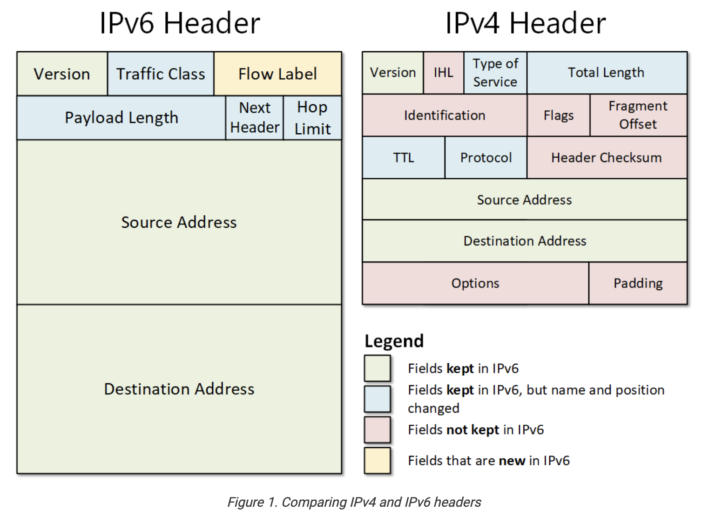

# IPv6 – Foundations

## What is IP?
- **IP (Internet Protocol) address** = unique identifier for a network interface.
- Works across all types of connections:
  - **Wi-Fi** (wireless link to a router at home, work, or public hotspot)
  - **Ethernet (cable)** (physical plug-in connection to a switch or router, common in offices/servers)
  - **Mobile data (4G/5G)** (connection to your mobile provider’s cellular towers, IP comes from telecom network)
  - **Even virtual interfaces** (software-defined “network cards” inside cloud servers or virtual machines; they behave like real hardware but exist only in software)
- A device can have multiple IPs (**one per interface**, e.g., your laptop might have one for Wi-Fi and another for Ethernet at the same time).

---

## IPv4 Addressing (32-bit)
- Written in **dotted decimal**: e.g., `192.168.0.10`
- Structure:
  - 4 numbers (0–255), each = **8 bits (1 octet)**.
  - Example:
    - `192` → `11000000`
    - `168` → `10101000`
    - `0`   → `00000000`
    - `10`  → `00001010`
- Total = 4 × 8 bits = **32 bits**.

---

## IPv6 Addressing (128-bit)
- Written in **hexadecimal groups** separated by `:`.
- Full address has **8 groups × 16 bits = 128 bits**.

### Example: `2001:0db8::1`

1. **Full form:**
`2001:0db8:0000:0000:0000:0000:0000:0001`
2. **Remove leading zeros in each group:**
`2001:db8:0000:0000:0000:0000:0000:1`
3. **Collapse consecutive all-zero groups (only once!):**
`2001:db8::1`

Always expands back to **8 groups** internally.

---

## Why IPv6?
- IPv4 = ~4.3 billion addresses → exhausted in 2019 (RIPE NCC ran out).
- IPv6 = 128-bit space → That’s 340 undecillion possible ~3.4 × 10³⁸ addresses.
- Enough for every phone, car, fridge, sensor (IoT), etc.

---

## Key Notes
- IPv5 existed as an **experimental streaming protocol** (ST2), never widely used.
- IPv6 adoption has been rising steadily (almost 50% of Google traffic by 2025).
- Every **network connection** (real or virtual) gets its own IP.

# IPv6 – Foundations (Deep Dive)

---

## 1. What is the Internet?

### 1.1 Internet = "network of networks"
- The Internet is not a single machine or cable.
- It is a **giant network made up of smaller networks** (ISPs, universities, companies, data centers).
- These networks are linked at **Internet Exchange Points (IXPs)** where different providers physically connect their routers.

### 1.2 How data flows (gut feeling path)
When you type `google.com` into your browser:

1. **Your device (phone/laptop)**  
   - Creates a packet with source = *your IP*, destination = *Google’s IP*.
   - Hands this to your **router**.

2. **Your home router**  
   - Acts as the "traffic cop" of your local network (Wi-Fi/Ethernet).  
   - Uses **NAT (in IPv4)** or **prefix delegation (in IPv6)** to send your packet to your ISP.  
   - Adds its own information to forward correctly.

3. **Your ISP (Telekom, Vodafone, O2 …)**  
   - Runs massive backbone routers.  
   - Assigns you a public IP address.  
   - Delivers your traffic out of the "last mile" (fiber, DSL, mobile tower).

4. **Backbone networks / IXPs**  
   - High-speed fiber cables interconnecting major ISPs and global carriers.  
   - Examples: DE-CIX (Frankfurt), AMS-IX (Amsterdam).  
   - They move your packet closer to Google’s servers.

5. **Google’s servers / data center**  
   - Receive the packet.  
   - The server with the right IP responds back to your IP, traveling the reverse path.

👉 This happens in **milliseconds** but involves multiple hops across devices owned by different organizations.

---

## 2. IP Packets and Headers

### 2.1 IPv4 header Vs. IPv6 header

## 2. IPv4 Header vs IPv6 Header

### 2.1 IPv4 Header
- **Version** → always `4` for IPv4.  
  - (Reminder: **Version 5** was already used in the 1980s/1990s for an **experimental streaming protocol** called ST2, defined in RFC 1190/1819. It never became mainstream, but since the number was taken, the next Internet Protocol became **IPv6**.)
- More **complex** and contains many fields that made sense in the 1980s but became inefficient later.
- Key fields:
  - **IHL (Internet Header Length)** → tells how long the header is (because it can vary).
  - **Type of Service** → QoS marking (used rarely).
  - **Total Length** → size of the whole packet.
  - **Identification, Flags, Fragment Offset** → used for packet fragmentation (breaking big packets into smaller ones).
  - **TTL (Time To Live)** → limits how many hops a packet can make.
  - **Protocol** → tells if the payload is TCP, UDP, ICMP, etc.
  - **Header Checksum** → error detection for header integrity.
  - **Source Address** → sender’s IPv4 address (32 bits).
  - **Destination Address** → receiver’s IPv4 address (32 bits).
  - **Options, Padding** → optional, rarely used.

👉 Result: IPv4 header is **variable-length** and costly to process by routers.

---

### 2.2 IPv6 Header
- **Version** → always `6` for IPv6.  
  - (Skips “5” because of ST2 experiment.)
- Designed to be **simpler, fixed-size, and faster** for routers to handle.
- Key fields:
  - **Version** → always `6` for IPv6.
  - **Traffic Class** → replacement of IPv4’s Type of Service (used for QoS/priority).
  - **Flow Label** (new) → allows labeling of packet flows for special handling (e.g., streaming).
  - **Payload Length** → size of the data after the header.
  - **Next Header** → replacement of Protocol field; indicates TCP, UDP, ICMPv6, or an extension header.
  - **Hop Limit** → replacement of TTL; decreases with each router hop.
  - **Source Address** → sender’s IPv6 address (128 bits).
  - **Destination Address** → receiver’s IPv6 address (128 bits).

👉 Result: IPv6 header is **fixed-size (40 bytes)**, easier for routers to parse, and puts optional/rare features into **extension headers** instead of bloating the base header.

---

### 2.3 Key Differences
- IPv6 removes many IPv4 fields:
  - No Header Checksum (error detection is handled elsewhere).
  - No Fragmentation fields (handled differently).
  - No Options in the main header (moved to extension headers).
- IPv6 adds:
  - **Flow Label** (new concept for traffic flows).
- IPv6 keeps:
  - Source/Destination addresses, TTL (renamed Hop Limit), Protocol (renamed Next Header).

👉 IPv6 is **leaner, cleaner, and optimized** for modern hardware.

---

## 3. Subnets (Super Important!)

### 3.1 What is a subnet?
- A **subnet** = a block (or slice) of IP addresses that belong together.  
- Think of the IP universe as a giant street map. Subnets = neighborhoods.  
- Each subnet is defined by:
  - **Network part** (fixed bits = the neighborhood ID)
  - **Host part** (remaining bits = house numbers inside the neighborhood)

### 3.2 IPv4 example
- `192.168.0.0/24`  
  - `/24` = 24 bits are fixed for the network.  
  - Remaining = 32 − 24 = 8 bits → 2⁸ = **256 host addresses**.  
- Hosts range from `192.168.0.0` to `192.168.0.255`.

👉 Easy for attackers: only 256 doors to knock on.

### 3.3 IPv6 example
- `2001:db8:abcd::/64`  
  - `/64` = 64 bits are fixed for the network.  
  - Remaining = 128 − 64 = 64 bits → 2⁶⁴ ≈ **18 quintillion host addresses**.  
- Hosts range from `2001:db8:abcd::0` up to `2001:db8:abcd::ffff:ffff:ffff:ffff`.

👉 For attackers: impossibly huge number of doors.

---

## 4. Why attackers scan subnets

### 4.1 Goal of scanning
- Attackers want to **find live hosts** (computers, servers, IoT devices) inside a subnet.
- Once found, they probe for vulnerabilities (weak passwords, unpatched software, open services).

### 4.2 Scanning IPv4
- Example: `192.168.0.0/24` → only 256 addresses.  
- Attacker sends "Are you there?" probes to each.  
- At 1 million probes/second, 256 hosts = scanned in a fraction of a millisecond.  
👉 This is why IPv4 networks are trivially mapped by attackers.

### 4.3 Scanning IPv6
- Example: `/64` subnet → 2⁶⁴ ≈ 18,446,744,073,709,551,616 possibilities.  
- At 1 million probes/second:  
`2^64 / 1,000,000 ≈ 1.8 × 10^13 seconds
≈ 584,000 years`
- 👉 **Blind scanning is useless**. Attackers must use shortcuts (DNS, predictable host IDs, sniffing local traffic).

---

## 5. MAC Address (Make it Tangible)

### 5.1 What is it?
- **MAC = Media Access Control address.**  
- A unique hardware ID burned into every network interface (Wi-Fi chip, Ethernet card).  
- Format: 6 bytes = 48 bits. Example:  
`00:1A:2B:3C:4D:5E`
### 5.2 Analogy
- Think of a MAC as your **device’s serial number** for networking.  
- Unlike IP (which can change depending on network), MAC is fixed to the hardware.  

### 5.3 IPv6 connection
- Early IPv6 used part of the MAC address to generate the host ID automatically.  
- Example:  
- MAC = `00:1A:2B:3C:4D:5E`  
- Host ID becomes `021a:2bff:fe3c:4d5e`.  
- Problem: **predictable** → attacker can guess which host IDs exist without blind scanning.  

