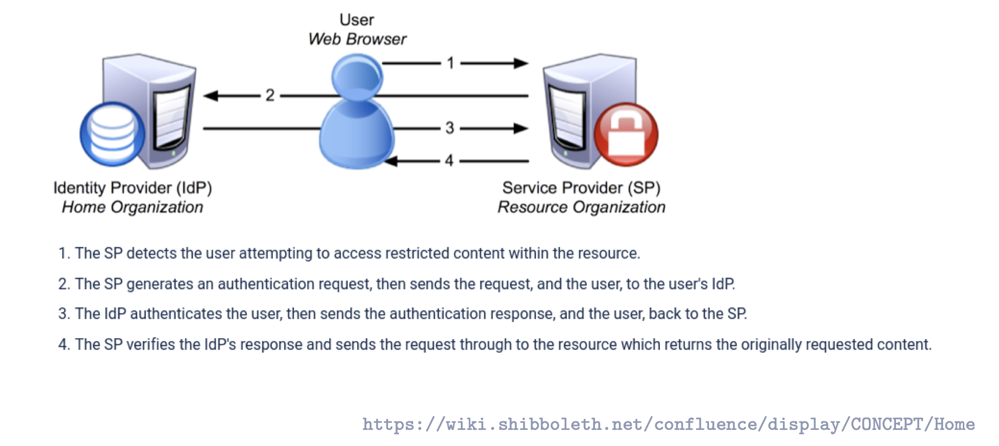

# Authentication & Single Sign-On (SSO) — Lecture Notes Breakdown

## 1. Authentication as a prerequisite
- **Authentizität der Subjekte/Akteure** (users, services) must be verified first.
- Only then can further security goals be realized:
  - **Integrität (Integrity)**: protecting data from unauthorized modification.
  - **Vertraulichkeit (Confidentiality)**: protecting data from unauthorized access.

## 2. Authentication techniques (Faktoren)
- **Wissen (Knowledge)** → something you know.
  - Examples: Passwort, PIN.
- **Besitz (Possession)** → something you have.
  - Examples: EC-Karte, USB-Stick with private key.
- **Sein (Inherence/Biometrics)** → something you are.
  - Examples: Fingerabdruck, face recognition.
    
    ⚠️ Weakness: Biometric secrets cannot be changed if compromised.

## 3. Mehr-Faktor-Authentifikation
- Use of more than one factor simultaneously.
- Example: ATM login = Karte (Besitz) + PIN (Wissen).
- **Zwei-Faktor-Authentifikation** = two distinct categories, not just two passwords.

## 4. One-way vs. Mutual Authentication
- **Einseitige Authentifikation** (one-way):
  - Only one party proves identity.
  - Examples:
    - ATM: User authenticates to system, but ATM does not authenticate to user.
    - Normal web browsing: Server authenticates (TLS certificate), client usually not at TLS layer.
- **Wechselseitige Authentifikation** (mutual, 2-way):
  - Both sides authenticate each other.
  - Example: Online banking (server proves identity to client, client authenticates with password + TAN/2FA).

## 5. Single Sign-On (SSO) in Distributed Systems
- A **verteiltes System (distributed system)** supports SSO if:
  - User authenticates **once**.
  - Gains access to all authorized services without re-entering credentials.
- Benefits: usability, consistent identity, reduced password fatigue.
- Risks: compromise of initial login compromises all services.

### Examples
- **Kerberos**: classical SSO system, widely used in enterprises.
- **Web-based SSO**: 
  - **SAML** (Security Assertion Markup Language).
  - **Shibboleth**: implementation of SAML, used for SSO at Universität Potsdam.

### Distinction
- Reusing same password across systems ≠ SSO (credential reuse).
- True SSO = one central authentication (IdP), the SPs participate in a federated trust model(Service Providers = the actual applications you want to use) accept tokens/assertions.
> Federation here means multiple independent systems (SPs) agreeing to trust the same Identity Provider (IdP). Instead of each SP maintaining its own user database, they “federate” around a shared authority.
- Example at Uni Potsdam:
  - Login once at IdP (idp.uni-potsdam.de).
  - Access Moodle, Git.UP, Mail, etc. without retyping credentials (if IdP session cookie persists).
  - In practice, session handling sometimes requires re-login, but architecture is still SSO.

