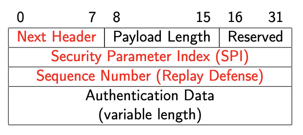
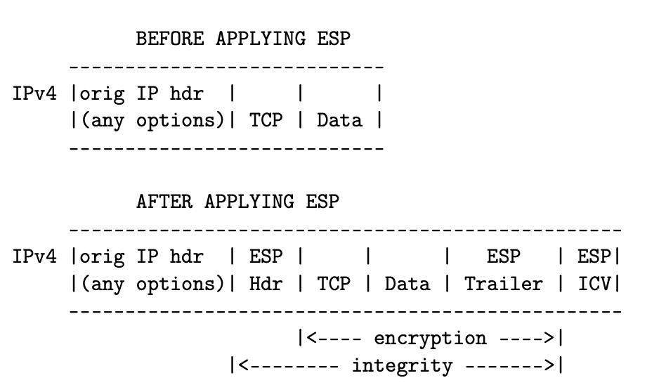
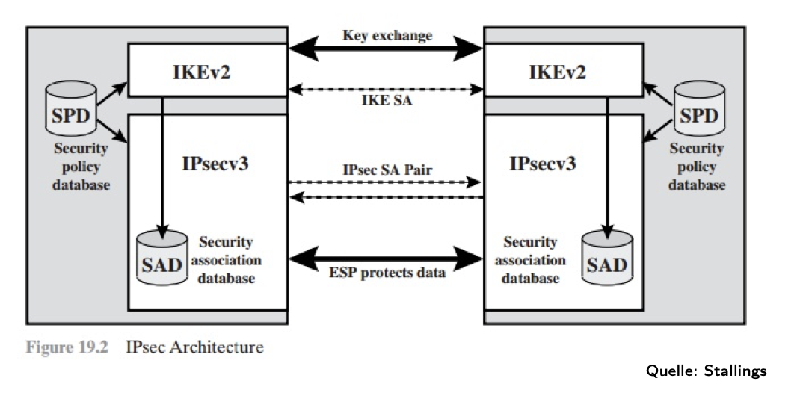
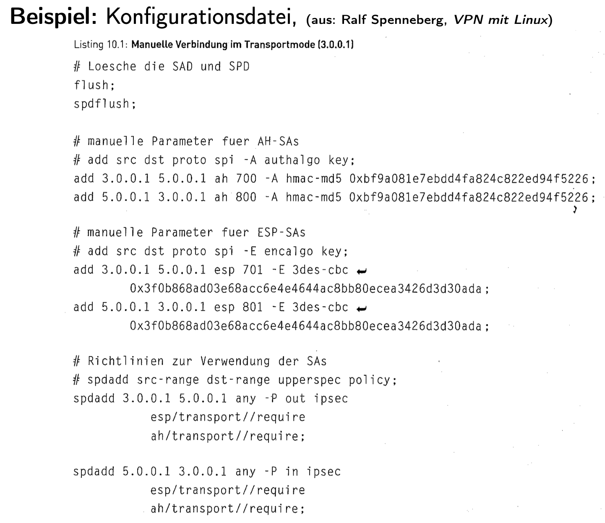
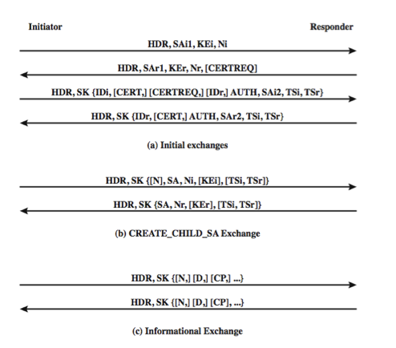
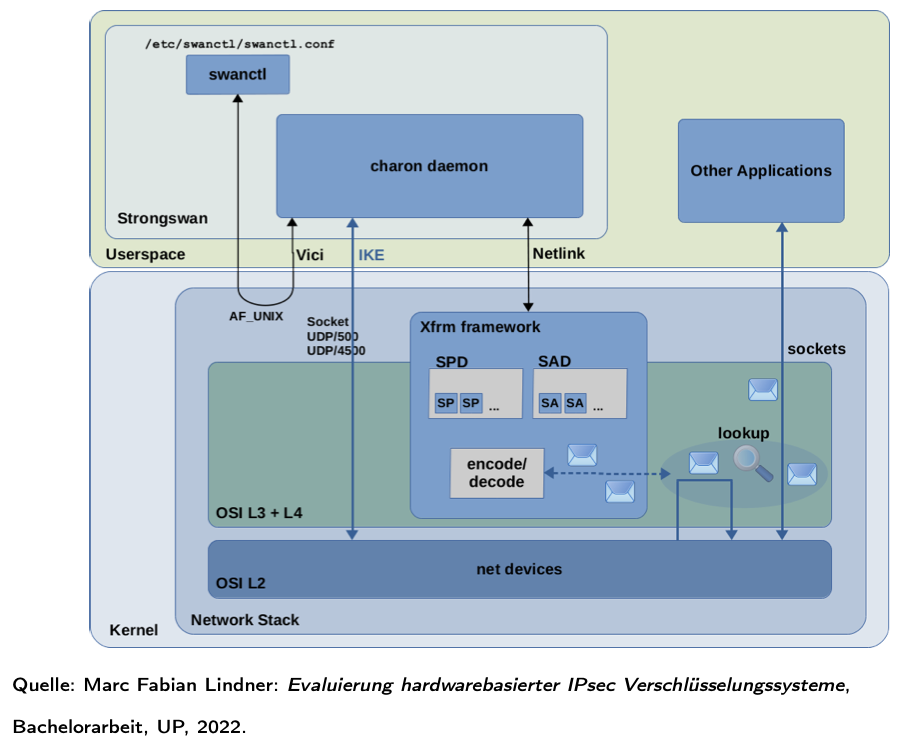
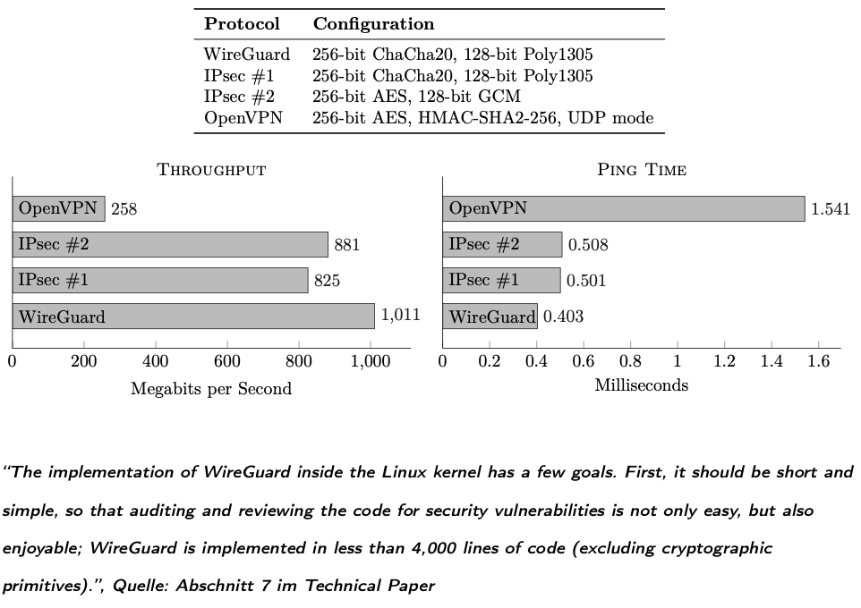

# Warm-Up: Packet Encapsulation & De-Encapsulation

This section is the **overview so far** — before we jump into IPSec itself.  
We start with a plain packet (no security, everything visible) and then show where different security protocols (MACsec, IPSec, TLS, QUIC) intervene.

## Baseline: No Security

A network packet without security looks like this. **Each header describes and controls the payload immediately to its right.**

````
+-----------------------------------------------------------+
| Ethernet Header | IP Header | TCP/UDP Header | App Data   |
+-----------------------------------------------------------+
````

- **Ethernet Header (L2):** Source/destination MAC, type, etc.  
- **IP Header (L3):** Source/destination IP, TTL, protocol, etc.  
- **TCP/UDP Header (L4):** Ports, sequence numbers, flags, etc.  
- **App Data (L7):** Application content (HTTP request, email, etc.).  

**Everything is visible on the wire.**

## Encapsulation (Sending Side)

1. **Application Layer (L7)**  
   - **Baseline:** Creates the data (e.g., `GET /index.html HTTP/1.1 …`).  
   - **With TLS/QUIC:**  
     - TLS encrypts just the application data before passing it to TCP.  
     - QUIC integrates TLS 1.3 and encrypts application data at this stage too.  

   Result:  
   - No security → `[App Data]`  
   - With TLS/QUIC → `[Encrypted App Data]`

2. **Transport Layer (L4 – TCP/UDP)**  
   - **Baseline:** Adds TCP/UDP header (ports, seq numbers, flags).  
     - Result: `[TCP/UDP Header | App Data]`  
   - **With TLS:** TCP header stays in cleartext, but payload is already TLS-encrypted.  
     - Result: `[TCP Header | Encrypted App Data]`  
   - **With QUIC:** UDP header visible, QUIC payload (including its transport metadata + app data) encrypted.  
     - Result: `[UDP Header | Encrypted QUIC Payload]`  

3. **Network Layer (L3 – IP)**  
   - **Baseline:** Adds IP header (src/dst IPs, TTL, protocol).  
     - Result: `[IP Header | TCP/UDP Header | App Data]`  
   - **With IPSec Transport Mode:**  
     - TCP/UDP header + App Data are encrypted (ESP payload).  
     - IP header remains visible.  
     - Result: `[IP Header | Encrypted (TCP/UDP Header + App Data)]`  
   - **With IPSec Tunnel Mode:**  
     - Entire original IP packet encrypted.  
     - New IP header added for routing.  
     - Result: `[New IP Header | Encrypted (Orig IP Header + TCP/UDP Header + App Data)]`

4. **Data Link Layer (L2 – Ethernet, Wi-Fi, …)**  
   - **Baseline:** Adds Ethernet (or Wi-Fi) header + trailer (MAC addresses, type, checksum).  
     - Result: `[Ethernet Header | IP Packet | Ethernet Trailer]`  
   - **With MACsec:**  
     - Encrypts the Ethernet payload (which is the entire IP packet).  
     - Ethernet header stays visible for switching.  
     - Result: `[Ethernet Header | Encrypted (IP Packet) | MACsec Trailer]`


5. **Physical Layer (L1)**  
   - **Baseline:** Converts frame to signals (electrical, optical, or radio).  
   - **Security:** At this level, no protocol encrypts the raw signal itself. Security always comes from higher layers (MACsec, IPSec, TLS, QUIC).  

## De-Encapsulation (Receiving Side)

The reverse happens:

1. **Physical Layer (L1)**  
   - Signals → bits.  
   - No security here.

2. **Data Link Layer (L2)**  
   - Removes Ethernet header/trailer.  
   - If MACsec is active → decrypts payload, verifies integrity.  
   - Exposes IP packet.

3. **Network Layer (L3 – IP)**  
   - Removes IP header.  
   - If IPSec is active → decrypts ESP payload (transport mode) or entire inner packet (tunnel mode).  
   - Exposes TCP/UDP segment.

4. **Transport Layer (L4 – TCP/UDP)**  
   - Removes transport header.  
   - If TLS is active → passes encrypted payload upward for TLS decryption.  
   - If QUIC is active → decrypts QUIC payload itself (since QUIC integrates crypto at L4).  
   - Exposes application data (or decrypted QUIC/TLS content).

5. **Application Layer (L7)**  
   - Processes the original request (e.g., HTTP).  
   - With TLS/QUIC → now sees cleartext after decryption.  

# IPSec 

- Before IPSec:
  - Security was added at the **application layer** (TLS, HTTPS, SMTPS, FTPS, …).
  - Problem: each application had to be modified to support encryption.

- With IPSec:
  - Security added at the **network layer (L3)** → transparent to applications.
  - Applications continue unchanged; OS handles security.

- IPSec provides:
  - **Encryption** – confidentiality of payload.
  - **Data integrity** – detect modification in transit.
  - **Authentication of sender** – data origin authentication.
  - **Replay protection** – prevents reuse of old packets.
  - **Negotiable algorithms** – peers agree dynamically.
  - **Key exchange** – done via **IKE (Internet Key Exchange)**.

## Characteristics

- Originally **mandatory for IPv6** (= any IPv6 stack had to come with IPSec code in the kernel); Over time, practice showed: **Not every use case needed IPSec**; because the web moved to TLS and VPNs had other technologies, today optional for both IPv4 and IPv6.
- Supports **compression before encryption** (since encrypted data doesn’t compress well).
- Requires **kernel/OS support** (unlike TLS, which runs in user space libraries).

## IPSec Protocols
**A protocol is a set of rules + a format for communication between peers.**

Every IP packet has a field in its header called *Protocol* (IPv4) or **Next Header** (IPv6).

This field says: “*What’s inside me?*”

Examples:

- 6 → payload is TCP.

- 17 → payload is UDP.

- 1 → payload is ICMP.

- 50 → payload is ESP.

- 51 → payload is AH.

So the IP header doesn’t care what the payload is. It just says: 
>“The next chunk is of type X.”

When IPSec is used, **instead of the IP payload being directly TCP/UDP**, it can be an **IPSec header**. So IPSec “**sits in between**” IP and TCP/UDP:
It doesn’t replace TCP or UDP.
It wraps them, so TCP/UDP are still there, just deeper inside.
### 1. AH – Authentication Header
````
IP Header (Protocol=51)
    └── AH Header
           └── TCP Header
                 └── Application Data
````

- **RFC 2402 (1998)** → replaced by **RFC 4302** (2005) and **RFC 4305**.  
- **Protocol number: 51.**  
- Services:  
  - Integrity protection.  
  - Authentication of sender.  
  - Replay protection.  
  - ⚠️ No encryption.  
- Works by calculating a **MAC** (Message Authentication Code) over:
  - Entire IP packet (IP header + payload + AH header).  
  - Excludes fields that change during transit (e.g., TTL). These are set to zero during MAC calculation.  
- **Fragmentation**: must reassemble fragments before verification, since MAC is over the whole packet.

#### AH Header Format

- **Next Header (8 bits):** Identifies protocol after AH (similar to Protocol field in IP header).  
- **Payload Length (8 bits):** Length of AH in 32-bit words.  
- **SPI – Security Parameter Index (32 bits):** Identifies the security association and cryptographic algorithms to use.  
- **Sequence Number (32 bits):** Prevents replay attacks.  
- **Authentication Data (variable):** Integrity check value (MAC).

### 2. ESP – Encapsulating Security Payload
Now, the IP header says: “*My payload is ESP.*”
````
[ IP Header (Protocol=50) | ESP Header | Encrypted Payload | ESP Trailer | ESP Auth ]
````
````
IP Header (Protocol=50)
    └── ESP Header
           └── [TCP Header + Application Data] (encrypted)

````

Inside ESP, you’ll eventually find the TCP/UDP header + app data (encrypted if ESP is in encryption mode).
- **RFC 2406 (1998)** → replaced by **RFC 4303** (2005).  
- **Protocol number: 50.**  
- Services:  
  - Encryption (confidentiality).  
  - Integrity protection.  
  - Authentication of sender.  
  - Replay protection.  
- **MAC calculation** only covers:  
  - ESP header.  
  - Payload (data).  
  - ESP trailer.  
  - The IP header is not ❌ covered (unlike AH), only in transport mode though. In **tunnel** mode **the original IP header** (the one from the host) is **encrypted** inside ESP. The new outer IP header (the one for gateways) is not encrypted.
#### ESP in Transport Mode



- **Before ESP**:  
````
IPv4 | Orig IP hdr | (any options) | TCP | Data |
````

- **After ESP**:  
````
IPv4 | Orig IP hdr | ESP hdr | TCP | Data | ESP trlr | ESP ICV |
````

- Encryption covers `[TCP | Data | ESP trailer]`.  
- Integrity protection covers `[ESP hdr | TCP | Data | ESP trailer | ICV]`.  

---

## IPSec Modes
**Modes are ways to apply a protocol (ESP or AH) to packets:**

### Transport Mode
- Protects only the **IP payload** (TCP/UDP header + application data). **Outer IP header** = the host’s **real** source/destination.
- Original IP header remains visible for routing.
- Used for **end-to-end host communication**.
- ESP → encrypts payload.  
- AH → authenticates payload + selected IP header fields.

### Tunnel Mode
- The **original IP packet** (which includes its own IP header + payload) is treated as data and encrypted by ESP.
- Adds a **new IP header** for routing between gateways.
- Used for **gateway-to-gateway VPNs** (site-to-site tunnels).
- Hides internal addressing from outside.

### Key point: Protocol and mode are independent axes.

→ You can run ESP in transport mode.

→ You can run ESP in tunnel mode.

→ You can run AH in transport mode.

→ You can run AH in tunnel mode.

→ You can even **stack** them: e.g., ESP transport + AH transport.

**In practice:**

ESP is overwhelmingly common (both modes).

AH is rare, because it doesn’t encrypt and breaks with NAT.

>AH protects immutable fields of the IP header by including them in its MAC (integrity check).
That includes source and destination IP addresses.
NAT changes those addresses.
Result: MAC check fails, receiver drops the packet.
There is no workaround: AH is fundamentally incompatible with NAT.
>
>👉 That’s why AH is basically dead in the real Internet.


## IPSec Use Cases

1. **Full traffic encryption between two hosts**
 - IPSec can secure all IP traffic between endpoints.  
 - Main use today: building **secure tunnels** → Virtual Private Networks (VPNs).  

When we think of IPSec, we often picture it protecting **user traffic**:
- Browser talking to a server,
- Host-to-host tunnel,
- VPN between gateways.

But the network itself also exchanges control traffic:

Routers talk to each other with routing updates (e.g., OSPF, BGP, ICMPv6). Hosts talk to routers with things like Neighbor Discovery in IPv6 (Router Advertisement, Neighbor Advertisement). This control traffic is also just IP packets. If an attacker can **tamper with routing or neighbor discovery**, they can e.g. redirect traffic through themselves (man-in-the-middle). So:

2. **Protection of routing information**
IPSec is not just for “your data.” It can also be applied to “*the network’s own housekeeping.*”
 - OSPF routing updates.  
 - ICMPv6 messages:  
   - **Router Advertisement** (new router announces itself).  
   - **Neighbor Advertisement** (router advertises itself to other routing domains).  
--- 
### More on Tunnel Mode Format


- **New IP header**: routes between gateways.  
- **ESP header/trailer/auth**: added by IPSec.  
- **Orig IP header + payload**: fully encrypted.  

### IPSec VPN Example


- End hosts send normal IP traffic into the LAN.  
- Networking device with IPSec (firewall/router) encapsulates traffic.  
- Over the public Internet: packets travel inside a **virtual tunnel**, protected by IPSec.  
- Remote gateway decrypts and forwards traffic to its local LAN.  


## Example 1 – Tunnel Mode (Gateway-to-Gateway VPN)

**Scenario:**  
- Berlin office LAN (`10.10.0.0/16`) and New York office LAN (`10.20.0.0/16`) need to communicate securely.  
- Each office has a **gateway** (a **firewall**/**router** that sits between the LAN – Local Area Network, a network limited to a relatively small geographic area using private IP addresses – and the public Internet).
- These gateways have **public IPs**: Berlin GW `203.0.113.1`, New York GW `198.51.100.2`.  

**Without IPSec tunnel mode:**  
- A host in Berlin (`10.10.5.1`) sends directly to a host in New York (`10.20.8.1`):  
````
[ IP Header: Src=10.10.5.1, Dst=10.20.8.1 | TCP | Data ]
````
- Problems:  
- Private IPs like `10.x.x.x` are not **routable** on the Internet.  
- Exposes internal addressing.  
- Routers on the Internet would simply drop the packet.  

**With IPSec tunnel mode:**  
1. The entire original packet is encrypted:  
````
Encrypted: [ Orig IP (10.10.5.1 → 10.20.8.1) | TCP | Data ]
````
2. A new outer IP header is added for routing:  
````
[ New IP Header: Src=203.0.113.1 (Berlin GW), Dst=198.51.100.2 (NY GW)
| ESP Header | (Encrypted Inner IP Packet) | ESP Trailer/Auth ]
````
- The Internet only sees traffic between the **gateways**.  
- The inner LAN addresses (hosts like `10.10.5.1`) are hidden.  
- New York GW decrypts, restores the original packet, and forwards it to its LAN (`10.20.8.1`).  

**Why tunnel mode feels “cleaner” with NAT:**  
- NAT changes IP headers to map private to public addresses.  
- With **AH**, this breaks immediately because AH’s MAC covers the IP header (so any NAT rewrite = authentication failure).  
- With **ESP transport**, NAT also causes trouble: the NAT box cannot see TCP/UDP ports inside ESP (they’re encrypted), so port mapping breaks. NAT Traversal (NAT-T, wrapping ESP in UDP/4500) is required to survive.  
- With **ESP tunnel mode**, NAT is harmless: NAT only rewrites the **outer IP header** (between gateways), which is not authenticated. The inner packet stays intact and encrypted.  
- That’s why **VPNs almost always use ESP in tunnel mode** — robust, NAT-friendly, hides internal addressing.  

✅ **Tunnel mode is used for site-to-site VPNs** between gateways.


## Example 2 – Transport Mode (Host-to-Host Secure Channel)

**Scenario:**  
- Two servers want to exchange sensitive data directly.  
- Server A: `192.0.2.10`  
- Server B: `192.0.2.20`  

**Without IPSec transport mode:**  
````
[ IP Header: 192.0.2.10 → 192.0.2.20 | TCP Header | Data ]
````
TCP header + data visible to anyone on the path.  

**With IPSec transport mode (ESP):**  
- The IP header stays visible (so routers can still forward).  
- TCP header + application data are encrypted inside ESP.  
````
[ IP Header: 192.0.2.10 → 192.0.2.20
| ESP Header | (Encrypted: TCP Header + Data + ESP Trailer) | ESP Auth ]
````

**Where NAT complicates this:**  
- In reality, most hosts don’t have globally routable public IPs.  
- Example: A laptop might be `10.0.0.5` behind a home NAT with public IP `203.0.113.5`.  
- Even here, there *is* a gateway (the NAT device), which rewrites the source IP to `203.0.113.5` and keeps a table so the reply can find its way back.  
- This is what I meant earlier when I said “no intermediate gateway” — in **textbook transport mode**, the two end hosts are the IPSec peers. But in practice, even hosts go through NAT gateways.  

**Why NAT is a problem for transport mode:**  
- AH breaks completely, since it authenticates IP headers that NAT changes.  
- ESP transport can also break because NAT can’t see the encrypted transport header and ports.  
- Workaround: **NAT-T** (NAT Traversal), which wraps ESP inside UDP/4500 so NAT treats it like ordinary UDP and can map it.  

✅ **Transport mode is used for direct host-to-host security** — but only works smoothly if both hosts have public IPs or if NAT-T is applied.


## Key Distinction Recap

- **AH + NAT:** incompatible (MAC covers IP headers, which NAT changes).  
- **ESP transport + NAT:** fragile, needs NAT-T.  
- **ESP tunnel + NAT:** clean, NAT only touches outer header, inner is protected.  

- **Transport mode:** end-to-end host security (direct peers).  
- **Tunnel mode:** gateway-to-gateway VPNs (protect entire LANs, NAT-friendly, hides addressing).

## Security Associations (SA), SPD, SAD, SPI, IKE
Imagine you are working from home on your corporate laptop and connect to your company’s network via an IPSec VPN.

* **Your laptop**: private IP `10.0.0.5` behind your home NAT.
* **Home NAT gateway**: public IP `203.0.113.50`.
* **Corporate VPN gateway**: public IP `198.51.100.1`.
* **Corporate server**: private IP `10.20.5.10` inside the LAN.

When you open a website or connect to a corporate file share, your laptop doesn’t just send packets directly. Every packet is checked against IPSec policy databases:

* **SPD**: decides what to do with the packet (**protect**, bypass, or discard).
* **SAD**: if **protection** is needed, find the right keys and algorithms.
* **IKEv2**: negotiates new SAs and installs them if not already present.
* **SPI**: a label inside each IPSec packet so the receiver knows which SA to use.

This control is why sometimes corporate laptops can’t access certain websites — the SPD rules force all traffic through the VPN, and the corporate gateway may block or misroute traffic.

## 1) Security Association (SA)

A **Security Association** is a one-way contract that defines how to **protect** IP traffic. Each SA includes:

* Peer IP address (or network prefix if covering multiple hosts).
* Protocol: **ESP (50)** or **AH (51)**.
* Algorithms + keys:

  * AH → integrity/authentication algorithm (MAC).
  * ESP → encryption algorithm + integrity/authentication.
* Initialization Vector (IV) info (ESP only).
* Lifetime (time-based or byte-based).
* Replay protection window.
* **SPI (Security Parameter Index):** unique 32-bit identifier carried in packets.

👉 Each SA is **unidirectional** and bound to one protocol. For bidirectional secure communication, you need a pair of SAs (one inbound, one outbound).

### Granularity of keys

* **Host-oriented:** one key per peer host.
* **User-oriented:** one key per user.
* **Connection-oriented:** one key per logical connection.

## 2) Security Policy Database (SPD)


The **SPD** is a rulebook inside the IPSec stack. Think of it as a firewall ruleset, but instead of just *allow/deny*, it can say:
- **PROTECT** → use IPSec (ESP or AH) according to a Security Association (SA).
- **BYPASS** → send/receive in clear.
- **DISCARD** → drop the packet.

SPD entries decide what happens to outgoing or incoming packets.

### Why SPD rules are needed
To encrypt/authenticate with IPSec, both sides need to agree on:
- Which algorithms to use (AES, SHA, etc.).
- Which keys to use.

But when you first boot your laptop, you don’t have any IPSec keys yet. That’s the job of **IKE (Internet Key Exchange)**.  
IKE is its own protocol, running over UDP port 500 (or 4500 with NAT). It negotiates algorithms and exchanges keys securely. Once IKE is finished, you have Security Associations (SAs) in the SAD, and IPSec can start encrypting traffic.

That’s why the SPD has a rule like:

> *“Packets for UDP port 500 (IKE) should bypass IPSec — send them in the clear.”*

Without this, the VPN could never start (chicken-and-egg problem).

### Example SPD Entries (Full Tunnel VPN design)

| Rule | Meaning |
|------|---------|
| `UDP 1.2.3.101:500 ↔ *:500   BYPASS` | Allow IKE key exchange both ways, in clear. Necessary to bootstrap. |
| `ICMP 1.2.3.101:* ↔ *:*   BYPASS` | Allow ICMP (ping, traceroute, Path MTU Discovery). Needed for diagnostics. |
| `* 1.2.3.101:* → 1.2.3.0/24:*   PROTECT: ESP transport` | Encrypt intranet traffic (LAN-to-LAN). Payload is secured, header stays visible. |
| `TCP 1.2.3.101:* → 1.2.4.10:80   PROTECT: ESP transport` | Secure traffic to internal HTTP server even if app doesn’t use HTTPS. |
| `TCP 1.2.3.101:* → 1.2.4.10:443   BYPASS` | Let TLS do its job. Avoid double encryption for HTTPS. |
| `* 1.2.3.101:* → 1.2.4.0/24:*   DISCARD` | Block all traffic to the DMZ subnet. |
| `* 1.2.3.101:* → *:*   PROTECT: ESP tunnel` | Force **all other Internet traffic** through the VPN tunnel. |

### *The DMZ (Demilitarized Zone)

- A **DMZ** is a special subnet (like `1.2.4.0/24`) where semi-public servers live.
- Examples: Web server (`www.company.com`), mail relay, DNS server.
- These machines **must** be reachable from the Internet, so they are higher risk.
- If a DMZ host is compromised, it should **not** be able to directly reach the LAN.

### Why SPD discards DMZ traffic
- This prevents corporate laptops from directly connecting to DMZ servers. 
- Example: If you try to SSH into `1.2.4.15` from your laptop, the packet never leaves your machine — kernel drops it instantly.
- Reason: DMZ is intentionally isolated. Only specific, tightly controlled flows are allowed (e.g., web traffic from Internet → DMZ web server). Employees should not directly access DMZ.

**Core point:** The DISCARD rule enforces *network segmentation* — LAN and DMZ are kept apart.


### Split Tunnel VPN

Same rules as above, except the **last line** is different:

| Rule | Meaning |
|------|---------|
| `* 1.2.3.101:* → *:*   BYPASS` | Let all Internet traffic go direct, unprotected. Only corporate subnets are protected. |

- **Split Tunnel**: Faster, less VPN load. But Internet traffic (Google, OpenAI, YouTube, etc.) is not inspected or filtered by the company. Less safe.
- **Full Tunnel**: More secure (all traffic forced through VPN → corporate firewall/monitoring), but slower and heavier load on the VPN gateway.

### Split Tunnel Example
- You connect to `https://openai.com`.
- SPD says: destination IP not intranet, not DMZ (the destination you’re trying to reach is not inside the 1.2.4.0/24 subnet) → match catch-all `BYPASS`.
- Traffic goes directly to the Internet, no IPSec.

### Full Tunnel Example
- Same connection to `https://openai.com`.
- SPD says: destination is not intranet, not DMZ → match catch-all `PROTECT: ESP tunnel`.
- Your laptop encapsulates traffic in IPSec, sends it to the VPN gateway.
- The gateway forwards it to the Internet. If the gateway blocks OpenAI, you cannot reach it.

### Takeaway
- **Split tunnel**: Protects corporate traffic, Internet is free/unmonitored. (Convenient, fast, weaker control.)
- **Full tunnel**: Protects *all* traffic, Internet included. (Stronger control, slower performance.)
- **DMZ DISCARD**: Ensures laptops cannot talk to semi-public servers directly, maintaining a strict security boundary.

## 3) Security Association Database (SAD)

The **SAD** holds all active SAs. Each entry is indexed by:

* Destination IP address.
* Security Protocol (ESP=50, AH=51).
* SPI value.

### Example SAD entry

```
SPI = 0x12345678
Peer = 198.51.100.1
Protocol = ESP
Encryption = AES-GCM
Key = abcdef...
Lifetime = 3600s
Replay Window = 64 packets
```

This tells the kernel: “Packets with Protocol=50 and SPI=0x12345678 use AES-GCM with this key.”

## 4) SPI (Security Parameter Index)

* 32-bit value carried in the **ESP or AH header** of each packet.
* Used by the receiver to select the correct SA from the SAD.
* Ensures multiple IPSec flows can exist at the same time between peers.

### Tangible ESP packet example

```
[ IP Header (Protocol=50) | ESP Header (SPI=0x12345678, Seq=42) | Encrypted Payload ... ]
```

* Protocol=50 → “This is ESP.”
* SPI=0x12345678 → Receiver looks up correct SA in SAD.
* SA entry tells which key/algorithm to use for decryption & replay protection.

## 5) IKE (Internet Key Exchange)

* Protocol that negotiates SAs dynamically (instead of manual configuration).
* Runs over UDP 500 (or UDP 4500 with NAT-T).
* Builds two types of SAs:

  * **IKE SA:** protects the IKE negotiation itself – after **IKE_SA_INIT** packets (UDP/500) where they exchange Diffie-Hellman values, nonces, algorithm proposals – Using Diffie–Hellman, both peers compute a shared secret. From that, they derive keys for IKE itself (encryption + integrity keys). Then they enter the IKE_AUTH phase.

  * **IPSec SAs:** installed into SAD for ESP/AH traffic.

### Example flow (home laptop → company server, detailed)

1. **Initial packet generation**

   * Application on laptop (`10.0.0.5`) wants to reach corporate server (`10.20.5.10`).
   * It generates a plain TCP/IP packet:

     ```
     [ IP: 10.0.0.5 → 10.20.5.10 | TCP | Data ]
     ```

2. **SPD check**

   * The kernel checks the **Security Policy Database**.
   * Policy says: *"Any traffic from 10.0.0.5 to 10.20.5.10 must be protected with ESP tunnel mode."*
   * Therefore, this packet cannot go out in clear.

3. **SAD lookup**

   * Kernel looks into the **Security Association Database** for an active SA covering this flow.
   * Finds none → must establish one.

4. **IKE negotiation (UDP/500, BYPASS)**

   * Kernel triggers IKE daemon.
   * Laptop (behind NAT, public IP = `203.0.113.50`) contacts VPN gateway (`198.51.100.1`) on **UDP port 500**.
   * Exchange includes: supported algorithms, Diffie-Hellman values, nonces, authentication (cert/PSK).
   * After negotiation, both sides derive shared keys.

5. **SA installation**

   * IKE installs a new **Security Association** into the SAD.
   * Example entry:

     ```
     SPI = 0x12345678
     Peer = 198.51.100.1
     Protocol = ESP
     Enc = AES-GCM
     Key = abcdef...
     Lifetime = 3600s
     ```

✅ **Core takeaway:**

* **SPD = rules (what traffic needs protection).**
* **SAD = active contracts (how to protect).**
* **SA = one of those contracts (with keys, algs, SPI).**
* **SPI = packet tag to look up SA.**
* **IKE = negotiator that creates SAs dynamically.**
* **Corporate side effect:** strict SPD policies are why some websites don’t work on a VPN-connected laptop.

## Security Associations (SA), Manual Config vs IKE
- **Two ways to establish Security Associations (SAs):**
  1. **Manual configuration**  
     - Admin defines algorithms, keys, SPIs in a config file.  
     - Inflexible: if a key needs to change, both ends must be reconfigured manually.  
     - Useful only for demos or lab setups.  
  2. **Automatic negotiation with IKE (Internet Key Exchange)**  
     - Runs over UDP/500 (or UDP/4500 with NAT).  
     - Negotiates algorithms, authenticates peers, performs Diffie–Hellman.  
     - Dynamically installs SAs into the SAD.  
     - Supports automatic key rollover (re-keying).
  

## Example: Manual configuration

From the slide:

```bash
# AH Security Associations
add 3.0.0.1 5.0.0.1 ah 700 -A hmac-md5 0xbf9a081e7ebdd4fa824c822ed94f5226;
add 5.0.0.1 3.0.0.1 ah 800 -A hmac-md5 0xbf9a081e7ebdd4fa824c822ed94f5226;

# ESP Security Associations
add 3.0.0.1 5.0.0.1 esp 701 -E 3des-cbc 0x3f0b868ad03e68acc6e4e4644ac8bb80ecea3426d3d30ada;
add 5.0.0.1 3.0.0.1 esp 801 -E 3des-cbc 0x3f0b868ad03e68acc6e4e4644ac8bb80ecea3426d3d30ada;

# SPD rules: require IPSec for all traffic between the hosts
spadd 3.0.0.1 5.0.0.1 any -P out ipsec
   esp/transport//require
   ah/transport//require;

spadd 5.0.0.1 3.0.0.1 any -P in ipsec
   esp/transport//require
   ah/transport//require;
```
**Explanation**

- Hosts: 3.0.0.1 and 5.0.0.1.

- SAs defined for both directions (A→B and B→A).

> Eine Security Association ist immer unidirektional und nur für ein IPsec-Protokoll gültig.

- AH entries (700, 800): provide authentication & integrity (HMAC-MD5).

- ESP entries (701, 801): provide encryption (3DES-CBC).

- SPD rules: enforce that all traffic between these two hosts must use AH and ESP in transport mode.

**Security Association properties:**

- **Unidirectional**: One SA per direction.

    3.0.0.1 → 5.0.0.1 uses SPI=700 (AH) + 701 (ESP).

    5.0.0.1 → 3.0.0.1 uses SPI=800 (AH) + 801 (ESP).

- Protocol-specific: An SA is valid for either AH or ESP, not both.

- Identified by SPI:

> The receiver checks the SPI in the ESP/AH header, not the IP addresses. This is faster: one direct lookup into the SAD. IPs are still used to scope policies (in SPD), but data-plane packet processing uses SPI first. 

Manual setup shows how IPSec glues together: SAs, SPIs, keys, algorithms.
Real-world deployments use IKE to negotiate these automatically.


# Cryptographic Algorithms and RFC Guidance for IPSec

## Algorithm Requirements (RFC history)
- **RFC 4303** (2005): Base specification for ESP.
- **RFC 4305** (2005): Algorithm requirements for ESP and AH.  
- **RFC 4835** (2007), **RFC 7321** (2014), **RFC 8221** (2017): Updated requirements.  
- **RFC 9395** (2023): Deprecates IKEv1 and several older ciphers (RC5, IDEA, CAST, Blowfish, 3IDEA, ENCR_DES_IV64, ENCR_DES_IV32).  
- **RFC 6071** (2011): “IPsec Roadmap” that summarizes the whole RFC landscape.

👉 The rules for which algorithms must be supported are separated from ESP/AH itself, so they can evolve independently.


## Changes and Recommendations
- **AH**:
  - Mandatory in IPSec-v2.
  - Optional in IPSec-v3.  
  - Modern deployments mostly rely on ESP (with built-in integrity options).
- **ESP**:
  - Supports “combined mode” algorithms that provide **encryption + integrity in one step** (e.g. AES-GCM).

## Current Guidance (RFC 8221, 2017)
- **Manual keying SHOULD NOT be used**:
  - No Perfect Forward Secrecy (PFS).
  - No guarantee of SPI uniqueness.
  - No automatic key rollover.
  - IPSec should be deployed with **IKEv2 [RFC 7296]** or higher.
- **Encryption without authentication MUST NOT be used**:
  - Encrypting without integrity protection is insecure.

## 3 Recommended Modes of ESP Use

1. **ESP with AEAD cipher (Authenticated Encryption with Associated Data)**
   - **Modern, fast, recommended.**
   - One algorithm provides both encryption and integrity.
   - Examples:  
     - `ENCR_AES_GCM_16`  
     - `ENCR_CHACHA20_POLY1305`
   - Authentication algorithm is set to `none` (already included in AEAD).

2. **ESP with non-AEAD cipher + separate authentication**
   - **Traditional approach, slower.**
   - Needs two passes over the data:
     - One for encryption (e.g. AES-CBC).
     - One for authentication (e.g. HMAC-SHA2).
   - Example:  
     - `ENCR_AES_CBC` + `AUTH_HMAC_SHA2_512_256`.

3. **ESP with non-AEAD cipher + AH with authentication**
   - **Not recommended.**
   - Requires both ESP and AH headers (more overhead).
   - Slowest, wastes space.
   - Example:  
     - ESP with `ENCR_AES_CBC` + AH with `AUTH_HMAC_SHA2_512_256`.

## Tangible takeaway
- **Old ciphers (RC5, Blowfish, etc.) are dead** — removed by RFC 9395.  
- **ESP with AEAD (AES-GCM, ChaCha20-Poly1305)** is today’s best practice.  
- **AH is rarely used** now, since ESP can handle both encryption and integrity.  
- **IKEv2 is mandatory** in practice → no manual keys.  

👉 If you deploy IPSec today, you’ll almost always see **ESP + AES-GCM with IKEv2**.

# Internet Key Exchange (IKE) – Focus on IKEv2



> IKEv2 is to IPSec what TLS is to HTTPS:
- Both start with a handshake (negotiate algorithms, exchange keys).
- Both authenticate peers (certificates or PSK).
- Both derive session keys for bulk encryption.
- After that, the real traffic flows securely.

> IKE is the **control-plane protocol** of IPSec.  
- **Why:** SPD may require IPSec, but if no SA exists in the SAD, IKE must negotiate one.  
- **Result:** IKE sets up Security Associations (SAs), installs keys, and defines algorithms.  
- **Data protection (ESP/AH)** then relies on these SAs.

## Evolution
- **IKEv1 (RFC 2409, 1998):** deprecated (RFC 9395, 2023).  
- **IKEv2 (RFC 4306, 2005 → RFC 5996, 2010 → RFC 7296, 2014):** current standard.  
- Not backward-compatible with IKEv1.  

## Security mechanisms in IKEv2
- **Diffie–Hellman / Elliptic Curve Diffie–Hellman:** creates a shared secret.  
- **Authentication:**  
  - PKI with digital certificates (recommended).  
  - Or Pre-Shared Keys (simpler, less scalable).  
- **Replay defense:** uses nonces.  
- **Integrity of handshake:** all messages after the first exchange are protected by encryption + MAC.  

## IKEv2 Exchange Structure
IKEv2 always works in **pairs of messages** (Initiator → Responder → back).

### (a) Initial Exchange (IKE_SA_INIT + IKE_AUTH)
- **Message 1:** Initiator → Responder  
  - Proposes algorithms, sends nonce `Ni`, DH value `KEi`.  
  - (`HDR, SAi1, KEi, Ni`)  

- **Message 2:** Responder → Initiator  
  - Chooses algorithms, sends nonce `Nr`, DH value `KEr`, optionally certificate request.  
  - (`HDR, SAr1, KEr, Nr, [CERTREQ]`)  

- **Message 3:** Initiator → Responder  
  - Sends ID and authentication data.  
  - Two possible modes:  
    - **With PKI:** `IDi, CERT, AUTH (signature proving possession of private key)`  
    - **With PSK:** `IDi, AUTH (computed with PSK, no CERT)`  
  - Also includes traffic selectors (TSi, TSr).  
  - (`HDR, SK {IDi, [CERT], AUTH, SAi2, TSi, TSr}`)  

- **Message 4:** Responder → Initiator  
  - Sends ID and authentication data.  
  - Two possible modes:  
    - **With PKI:** `IDr, CERT, AUTH (signature)`  
    - **With PSK:** `IDr, AUTH (computed with PSK)`  
  - Confirms traffic selectors.  
  - (`HDR, SK {IDr, [CERT], AUTH, SAr2, TSi, TSr}`)  

✅ Result: **IKE SA established**. All further IKE messages are encrypted.

### (b) CREATE_CHILD_SA Exchange
- Used to create the actual IPSec SAs (ESP or AH).  
- Can also re-key existing SAs.  
- Example message:  
  - (`HDR, SK {SA, Ni, [KEi], TSi, TSr}`)  

### (c) Informational Exchange
- Management messages: delete an SA, error notifications, keepalives.  
- Example message:  
  - (`HDR, SK {N, D, CP}`)  

## Message count
- **Initial setup:** minimum of 4 messages (2 pairs).  
- **Additional SAs:** can be created with CREATE_CHILD_SA exchanges.  

## Tangible takeaway
- **IKEv2 = TLS-like handshake for IPSec.**  
- **IKE SA**: secure channel between peers (control plane).  
- **Child SAs (ESP/AH)**: used for protecting actual data traffic (data plane).  
- Without IKEv2, IPSec would be stuck with manual keys (no PFS, insecure).  

# IPSec in Practice: Implementations and Alternatives

So far, we covered the theory: IPSec protocols (ESP, AH), modes (transport vs tunnel), key exchange (IKE), and security associations (SPD/SAD/SPI).  
Now let’s look at how IPSec is actually implemented in Linux, and what alternatives exist (OpenVPN, WireGuard).  

## IPSec in Linux: StrongSwan



### User space vs Kernel space
- **User space** = where applications and daemons run (e.g., browsers, VPN daemons).  
  - Examples: `swanctl` (configuration tool), `charon` (IKEv2 daemon).  
  - **Job:** negotiate cryptographic parameters (IKEv2), authenticate peers, exchange keys.  

- **Kernel space** = part of the operating system that directly handles packets.  
  - Contains the **XFRM framework**, which enforces IPSec.  
  - **Job:** apply Security Policy Database (SPD) rules and Security Associations (SAD) to each packet.  
  - Performs the actual **ESP/AH encryption and decryption**.

**Tangible workflow (example VPN session):**
1. Admin defines a VPN policy in `/etc/swanctl/swanctl.conf`.  
2. `swanctl` passes the config to `charon`.  
3. `charon` runs the IKEv2 handshake with the remote peer, agrees on algorithms, and establishes keys.  
4. Once done, `charon` installs rules (SPD) and SAs (SAD) into the kernel.  
5. The **kernel** enforces IPSec for every packet:
   - Outgoing: SPD says “protect” → kernel looks up SA in SAD → adds ESP header and encrypts.  
   - Incoming: kernel looks at SPI → finds SA → decrypts → delivers cleartext to application.  

👉 **User space negotiates. Kernel enforces.** This split makes sense:  
- Negotiation is complex (certificates, DH, IKE).  
- Packet processing must be fast → offloaded to kernel.  

## Alternatives to IPSec

While IPSec is mature and flexible, there are alternatives designed for different trade-offs.


### 1. OpenVPN
- Runs entirely in **user space**.  
- Uses **TLS** (like HTTPS) for encryption.  
- Pros:
  - Very flexible and firewall-friendly (can run over TCP/443 to blend in with HTTPS).  
  - Cross-platform, widely supported.  
- Cons:
  - User-space processing = **slower** (context switch for every packet).  
  - Larger, more complex codebase.  

**Real-life example:**  
When traveling, many corporate laptops use **OpenVPN** because it works through almost any hotel Wi-Fi or airport firewall — it looks like ordinary TLS traffic.

### 2. WireGuard
- A modern VPN protocol, designed to be a **replacement for IPSec and OpenVPN**.  
- Implemented as a **kernel module** (faster than user-space OpenVPN).  
- Extremely small codebase (< 4,000 lines) → easier to audit and secure.  
- Uses only modern cryptography (Curve25519, ChaCha20, Poly1305).  
- Default transport: **UDP** (typically port 41414, but configurable).  

**How peers connect:**  
- Each peer has a static **private key** and corresponding **public key**.  
- Public keys are exchanged out of band (config files, QR codes, etc.).  
- Once set up, packets are automatically encrypted/decrypted.  

**Real-life example:**  
A startup might deploy **WireGuard** instead of IPSec because it’s easy to set up, fast, and secure by default.  
Smartphones also use WireGuard in apps because it integrates seamlessly and drains less battery.

## Performance Comparison



Benchmark results (Linux implementation):

| Protocol   | Throughput (Mbps) | Latency (ms) |
|------------|--------------------|--------------|
| OpenVPN    | ~258               | ~1.541       |
| IPSec      | ~825               | ~0.501       |
| WireGuard  | ~881               | ~0.403       |

**Takeaway:**
- **WireGuard**: fastest, lowest latency.  
- **IPSec**: close behind, still strong but more complex.  
- **OpenVPN**: slowest, due to running in user space and TLS overhead.  

## Tangible takeaway
- **IPSec (StrongSwan on Linux):**  
  - Enterprise-grade, highly configurable, integrates with SPD/SAD in kernel.  
  - Complex but powerful.  

- **OpenVPN:**  
  - User space, TLS-based, highly compatible (can bypass firewalls easily).  
  - Comes at a performance cost.  

- **WireGuard:**  
  - Lightweight, kernel-based, fastest in practice.  
  - Simpler design, but less feature-rich than IPSec (e.g., no built-in IKE negotiation, static keys must be pre-distributed).  

👉 In practice:  
- Enterprises use **IPSec** for site-to-site VPNs.  
- Traveling employees often use **OpenVPN** for compatibility.  
- Modern setups increasingly adopt **WireGuard** for remote access and cloud networking.


# Why IPSec cannot prevent DNS-Spoofing

**Question:**  
Why can’t IPSec solve the problem of DNS spoofing?

**Answer:**  
- **IPSec scope:** IPSec operates at the **network layer (Layer 3)**.  
  - It secures IP packets in transit (confidentiality, integrity, authenticity).  
  - It can guarantee: *“This packet really came from my IPSec peer and was not tampered with in transit.”*  
- **DNS spoofing nature:** DNS spoofing is an **application-layer attack (Layer 7)**.  
  - The attacker tricks you into accepting a *fake DNS response*.  
  - IPSec cannot look inside the DNS payload to verify whether the domain resolution itself is correct.  
- **Implication:** Even if the DNS packet is protected by IPSec, the *content of the DNS answer* may still be malicious.  

**Real-world solution:**  
- **DNSSEC (DNS Security Extensions):** adds cryptographic signatures to DNS records.  
- **DoH / DoT (DNS over HTTPS/TLS):** encrypts DNS queries at the application layer.  

👉 **Takeaway:** IPSec = protects packet delivery. DNS spoofing = problem at the DNS application layer. Different layers, different protections.
