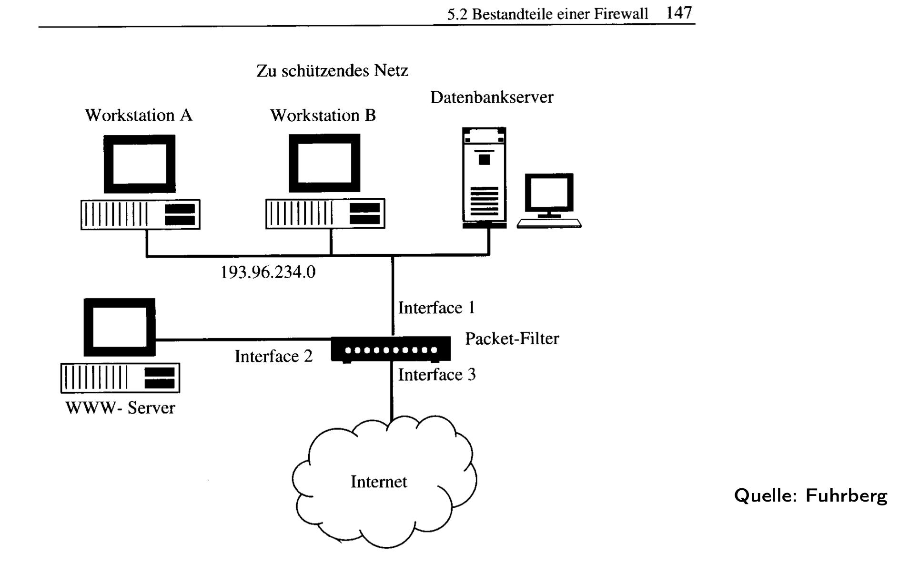
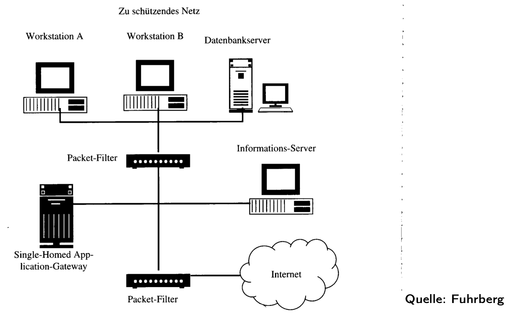

# Firewalls

## Definition (vgl. Definition 75)
A **firewall** (Brandmauer) is a hardware/software system that connects two networks and ensures that **all traffic between them passes through it**.  
It enforces a **security strategy** by:

- Filtering packets (mainly **Layer 3 & 4**, sometimes L2 or DPI at L7).
- Enforcing **access restrictions** (who/what can communicate).
- Performing **authentication** (if required).
- Supporting **auditing & logging** (detection, forensics).

Only packets that satisfy the defined strategy are forwarded.

## Firewall Concept
A firewall deployment always involves four pillars:

1. **Security Strategy / Policies**  
   - What is protected? Against which threats?
   - Example: allow outbound HTTPS, deny inbound except VPN.

2. **Filter Rules & Mechanisms**  
   - **Stateless filters**: match IPs, ports, protocols.  
   - **Stateful filters**: track TCP sessions.  
   - **DPI / Application inspection**: scan payloads, detect malware.

3. **Protokollierung & Auditing**  
   - Record allowed, denied, and suspicious traffic.  
   - Enables attack detection and forensic analysis.

4. **Management**  
   - Define & control filter rules.  
   - Apply updates, patches, signatures.  
   - Create & restore backups of configuration.

## Firewall Strategy 
When designing a firewall strategy, the following aspects must be clarified:

1. **Schutzbedarf** – What protection needs are required?  
2. **Struktur des Netzes / Topologie** – What does the existing network topology look like?  
3. **Kommunikationsprofil** – Which services, users, and flows are required?  
4. **Informationen verdecken** – What should the firewall hide (e.g., NAT, private IPs)?  
5. **Zugänge** – Which access paths are required (ISP, redundancy, IPv4/IPv6)?  
6. **Datendurchsatz** – What throughput is expected?  
7. **Administration** – Who manages the firewall, rules, and rights?  
8. **Protokollauswertung** – Who analyzes logs and reacts to attacks?  
9. **Revision** – Who is responsible for compliance/audit checks?  
10. **Verschlüsselung** – Which data must be specially protected by encryption?  
11. **Schadsoftware-Schutz** – How are end-users protected from malware (central, decentralized, spam filter)?  
12. **Ausnahmesituationen** – How are exceptions or emergencies handled?  
13. **Backups** – Who performs backups, and how are they carried out?  
14. **Verbindungswünsche** – How are new connection/service requests treated?  
15. **Integrität** – How is data integrity ensured on systems?  
16. **Aktualität** – How are firewall software, OS, and admin knowledge kept up to date?

## Firewall Classification

### Mechanisms (Filter Philosophy)
- **Optimistischer Ansatz (optimistic approach):**  
  - Default = allow.  
  - Only *specified* traffic is blocked.  
  - Example: "Block SMTP spam, allow everything else."  
  - Risk: Easier misconfigurations, larger attack surface.  
  - Security principle: **Default-allow**.

- **Konservativer Ansatz (conservative approach):**  
  - Default = deny.  
  - Only *specified* traffic is allowed.  
  - Example: "Only allow HTTPS outbound, deny all other traffic."  
  - Stronger security posture, but more management overhead.  
  - Security principle: **Default-deny**.

### Protocol Layer Perspective
- **Vermittlungs- und Transportschicht (Network + Transport, L3/L4):**  
  - IP addresses, subnets, ports, TCP/UDP.  
  - Example rule: *Allow TCP 443 to 192.0.2.10, deny others*.  
  - Efficient, but no deep knowledge of the application.

- **Anwendungsschicht (Application Layer, L7):**  
  - Deep Packet Inspection (DPI), protocol awareness.  
  - Understands HTTP, SMTP, DNS, etc.  
  - Example: *Block HTTP requests with suspicious payloads (SQL injection patterns)*.  
  - More powerful, but CPU-intensive and affected by encryption (TLS/QUIC).

### Firewall Architectures
- **Zentrale Firewall (centralized firewall):**  
  - One main firewall at the network boundary (e.g., internet gateway – can be in the same box as the NAT).  
  - Easier to manage, but creates a bottleneck and single point of failure.  
  - Common in smaller organizations or simple topologies.

- **Verteilte Firewalls (distributed firewalls):**  
  - Multiple firewalls at different points (e.g., internal VLANs, data center segments).  
  - In modern environments: endpoint firewalls, cloud security groups, microsegmentation.  
  - Higher complexity but greater security granularity.

### Real-World Scale Example (University of Potsdam, 2014)
- **Active hosts (Endsysteme inkl. Telefone, Access Points, WLAN Clients):** ~18,000.  
- **Firewall ruleset (Internet-facing instance):** ~1,000 rules.  

📌 Insight:  
Even for ~18k endpoints, the number of **firewall rules** was only ~1k, showing:  
- Rules must be **abstract and scalable** (cover ranges, not individual hosts).  
- Rule management is a major administrative challenge (avoid redundancy, shadow rules).  

## Firewall Architectures
### One firewall system with multiple network interfaces
When we speak of a **firewall architecture**, we mean how the firewall is positioned in the network and how it connects to different zones.  

The simplest design is **one firewall system with multiple network interfaces**. Imagine a single firewall box (could be a hardware appliance like Cisco ASA, FortiGate, or even pfSense). It has several **network interfaces** — these are the “doors” that connect it to different networks(e.g outside, inside). Each interface has its own MAC address, IP configuration, and routing entry, and the firewall knows exactly which packet arrived on which interface.

Typical roles of the interfaces in this architecture:
- **LAN interface (Local Area Network):** connects to the internal, trusted network (e.g., your company’s PCs, your home laptops).  
- **WAN interface (Wide Area Network):** connects outward to the Internet or an ISP. This is often called the **WAN uplink**, because it is the physical link that carries your traffic “upstream” into the provider’s backbone.  
- **DMZ interface (Demilitarized Zone):** connects to semi-trusted systems like public web or mail servers that are exposed to the Internet.  

To make this concrete: when you want to connect to Google from your laptop, Chrome opens a TCP connection to port 443 (HTTPS). Your laptop checks its routing table: *“I don’t know this 142.250.185.36 address, it’s outside my local network.”* So → send it to my default gateway = 192.168.1.1 (your router), your packet leaves through your laptop’s Wi-Fi **network interface**(WAN), travels to your default gateway (the firewall/router). The firewall receives it on its **LAN interface**, checks its rules, applies **NAT** (translating your private IP 192.168.x.x into the firewall’s public IP), and then forwards it out through the **WAN interface** to the ISP. Google responds back to the firewall’s WAN IP, and the firewall rewrites it to your private address before sending it back via the LAN interface to your laptop.*This is why interfaces are crucial: without multiple interfaces, the firewall couldn’t distinguish between “inside” and “outside,” or enforce different rules depending on traffic direction.*


#### Advantages (of one firewall system with multiple network interfaces)
- **Preiswert (cost-effective):** one device with several interfaces is cheaper and simpler to manage than multiple separate firewalls.  
- **Centralized management:** only one ruleset and one configuration to maintain.  

#### Disadvantages
- Suitable only for **niedrigen bis mittleren Schutzbedarf (low to medium protection needs)**.  
- It creates a **single point of failure**: if this one firewall is compromised or misconfigured, the attacker has direct paths to LAN, DMZ, and Internet.  
- Security principle violated: no **defense-in-depth**. With only one protective wall, there’s just one “Hürde” (hurdle) for attackers.  

To understand *defense-in-depth*, imagine layering:  
- Outer firewall blocks all inbound except HTTPS.  
- A second internal firewall separates LAN from DMZ.  
- Host firewalls on servers allow only specific application traffic.  
If one layer fails, the others still stand. A single multi-interface firewall lacks these redundant layers.  

#### Use Cases
- **Small and medium businesses.**  
- **University departments.**  
- **Home labs or SOHO setups.**  
Where budgets and complexity must stay low, a single firewall with multiple interfaces is often chosen, even if it sacrifices depth of protection.  
---
### Demilitarized Zone (DMZ)

#### What is a DMZ?
The term **DMZ (Demilitarized Zone)** comes from the military: a buffer zone between two hostile sides.  
In networking, it is a **separate subnet** for servers that must be reachable from the Internet, while protecting the internal LAN.  

- Goal: if a web or mail server is compromised, the attacker is **confined to the DMZ** and cannot directly access the LAN.  
- Quote by Bob Toxen:  
  > "Anyone inside it will likely get shot."  
  Servers in the DMZ are always at risk but that risk is isolated.  

#### Architecture Example: Screened Subnet with Application Gateway

This architecture shows a **three-zone setup** protected by two packet filters and an application gateway:

1. **Internet (untrusted zone):** all external requests enter here.  
   - First **packet filter** checks and limits incoming traffic.  

2. **DMZ (buffer zone):** contains public-facing systems.  
   - **Information server**: a service like web or mail that must be reachable.  
   - **Single-homed application gateway**: a proxy/firewall at Layer 7.  
     - "Single-homed" means it has only one interface, located in the DMZ.  
     - It mediates requests instead of allowing direct LAN connections (e.g., accepts a mail request and relays it inside).  
   - The DMZ is deliberately isolated: if a public server is hacked, the attacker is trapped here.  

3. **Internal network (trusted LAN):** workstations and database server.  
   - Protected by a second **packet filter**.  
   - Only carefully defined traffic from the DMZ or proxy can enter.  

**Key idea:** traffic from Internet → must go through outer filter → DMZ/proxy → inner filter → LAN.  
There is no direct Internet-to-LAN path. This creates **defense-in-depth** and limits the **blast radius** if a DMZ server is compromised.


#### Why a DMZ?
- Without DMZ: web servers would sit in the LAN → if hacked, attackers reach internal assets directly.  
- With DMZ: attackers breaking into a DMZ server still face another firewall barrier before touching LAN systems.  
- Implements **defense-in-depth**: multiple hurdles instead of one.


#### University Example – Reference Network Design

This shows a **real-world campus design** with multiple zones:

- **WiN Internet:** German national research & education backbone (DFN-WiN).  
- **Firewall / IDS/IPS Gateway:** first line of defense against external traffic.  

### Campus Core (Hochschulnetz)
- Central backbone for the university: routes between buildings, connects WLAN, VoIP, and building automation systems.  

### Locations (Standort A, B, C…)
- **PC-Pools:** student computer labs.  
- **Instituts-Server:** departmental servers (per faculty/institute).  
- **Remote sites:** smaller branch campuses, connected back into the core.  

### Verwaltungs-IT (Administrative IT)
- Most sensitive systems: HR, exams, finance, campus management.  
- Strictly separated by its own firewall rules.  
- Students or external users cannot reach it directly.  

### DMZ
- Buffer zone for public-facing services: web servers, e-learning platforms, video servers.  
- Accessible from both Internet and internal users.  
- If compromised, attackers are contained here and cannot freely pivot into Verwaltungs-IT or core infrastructure.  

### Zentrale IT-Dienstleister (Central IT Services)
- Critical backend services: mail servers, directory services, HPC cluster (High Performance Computing), file servers, e-journals.  
- Heavily protected, positioned deeper inside than the DMZ.  

### True vs Pseudo-DMZ
- **True DMZ:** 
>firewall rules + separate network topology, example: Internet → Firewall → DMZ subnet → Firewall → LAN

A separate subnet with its own firewall interfaces and rules; own network segment, IP range. It is physically or logically isolated by the firewall. Traffic must cross firewall rules to move between:
- Internet ↔ DMZ
- DMZ ↔ LAN

Even if the firewall rules are misconfigured, the physical/logical subnet separation means the attacker still has to cross the firewall device to move further.
*This is network segmentation you can draw on a diagram with three zones: Internet, DMZ, LAN.* 
- **Pseudo-DMZ:** 
>only firewall rules to “pretend” separation, example:
Internet → Firewall allows → 192.168.10.50 (web server)

NO dedicated subnet, only separation by firewall rules **within the same network**. Servers are in the same address space as the LAN, but firewall rules “pretend” to isolate them. The firewall says “treat this host differently,” but physically/logically it is still in the LAN. Less secure, since a rule mistake can expose internal systems. **IF:**

  - Web server has address 192.168.10.50.
  - Workstations are also 192.168.10.x (**same subnet**)
  - Firewall rules say:
  - Allow Internet to → 192.168.10.50 (web server).
  - Deny Internet to → 192.168.10.0/24 (other hosts).

  But since the web server is on the same subnet as LAN PCs, if an attacker compromises it, they can directly **ARP-scan (Address Resolution Protocol) = maps IPv4 addresses → MAC addresses on a LAN** and talk to the workstations: the firewall won’t even see that traffic, because it never passes through it.
#### Example
- A student accesses an **e-learning platform** (in the DMZ).  
- Request goes: Internet → firewall → DMZ server.  
- If the e-learning server is hacked, the attacker cannot directly jump into the exam management system (Verwaltungs-IT), because that lies behind a different firewall barrier.  

#### Pros and Cons of DMZ
**Advantages**
- Limits impact of compromised public servers.  
- Enforces **defense-in-depth**: Internet → DMZ → LAN.  
- Supports more granular monitoring and logging.  

**Disadvantages**
- More complex setup and rulesets.  
- Higher cost (multiple firewalls, IDS/IPS).  
- Requires careful design to avoid “pseudo-DMZ” pitfalls.  

#### Key Takeaway
- DMZ = buffer zone for public services.  
- **Application gateways** add another layer by mediating traffic at the application layer.  
- **Universities and enterprises** always deploy DMZs for web, mail, e-learning, video, etc.  
- **SOHO setups** often skip DMZs because of cost/complexity, but this is risky if public services exist.

### Host Firewall (Personal / Desktop Firewall)
- A **host firewall** runs directly on the **end system** (the host).  
- Controls **incoming and outgoing packets** for that one machine.  
- Special case of a network firewall, but limited to one host.  
- Protects against local malware or unauthorized outbound connections.  

**Examples**  
- Windows Firewall  
- Linux `iptables` / `nftables`  
- FreeBSD `ipfw`  
- OpenBSD `pf`  

>Host firewalls often use packet filtering technology.
E.g., Windows Firewall is a packet filter, but it runs on the host. But **not all** packet filters are host firewalls.

**Tangible case**  
- On Windows, when an app first tries to connect, a popup asks:  
  *“Allow this app to communicate on private/public networks?”*  
- That is host firewall filtering in action.

## Packet Filters
Packet filters enforce rules based on **packet attributes**:

- Source / Destination IP address  
- Transport protocol (TCP, UDP, ICMP)  
- Port numbers (80, 443, 53, …)  
- TCP flags (SYN, ACK, FIN)

**Key properties**  
- Operate at **Layer 3 (Network)** and **Layer 4 (Transport)**.  
- Transparent to users and applications.  
- Known as **“first generation firewalls.”**


### Filtering Philosophy
- **Conservative (default deny):**  
  - Allow only required services, block everything else.  
  - Example: Permit only DNS + HTTPS.  
- **Optimistic (default allow):**  
  - Block only known bad services, allow the rest.  
  - Example: Block Telnet, allow everything else.  
- Secure deployments generally use **default deny, allow by exception**.

### Rule Processing
- Rules are applied **in order**.  
- First matching rule is enforced → remaining rules ignored.  
  - *Exception*: OpenBSD `pf` → **last match wins**.  
- Rule order critically affects security outcome.  

**Example**  
1. Allow TCP 53 outbound (DNS).  
2. Allow TCP 443 outbound (HTTPS).  
3. Deny all.  

- DNS packets match rule 1 → allowed.  
- Random traffic hits rule 3 → denied.

### Two Rules per Service: die gehenden und kommenden Paketen
For every service you want to pass, you typically need **two rules** (if it's not a Stateful Firewall, aka Dynamic Packet Filter):  
- Outbound request (client → server).  
- Inbound response (server → client).  

**Example: DNS**  
- Allow UDP 53 to DNS server.  
- Allow UDP 53 back from DNS server.

### Logging
- Packet filters should log all **dropped packets** with details:  
  - Source/destination IP, port, protocol, timestamp.  
- Enables detection of scans, suspicious activity, and forensic analysis.

### Properties of Packet Filters

**Advantages**  
- **High performance**: runs in kernel space, fast decisions.  
- **Cheap**: built into routers, operating systems.  
- **Extensible**: new services supported by simply adding new rules.

**Disadvantages**  
- **Coarse-grained control**: only IPs and ports, no user identity: doesn’t know which user on that subnet is sending traffic, doesn’t know what the HTTPS connection contains (legit banking, or malware).

> Fine-grained on the other hand, means you can decide based on higher-level context, which goes beyond headers into higher OSI layers (5–7). such as:
>The user identity (Alice vs Bob).
>The application (Slack vs Chrome, even if both use HTTPS).
>The content (block HTTP POSTs containing SQL injection strings).
>This requires stateful firewalls or even application-layer firewalls (next-gen firewalls).

- **No authentication awareness**: can’t tell who is behind an IP.  
- **Limited to TCP-oriented services**: weaker for UDP/ICMP.  
- **Configuration complexity**:  
  - Writing correct rule sets is hard.  
  - Requires deep knowledge of TCP/UDP port usage across OSs.  
  - Cheswick & Bellovin:  
    > “Configuring packet filters correctly requires detailed knowledge. That’s why we dislike them.”

### Tangible Example
On a Linux laptop with `iptables`:

- Rule: Allow only outbound DNS (UDP 53) and HTTPS (TCP 443).  
- Rule: Deny + log everything else.  

**Result**  
- Browser works (HTTPS).  
- DNS resolution works.  
- Malware trying to exfiltrate via TCP 8080 → dropped + logged.  

#### Packet Filter Rules (Zwicky et al.)

We inherit the following firewall rules:

| Regel | Aktion     | Quelle (Source) | Quell-Port | Ziel (Destination) | Ziel-Port |
|-------|------------|-----------------|------------|--------------------|-----------|
| A     | erlauben   | 10.*.*.*        | *          | 172.16.6.*         | *         |
| B     | blockieren | 10.1.99.*       | *          | 172.16.*.*         | *         |
| C     | blockieren | *.*.*.*         | *          | *.*.*.*            | *         |

#### Rule Analysis
- **Rule A:**  
  Allow all hosts in `10.0.0.0/8` to reach subnet `172.16.6.0/24` (all ports).  

- **Rule B:**  
  Block hosts in `10.1.99.0/24` from reaching any `172.16.x.x` host.  
  → This is a *subset* of Rule A.  

- **Rule C:**  
  Block all remaining traffic.  
  → Implements “default deny.”

### Packets That Pass
- Packets from `10.x.x.x` → `172.16.6.x` **are allowed**.  
- Packets from `10.1.99.x` → `172.16.6.x` **still allowed** (Rule A matches first).  
- All other traffic → **blocked** by Rule C.

### Redundant Rules
- **Rule B is redundant** in this order:  
  - Rule A allows 10.x.x.x traffic before B is checked.  
  - So Rule B never applies to 10.1.99.x hosts reaching 172.16.6.x.  

- To make Rule B effective, it must appear **before Rule A**.  

**Lesson:** Specific block rules must come before general allow rules.

### Conceptual Takeaways
- **Default deny** (Rule C) is a secure base.  
- **Order matters:**  
  - Linux iptables = first match wins.  
  - OpenBSD pf = last match wins (different behavior!).  
- Always place **specific rules before general ones** to avoid unintended bypass.

#### Real-World Example
Imagine:  
- Rule A = “Allow all employees (10.x.x.x) to access the finance subnet (172.16.6.x).” 
- Rule B = “Block the contractor subnet (10.1.99.x) from finance.” 

Because Rule A comes first, contractors are accidentally allowed.  
This is a **classic firewall misconfiguration**.

# Stateful Packet Filtering

## Why we need packet-filter extensions
- **Problem with stateless filters:** they inspect each packet in isolation (L3/L4 headers only).  
  - Cannot reliably decide whether an incoming packet is a *new* connection attempt or a *reply* to an established one.  
- **Consequences:** require explicit two-way rules per service (request + reply) and are error-prone.  
- **Solution:** **stateful inspection / connection tracking** — remember 5-tuple + state and allow replies automatically.

**5-tuple** = (srcIP, srcPort, dstIP, dstPort, protocol).

## Stateful rules for TCP (concept)
- TCP connection lifecycle recognized by flags and handshake:  
  1. `SYN` (client) → `SYN/ACK` (server) → `ACK` (client) = **3-way handshake**.  
- **State machine model** (typical states): `NEW` → `SYN_RECEIVED` → `ESTABLISHED` → `FIN_WAIT` → `CLOSED`.  
- Firewall actions:  
  - On `SYN` (NEW): create a state entry (5-tuple) if policy allows.  
  - On subsequent packets: match 5-tuple → treat as `ESTABLISHED` and allow if state is valid.  
  - On `FIN`/`RST`: tear down state entry (or timeout).

**Why this helps:** single outbound allow rule (e.g., allow outbound TCP 443) suffices; replies are matched by state table.

## Dynamic rules for UDP
- UDP is connectionless — no handshake. Stateful behaviour is simulated:
  - When a host sends UDP request `(A:portX → B:53)`, firewall **creates a temporary state**: allow `B:53 → A:portX` for short period (e.g., 30s).  
  - If reply arrives in time → accepted and timer refreshed. Otherwise rule removed.
- This technique is called **connection tracking** for UDP (dynamic allow entries).

**Typical use-case:** DNS queries, RTP in VoIP (with larger timeouts).

## TCP header and flags (CODE bits)
- **TCP header flags (single-bit fields)**: `URG`, `ACK`, `PSH`, `RST`, `SYN`, `FIN`.  
- Interpretations used by firewalls:  
  - `SYN` without `ACK` → NEW connection attempt.  
  - `SYN+ACK` → server reply during handshake.  
  - `ACK` → regular packet in established flow.  
  - `FIN` / `RST` → teardown/abort signals → remove state.  
- **Firewall uses flags + 5-tuple to track session state.**

**Practical observation:** flags are visible in packet captures (`tcpdump`, `Wireshark`) as `[S]`, `[S.]`, `[.]`, `[F.]`, etc.

## Tangible example: Web browsing (HTTPS)
1. Browser: `192.168.1.20:51515 → 142.250.185.36:443` with `SYN`.  
2. Firewall: sees `SYN`, creates state entry: `(192.168.1.20,51515,142.250.185.36,443,TCP)` → `NEW`.  
3. Server: replies `SYN/ACK`, firewall matches entry → allowed.  
4. Client: `ACK` completes handshake → firewall marks `ESTABLISHED`.  
5. Data flows (PSH+ACK) → allowed as part of the state.  
6. Close (FIN) → firewall removes state after proper close or timeout.

**Commands to inspect (Linux/Mac):**
- Linux conntrack: `sudo conntrack -L`  
- OpenBSD/macOS `pf`: `sudo pfctl -ss`

## Practical Host examples

### 1) Example: Stateful rules with `iptables` (host)
```bash
# Allow SSH incoming (stateful)
iptables -A INPUT  -i eth0 -p tcp --dport 22 -m state --state NEW,ESTABLISHED -j ACCEPT
iptables -A OUTPUT -o eth0 -p tcp --sport 22 -m state --state ESTABLISHED -j ACCEPT

# Alternative outgoing-allow simplification (allows all outbound and replies)
iptables -A OUTPUT -m state --state NEW,RELATED,ESTABLISHED -j ACCEPT
iptables -A INPUT  -m state --state ESTABLISHED,RELATED -j ACCEPT
```
- First pair: explicit allow for SSH server + allow replies.

- Simpler pattern: If you allow NEW + ESTABLISHED + RELATED, every outgoing session from your host will be allowed, and all replies are auto-allowed. So in practice, admins often simplify and just say: “all outbound allowed, only restrict inbound.”

### Dynamic Packet Filters (UDP)

* Mechanism: on seeing outbound UDP to `(B:53)`, create **ephemeral** allow rule permitting `B:53 → A:portX` for N seconds.
* Timer refresh on each matching reply.
* If timer expires → entry removed (hole closes).

### Example: DNS traffic filter

**Outbound rule (static):**

* Allow internal `*:* → DNS servers :53 (UDP)`

**Dynamic reaction (internal):**

* On seeing `(IP_intern, portClient) → (IP_dest, 53) UDP`:

  * Create state: allow `(IP_dest,53) → (IP_intern,portClient) UDP` for (e.g.) 30s.
* If reply comes within 30s → accepted; reset timer.
* After 30s of inactivity → state removed.

**Note:** this is "connection tracking" for stateless UDP.

## Fragmentation attacks on packet filters

### How fragmentation works (IP layer)

* IP header fields for fragmentation:

  * `Identification` (16 bits)
  * `Flags` (DF=Don’t Fragment, MF=More Fragments)
  * `Fragment Offset` (13 bits) — units of 8 bytes
* **First fragment**: `Offset = 0`. Subsequent fragments: `Offset > 0`.

### Normal case

* Entire TCP header (min 20 bytes) is placed at the start of the IP payload → present in fragment with `Offset = 0`. Firewalls inspect offset 0 fragment, see flags (SYN), and decide.

### Malicious case (crafted fragmentation)

* Attacker deliberately fragments so **first fragment contains only part of the TCP header** (or none of the bytes containing the flags).
* Later fragment(s) contain the remainder of the TCP header (including SYN).
* **Naive firewall**: inspects only first fragment, sees no SYN, and forwards fragments.
* **Host**: reassembles fragments and may see full TCP header with SYN → accepts and establishes connection.
* **Mismatch** := firewall’s view (no SYN → forwarded) ≠ host view (SYN reassembled → connection accepted). This is the evasion.

### Why modern firewalls are not vulnerable (defenses)

* **Defragment before filtering (reassembly/normalization)** — e.g., `pf` scrub, iptables normalization modules.
* **Drop suspicious fragments** — drop fragments with `Offset > 0` when no corresponding first fragment/state exists.
* **Reject tiny first fragments** that can't include a full transport header.
* **Detect overlapping fragments** and normalize or drop.
* **Logging & rate-limiting** to detect/mitigate exploitation.

### Practical rule-of-thumb

* If your firewall supports **normalization/defragmentation**, enable it. If not, be conservative: drop non-first fragments without state.

## Commands & packet inspection

* See firewall state (Linux): `sudo conntrack -L`
* See pf state (macOS/OpenBSD): `sudo pfctl -ss`
* See pf rules: `sudo pfctl -sr`
* Capture raw packets and flags: `sudo tcpdump -n -i <iface> tcp`
* Inspect fragment fields in capture: `sudo tcpdump -n -i <iface> -v ip`  (look for `frag` markers)

**Note:** On macOS you saw `pf` status disabled by default; `tcpdump` still shows live packets & TCP flags.


## Short exam checklist (remember)

* Stateless filter: per-packet checks → need two rules per service (request + reply).
* Stateful filter: connection tracking → single rule for initiated direction suffices (track 5-tuple & allow ESTABLISHED).
* UDP: ***connection-tracking*** creates short-lived dynamic rules (e.g., DNS).
* TCP flags: `SYN` determines NEW, `ACK` indicates established flow, `FIN`/`RST` close state.
* Fragmentation: always consider fragmentation normalization; don’t rely only on “first fragment has TCP header” assumption.
* Tools: `tcpdump`, `conntrack`, `pfctl`, `iptables` — use them in a lab to observe handshake and state table.
## Fragmentation Basics (IP layer)
- When an IP packet (datagram) is too large for the MTU, it is split into **fragments**.
- Each fragment is itself an IP packet with:
  - **IP header** (always repeated)
    - Source IP
    - Destination IP
    - Protocol (TCP=6, UDP=17, ICMP=1, etc.)
    - TTL, checksum
    - **Fragmentation fields**:
      - **Identification** (16 bits): same across all fragments of the original datagram.
      - **Flags** (3 bits):  
        - DF (Don’t Fragment), MF (More Fragments).
      - **Fragment Offset** (13 bits): position of this fragment’s payload in the original datagram.  
        **Important**: offset is in **8-byte units**, not in single bytes.
  - **Payload** (a slice of the original transport segment, e.g., TCP or UDP).

### Where is the TCP header?
- Normally, the **TCP header (20–60 bytes)** is entirely in the **first fragment** (offset=0).
- Later fragments (`Offset > 0`) carry only TCP **data**.
- **Confusion resolved:** The “fragment header fields” are **IP header fields**, not TCP header fields. The TCP header is inside the payload of the first fragment (unless attacker cheats with tiny fragments).

## Tiny-Fragment Attack
- **Idea:** split the TCP header across multiple fragments so the first fragment does not include the TCP flags (e.g., SYN).
- **Why this matters:**
  - A naïve firewall that only inspects the first fragment sees no SYN bit and assumes:
    > “This is not a new connection, it must be part of an existing one — forward it.”
  - Later fragment carries the SYN bit → the **host reassembles and sees SYN**, establishing a connection.
- **Mismatch explained:**  
  - Firewall thought it was harmless (ACK/data only), forwards it.  
  - Host sees SYN after reassembly, accepts new connection.  
  - This bypasses policy (e.g., “block new incoming TCP connections”).  
- **Confusion clarified:**  
  - *“If SYN is not present, shouldn’t it be denied?”*  
    - **Correct for stateful firewalls.**  
    - But naïve stateless filters only looked at ports/IP in fragment #1 and forwarded if no obvious violation. They assumed headers aren’t split (true for normal stacks). That false assumption allowed bypass.
## Overlapping Fragment Attack
- **Attack:** send fragments with overlapping byte ranges in their payloads.  
- Example:  
  - Fragment A: offset=0, length=100 → covers bytes 0–99.  
  - Fragment B: offset=8 (8×8=64 bytes), length=100 → covers bytes 64–163.  
  - Now bytes 64–99 appear twice.
- **Key point:** attacker can insert *different content* for the same bytes.  
  - In A: bytes 64–99 = “AAAA” 
  - In B: bytes 64–99 = “BBBB”
- **Why dangerous:**  
  - Firewall reassembly policy may use “first wins” → sees `AAAA`.  
  - Host OS may use “last wins” → sees `BBBB`.  
  - So firewall and host interpret different final packets.  
  - Exploit: put harmless TCP flags in the firewall’s view, SYN in the host’s view → firewall lets it through, host accepts connection.
- **Why ambiguity exists:**  
  - RFC 791 (IPv4) never defined how to handle overlaps.  
  - Different OSes/firewalls implemented differently (first wins, last wins, BSD style).  
  - RFC 1858 and later recommended to **drop or normalize overlapping fragments**.

## Practical Confusions & Clarifications
- **Why do offsets jump 0 → 185 → 370?**  
  - Because Fragment Offset field is in 8-byte units.  
  - 185 × 8 = 1480, 370 × 8 = 2960. That’s why.  
- **How can overlapping bytes have “different content”?**  
  - Normal stacks wouldn’t, but attackers craft different payloads in overlapping regions.  
  - This creates the firewall–host mismatch.  
- **What does F0=1 mean in slides?**  
  - Shorthand for “Fragment Offset ≠ 0” (not the first fragment).  
  - Rule: `IF FragmentOffset != 0 AND Protocol=TCP THEN DROP` → conservative but safe.  

## Why Firewalls Forwarded Suspicious Fragments (Naïve Case)
- **Naïve assumption:** “If I don’t see SYN in the first fragment, this must be established, ongoing traffic.” 
- Early packet filters wanted performance → they didn’t reassemble, they trusted that TCP headers are always in the first fragment.  
- Normal traffic followed that rule, so they passed it.  
- Attackers broke the assumption with tiny fragments.

## Defenses in Modern Firewalls
1. **Defragment before filtering (normalization):**
   - Reassemble all fragments, then inspect L4 headers once.
   - `pf` (OpenBSD/macOS): `scrub in all` reassembles & normalizes.  
   - Linux iptables/nftables: conntrack subsystem handles reassembly.
2. **Drop non-first fragments for TCP if no state exists.**
```bash
   iptables -A INPUT -p tcp -f -j DROP
```
(`-f` = matches non-first fragments.)

3. **Drop tiny first fragments** that can’t hold full TCP header (e.g., <20 bytes payload).
4. **Normalize overlaps** or drop them entirely. IDS/IPS (Snort, Suricata) treat overlaps as suspicious.
5. **Resource safety:** cap fragment reassembly buffers, use short timeouts.

## Operational Impact

* **TCP:** tiny and overlapping fragments target handshake (SYN/ACK), so they’re the main attack vector.
* **UDP:** fragmentation can also be abused (e.g., hiding DNS header fields in later fragments).
* **Modern practice:** most firewalls either normalize or conservatively drop suspicious fragments.
* **IDS view:** overlapping or tiny fragments in the wild are almost always considered malicious.

## Quick Exam Checklist

* IP fragmentation fields: Identification, Flags (DF/MF), Fragment Offset (8-byte units).
* TCP header normally in fragment offset=0.
* Tiny fragment attack: SYN hidden in later fragment.
* Overlap attack: different reassembly semantics (firewall vs host).
* Naïve assumption: “No SYN seen → must be established traffic.”
* Defenses: reassemble, drop non-first TCP fragments without state, drop tiny first fragments, normalize overlaps.
* Modern OS/firewalls: normalize or drop suspicious fragments by default.
