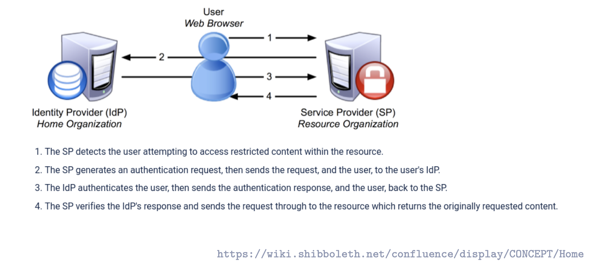
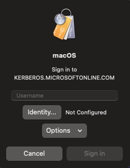

# Authentication & Single Sign-On (SSO)
So far, we've talked about **public-key cryptography**: RSA, Diffie-Hellman, certificates, smart cards. These are powerful tools, but they have a problem: **they're slow**. 

Every time you need to authenticate or sign something, you're doing complex mathematical operations - raising huge numbers to huge powers, modulo arithmetic in Galois Fields. Your smart card chip is working hard!

Now imagine a large organization - let's say a university with 50,000 students and staff. Every morning:
- 50,000 people log in to their computers
- They access email servers
- They connect to file servers  
- They use printing services
- They access databases

If every single authentication used RSA or certificate verification, the servers would be overwhelmed! 

**The question becomes:** How do we authenticate thousands of users, thousands of times per day, efficiently?

This is where **Kerberos** comes in. 

Kerberos takes a completely different approach. Instead of using slow public-key cryptography for every authentication, it uses **fast symmetric encryption** (like AES). Remember how we said AES is much faster than RSA? Kerberos exploits that.

The clever idea: **What if we could authenticate once in the morning, and then use that authentication all day long for different services, without doing expensive cryptographic operations every time?**

That's exactly what Kerberos does - it's a **ticket-based authentication system**. You prove who you are once, you get a ticket, and you show that ticket to access services throughout the day. Like getting a wristband at a festival - you verify your ID once at the entrance, then the wristband gets you into all the venues.

Let's see how this works...

## 1. Authentication as a prerequisite
- **Authentizität der Subjekte/Akteure** (users, services) must be verified first.
- Only then can further security goals be realized:
  - **Integrität (Integrity)**: protecting data from unauthorized modification.
  - **Vertraulichkeit (Confidentiality)**: protecting data from unauthorized access.

## 2. Authentication techniques (Faktoren)
- **Wissen (Knowledge)** → something you know.
  - Examples: Passwort, PIN.
- **Besitz (Possession)** → something you have.
  - Examples: EC-Karte, USB-Stick with private key.
- **Sein (Inherence/Biometrics)** → something you are.
  - Examples: Fingerabdruck, face recognition.
    
    ⚠️ Weakness: Biometric secrets cannot be changed if compromised.

## 3. Mehr-Faktor-Authentifikation
- Use of more than one factor simultaneously.
- Example: ATM login = Karte (Besitz) + PIN (Wissen).
- **Zwei-Faktor-Authentifikation** = two distinct categories, not just two passwords.

## 4. One-way vs. Mutual Authentication
- **Einseitige Authentifikation** (one-way):
  - Only one party proves identity.
  - Examples:
    - ATM: User authenticates to system, but ATM does not authenticate to user.
    - Normal web browsing: Server authenticates (TLS certificate), client usually not at TLS layer.
- **Wechselseitige Authentifikation** (mutual, 2-way):
  - Both sides authenticate each other.
  - Example: Online banking (server proves identity to client, client authenticates with password + TAN/2FA).

## 5. Single Sign-On (SSO) in Distributed Systems
- A **verteiltes System (distributed system)** supports SSO if:
  - User authenticates **once**.
  - Gains access to all authorized services without re-entering credentials.
- Benefits: usability, consistent identity, reduced password fatigue.
- Risks: compromise of initial login compromises all services.

### Examples
- **Kerberos**: classical SSO system, widely used in enterprises.
- **Web-based SSO**: 
  - **SAML** (Security Assertion Markup Language).
  - **Shibboleth**: implementation of SAML, used for SSO at Universität Potsdam.

### Distinction
- Reusing same password across systems ≠ SSO (credential reuse).
- True SSO = one central authentication (IdP), the SPs participate in a federated trust model(Service Providers = the actual applications you want to use) accept tokens/assertions.
> Federation here means multiple independent systems (SPs) agreeing to trust the same Identity Provider (IdP). Instead of each SP maintaining its own user database, they “federate” around a shared authority.
- Example at Uni Potsdam:
  - Login once at IdP (idp.uni-potsdam.de).
  - Access Moodle, Git.UP, Mail, etc. without retyping credentials (if IdP session cookie persists).
  - In practice, session handling sometimes requires re-login, but architecture is still SSO.



# Kerberos

## 1. What is Kerberos?
- A **network authentication protocol**.  
- Goal: Clients and servers in a **verteiltes System (distributed system)** can prove their identities to each other **over insecure networks**.  
- Prevents sending passwords directly; instead uses **tickets + session keys**.  
- Provides **Single Sign-On (SSO)**: one login unlocks many services.

---

## 2. Architecture
- **Client (C):** the user or computer requesting access.
- **Server (S):** the service you want (file server, mail server, app server).
- **KDC (Key Distribution Center):** the trusted 3rd party that both sides trust.  
  - **AS (Authentication Server):** first login, checks the user, issues a **Ticket Granting Ticket (TGT)**.  
  - **TGS (Ticket Granting Server):** issues **service tickets** for specific servers based on a valid TGT.  

👉 Puzzle:  
- **Without KDC:** every client and server would need to share passwords directly → `N × M` explosion of keys.  
- **With KDC:** each client and server only needs *one* long-term key with the KDC.  

---

## 3. Why a Third Party?
- If there are 100 clients and 50 servers:  
  - **Without KDC:** 5000 keys/passwords must be stored everywhere.  
  - **With KDC:** 150 keys only (100 client keys + 50 server keys, all to the KDC).  
- When client and server want to talk: KDC creates a session key, gives each side a ticket.  
- **Intuition:** Everyone only needs to trust the “referee” instead of trusting each other directly.

---

## 4. Applications of Kerberos
- **DCE (Distributed Computing Environment, 1990s):**
  - Early enterprise distributed system, Kerberos provided cross-host authentication.
  - “Early enterprise cloud” → first attempt at seamless multi-server apps.

- **NFS (Network File System, Unix/Linux):**
  - Protocol that lets you mount remote folders as if they were local.
> With NFS, a folder on the server can be “mounted” on your machine, so /home/student on your computer might actually live on the server. Imagine plugging in a USB stick but instead of plugging into your laptop, it’s plugged into the server room, and your computer “pretends” it’s local. That’s NFS.
  - Without Kerberos: NFS trusts easily-faked user IDs (UID spoofing).  
  - With Kerberos: access tied cryptographically to the authenticated user.

- **Active Directory (Windows 2000+):**
  - Kerberos is the **default auth protocol** in AD domains.  
  - When logging into Windows, AD issues a TGT.  
  - All enterprise resources (Outlook, Teams, file shares, printers) accept Kerberos tickets → seamless SSO.

---

## 5. Attacker Model (Angreifermodell)
Kerberos assumes the network is hostile. Defenses are built-in:

1. **Message tampering (order/delete):**  
   - Mitigated by **timestamps** and **ticket lifetimes**.  
   - If out of order or expired → rejected.

2. **Eavesdropping (Abhören, Man-in-the-Middle):**  
   - Password never sent.  
   - Keys are derived and session-specific → attacker only sees encrypted blobs.

3. **Replay attacks:**  
   - Each session uses an **Authenticator with a fresh timestamp**.  
   - Replaying old authenticators fails.

4. **IP-Spoofing:**  
   - Tickets include **AddrC** (bound to client’s network address).  
   - If packet source ≠ ticket address, server rejects.

5. **ARP-Spoofing:**  
   - Pretending to be another host won’t work, since you still lack the **long-term secret key** that only the real host shares with the KDC.

---

## 6. Example: “Day in the Life” at Company XZY

1. **Mac login:**  
   - Your Mac password is **normally synced with your AD (Active Directory) password** via enterprise tooling (e.g. Intune/Jamf/Apple Enterprise Connect, **REASON**: macOS doesn’t speak Kerberos/AD natively as deeply as Windows... *just like VPN uses RADIUS as its mediator, your Mac uses JAMF/Intune*).  
   - This makes it *feel* like a single password for both your Mac and corporate services.  
   - In reality, these are **two separate stores**:  
     - Local macOS account password.  
     - AD/Azure account password (used for VPN, Outlook, Teams, ServiceNow, etc.).  
   - If you reset your Mac password locally (e.g. via recovery key), the sync is broken → your Mac login password diverges from your AD password.  
   - If you change your password through AD, the sync updates your Mac to keep them identical.  

2. **Cisco VPN:**  
   - Uses **RADIUS** for network access.  
   - VPN appliance* forwards your credentials to a RADIUS server.
   - The RADIUS server checks with AD → same corporate account as above.
   >	In IT, an **appliance** usually means a dedicated system (hardware box or virtual machine) that does one job very well. A **VPN appliance** = a specialized server that handles VPN connections. It can be a physical device in the datacenter (e.g. Cisco ASA, Palo Alto, Fortinet) OR a virtual machine/appliance running in the cloud. It **terminates your VPN tunnel** (A VPN tunnel = the encrypted “tube” your computer builds to the company network) When you start the VPN client, you type your credentials, the VPN appliance checks them (usually by asking a RADIUS server, which in turn asks AD), only if you’re authenticated does the tunnel get fully established. Your Mac wraps all traffic in encryption/builds the encrypted VPN tunnel and sends it to the VPN appliance. The appliance terminates = it’s the endpoint of that encrypted tube. After that point, the traffic is “inside” the corporate network in plain form. *Picture*: **From your Mac → encrypted → VPN appliance. VPN appliance decrypts → sends your traffic to file servers, Jira, Outlook, etc.**
   
  >  **Why does VPN need a mediator (RADIUS) to check with AD?** The VPN box could talk directly to AD. **But**: AD uses Kerberos + LDAP → those are not “VPN protocols.” VPN appliances are built by network vendors (Cisco, Palo Alto, Fortinet), not Microsoft. **Instead of embedding Kerberos/LDAP logic into every VPN box**, vendors implement ***RADIUS***, a lightweight, universal protocol to ask: “Here’s a username/password. Is it valid? Yes/No?” The RADIUS server then translates that into whatever the backend is (AD, LDAP, SQL, certificates).

  > 👉 So RADIUS is the translator between “network devices” and “identity systems.” **That’s why VPN → RADIUS → AD**.
It makes the VPN vendor’s job easier and keeps things modular.

> A **gateway box** (appliance) is purpose-built (hardware or VM) for a single function (like VPN, firewall, proxy). Inside, it’s still just a computer (CPU, RAM, OS), but locked down and optimized for that role.

3. **Outlook / Teams / SharePoint (Office 365 / Azure AD):**  
   - These apps are **cloud-based** and use **OAuth2 / OpenID Connect**.  
   - Azure AD issues tokens (JWTs) after authentication.  
   - If Kerberos login is configured (`KERBEROS.MICROSOFTONLINE.COM`), macOS can present Kerberos tickets directly to Azure AD, which then exchanges them for tokens.  
   - End result: you don’t retype your password; tokens are handed to the apps.

4. **Jira / Confluence (Atlassian Cloud):**  
   - Use **SAML SSO** with Azure AD as the Identity Provider.  
   - Jira redirects you to Azure AD → Azure AD checks your Kerberos/AD session or cached login.  
   - If valid, Azure AD hands Jira a signed **SAML assertion**.  
   - Jira trusts it, no password prompt.

👉 **End result:**  
- **One identity (AD credentials)** is used everywhere.  
- **Kerberos** runs locally (AD) and extends into **Microsoft Online** (Azure AD realm).  
- **Tokens (SAML/OAuth)** are the “currency” that cloud apps accept.  
- **RADIUS** protects network access but ultimately checks back with AD.  
- **Mac password ≈ AD password** only when sync is intact. Local resets break the illusion.
---

## 7. Related Protocols (for context)
- **LDAP:** protocol to query/update directories (user database).  
- **Active Directory (AD):** Microsoft’s directory service (LDAP + Kerberos + policies).  
- **RADIUS:** protocol for authenticating network access (VPN/Wi-Fi), usually checks AD in the background.  
- **TACACS+:** Cisco’s protocol for authenticating access to routers/switches.  
- **OAuth2/OpenID Connect:** modern web protocols for “Login with Google/Microsoft.”  
- **TLS Client Certificates:** alternative to passwords, using cryptographic certificates.

---

## 8. Tokens (OAuth/SAML)
- Instead of sending passwords, cloud IdPs hand apps a **token**:  
  - **JWT (OAuth2)** or **SAML assertion**.  
  - Signed cryptographically → can’t be forged.  
- Token = *“This is Jînno, already authenticated at X time, with Y roles.”*  
- Apps verify the signature instead of asking for a password again.

---
## Kerberos V5: 6-Message Flow 

> Scenario: You (Client) log into your laptop, then try to access a shared file folder on an NFS server inside your company network.  
The KDC here is **Active Directory (AD)**, which issues Kerberos tickets.

## Message 1 — Client → AS (AS-REQ)
- You type your username + password at login.  
- Your computer sends a request to the **Authentication Server (AS)** in AD:  
  - “This is user `jzobairi`. Please give me a Ticket Granting Ticket (TGT).” = A special ticket you get once at login (from the Authentication Server, AS). 

  **Details:**  
- Your password is used once here to prove identity.  
- From now on, you won’t send it again.  
- This request may also include a pre-auth timestamp, encrypted with your password key, to stop offline guessing.  

**Real-world:** When you log into your Mac/Windows machine that’s joined to AD.

---

## Message 2 — AS → Client (AS-REP)

- AD (AS) checks your password. If correct, it replies with:
1. A **session key (Kc,tgs)**: secret for you and the Ticket Granting Server (TGS).  
     - Encrypted with your password key, so only you can open it.  
2. A **Ticket Granting Ticket (TGT)**: sealed envelope for the TGS.
    - It proves that you authenticated correctly with your password. It’s valid for a limited time (often 8–10 hours, like a workday).
    - **It’s encrypted with the TGS’s secret key, so only the Ticket Granting Server can open it.**
    - You can’t read or modify your TGT yourself. You just carry it around.
    - What it contains
      - Your client ID (your username).
      - Your network address (AddrC).
      - A timestamp when it was issued.
      - A lifetime (expiration time).
      - A session key (Kc,tgs) → same one you just received.

**Real-world:** After login, you don’t have to keep typing your password. Instead, your computer now holds a TGT valid for several hours.

---

## Message 3 — Client → TGS (TGS-REQ)
- Later you click on the shared **network drive (NFS/SMB)**.  
- Your machine sends to the **Ticket Granting Server (TGS)**:  
  - The TGT you got earlier (proof you authenticated at login).  
  - An **Authenticator** — fresh data encrypted with `Kc,tgs` to show this request is new.  
  - The name of the target server (`fileserver.xyz.de`).  


### TGT vs. Authenticator

Kerberos uses **two distinct elements** that often get confused:  
- The **Ticket Granting Ticket (TGT)** → long-lived identity proof.  
- The **Authenticator** → short-lived freshness proof.  
Together, they stop both replay attacks and constant password reuse.

#### Ticket Granting Ticket (TGT)
- **Issued by:** Authentication Server (AS).
- **Consumed by:** TGS (because only TGS can decrypt it).  
- **Encrypted with:** TGS’s long-term secret key (so only TGS can open it).  
- **Validity:** Hours (typical workday, e.g. 8–10h).  
- **Purpose:**  
  - Reusable proof that the client has already authenticated.  
  - Lets the client get service tickets without sending the password again.  
- **Contents:**  
  - Client ID.  
  - Client network address (AddrC).  
  - Timestamp when issued (Tkdc).  
  - Lifetime (Lkdc).  
  - Session key (Kc,tgs) for client–TGS communication.  

#### Authenticator
- **Created by:** Client, each time it requests a service.  
- **Encrypted with:** The session key `Kc,tgs` (from the TGT).  
- **Validity:** Very short (minutes; checked with clock skew = when one machine’s clock drifts (e.g., battery dying, NTP sync disabled) = The maximum tolerated clock drift (offset) between client and server. Usually 5 minutes by default in AD.).  
- **Purpose:**  
  - Proves the request is fresh (not a replay).  
  - Proves the client presenting the TGT is the *real* holder of the session key.  
- **Contents:**  
  - Client ID.  
  - Client network address (AddrC).  
  - Current timestamp (Tc).
  > Suppose it’s 18:09 right now. You (the client) build a small data structure: 
    ```
    ClientID = "jzobairi"
    AddrC = "192.168.1.50"
    Timestamp = 18:09:30
    ```
  > Then you encrypt this blob with your session key Kc,tgs.
  
  > Result = the Authenticator.
### Why both?
- **TGT alone:** Could be stolen and replayed for hours.  
- **Authenticator alone:** Not trusted (needs backing by TGT).  
- **Together:**  
  - TGT = *“This user is legit”* (long-term identity).  
  - Authenticator = *“And it’s really them right now”* (short-term freshness).  

**Real-world:** When you double-click on the “S:” drive or `\\fileserver\share` in Windows Explorer.

---

## Message 4 — TGS → Client (TGS-REP)

- AS gave out `Kc,tgs` twice at login:  
  - **To you:** encrypted with your password key.  
  - **To the TGS:** inside the TGT, encrypted with TGS’s long-term key.  
- Result: you and TGS both know `Kc,tgs`, each with a different encryption of it

***NOW***
1. TGS decrypt the TGT with its long-term key → extracts `Kc,tgs`.  
2. Decrypts the Authenticator with `Kc,tgs`.  
3. Checks the timestamp vs. its own clock (within skew).  
   - If valid → request is genuine.  
   - If stale/reused → reject.

***AFTERWARDS***
- TGS replies with:  
  - **`Kc,s`**: session key for you and the target server.  
  - **Service ticket**: same `Kc,s`, sealed with the server’s long-term key.  

**In short:**  
- **TGT** proves identity.  
- **Authenticator** proves freshness.  
- **TGS response** sets up the client–server session (`Kc,s`). 
- `Kc,tgs` was only for talking to the TGS.  
- Now you get a new key `Kc,s`, unique to this client–server pair.  
- The service ticket contains the same `Kc,s` and your ID, encrypted with the server’s long-term key (only the file server can open it).  
>the exact same logic repeats, just with different actors:
>- First stage: AS vouches for you to the TGS.
>- Second stage: TGS vouches for you to the server.

Look what happens in the next step:


## Message 5 — Client → Server (AP-REQ)
- Your computer connects to the **file server** and presents:  
  - The service ticket (only the file server can decrypt).  
  - A fresh timestamp encrypted with the new session key.  

**Real-world:** This is the behind-the-scenes step that happens the moment you open the shared folder. The file server checks the ticket and knows it’s really you.

---

## Message 6 — Server → Client (AP-REP, optional)
- The file server may reply with proof:  
  - It returns your timestamp+1, encrypted with the session key.  
- This assures your computer: *“I am the real fileserver.xyz.de.”*  

**Real-world:** This is used for **mutual authentication** in sensitive apps (e.g., online banking, some AD services).

---

## Attack Mapping in Real Environment
- **Replay attacks:** Timestamps prevent an attacker from reusing your login later.  
- **Eavesdropping:** Password never sent; all tickets encrypted.  
- **IP/ARP spoofing:** Tickets are tied to your client machine address.  
- **Tampering:** Any modification breaks the cryptographic checks.  

---
## Kerberos V5 in BAN-Logic

### Initial Assumptions (Voraussetzungen)
- Client and KDC share a long-term secret (password-derived):
  - `C ⊨ (C ⟷ Kc,Kerb KDC)`
- TGS and KDC share a long-term secret:
  - `TGS ⊨ (TGS ⟷ Ktgs,Kerb KDC)`
- Server and KDC share a long-term secret:
  - `S ⊨ (S ⟷ Ks,Kerb KDC)`
- All parties trust the KDC to generate and distribute fresh keys; in other words, the KDC has jurisdiction (authority) over session keys.
  - `KDC ⇒ (C ⟷ K TGS)`
  - `KDC ⇒ (C ⟷ K S)`

### Protocol Flow with BAN-Logic

### Message 1: `C sends KDC : C(username / principal name), TGS(the name/identity of the service it wants a ticket for), Nonce1(a random number or timestamp the client generates, so it can later check freshness in the reply)` 
- Client sends its ID, target TGS, and fresh nonce.
- BAN view: `C ⊨ #(Nonce1)`


### Message 2: `KDC sends C : {Kc,tgs, Nonce1}Kc,Kerb(the long-term key derived from your password), {TGS, C, AddrC, Tkdc, Lkdc, Kc,tgs}Ktgs,Kerb(Encrypted with the TGS’s long-term key Ktgs,Kerb)`
- Client sees: `C ◁ {Kc,tgs, Nonce1}Kc,Kerb`
- **Inference Rule (Message Meaning Rule):**

$$
\frac{C \models (C \leftrightarrow_{Kc,Kerb} KDC),\;\;
      C \triangleleft \{Kc,tgs,Nonce1\}_{Kc,Kerb}}
     {C \models (KDC \sim (C \leftrightarrow_{Kc,tgs} TGS))}
$$

- With `#(Nonce1)`:
  - `C ⊨ #(Kc,tgs)` (fresh session key)


### Message 3: `C → TGS : {C, AddrC, Tc}Kc,tgs , {TGT}`
- TGS decrypts TGT with `Ktgs,Kerb` → learns `Kc,tgs`
- TGS sees: `TGS ◁ {C, AddrC, Tc}Kc,tgs`
- With `#(Tc)`:
  - `TGS ⊨ #(request)` (fresh, not replayed)


### Message 4: `TGS → C : {Kc,s, Nonce2}Kc,tgs , {S, C, AddrC, Ttgs, Ltgs, Kc,s}Ks,Kerb`
- Client sees: `C ◁ {Kc,s, Nonce2}Kc,tgs`
- By rule: `C ⊨ TGS ~ (C ⟷ Kc,s S)`
>“The TGS once said: C and Server S should share session key Kc,s.”
- With `#(Nonce2)`:
  - `C ⊨ #(Kc,s)` (fresh service key)
>Since Nonce2 is fresh: The client now believes the TGS currently believes this is the session key.

### Message 5: `C → S : {C, AddrC, Tc}Kc,s , {Ticket}Ks,Kerb`
- Server decrypts ticket with `Ks,Kerb` → learns `Kc,s`
- Server sees: `S ◁ {C, AddrC, Tc}Kc,s`
- With `#(Tc)`:
  - `S ⊨ #(Kc,s)`
  - `S ⊨ (C ⟷ Kc,s S)`


### Message 6: `S → C : {Tc}Kc,s`
- Client sees: `C ◁ {Tc}Kc,s`
- Now mutual belief:
  - `C ⊨ (S ⊨ (C ⟷ Kc,s S))`


## Final Beliefs (Protocol Goals) ✅ 
1. `C ⊨ (C ⟷ Kc,s S)`  
   (Client believes it shares a fresh secret key with Server)  

2. `S ⊨ (C ⟷ Kc,s S)`  
   (Server believes it shares the same key with Client)  

3. `C ⊨ #(Kc,s)` and `S ⊨ #(Kc,s)`  
   (Both believe the key is fresh, no replay)  

4. `C ⊨ (S ⊨ (C ⟷ Kc,s S))`  
   (Client believes the server also believes the key is shared → mutual authentication)


## NOTES
- Kerberos achieves **mutual authentication**.  
- BAN-Logic helped identify **redundancies in Kerberos V4** (unnecessary double encryption).  
- The encrypted password is **never transmitted**.  
- KDC and TGS can be combined (both access the same Kerberos database).  
- Prerequisites:  
  - **Synchronized and authenticated clocks** (timestamps or nonces must be trusted).  
  - **Good random key generation** by KDC/TGS.  
- RFC 4120 (Kerberos V5) explicitly uses **nonces** to protect against replay.  
- A major component of Kerberos is **fast generation of strong session keys**.  


## Applications
- Kerberos provides **Single Sign-On (SSO)** inside organizations.  
- Examples of kerberosized services: **NFS, LDAP, SSH**.  
- Since 2019, IFI (Institut für Informatik) uses Kerberos for encrypting NFS traffic; later extended to LDAP and SSH.  
- Microsoft adopted Kerberos for authentication starting with **Windows 2000**.  
  - Kerberos keys are stored in **Active Directory**.  


## Security Note ⚠️ 
- TA14-323A: Microsoft Windows Kerberos KDC Remote Privilege Escalation Vulnerability.  
- Release: November 19, 2014.  
- Affected systems: Windows Vista, 7, 8, 8.1, Server 2003–2012 R2.  
- Cause: KDC failed to properly check service ticket signatures, enabling attackers to escalate privileges remotely.  
