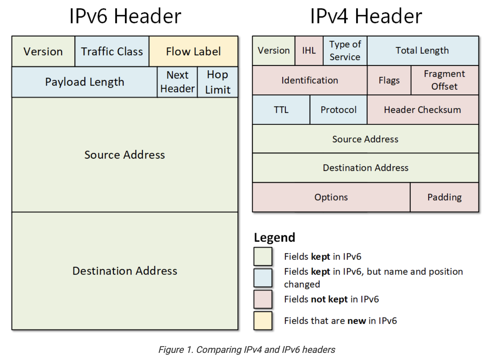

# IPv6 – Foundations

## 1. What is the Internet?
### 1.1 Internet = "network of networks"
What is the Internet?
The Internet is often described as a **"network of networks"**—it's not a single machine or cable, but rather a federation of thousands of independent networks that agree to exchange traffic with each other.
These independent networks are called **Autonomous Systems (ASes)**. They include ISPs, universities, companies, and data centers. Each AS operates its own network infrastructure, but they all interconnect to form the global Internet we use every day.
How Networks Connect
ISPs and other networks physically connect their routers at **Internet Exchange Points (IXPs)**—dedicated facilities where different providers peer with each other to exchange traffic efficiently.
Organizations like universities or companies that want direct Internet connectivity can apply for their own IP address space from a **Regional Internet Registry (RIR)**. Once they receive their IP block, they configure their routers to announce this address space using **BGP (Border Gateway Protocol)**. This is how they officially become part of the Internet as an autonomous system.

#### Why private vs public?
- IPv4 has only ~4.3 billion addresses.  
- NAT + private ranges (`192.168.x.x`, `10.x.x.x`, `172.16–31.x.x`) allow millions of devices to share fewer public IPs.  
- Without this system, IPv4 would have run out long ago.

#### How IPv6 changes this
- IPv6 has 128-bit addresses → 3.4 × 10³⁸ possibilities.  
- NAT is not needed: every device can get its **own public IPv6 address** directly.  
- Example:  
  - Laptop → `2001:db8:abcd:1::23`  
  - Phone → `2001:db8:abcd:1::45`  
- Websites see the same IPv6 your device has — no translation.  
- IPv6 does define **ULA (Unique Local Addresses, `fc00::/7`)** for private use, but they are rarely needed.

#### Analogy
- **IPv4 with NAT**  
  - Your apartment building has **one street address (public IP)**.  
  - Inside, each tenant has a **room number (private IP)**.  
  - The doorman (router with NAT) knows which room to deliver each letter to.  

- **IPv6 without NAT**  
  - Every tenant has their own **unique street address**.  
  - The mail (packets) goes straight to them — no doorman required.

---

3. **Your ISP (Telekom, Vodafone, O2 …)**  
   - Owns and runs a **large access network** made of:
     - **Access switches** (collect connections from neighborhoods).  
     - **Edge routers** (decide where to send traffic out of the access area).  
     - **Backbone routers** (high-capacity devices like Cisco ASRs or Juniper MX, moving traffic across cities).  
   - Assigns you an IP address (dynamic or static).

      - **Public IP allocation (from ISP to your router):**
        - ISP assigns your router a **public IP address** that represents your home on the Internet.
        - Types:
          - **Dynamic IP** (default for most home users):  
            - Changes periodically (e.g., after router reboot or every 24h).  
            - Easier for ISPs to manage and recycle scarce IPv4 addresses.
          - **Static IP** (optional, often for businesses or advanced users):  
            - Never changes.  
            - Useful for hosting servers, remote access, or VPNs that require a fixed endpoint.  
            - ISPs usually charge extra for static IPs because:
              - It consumes an address permanently (can’t be recycled).  
              - Scarcity of IPv4 addresses makes fixed allocations more valuable.  
              - Requires extra management/support.

      - **Private IP allocation (inside your home):**
        - Handled by your **router via DHCP(Dynamic Host Configuration Protocol)**.  
        - Gives each device a local private IPv4 address (`192.168.x.x`, `10.x.x.x`).  
        - These are not assigned by the ISP, only by your router.
        
### 1.2 How Data Flows (from your device to Google)

When you type `google.com` into your browser, this is what really happens step by step at the IP layer (L3):

1. **Your device (phone/laptop)**  
   - Builds an IP packet with:
     - **Source** = your IP address (assigned by ISP or VPN).
     - **Destination** = Google’s IP address.  
   - Passes this packet to your **home router** via Wi-Fi or Ethernet.
   > **But:** how does the packet actually get from your laptop to the home router in the first place? That’s where MAC addresses and glue protocols (**ARP in IPv4**, **NDP in IPv6**) come in - Explained later!
---
2. **Your home router**  
   - Acts as the **reception desk** in your home network.  
   - Decides how to forward packets:
     - In **IPv4**: performs **NAT (Network Address Translation)** so multiple devices can share one public IP(= one public IP, many private devices inside)
     - In **IPv6**: uses **prefix delegation** (a mechanism in **IPv6** that allows a **router** to automatically **DHCPv6-PD request** and receive a **block (prefix)** of IPv6 addresses **from an ISP's DHCPv6 server of the upstream provider**, which it can then subdivide and configure its internal interfaces. It happens during the **initial** router configuration and connection setup. The delegated prefix has a **lease time (like DHCPv4)**. The router **periodically** renews the lease to keep the same prefix).  
   - Then forwards traffic to your ISP’s network.

   ### Public vs Private IPs and NAT (IPv4 vs IPv6)

#### IPv4
- Your **home router** runs a **DHCP server (Dynamic Host Configuration Protocol)**.  
- DHCP automatically hands out **private IPs** to each device:  
  - Laptop → `192.168.0.15`  
  - Phone → `192.168.0.23`  
- These addresses are only valid inside your local network (LAN).  
- They are **not routable on the Internet**.
- Your **ISP assigns a public IP** to your home router.  
- Example: `84.156.221.42`.  
- This is what websites see when you visit “What is my IP?”.  
- Public IP = globally unique and routable.
- Since all devices in your LAN share one public IP, the router must **translate**.

#### IPv6
  - Your ISP usually assigns your router a whole **prefix** (e.g., `2001:db8:abcd::/56`).  
  - That prefix defines the **network part** of the IPv6 address.  
  - Your router then gives every device a **globally unique IPv6 address** from that prefix.  
  - Because IPv6 space is so huge, there is **no need for NAT** (unlike IPv4).  

⚠️ Note: This "prefix allocation" is **different** from how the device itself chooses its **host ID** (the second half of the address). We will cover that below in the MAC address section.

⚠️ How does the packet actually leave the laptop and reach the router physically over Wi-Fi/Ethernet? **That’s where L2 (MAC addresses) and the glue protocols (ARP/NDP) come in.**

---

4. **Backbone networks / Internet Exchange Points (IXPs)**  
   - High-speed **fiber cables** interconnect ISPs and global carriers.  
   - IXPs (like **DE-CIX Frankfurt** or **AMS-IX Amsterdam**) are “train stations” where ISPs hand packets to each other.  
   - At the IXP, your ISP forwards traffic to Google’s network (because Google peers(“Peering” = two networks meet and exchange traffic directly without going through a third ISP) directly at major IXPs).  

---

5. **Google’s network (edge routers & data centers)**  
   - **Google edge routers** receive your packet at the nearest data center.  
   - The router forwards it into the **data center switch fabric** (huge local network).  
   - Finally, a **Google server** with the requested IP address processes your request and sends a reply packet.  
   - The reply travels the reverse path: Google → IXP → ISP → your router → your device.  

---

### 1.3 Special Case: VPNs

### VPN Types and How They Work

- **Corporate VPN (e.g., Cisco ASA, Palo Alto, Fortinet)**  
  - Your device sets up an **encrypted tunnel** to the company’s VPN appliance.  
  - Even here, your packets **must first cross your ISP’s routers and backbone** — there is no bypassing that.  
  - What the ISP sees:  
    - Source = your home public IP.  
    - Destination = company VPN appliance’s IP.  
    - Payload = encrypted blob (cannot see inner destinations).  
  - At the VPN appliance (in the office or datacenter):  
    - Packets are **decrypted**.  
    - Injected into the **corporate LAN** as if you were physically there.  
  - Effect: you appear “inside the office network” remotely.

- **Commercial VPN**  
  - Your device sets up an **encrypted tunnel** to the VPN provider’s server.  
  - ISP again only sees “you ↔ VPN server” (encrypted traffic).  
  - At the VPN server:  
    - Packets are **decrypted**.  
    - Forwarded to the actual Internet destinations (Google, YouTube, etc.).  
  - Effect: websites see the VPN server’s IP/location, not your home IP.  

👉 In both cases:  
- Packets always **physically cross your ISP’s network first** (cables, routers, backbone).  
- The difference is the **tunnel termination point**:  
  - **Corporate VPN:** tunnel ends at the company’s gateway → traffic enters the corporate LAN.  
  - **Personal VPN:** tunnel ends at the VPN provider’s server → traffic enters the wider Internet.

---

### 1.4 Why this matters for IPv6

- Everything above describes the **plumbing of the Internet**: devices, routers, ISPs, IXPs, data centers.  
- The one thing that makes it all possible = **addresses** (IPs).  
- In IPv4, these are 32-bit addresses (≈ 4.3 billion).  
- In IPv6, these are 128-bit addresses (≈ 3.4 × 10³⁸).  


## What is IP?
- **IP (Internet Protocol) address** = unique identifier for a network interface.
- Works across all types of connections:
  - **Wi-Fi** (wireless link to a router at home, work, or public hotspot)
  - **Ethernet (cable)** (physical plug-in connection to a switch or router, common in offices/servers)
  - **Mobile data (4G/5G)** (connection to your mobile provider’s cellular towers, IP comes from telecom network)
  - **Even virtual interfaces** (software-defined “network cards” inside cloud servers or virtual machines; they behave like real hardware but exist only in software)
- A device can have multiple IPs (**one per interface**, e.g., your laptop might have one for Wi-Fi and another for Ethernet at the same time).

---

## IPv4 Addressing (32-bit)
- Written in **dotted decimal**: e.g., `192.168.0.10`
- Structure:
  - 4 numbers (0–255), each = **8 bits (1 octet)**.
  - Example:
    - `192` → `11000000`
    - `168` → `10101000`
    - `0`   → `00000000`
    - `10`  → `00001010`
- Total = 4 × 8 bits = **32 bits**.

---

## IPv6 Addressing (128-bit)
- Written in **hexadecimal groups** separated by `:`.
- Full address has **8 groups × 16 bits = 128 bits**.

### Example: `2001:0db8::1`

1. **Full form:**
`2001:0db8:0000:0000:0000:0000:0000:0001`
2. **Remove leading zeros in each group:**
`2001:db8:0000:0000:0000:0000:0000:1`
3. **Collapse consecutive all-zero groups (only once!):**
`2001:db8::1`

⚠️ Important: `::` may only be used **once** per address.  

- Allowed: `2001:DB8::8:0:0:417A` ✅ 
- Not allowed: `2001:DB8::8::417A` ❌ 

Always expands back to **8 groups** internally.

## Why IPv6?
- IPv4 = ~4.3 billion addresses → exhausted in 2019 (RIPE NCC ran out).
- IPv6 = 128-bit space → That’s 340 undecillion possible ~3.4 × 10³⁸ addresses = 7·1023 Adressen pro Quadratmeter
- Enough for every phone, car, fridge, sensor (IoT), etc.

## How it started Vs. How it's going

### 1995–2006: 6Bone Test Network
- **Goal:** Provide a testbed for IPv6 before real deployment.  
- **Method:** Used *IPv6-in-IPv4 tunneling* (encapsulating IPv6 packets inside IPv4).  
- **Impact:** Allowed researchers, universities, and early adopters to experiment with routing and addressing.  
- **Shutdown:** 2006, once native IPv6 began rolling out.

### 2011: World IPv6 Day (June 8, 2011)
- Major players (**Google, Yahoo, Facebook**) enabled IPv6 alongside IPv4 for 24 hours.  
- Purpose:
  - Test IPv6 readiness worldwide.  
  - Identify breakages in ISP and enterprise networks.  
- Result:  
  - Only ~0.229% of users were on IPv6.  
  - Quote (Igor Gashinsky, Yahoo):  
    > “That was a lot of work for 0.229% IPv6 users.”

### Challenges During Early Adoption
1. **New protocols = new risks**  
   - IPv6 + ICMPv6 introduced unfamiliar attack surfaces.  
   - Example: IPv6 Neighbor Discovery could be abused like ARP spoofing in IPv4.  

2. **Security tools not compatible**  
   - Firewalls, IDS/IPS initially built for IPv4.  
   - Could not parse IPv6 headers or extension headers properly.  

3. **Knowledge gap in admins**  
   - Network staff had decades of IPv4 training.  
   - Misconfigurations common when shifting to IPv6.  

4. **Lack of monitoring/analysis tools**  
   - IPv6 traffic harder to inspect and log in early years.

### 2011–2025: Adoption Growth
- After 2011, gradual rollout by ISPs, CDNs, and device vendors.  
- Google IPv6 adoption data (2009–2025):  
  - 2011: ~0.2%  
  - 2020: ~35%  
  - 2025: ~48% (almost half of Google traffic is IPv6).  
- Adoption continues to rise, driven by:  
  - IPv4 exhaustion.  
  - Mobile providers (4G/5G) going IPv6-first.  
  - Cloud/data centers supporting dual-stack or IPv6-only setups.  


### IPv4 header Vs. IPv6 header

## 2. IPv4 Header vs IPv6 Header

#### 2.1 IPv4 Header
##### mnemonic: "Very IHL Types Total IDs, Flagging Fragments Through Protocol Head-checks from Source to Dest, Optionally Padded"
- **Version** → always `4` for IPv4.  
  - (**Version 5** was already used in the 1980s/1990s for an **experimental streaming protocol** called ST2, defined in RFC 1190/1819. It never became mainstream, but since the number was taken, the next Internet Protocol became **IPv6**.)
- More **complex** and contains many fields that made sense in the 1980s but became inefficient later.
- Key fields:
  - **IHL (Internet Header Length)** → tells how long the header is (because it can vary).
  - **Type of Service** → QoS marking (used rarely).
  - **Total Length** → size of the whole packet.
  - **Identification, Flags, Fragment Offset** → used for packet fragmentation (breaking big packets into smaller ones).
  - **TTL (Time To Live)** → limits how many hops a packet can make.
  - **Protocol** → tells if the payload is TCP, UDP, ICMP, etc.
  - **Header Checksum** → error detection for header integrity.
  - **Source Address** → sender’s IPv4 address (32 bits).
  - **Destination Address** → receiver’s IPv4 address (32 bits).
  - **Options, Padding** → optional, rarely used.

👉 Result: IPv4 header is **variable-length** and costly to process by routers.

----

#### 2.2.1 IPv6 Base Header Fields (40 Bytes)
##### mnemonic: "Very Tiny Frogs Play Nextto Hoppy Singing Ducks" 
The IPv6 base header is **fixed-length (40 bytes)** and much simpler than the variable IPv4 header. Each IPv6 header is made up of two big addresses (source(16 byte = 128 bit) + destination(16 byte = 128 bit)) plus some small control fields.  

- **Version (4 bits)**  
  - Always `6` for IPv6.  

- **Traffic Class (8 bits)**  
  - Similar to IPv4’s Type of Service field, used for QoS (Quality of Service).  
  - Allows marking packets for priority handling.  
  - Example values:  
    - `0–7`: lower-priority traffic (can be delayed if congested).  
    - `8–15`: higher-priority, constant-rate traffic (e.g. voice/video streaming).  

- **Flow Label (20 bits)**  
  - New in IPv6.  
  - Identifies packets that belong to the same “flow” (e.g., one video stream, one voice call).  
  - Allows routers to recognize and keep special handling for flows requiring specific QoS.  
  - **Note:** Still rarely used in real-world networks; many routers ignore it.  

- **Payload Length (16 bits)**  
      - **Definition:**  
      A **number** that specifies the size of the payload in **bytes**.  
      It tells the receiver: *“How many bytes follow the 40-byte IPv6 base header.”*  

    - **What it measures:**  
      - Extension headers (if any) ✅ 
      - Transport layer data (TCP, UDP, ICMPv6, etc.) ✅ 
      - Does **not** include the IPv6 base header itself (40 bytes) ❌ 
      - Does **not** include the Source/Destination addresses (they are part of the 40-byte base header) ❌   

    - **Range:**  
      - Payload Length field = 16 bits → can represent `2^16 = 65,536` values.  
      - Range = 0 … 65,535 (since counting starts at 0).  
      - Max Payload Length = **65,535 bytes**.  
      - Example: if field = `0xFFFF` (65,535), then:
      ````
        Total packet size = 40 (header) + 65,535 (payload) = 65,575 bytes
      ````
      **OR**  
      - If `Payload Length = 0x0020` (32 in decimal), it means:  
        → *There are exactly 32 bytes of data after the header.*  
      - To compute the **total IPv6 packet size**:  
        ```
        Total Length = 40 (base header) + Payload Length
        ```
      - For larger payloads, IPv6 uses the **Jumbo Payload** option (up to ~4 GB).  

    - **Comparison with IPv4:**  
      - IPv4 used a **Total Length field** (header + payload together).  
      - IPv6 simplified it: **Payload Length** = only the part after the header, since the header is always fixed at 40 bytes.

    ✅ The **Payload Length field is not the content itself**. It is a **counter** describing the size of the content (in bytes).  

- **Next Header (8 bits)**  
  - Replaces IPv4’s Protocol field.  
  - Identifies the type of header that follows the IPv6 header.  
  - Can indicate:  
    - A transport-layer protocol (e.g., TCP = 6, UDP = 17, ICMPv6 = 58).  
    - Or an IPv6 extension header (e.g., routing header, fragmentation header).  

- **Hop Limit (8 bits)**  
  - Replaces IPv4’s TTL(Time To Live)  
  - When a device (like a laptop) sends an IPv6 packet, it sets a Hop Limit value in the header. Example: 64. Each time the packet passes through a router, the router subtracts 1 from that value.
  - If the Hop Limit reaches 0, the router discards the packet and usually sends back an ICMPv6 “Time Exceeded” error.
  - Its job: prevent packets from circulating endlessly in the network if there’s a routing loop.

- **Source Address (128 bits)**  
  - The sender’s IPv6 address.  

- **Destination Address (128 bits)**  
  - The intended recipient’s IPv6 address.  

---

#### 2.2.2 Key Differences to IPv4

- IPv6 header = **fixed 40 bytes**, IPv4 header = variable (20–60 bytes).  
- Removed:  
  - Header checksum (error detection handled by upper layers and link layer).  
  - Fragmentation fields (done differently in IPv6, only endpoints can fragment, not routers).  
  - Options (moved to extension headers).  
- Added:  
  - Flow Label (for special traffic flows).  
- Renamed:  
  - TTL → Hop Limit.  
  - Protocol → Next Header.  

👉 Result: IPv6 header is **leaner, faster to process**, and scales better.

### 2.4 IPv6 Address Types by Prefix
**Der Typ einer IPv6-Adresse wird durch die high-order Bits(leftmost bits) bestimmt**
| Address Type        | Binary Prefix        | IPv6 Notation | Example | Real-life meaning |
|---------------------|----------------------|---------------|---------|-------------------|
| **Unspecified** (literally all zeros)     | 00…0 (128 bits)      | `::/128`      | `::`    | Used as “no address” (e.g., before an interface configures one). |
| **Loopback** (“I’m talking to myself.”)       | 00…1 (128 bits)      | `::1/128`     | `::1`   | Like IPv4 `127.0.0.1`, used to test networking stack locally, it is sent out and immediately comes back in. |
| **Multicast**       | 11111111             | `FF00::/8`    | `FF02::1` | Replaces IPv4 broadcast. Devices subscribe to groups like `ff02::1` (all nodes) or `ff02::2` (all routers) from the moment the interface(= your network card or port) comes up(=the operating system activates it and marks it as ready to send/receive traffic)|
| **Link-Local Unicast** | 1111111010         | `FE80::/10`   | `fe80::1%eth0` | Always auto-assigned, used to talk to neighbors and discover routers. |
| **Unique-Local Unicast (ULA)** | 1111110    | `FC00::/7`    | `fd12:3456:789a::1` | Like IPv4 private ranges (`192.168.x.x`), only routable inside private networks. |
| **Global Unicast**  | everything else      | (commonly `2000::/3`) | `2001:4860:4860::8888` | Public Internet addresses (e.g., Google DNS). |

#### Examples

- `2001:DB8:0:0:8:0800:200C:417A` → **Global Unicast**  
- `FF01:0:0:0:0:0:0:101` → **Multicast**  
- `0:0:0:0:0:0:0:1` → **Loopback**  


## Key Points

- IPv6 addresses are categorized by their **prefix bits**.  
- `/64` is the default subnet size (huge host ID space).  
- Special cases:  
  - `::/128` = unspecified  
  - `::1/128` = loopback  
- IPv6 **does not have broadcast** → replaced with multicast groups (`ff02::1`, `ff02::2`).  
- Shortening rules keep addresses readable and consistent.  

## 3. Subnets 

### 3.1 What is a subnet?
- A **subnet** = a block (or slice) of IP addresses that belong together.
- Think of the IP universe as a giant street map, then:
    - Subnets = neighborhoods.  
- Each subnet is defined by:
  - **Network part** (fixed bits = the neighborhood ID)
  - **Host part** (remaining bits = house numbers inside the neighborhood)

---

### 3.2 IPv4 example
- `192.168.0.0/24`  
  - `/24` = 24 bits are fixed for the network.  
  - Remaining = 32 − 24 = 8 bits → 2⁸ = **256 host addresses**.  
- Hosts range from `192.168.0.0` to `192.168.0.255`.  
- Only 256 possible “house numbers” inside this subnet.

---

### 3.3 IPv6 example
- `2001:db8:abcd::/64` In binary it looks like:
```
2001      : 0db8      : abcd      : 0000   | 0000      : 0000      : 0000      : 0000
[ 16 bits ][ 16 bits ][ 16 bits ][ 16 bits]|[host part begins         →               ]
```
  - `/64` = 64 bits are fixed for the network (the prefix given by ISP).  
  - Remaining = 128 − 64 = 64 bits → 2⁶⁴ ≈ **18 quintillion possible addresses per subnet**.  
- Hosts range from `2001:0db8:abcd:0000:0000:0000:0000:0000` up to `2001:db8:abcd::ffff:ffff:ffff:ffff`.  
- In other words, the neighborhood is defined by the prefix, but there are an enormous number of possible “house numbers” (host IDs).

---
### 3.4 How Host IDs Are Assigned

Up to now we said:  
- An IP address = **[network prefix] + [host ID]**. This is CIDR notation (Classless Inter-Domain Routing).
- The prefix is fixed (defines the subnet).  
- The host ID varies (defines the individual device).  

But: **who assigns the host ID?**  
It depends on IPv4 vs IPv6.

---

#### IPv4 Host IDs
- In IPv4, the **router** usually assigns host IDs via **DHCP (Dynamic Host Configuration Protocol)**.  
- Example in `192.168.0.0/24`:  
  - Laptop gets `.15`  
  - Phone gets `.20`  
  - Printer gets `.50`  
- The router picks numbers from the available pool and hands them out to devices when they join the LAN.  
- If two devices accidentally got the same host ID → conflict (they couldn’t both work).  

---

#### IPv6 Host IDs
- Your ISP assigns your **router** a whole **prefix** (e.g., `2001:db8:abcd::/56`).  
- That prefix defines the **network part** of IPv6 addresses in your home/office.  
- The router splits this into `/64` subnets and **advertises those prefixes** to devices (via *Router Advertisements*).  
- Each device then **generates its own host ID** inside that prefix.  
- Result: each device creates its **own full Global Unicast address**.  
- Because IPv6 has such a huge address space, there is **no NAT needed** (unlike IPv4).  

✅ **Important points:**  
- The router only hands down the **prefix**.  
- The device itself always generates the **host ID**.  
- The router never assigns the full global IPv6 address directly.  

- IPv6 mandates that a subnet must be at least `/64`.  
- In other words:  
  - **First 64 bits** = prefix (from ISP, passed via router).  
  - **Last 64 bits** = host ID (device decides).  

### Two approaches for host ID generation:
1. **Early method:** Host ID derived from device’s MAC address (**EUI-64**).  
2. **Modern method:** Host ID chosen randomly (privacy extensions).
👉 This explains why MAC addresses enter the picture next: because IPv6 originally tied the host ID generation directly to the hardware MAC:

## 4. MAC Addresses and IPv6 Host IDs
### 4.1 What is a MAC address?
- **MAC = Media Access Control address.**  
- A unique hardware ID burned into every network interface (Wi-Fi card, Ethernet port, etc.).  
- Format: 6 bytes = 48 bits. Example: 
`00:1A:2B:3C:4D:5E`
- Think of it like your device’s **serial number for networking**.  
- Unlike IP addresses (which change depending on network), MAC addresses are fixed to the hardware.

### 4.2 How IPv6 uses MAC for host IDs (early method)
- Recall: an IPv6 address = **[network prefix] + [host ID]**.  
- The **prefix** comes from the ISP.  
- The **host ID** is chosen by the device inside that subnet.  
- Early IPv6 devices generated the host ID automatically from the MAC address (called **EUI-64 format**).  
- Example:  
- Prefix from ISP: `2001:db8:abcd:1234::/64`  
- MAC address: `00:1A:2B:3C:4D:5E`  
- Converted host ID: `021a:2bff:fe3c:4d5e`  
- Full IPv6 address:  
  ```
  2001:db8:abcd:1234:021a:2bff:fe3c:4d5e
  ```
### 4.3 Modern IPv6 host IDs
- To avoid predictability and privacy issues, modern IPv6 devices use **random host IDs** instead of embedding the MAC.  
- Example:
`2001:db8:abcd:1234:9f12:88c0:22ab:7c3d`
- Still follows the same logic:  
- First 64 bits = prefix from ISP (subnet definition).  
- Last 64 bits = host ID, but now random rather than tied to MAC.

---

## 5. Attacks and Scanning in IPv4 vs IPv6

### 5.1 Why attackers scan
- Attackers cannot exploit what they cannot find.
- To build a **botnet** (network of compromised computers (bots) controlled by an attacker, often used for DDoS, spam, or malware spreading), attackers first need to **discover active hosts** (computers, IoT devices, servers).  
- First step = **reconnaissance**: This is done through **host scanning** → sending probes to IP addresses in order to see who responds.  
- Next steps = probe (send crafted packets to) those devices for entry points (ports and services).  
- Final goal = exploit a weakness:
  - Steal data (credentials, personal info, business secrets).  
  - Take control of the system (remote shells, admin access).  
  - Enlist devices into botnets for DDoS or spam.  

---

### 5.2 LAN vs Public Internet

- **Inside a LAN**  
  - Devices share the same **network prefix**.  
  - Example (IPv4): `192.168.0.0/24` → Laptop `192.168.0.15`, Printer `192.168.0.50`.  
  - Because they share the prefix, packets flow directly between them without going through the Internet.  
  - That’s why you can still print or stream to a smart TV when your Internet is down.  

- **Outside (Internet)**  
  - The LAN is hidden behind a **router with NAT**.  
  - Router has:
    - Private side = `192.168.0.1` (LAN-facing).  
    - Public side = `84.156.221.42` (ISP-assigned).  
  - From the Internet, attackers only see the **public IP** (`84.156.221.42`), never your private LAN IPs.  

---

### 5.3 Solicited vs Unsolicited Packets

- **Solicited traffic:**  
  - Initiated by you.  
  - Example: Your browser requests `google.com`.  
  - NAT creates an entry: "192.168.0.15:51234 → 84.156.221.42:443 (HTTPS)".  
  - When Google replies, the router knows which device to send it to.  

- **Unsolicited traffic:**  
  - Arrives at your public IP without you asking.  
  - Example: Attacker sends a TCP SYN packet to `84.156.221.42:3000`.  
  - Router checks NAT table: no entry found → drops the packet.  
  - This is why NAT provides a default safety layer: strangers can’t just walk into your LAN.  

---

### 5.4 Port Forwarding

- Normally, unsolicited packets stop at the router.  
- If you configure **port forwarding**, the router knows to forward certain traffic inside.  
- Example:
  - You run a Node.js app on laptop `192.168.0.15`, listening on port 3000.  
  - Router rule: “Forward all traffic on public IP port 3000 → 192.168.0.15:3000.”  
  - Now outsiders can reach your server at `84.156.221.42:3000`.  

👉 This is why attackers focus on **ports**: each open port = a service potentially exposed to the world.  

---

### 5.5 What does "listening" mean?

- When a program “listens,” it tells the OS: “Bind me to this port and deliver any incoming traffic here.”  
- Examples:
  - **Node.js**  
    ```js
    app.listen(3000);
    console.log("Listening on port 3000");
    ```
  - **Java (Spring Boot)**  
    ```
    Tomcat started on port(s): 8080
    ```
  - **Python (Flask)**  
    ```python
    app.run(host="0.0.0.0", port=5000)
    ```

- Locally, you see `http://localhost:3000`.  
- Globally, if port 3000 is forwarded on your router, outsiders can also reach it via your **public IP** (`http://84.156.221.42:3000`).  

---

#### How local apps become reachable from outside

1. **Direct port forwarding (home/lab setup)**  
   - Router forwards public traffic on port X → to device + port Y inside the LAN.  
   - Example: forward `:3000` externally → `192.168.0.15:3000`.

2. **Reverse proxy (production setup)**  
   - Middleman software like Nginx or Apache sits on standard web ports (80/443).  
   - Forwards traffic internally to your app (e.g., port 3000).  
   - Adds HTTPS, security filtering, and scalability.

3. **Tunneling services (developer convenience)**  
   - Tools like **ngrok** or **localtunnel** create a secure tunnel from the Internet → to your local port.  
   - Useful for demos or testing without touching router settings.  
   - Example: `https://randomstring.ngrok.io` → forwarded to your local app on port 5000.

****Big picture:****  
- **Listening** = app is ready on a port.  
- To be reachable globally, that port must be exposed in one of three ways:  
  - Router forwarding,  
  - Reverse proxy on 80/443,  
  - Tunnel service (ngrok).  
- In production, reverse proxies are standard; for testing, tunneling tools are common.
---

### 5.6 IPv4 Scanning

1. **Host discovery (which devices exist in a subnet):**  
   - Send ICMP Echo (“ping”) or TCP SYN probes.  
   - Tools: `nmap -sn 192.168.0.0/24`.  
   - Easy in IPv4: only 256 possibilities in a `/24`.  

2. **Port scanning (which services are listening):**
> Up to now, we focused on **hosts**: which IP addresses inside a subnet are alive.  The next step is **ports**: which *services/programs* are listening on those hosts.
> #### Where ports fit in the stack
>- **IP layer (IPv4/IPv6):** delivers the packet to the right machine.  
>- **Transport layer (TCP/UDP):** delivers the packet to the right program on that machine, using **port numbers**.  
>- **Application layer:** interprets the data according to the service (HTTP, SSH, DNS, etc.).
Your laptop (IP: 84.156.221.42, port 52314)
→ Google server (IP: 142.250.185.14, port 443 HTTPS)
→ Application: HTTPS GET request

>- Without ports, the OS would not know whether a packet is for the **web server**, the **SSH daemon**, or some other program.
>#### Why scanning ports matters
>- Each open port = one program actively **listening** for connections.  
>- Attackers probe ports to discover:
>   - Which services are exposed (HTTP, SSH, databases).  
>   - Which versions they run.  
>   - Whether those versions have known vulnerabilities.

>👉 With this context in place, we can now look at the details:  

For each live host, attackers scan ports 0–65535:
    In TCP/UDP, the **port number field is 16 bits long** → 2¹⁶ = 65,536 possible values.  
    - Port numbers let one IP run many services at once.  
      - 22 = SSH  
      - 80 = HTTP  
      - 443 = HTTPS  
      - 3306 = MySQL  
    - **Well-known ports (0–1023):**  
      - Reserved for core Internet services.  
      - Binding to them requires **admin/root rights** for extra safety.  
    - **Registered ports (1024–49151):**  
      - Commonly assigned to applications (e.g., 3306 = MySQL, 5432 = PostgreSQL).  
    - **Dynamic/Ephemeral ports (49152–65535):**  
      - Picked by the OS for temporary outbound connections.  
      - Example: browser connects to Google → source port 52314 → destination port 443.  
    - Attackers scan all ports (0–65535) on each host.  
    - Any open, listening port could be a potential attack entry point.
    
3. **Service and version detection:**  
   - Fingerprint services by sending crafted packets.  
   - Example:  
     - SSH banner reveals “OpenSSH 7.2p2”.  
     - HTTP header reveals “Apache/2.4.41 (Ubuntu)”.  

4. **Vulnerability mapping:**  
   - Compare versions to public vulnerability databases (CVEs).  
   - Example: Apache Struts CVE-2017-5638.  

5. **Exploitation:**  
   - Launch exploit → gain unauthorized access.  
   - Example: SMB exploit (EternalBlue) → install ransomware.  

---

### 5.7 IPv6 Scanning
- Since IPv6 mandates that a subnet must be at least `/64`:
- And a `/64` subnet has 2⁶⁴ ≈ 18 quintillion possible host IDs.  
  - Brute-forcing every address = computationally impossible = **Blind Scanning is Impractical**

**But once an IPv6 address is known, port scanning works exactly the same.**  
- Host discovery is the hard part.  
- ***Port → Service → Version → Vulnerability → Exploit*** sequence doesn’t change.

### 6.4 Practical Shortcuts Attackers Use

Since blind scans don’t work, attackers use **smarter techniques**:

1. **Predictable Host IDs**
 - Early IPv6 devices used **MAC-based host IDs (EUI-64)**.  
 - If the attacker knows the vendor prefix of the MAC (e.g., Apple, Intel), they can guess likely addresses.  
 - Manually chosen host IDs are also easy to guess:
   - `::10`, `::20`, `::100`  
   - Embedded IPv4 addresses (e.g., `::192.168.0.10`).  

2. **DNS Resolution**
 - Many services publish their IPv6 addresses in DNS (AAAA records).  
 - For example run *dig* (Domain Information Groper) on your own computer:
   ```
   dig AAAA facebook.com
   ```
   👉 That’s Facebook’s IPv6 address.
 - That means attackers don’t need to brute-force 2⁶⁴ possibilities; the IPv6 address is public knowledge.

> **But**: discovery is only step 1. Knowing an IP doesn’t mean you can break into it. What really matters is **what’s listening on that IP**.

3. **Local Access Attacks**
 - If an attacker is already inside the LAN (infected laptop, rogue Wi-Fi user), discovery becomes trivial:
   - **Multicast groups (RFC 2375):**
     - `FF02::1` → All Nodes  
     - `FF02::2` → All Routers  
     - `FF05::3` → All DHCP Servers  
     → One packet reveals all participants.  
   - **Fake Router Advertisements (RAs):**
     - Attacker pretends to be a router, tricks devices into revealing themselves.  
   - **Sniffing Duplicate Address Detection (DAD):**
     - When a device joins, it announces “I want to use this address; anyone else?”  
     - Attacker can listen and harvest active host IDs.  
  

---

### 5.8 Dual Stack Reality

- Most networks run **both IPv4 and IPv6 (dual stack)**.  
- That means devices have two addresses:
  - One IPv4 (public via NAT).  
  - One IPv6 (global, from ISP prefix).  
- Analogy: Same building, but it has **two official street addresses**.  

**Attackers prefer IPv4 today** because:  
- IPv4 subnets are enumerable and tools are mature.  
- Many services still exposed only on IPv4.  

But:  
- If an IPv6 address leaks (via DNS or predictable host IDs), attackers scan its ports the same way.  
- So networks are only as secure as their weakest stack.  

---

### 5.9 Key Takeaways
- LAN = devices sharing the same prefix; they talk directly without Internet.  
- NAT hides LAN behind one public IP. Unsolicited packets are dropped unless port forwarding is configured.  
- Ports = entry points into services. “Listening” means a program is actively waiting on that port.  
- IPv4 scanning is trivial; IPv6 brute-force scanning is impossible, but shortcuts exist.  
- Dual stack = attackers will use whichever address family is easier. Today that’s often IPv4.

---
# IPv6 - Address Types

IPv6 addresses are categorized into **three fundamental types**. Each type defines **who receives a packet** when you send it.

## 1. Unicast (One-to-One)

A **unicast address** identifies a single interface. Packets sent to a unicast go to exactly **one device**.

### Subtypes of Unicast

1. **Global Unicast**  
   - **Prefix:** `2000::/3` (In binary, 2000:: starts with 001)
   - **Scope:** The entire Internet  
   - **Routable:** Globally 🌐 
   - **Analogy:** International phone number (works everywhere)  
   - **Examples:**  
     - Google DNS → `2001:4860:4860::8888`  
     - Cloudflare DNS → `2606:4700:4700::1111`  
   - **Real-life:** When you browse `https://google.com`, your computer’s **global unicast** is the source address used to reach Google’s **global unicast servers**.

2. **Link-Local Unicast**  
   - **Prefix:** `fe80::/10`  
   - **Scope:** Valid only on the *local link* (one Ethernet segment or Wi-Fi network)  
   - **Routable:** Never forwarded by routers ❌ 
   - **Analogy:** Room number inside one apartment (only meaningful if you’re already inside that apartment)  
   - **Examples:**  
     - `fe80::1a2b:3c4d:5e6f:7g8h%eth0`  
   - **Real-life:**  
     - Every IPv6 interface automatically configures a link-local address.  
     - Used for router discovery and neighbor discovery.  
     - Example: When your laptop boots(starts up), it automatically assigns itself a link-local address. It uses this to ask: “Hey, who is the default router?” (This “asking” happens with a special kind of message called **ICMPv6 Neighbor Discovery**):
      1. Laptop boots → generates `fe80::…` (Host ID from MAC or random).  
      2. Laptop sends a **Router Solicitation** to the multicast `ff02::2` (all routers).  
      3. Router replies from its own **Link-Local** (e.g. `fe80::1`), saying: *“I am your default gateway, and here’s the global prefix you should use.”*  
      4. Only **after this exchange** does the laptop create its Global Unicast address.  

  ⚠️ **SO**:
  - the **Link-Local prefix is fixed (`fe80::/10`)** and the device always self-assigns it.  
  - The router only hands down the **global prefix** later.

3. **Unique-Local Unicast (ULA)**  
   - **Prefix:** `fc00::/7` (in practice `fdxx::/8`)  
   - **Scope:** Private networks  
   - **Routable:** Inside private network, Never on Internet  
   - **Analogy:** Company’s internal phone extension (works across office buildings, but not outside)  
   - **Examples:**  
     - `fd12:3456:789a::1` (internal database server)  
   - **Real-life:**  
     - A company uses ULA for file servers, printers, or intranet services.  
     - These addresses are reachable across internal routers but invisible to the outside world.

### ✅ Quick Recap Table

| Type           | Prefix       | Scope        | Routed?            | Example                  | Analogy                        |
|----------------|-------------|--------------|--------------------|--------------------------|--------------------------------|
| Global Unicast | `2000::/3`  | Internet     | Global           | `2001:4860:4860::8888`   | International phone number     |
| Link-Local     | `fe80::/10` | One link     | Never forwarded  | `fe80::1%eth0`           | Room # inside an apartment     |
| Unique-Local   | `fdxx::/8`  | Private net  | Inside private   | `fd12:3456:789a::1`      | Company phone extension        |

## 2. Multicast (One-to-Many)

A **multicast address** identifies a group of interfaces. Packets sent to a multicast are delivered to **all members of the group**. (⚠️ IPv6 has **no broadcast at all**)

- **Prefix:** `ff00::/8`  
- **Scope:** Defined by flags, common ones include:  
  - `ff02::1` → All nodes on the local link  
  - `ff02::2` → All routers on the local link  
- **Real-life:**  
  - Your laptop multicasts to `ff02::2` (all routers) to ask: *“Who is my default router?”*  
  - Streaming applications can use multicast to send one stream to many clients.


## 3. Anycast (One-to-Nearest)

An Anycast address can be used by **multiple machines** at the same time. But when you send a packet to that address, only **one machine** receives it, the one that is **closest** according to the routing system. This is different from multicast (many receivers) and unicast (exactly one fixed receiver).

- **Prefix:** None special (looks like unicast)  
- **Scope:** Usually global  
- **Analogy:** Toll-free number (you always reach the nearest call center)  
- **Real-life:**  
  - Root DNS servers → e.g. `2001:500:2f::f` is advertised from many locations worldwide. You always connect to the closest one.  
  - Google DNS (2001:4860:4860::8888) is anycasted, so you automatically hit the closest Google data center.


## Big Picture Summary

- **Unicast (one-to-one):**  
  - **Global (`2000::/3`)** → Internet-wide, routable everywhere (e.g. Google DNS `2001:4860:4860::8888`).  
  - **Link-Local (`fe80::/10`)** → mandatory, always created on boot, valid only on the local link, never forwarded. Used first to find the router.  
  - **Unique-Local (`fdxx::/8`)** → private networks, routable only internally (like IPv4 private ranges).  

- **Multicast (one-to-many):** replaces IPv4 broadcast. Devices auto-join groups like:  
  - `ff02::1` → all nodes on the link (“Hey, every IPv6 device, listen up.”)  
  - `ff02::2` → all routers on the link (“Hey, only the routers, I need you.”)  

- **Anycast (one-to-nearest):** same address advertised by multiple servers, but only the closest responds (used by DNS root servers, CDNs, global DNS resolvers).  

- **Every IPv6 interface always carries:**  
  - **1× Link-Local address** (`fe80::…`),  
  - **some Multicast memberships** (`ff02::1`, `ff02::2` if router),  
  - **0 or more Global/ULA addresses** depending on the network. 

### IPv6 Address Lifecycle on a Laptop  

1. **Boot Phase – Link-Local Only**  
   - The laptop immediately generates a **Link-Local address (`fe80::/10`)**.  
   - This is **mandatory**, always present, and unique only on the local link.  
   - No router or ISP needed yet.  

2. **Multicast-Based Router Discovery**  
   - The laptop uses its link-local as the **source address**.  
   - It sends a **Router Solicitation (RS)** to the **All Routers Multicast group (`ff02::2`)**.  
   - The router replies with a **Router Advertisement (RA)**, usually to the **All Nodes Multicast group (`ff02::1`)**.  
   - This exchange is the foundation of IPv6’s Neighbor Discovery.  

3. **Optional ULA Assignment (`fc00::/7`)**  
   - If the network administrator has set up a **Unique Local Address (ULA)** prefix, the router advertises it.  
   - The laptop then configures a **ULA address** (e.g., `fd12:3456:789a::1234`).  
   - Provides stable **internal connectivity** even without ISP Internet access.  

4. **Global Unicast Delegation (`2000::/3`)**  
   - The ISP delegates a **/64 prefix** (e.g., `2001:db8:abcd:1234::/64`) to the router.  
   - The router advertises this prefix to devices on the LAN.  
   - The laptop constructs a **Global Unicast address** by appending a host identifier.  
     - **EUI-64 (MAC-based)** → host ID stable, same across link-local and global.  
     - **Privacy Extensions** → host ID randomized, different across link-local and global.  

5. **Coexistence on a Single Interface**  
   - At this point, the laptop’s NIC holds multiple IPv6 addresses:  
     - **Link-local** (`fe80::/10`) → mandatory, for control and ND.  
     - **ULA** (`fc00::/7`, if configured) → optional, for private internal comms.  
     - **Global unicast** (`2000::/3`) → routable on the Internet.  
     - Potentially multiple **temporary global addresses** (privacy).  

---

# Maximum Transmission Unit (MTU)

#### What is MTU?
When data travels over a network, it moves **link by link**.  
A ***link*** is simply the local network segment where devices can talk directly: like all machines on the same Wi-Fi network (SSID, Service Set Identifier = name of a Wi-Fi network) or all devices plugged into the same Ethernet switch. Each link type has its own physical or technical limits, and one of the most important is how large a **single packet** can be carried in one piece.  

This limit is the **Maximum Transmission Unit (MTU)**, measured in **octets** (8-bit bytes). Networking standards use "octet" for precision, since historically "byte" wasn’t always fixed at 8 bits.  

#### The IPv6 rule
- Every link that supports IPv6 must be able to carry a packet of at least **1280 octets**.  
- This number is not random:  
  - It’s big enough to carry useful payloads (TCP/UDP data + headers).  
  - It’s small enough that even constrained links (like low-power IoT radios) can handle it by performing their own fragmentation beneath IPv6. 
  - If a link technology cannot handle 1280 octets directly (e.g., **IEEE 802.15.4**, which supports only 127 bytes per frame), then it must provide **fragmentation and reassembly below IPv6**(the link layer technology is doing the chopping and reassembling, not IPv6).
  - From IPv6’s point of view, the packet is still 1280 bytes; the link layer secretly splits/reassembles it.  
 

#### IPv4 vs IPv6: Why 1280?

- **IPv4 approach:**  
  - When a packet was too large for the next link, the router itself would split it into smaller fragments.  
  - This kept things working, but it burdened routers with extra work (fragmentation + reassembly) and made networks less efficient.  

- **IPv6 redesign:**  
  - Routers never fragment packets anymore. Their job is to forward fast.  
  - The responsibility shifts to the **end host (sender)**:  
    - The sender must size packets so that they fit the smallest MTU along the path.  
    - If a packet is too big, the router discards it and replies with an **ICMPv6 “Packet Too Big”** message containing the supported MTU.  
    - The sender then adjusts its packet size accordingly.  

- **The guaranteed minimum:**  
  - To ensure that any two IPv6 hosts can always communicate, regardless of the underlying link technology, IPv6 defines a universal floor: **1280 bytes**.  
  - Any link technology that cannot natively handle 1280 must emulate it by fragmenting and reassembling *below IPv6*, so IPv6 itself always sees a minimum MTU of 1280.  

#### Payload Length vs MTU
- **Payload Length** (field in the IPv6 header) tells how many bytes this *specific packet* carries after the 40-byte base header.  
- **MTU** (property of the link) is the maximum size of a packet that can pass across that segment.  

The rule is simple: `40 (header) + Payload Length ≤ MTU of the link`
If a packet doesn’t fit, it gets dropped, and the sender must adapt.  

#### Path MTU Discovery (PMTUD)
- To avoid guessing, IPv6 nodes use PMTUD (RFC 8201).  
- Mechanism:  
  - Sender transmits a packet.  
  - If it’s too big for some link, the router discards it and returns an ICMPv6 “Packet Too Big” with the supported MTU.  
  - Sender then shrinks future packets accordingly.  
- For multicast: since packets may take multiple paths, each with a different MTU, the effective size is the **minimum MTU across all paths**.  

#### Key takeaway:  
IPv6 makes end hosts responsible for ensuring packets fit the smallest MTU along the path.  
The fixed lower bound of **1280 bytes** guarantees that, no matter the technology, IPv6 packets can always make it through.

# Next Header & Extension Headers in IPv6

IPv6 keeps its **Base Header fixed at 40 bytes** and very simple.  
Optional or advanced features are not stuffed into the base header (like in IPv4), but placed into **Extension Headers**.  

#### Next Header (field)
- It exists in the IPv6 Base Header and in every Extension Header.
- Tells what comes immediately after the current header.  
- Two possibilities:  
  1. **Transport protocol** (e.g. TCP, UDP, ICMPv6).  
  2. **Another extension header**.  
- Works like a **chain pointer**: each header points to the next one until the final payload is reached.
#### Extension Header
An Extension Header is an extra block of information that IPv6 can insert between the Base Header and the payload. It's an actual header structure (not just a field).
#### Extension Header chaining
- The Next Header field can point to:
  1. A transport-layer protocol (like TCP, UDP, ICMPv6).
  2. Or an Extension Header (like Routing, Fragment, Authentication).
- If the Next Header points to an Extension Header → that header also contains a Next Header field, which points further down the chain.
`[Base Header] → [Extension Header 1] → [Extension Header 2] → … → [Transport Data]`
- Each extension header has its own **Next Header field**.  
- The last extension header points to the transport layer data (TCP, UDP, …)
- Like a Linked List:
`Base Header (Next=43) → Routing Header (Next=44) → Fragment Header (Next=6) → TCP Segment`

#### Common Extension Headers (RFC 8200, RFC 4302, RFC 8221)

| Next Header Value | Extension Header              | Purpose |  Content |
|-------------------|-------------------------------|---------|----------|
| 0                 | Hop-by-Hop Options            | Carries optional information that must be examined by every router along the packet’s path: Jumbo Payload option, Padding options (Pad1, PadN) | Next Header (8 bits, could be another extension header, or upper-layer), Hdr Ext Len (8 bits, the length of this header in 8-octet units, minus 1), Options (variable length, the actual hop-by-hop data, like Jumbo Payload, padding, etc.)
| 43                | Routing (Type 0)              | Allows the sender to specify a list of intermediate nodes (routers) that a packet should visit before reaching the destination. This is a form of source routing. |
| 44                | Fragment                      | Handles packet fragmentation. In IPv4, routers could fragment oversized packets. In IPv6, only the sending host fragments, routers never do. | For ICMPv6 Packet Too Big, the sender splits it into fragments. Each fragment gets its own IPv6 header (40 bytes) + A Fragment Header with offset + identification. The receiver uses Identification + Offset to reassemble the original packet.
| 60                | Destination Options           | Extra info meant only for the destination node. Intermediate routers do not process it (unlike Hop-by-Hop) |If the DOH is before the Routing Header, each of those intermediate destinations must look at the DOH. It can also be before Upper-Layer Header → applies to the final destination
| 51                | Authentication (AH)           | Provides data origin authentication, integrity (IPsec) =	The packet really came from the claimed sender. The packet hasn’t been tampered with in transit. |	Uses keyed hashes (e.g., HMAC)
| 50                | Encapsulating Security Payload (ESP) | Provides confidentiality (encryption), and optionally authentication + integrity. Unlike AH, ESP hides the packet contents from eavesdroppers. | ESP is more complex than AH because it actually wraps around the payload. It is the **core building block** of most VPNs. It has 2 Modes of Operation: Transport Mode and Tunnel Mode. In tunnel mode, ESP encrypts the entire original IPv6 (or IPv4) packet. Then, it wraps that encrypted blob inside a new outer IPv6 header. This hides not just the data (TCP/UDP payload) but also the original source/destination addresses. This is why in a VPN, outsiders only see encrypted packets between your machine and the VPN gateway, they cannot see the final destination IPs inside.
| 59                | Value 59 in the Next Header field means: “This packet has no more headers and no upper-layer payload.”               | Marks end of the header chain (no payload follows). |

#### Hop-by-Hop Options Header
- The Next Header field (inside that first 8 bytes) tells us what comes after the 40-byte base header. If it’s 0 → means: the next thing in memory is the Hop-by-Hop Options Header. Then the Hop-by-Hop header itself starts, and it has its own Next Header field pointing further down the chain.
- Placed immediately after the Base Header if present.  
- Contains information that **every router along the path** must examine.  
- Examples:  
- Jumbo Payload Option (RFC 2675)  
- Padding (Pad1, PadN, RFC 2460)  
- ⚠️ RFC 8200 update: In practice, routers often ignore hop-by-hop unless explicitly configured, because it slows down fast forwarding.  

 
- Contains options examined by every router on the path.  
- Examples: Jumbo Payload option, Padding (Pad1, PadN).  
- RFC 8200 update: routers only process Hop-by-Hop if explicitly configured, since it slows down fast packet forwarding.

- **Routing Header**  
  - Allows sender to specify intermediate nodes (source routing).  
  - Deprecated Type 0 routing for security reasons (amplification / DoS risks).  
  - Still supported for certain specialized uses.

- **General Rules for Extension Headers**  
  - Each extension header should appear at most once.  
  - Exception: Destination Options may appear twice (once before Routing, once before Upper-Layer header).  
  - Order matters: standardized processing sequence (Hop-by-Hop → Routing → Fragment → Destination → Security).  

- **Firewall Note**  
  - Firewalls and intrusion detection systems must filter out malformed or suspicious header chains.  
  - Attackers may abuse unusual extension header combinations to bypass security devices.
  
  >Each extension header should occur at most once, except for the Destination Options header which should occur at most twice (once before a Routing header and once before the upper-layer header).

# ICMPv6 (Internet Control Message Protocol v6)

We already saw in our earlier example of sending data to Google that:  
- Your laptop built an IP packet to Google’s IPv6 address.  
- To actually send it out, the packet first had to reach your **default gateway** (your home router).  

So far, we focused mostly on the **logical IP flow (Layer 3, the “map”)**:  
how a packet is addressed from your device’s IP to Google’s IP, and how routers forward it hop by hop across the Internet.  

But that’s only half the story. An IP packet by itself is like an addressed letter with no delivery truck.  
To actually move from one box to the next on a **physical link (Layer 2, the “plumbing”)** — like your laptop’s Wi-Fi interface to your home router’s Wi-Fi interface — the packet must be wrapped in a **frame** that carries **MAC addresses (hardware identifiers for network interfaces)**.  

Here’s the catch: your laptop knows its router’s **IP address** (e.g., `fe80::1` from Router Advertisements),  
but to send a frame on Wi-Fi, it needs the router’s **MAC address**.  
That IP→MAC translation is the “glue” between L3 and L2.  

- In IPv4, this glue was a separate protocol: **ARP (Address Resolution Protocol)**.  
- In IPv6, it’s integrated into ICMPv6 as the **Neighbor Discovery Protocol (NDP)**.  

👉 This is why ICMPv6 is central: it isn’t just about error messages anymore; it’s the mechanism that makes IPv6 packets *actually deliverable* on real networks. 

#### What ICMPv6 is
- ICMPv6 is not just ICMP with longer (128-bit) addresses.  
- It has become the **control plane of IPv6**:  
  - In IPv4, different helper protocols existed (ARP for IP↔MAC mapping, IGMP for multicast).  
  - In IPv6, **ICMPv6 integrates all these roles** into one unified protocol.  

#### Functions of ICMPv6 (with clarifications in context)

1. **Error Reporting (classic ICMP role)**  
   - Just like ICMPv4, ICMPv6 reports problems that occur during forwarding.  
   - Examples:  
     - **Destination Unreachable** → packet cannot be delivered.  
     - **Time Exceeded** → Hop Limit (the IPv6 version of TTL) reached 0.  
     - **Packet Too Big** → packet exceeded MTU of a link.  
       - This is vital for **Path MTU Discovery (PMTUD)** (the process where the sender learns the maximum packet size that can travel the whole path without fragmentation).  

2. **Neighbor Discovery Protocol (NDP)**  
  - As soon as the laptop boots and brings its interface up:
	- It auto-generates a Link-Local address (fe80::/10).
	- Host ID = derived from MAC or randomized for privacy (So yes: Link-Local also uses MAC/random for its Host I, just like Global Unicast Address)
  - This address always exists. Every IPv6 device must have a Link-Local, even if no router or Internet is present.

  - Laptop wants to leave the local link → it needs to know the default gateway. 
  - It sends a Router Solicitation (RS) to the multicast address ff02::2 (“all routers on this link”).
  - Router replies with a **Router Advertisement (RA)** from its own Link-Local address (e.g., fe80::1).
   
   
  - The RA told you:  
    - Prefix (e.g., `2001:db8:abcd::/64`).  
    - Default gateway (the router’s **Link-Local IPv6 address**, e.g., `fe80::1`). 
    - Laptop takes the prefix from RA (2001:db8:abcd::/64).
    - Appends its Host ID (random or MAC-derived).
    - Forms a full Global Unicast Address.
  - So your laptop already knows:  
    > “My next hop to ultimately reach the Internet is `fe80::1`.”  

  That’s the router’s **logical identity at Layer 3 (IP)**.
  
  Knowing the router’s IPv6 address (`fe80::1`) isn’t enough to send a frame over Wi-Fi.  

  - **Why?** Wi-Fi/Ethernet hardware only understands **MAC addresses (Layer 2 identifiers)** when delivering frames on the link.  
  - So the laptop still has to ask:  
    > “Which MAC address corresponds to `fe80::1`?”  

  That’s exactly what **Neighbor Discovery Protocol (NDP)** does:  
  - Laptop sends **Neighbor Solicitation (NS):**  
    > “Who has IPv6 `fe80::1`? Tell me your MAC.”
     
  - Router replies with **Neighbor Advertisement (NA):**  
    > “`fe80::1` is me. My MAC = `AA:BB:CC:DD:EE:FF`.” 
    
  - Laptop caches this mapping in its **Neighbor Cache** (same idea as the ARP table in IPv4):  

  - Once learned, the mapping stays in the **Neighbor Cache** for a while (minutes to hours; if you stay active on Wi-Fi (browsing, streaming), your MacBook will keep refreshing the entry, so it might not need to ask again often. If you go idle or move between networks, the cache may expire, and the next packet will trigger a new Neighbor Solicitation → Neighbor Advertisement exchange.) 
  - If the laptop already has the router’s MAC cached → it can send immediately.  
  - If the entry expires or becomes invalid → the laptop sends a new Neighbor Solicitation.  

    **So**:

    1. Laptop resolves Google’s IP using DNS.  
    2. Laptop builds an IPv6 packet:
    ```
    Source = 2001:db8:abcd::42
    Dest = 2a00:1450:4001:829::200e
    ```
    3. It knows the default gateway’s IP = `fe80::1` (from RA).  
    4. It checks its **Neighbor Cache**:  
    - If MAC for `fe80::1` is cached → send frame.  
    - If not → perform NDP query (NS/NA).  
    5. It finally wraps the IPv6 packet inside a Wi-Fi frame:
    ```
    Destination MAC = router’s MAC
    Source MAC      = laptop’s MAC
    Payload         = IPv6 packet
    ```
    **That being said**:
   - NDP is IPv6’s replacement for **ARP (Address Resolution Protocol in IPv4, which mapped IP addresses to MAC addresses)**.  
   - NDP handles IP ↔ MAC mapping **inside ICMPv6**, plus additional tasks.  
   - Key message types:  
     - **Neighbor Solicitation (NS)** → “Who has IPv6 address X? Tell me your MAC.” (like ARP Request).  
     - **Neighbor Advertisement (NA)** → “That’s me, here’s my MAC.” (like ARP Reply).  
     - **Duplicate Address Detection (DAD)** → before a host starts using an address, it asks if someone else already uses it. If no one answers, it’s safe.  
        - ✅ Important: DAD applies to **every new IPv6 address** a device configures:  
          - Link-Local (`fe80::abcd:1234`)  
          - Global Unicast (`2001:db8:abcd::42`)  
          - Unique Local (`fdxx::/8`)  
        - Why? Because even though **MAC addresses are supposed to be globally unique**, collisions *can* happen (e.g., virtual machines, misconfigured NICs, random Host IDs). If every device used its MAC address, collisions would be astronomically unlikely. With random IDs, Duplicate Address Detection (DAD) runs → if two hosts randomly pick the same ID, one backs off. So yes: the system is protected either by uniqueness of MAC or by DAD.
        - The process:  
          - You’re about to start using a new IPv6 address (e.g., `2001:db8:abcd::42`).  
          - You send a **Neighbor Solicitation (NS)** asking:  
            > “I’d like to use `2001:db8:abcd::42`. Is there already a MAC address bound to this IPv6 address on this link?”  
            - (Yes, the same NS message type is used in **two situations**:  
              1. Normal case: resolving IPv6 → MAC for a *known* neighbor.  
              2. DAD: probing to see if the address is already in use.)  
          - If **nobody replies** → the address is free → safe to bind it to your MAC and start using it.  
          - If **someone replies with a Neighbor Advertisement (NA)** → conflict detected → you cannot use that address.  

      🔒 **Why this matters:** DAD ensures that no two devices on the same link accidentally use the same IP, whether it’s a Link-Local or a Global.  
   - This ensures that packets can actually be wrapped in the correct **Layer 2 frame (Ethernet/Wi-Fi)** with the right **MAC address (the fixed hardware identifier on network cards, 48 bits like `00:1A:2B:3C:4D:5E`)**.  
   - Without this glue, the IP packet could never leave your laptop.  

3. **Router Discovery & Stateless Address Autoconfiguration (SLAAC)**  
   - IPv6 routers send **Router Advertisements (RA, messages from the router’s own Link-Local address such as fe80::1)**.  
   - RAs tell hosts:  
     - The global **prefix** (e.g., `2001:db8:abcd::/64`).  
     - That the router is the **default gateway** (the next hop for the Internet).  
   - Hosts can also actively ask by sending a **Router Solicitation (RS)** to `ff02::2` (all routers multicast).  
   - With this info, your laptop creates a **Global Unicast Address (2001:db8:abcd::42)** by combining:  
     - The prefix from RA.  
     - A **Host ID** (randomized or MAC-based).  
   - Note: your laptop still always has a **Link-Local address (fe80::abcd:1234)** for local communication, independent of the router.  

4. **Path MTU Discovery (PMTUD)**  
   - Since routers never fragment packets in IPv6, PMTUD is essential.  
   - If a packet is too large for a link, the router drops it and sends an ICMPv6 **Packet Too Big** message back.  
   - The sender learns the maximum MTU for that path and resizes packets accordingly.  


5. **Multicast Group Management**  
    In IPv6, multicast replaces broadcast.  
    - **Broadcast (IPv4)**: one-to-everyone, even those who don’t care → wasteful.  
    - **Multicast (IPv6)**: one-to-many, but only to devices that explicitly *join* a group.  

    #### IPv4 vs IPv6
    - **IPv4** used **IGMP (Internet Group Management Protocol)** to manage multicast memberships.  
    - **IPv6** integrates this into ICMPv6 as **Multicast Listener Discovery (MLD)**.  
      - MLD = the protocol hosts use to “subscribe” to multicast groups.  

    #### How it works
    - A **host** (laptop, smart TV, IoT device) sends an MLD Report:  
      > “I want to receive traffic for multicast group `ff3e::101`.”  
    - The **router** records this subscription in a table.  
    - The router then ensures that multicast traffic for that group is only forwarded onto links where at least one host has subscribed.  
    - If no host on a link is interested → router stops forwarding that group there.  

    #### Multicast Router Discovery
    - Hosts also need to know which routers are capable of handling multicast.  
    - IPv6 includes **Multicast Router Discovery**:  
      - Routers advertise themselves as multicast-forwarders.  
      - Hosts use this info to join groups efficiently.  

    #### Examples of IPv6 multicast groups
    - `ff02::1` → all nodes on the link.  
    - `ff02::2` → all routers on the link.  
    - `ff02::1:ffXX:XXXX` → solicited-node multicast (used by NDP).  
    - `ff3e::101` → could be used by an application like IPTV for a live channel.  

    #### Use cases
    - **IPTV / live video streaming** → one stream to many subscribers, no duplicate unicast.  
    - **Software updates** → OS patches distributed once to many machines.  
    - **Gaming / real-time apps** → multiple players receive the same game state updates.  
    - **Financial feeds** → stock ticker information to multiple traders simultaneously.  


#### Big Picture Recap
- In **IPv4**:  
  - ICMP = error reporting.  
  - ARP = address resolution.  
  - IGMP = multicast group management.  

- In **IPv6**:  
  - ICMPv6 = does all of it (errors + neighbor discovery + router discovery + SLAAC + MTU discovery + multicast management).  

---
# Neighbor Discovery Protocol (NDP)
TO RECAP:
**NDP = IPv6’s replacement for ARP.**  
- In IPv4: **ARP (Address Resolution Protocol)** was a separate protocol for IP ↔ MAC mapping.  
- In IPv6: **NDP is built into ICMPv6** and extends far beyond ARP.  
- It is a **Link-Layer protocol**: all NDP multicasts stay on the local link.  

#### What NDP does
1. **Address resolution** → maps IPv6 addresses to MAC addresses (replaces ARP).  
2. **Duplicate Address Detection (DAD)** → ensures no two devices claim the same IP.  
3. **Router Discovery** → learns about routers and prefixes.  
4. **Redirects** → routers can tell hosts about better next-hops.  

#### NDP Packet Types (ICMPv6 Types 133–137)

1. **Router Solicitation (Type 133)**  
   - Sent by a host to `ff02::2` (all routers on the link).  
   - Question: *“Any routers out there? Please announce yourself.”*  
   - Used to speed up address configuration instead of waiting for periodic Router Advertisements.  

2. **Router Advertisement (Type 134)**  
   - Sent by routers, either:  
     - As a reply to a Router Solicitation, or  
     - Periodically on their own.  
   - Carries:  
     - The router’s Link-Local address (e.g., `fe80::1`) → default gateway.  
     - Prefixes (e.g., `2001:db8:abcd::/64`) → for SLAAC.  
     - Other flags: use DHCPv6? lifetime values?  

3. **Neighbor Solicitation (Type 135)**  
   - Used in two contexts:  
     - **DAD (Duplicate Address Detection):** *“Is anyone already using this IPv6 address?”*  
     - **Neighbor resolution (like ARP):** *“Who has IP X? Tell me your MAC.”*  
   - Sent to a **solicited-node multicast address** (special multicast derived from the target IPv6).  

4. **Neighbor Advertisement (Type 136)**  
   - Reply to a Neighbor Solicitation.  
   - Example: *“That’s me, I own this IPv6, and my MAC is 00:1A:2B:3C:4D:5E.”*  
   - Confirms binding of IPv6 address ↔ MAC address.  

5. **Redirect (Type 137)**  
   - Sent by a router to a host if there’s a better next hop.  
   - Example:  
     - Laptop sends packet to Router A for some destination.  
     - Router A sees Router B is a closer gateway.  
     - Router A forwards the first packet but also sends a **Redirect**:  
       > “Hey laptop, next time send directly to Router B.”
       
#### All NDP Multicasts = Link-Layer Multicasts
- These messages never leave the link.  
- Example: `ff02::1` (all nodes), `ff02::2` (all routers), solicited-node multicast for a specific IPv6.

# IPv6 Address Configuration

As we mentioned, every interface auto-generates a **Link-Local address (`fe80::/10`)** at boot, and the host ID can come from MAC (EUI-64) or randomized/stable IDs.  
Now we add the methods for obtaining **Global IPv6 addresses**:

1. **Static Addressing**  
   - Manually configured by an admin.  
   - Common for infrastructure (routers, servers).  

2. **DHCPv6 (Dynamic Host Configuration Protocol v6)**  
   - Central server assigns IPv6 addresses and keeps state.  
   - Also provides extra info like DNS servers.  
   - Known as **Stateful Address Configuration**.  

3. **SLAAC (Stateless Address Autoconfiguration)**  
   - Router sends a **Router Advertisement (RA)** with a prefix (e.g., `2001:db8:abcd::/64`).  
   - Host auto-generates its own Host ID (MAC-derived or random).  
   - Router does not track individual assignments → **Stateless**.  

# Encapsulation of ICMPv6 Messages

When your host sends something like a Router Solicitation (RS), it’s not “just” an ICMPv6 packet.  
It gets wrapped layer by layer(OSI Model):

1. **Ethernet header (L2)**  
   - **Source MAC** = your NIC’s hardware address.  
   - **Destination MAC** = either:  
     - Router’s unicast MAC (if known), or  
     - A multicast MAC (if you don’t know it yet, e.g., `33:33:00:00:00:02` for all routers = the Layer 2 equivalent of IPv6’s multicast groups (ff0x::…)).  

2. **IPv6 header (L3)**  
   - **Source IPv6** = your Link-Local (`fe80::abcd:1234`).  
   - **Destination IPv6** = depends on the message:  
     - RS → `ff02::2` (all routers).  
     - NS for DAD → solicited-node multicast (derived from the candidate address).  
     - NS for router MAC → the router’s Link-Local (`fe80::1`).  

3. **ICMPv6 header (L4 control message)**  
   - Contains **Type** (133 = RS, 134 = RA, 135 = NS, 136 = NA).  
   - Also has Code and Options depending on the message.  
   - This is the actual control message (e.g., “Any routers out there?”).  

### Multicast MACs in IPv6
- The unicast MAC is hardware-tied, unique.
- But Ethernet also supports multicast MACs, not burned into hardware; instead, it’s a reserved pattern that Ethernet devices understand = it represents a group membership

Examples:
- **All-nodes (`ff02::1`)** → MAC `33:33:00:00:00:01`  
- **All-routers (`ff02::2`)** → MAC `33:33:00:00:00:02`  
- **Solicited-node multicast (`ff02::1:ffXX:XXXX`)** → MAC `33:33:ff:XX:XX:XX`  

After discovery:
- Once the target replies (via NA or RA), the host learns the **unicast MAC**.  
- Future communication uses that unicast MAC directly.  
# IPv6 Security Issues: Neighbor Discovery & Addressing

### 1. DoS Attack against Duplicate Address Detection (DAD)
- **How DAD works (recap):**  
  Before a host uses a new IPv6 address, it sends a **Neighbor Solicitation (NS, type 135)**:  
  > "Is anyone already using this address?"  
  If no response → safe.  

- **Attack:**  
  An attacker can **falsely reply** with a **Neighbor Advertisement (NA, type 136)**:  
  > "Yes, that address is already taken!"  
  - Victim cannot configure the IPv6 address.  
  - Repeated attacks block the host from ever joining the network.  
  - Result: **Denial of Service (DoS)**.  

- **Requirements:** attacker must be on the **same link** (inside attacker).  
- **Defense:**  
  - Stateful Intrusion Detection Systems (IDS).  
  - Or avoid SLAAC/DAD by forcing **DHCPv6**.  


### 2. Other Attacks on Neighbor Discovery
- **Router Advertisement (RA) Spoofing:**  
  - Any node can claim to be a router (fake RA).  
  - Leads to Man-in-the-Middle or traffic diversion (redir6).  

- **RA Flooding:**  
  - Attacker sends many fake prefixes in RAs.  
  - Victim configures many useless addresses.  
  - Result: resource exhaustion → DoS.  

- **smurf6 attack:**  
  - Attacker sends pings to a multicast address with victim’s IPv6 as source.  
  - All members of the multicast group reply to the victim.  
  - Result: amplified DoS.  

- **Tools:**  
  - “The Hacker’s Choice (THC)” toolkit.  
  - **SI6** (by Fernando Gont).  


### 3. Proposed Defense: Secure Neighbor Discovery (SEND)
- Solution: authenticate NDP messages.  
  - Uses **IPsec AH Header** (RFC 4302, 4305).  
  - Ensures integrity and authenticity.  

- Problem:  
  - Requires **manual key exchange** or PKI infrastructure.  
  - Bootstrapping complexity = rarely deployed in practice.  

### 4. Privacy Issues: Traceable Internet Users
- If Interface ID is derived directly from **MAC address (EUI-64)**:  
  - MAC = globally unique → Interface ID = globally unique.  
  - Means your device can be tracked anywhere on the Internet.  

- Consequences:  
  - User’s mobility and activity can be traced across networks.  
  - Privacy violation: IPv6 address leaks your hardware identity.  

- Countermeasures:  
  - Use **Privacy Extensions** (RFC 4941) → random temporary Interface IDs.  
  - Use **Stable but not MAC-based IDs** (RFC 7217).  

# IPv6 Security & Privacy Extensions

### 1. Privacy Problem: Traceable Internet Users
- If the **Interface ID** is derived from the **MAC address (EUI-64)**:
  - Globally unique → device can be tracked across the entire Internet.
  - User’s mobility and activity can be traced.
  - Serious **privacy violation**.

### 2. Privacy Extensions (RFC 3041 → RFC 4941)
- Introduced to mitigate traceability.
- Idea: **generate temporary Interface IDs** using pseudo-random values (MD5-based).  
- These IDs are short-lived → rotated after some time.  
- Advantage: harder to track a device across networks.
- Limitation: temporary, not stable; may break some applications that expect a consistent address.

### 3. Stable Privacy Addresses (RFC 7217, 2014)
- Improved approach: generate **stable but not globally unique** Interface IDs.
- Properties:
  - If device returns to the same network → same Interface ID reused.
  - Across different networks → different Interface IDs used.
  - Breaks global tracking, but maintains stability within one network.
- Formula: 
`IPv6_IID = Hash(Net_Prefix, Net_ID, Net_Iface_ID, Secret_Key)`
- **Hash()**: cryptographically secure hash function.
- **Net_Prefix**: prefix advertised by local router.
- **Net_ID**: optional (e.g., Wi-Fi SSID).
- **Net_Iface_ID**: local interface identifier (e.g., NIC name).
- **Secret_Key**: random value fixed across reboots.

### 4. Secure Neighbor Discovery (SeND)
- RFC 3971 (2005), updated by RFC 6494/6465.
- Goal: protect NDP messages (RA, RS, NS, NA) against spoofing.
- Uses **cryptographic techniques** for address generation and authentication.
- Host must have a **trust anchor** (certificate authority path) before accepting a router as default gateway.
- Problem: **Bootstrapping** (who do you trust first?) → limits deployment in practice.

### 5. ICMPv6 and Firewalls
- ICMPv6 is **essential** for IPv6 (used for NDP, MTU discovery, etc.).
- ICMPv4 firewall rules cannot simply be copied to IPv6.
- RFC 4890: recommendations for safe ICMPv6 filtering.  
- RFC 7112: handling of **fragmented packets**:
- All extension headers and the L4 header must be in the **first fragment**.
- Otherwise: DROP (prevents evasion attacks).

### 6. Covert Channels
- Attackers can misuse unused IPv6 header fields to hide data.
- Examples:
1. **20-bit Flow Label**  
   - Firewalls often don’t check if it’s set to zero.  
   - Can be used to smuggle information.  
2. **Destination Options Header**  
   - Tools like `covert_send6` (THC toolkit) hide data inside options.  

- This is either a **design issue** (fields too flexible) or **implementation flaw** (firewalls not checking properly).

# IPv6 Deployment Challenges

- **Hardware updates**  
  - Legacy devices (routers, printers, IoT gear) may not support IPv6.  
  - Replacing or upgrading hardware = costly.  

- **Application support**  
  - Applications must be updated to handle IPv6 addresses (longer, new APIs).  
  - Legacy code often assumes IPv4 (e.g., dotted decimal format).  

- **Training**  
  - System administrators need IPv6 expertise.  
  - Misconfiguration risk is high during the transition phase.  

- **Management tools**  
  - Many network monitoring/management tools were IPv4-only.  
  - IPv6-capable tools are still catching up.  

- **Firewalls**  
  - ICMPv6 is not optional (unlike many ICMPv4 rules).  
  - Filtering must follow RFC 4890 (2007).  
  - Misconfigured firewalls can either break IPv6 or create security gaps.  

- **Dual stack transition (IPv4 + IPv6)**  
  - During migration, both protocols run side by side.  
  - Expands the **attack surface**: attackers can probe both stacks.  

- **Security**  
  - ICMPv6 is structurally different from ICMPv4.  
  - New approaches (e.g., NDP, RA) bring new attack vectors.  

### Cultural challenge
- Old mindset: **“Never change a running system.”**  
- But: IPv4 is exhausted, and IPv6 is needed for future scalability.  

### Vision
> *“Take the Internet where no other network has been before.”*  
— Vinton Cerf, IPv6 Forum Honorary Chairman  

✅ IPv6 is not just an upgrade → it’s a foundation for the next generation Internet (end-to-end connectivity, IoT, security, and scalability).
