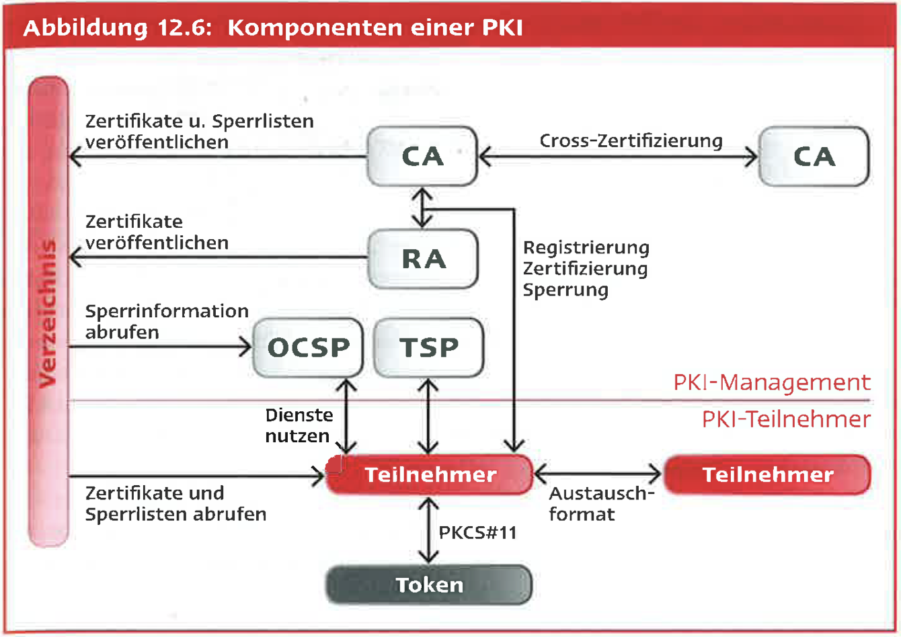
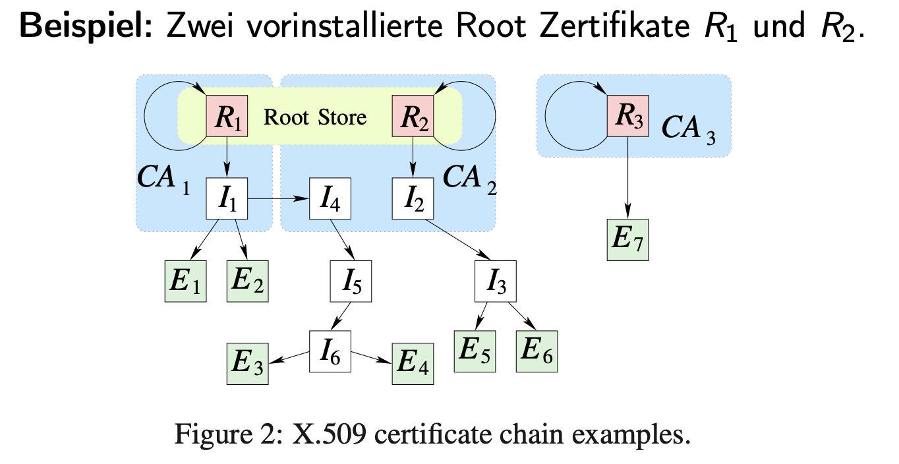
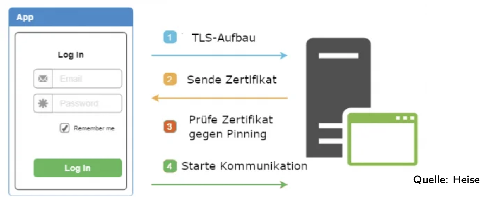
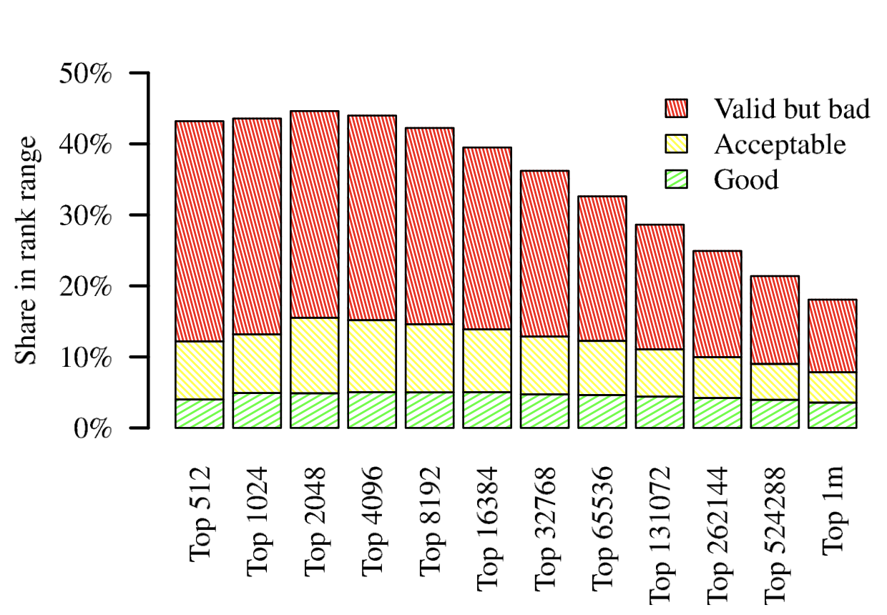

## Problem: Public Key Distribution

### Core Issue:

In asymmetric cryptography, we need to distribute public keys **securely** to ensure that they genuinely belong to the stated person or system. If an attacker inserts their own public key and pretends to be someone else, the whole system can be compromised (this is called a **man-in-the-middle attack**)

Imagine this situation:

1. You want to send an encrypted message to Alice, so you need Alice’s public key.
2. You search for her key and find a key that says it belongs to Alice.
3. But… that key was actually uploaded by Mallory, the attacker, and it’s her key, not Alice’s!

So now:
1. You encrypt the message using Mallory’s key, thinking it’s Alice’s.
2. Mallory intercepts it, decrypts it with her private key, reads or modifies it, and maybe even re-encrypts it with the real Alice’s key and sends it forward.

You never realize there was someone in the middle.
This is called a Man-in-the-Middle (MitM) attack.


---

## What Is a Certificate?

**Definition:**
A **certificate** is a digital document that **verifiably links a public key to a specific identity**, such as a person (natural) or organization (juridical).

* It is issued by a **Certification Authority (CA)**, sometimes called a **Trust Center**. It signs a digital certificate that says:

>👉 “This public key really belongs to Jînno (or example.com). I vouch for it.”
* The CA uses **asymmetric cryptography** to sign that statement using its **private key**.

Everyone can verify this statement using the CA’s public key (which is known and trusted — often built into your browser/OS).

**Q**: If I generate my own public-private key pair, do I need someone else to sign my public key to make it trustworthy?

**A**:

Yes, if you want others to trust your identity.

Generating a key pair just gives you:

🔑 Your public key

🔐 Your private key

But anyone can generate any key pair and say “this belongs to Alice.”

So, if you want to prove you are Jînno and not some random person:

	1.	You send your public key and proof of identity to a CA.

	2.	They check who you are.

	3.	If verified, they sign your public key, producing a certificate.

	4.	Now others can say: 👉 “This key was signed by a trusted CA — so I believe it’s really Jînno’s.”

Without this signature, no one knows if the key you’re showing them is genuinely yours.


# Title: What Does PKI Do? – Summary and Threat Context


## Why Does PKI Matter?

When someone says: *"This public key belongs to me"*, that alone isn’t trustworthy.
Anyone could generate a key and make that claim.

**The job of PKI is to make that claim verifiable** and usable at global scale.


## 🔐 What If Someone Trusts the Wrong Key?

If someone trusts a fake public key (e.g., attacker Mallory’s instead of Jînno’s):

* Mallory can **intercept and decrypt** confidential messages.
* She can **alter the message**, then re-encrypt with the real recipient’s key.
* She can **impersonate** Jînno, sending fake messages signed with her own key.

> 🎯 **Result: A man-in-the-middle attack with full access and forgery.**

This is why PKI is critical: it prevents trusting the wrong public key.


## What PKI Manages (By Role)

| Role                            | What It Manages                                                     |
| ------------------------------- | ------------------------------------------------------------------- |
| ✅ **Who you are**               | Identity verification (Are you really Jînno?)                       |
| ✅ **What your key is**          | Public key registration (This is Jînno’s key)                       |
| ✅ **Who can vouch for you**     | Certification via CA (I, a trusted CA, confirm this key is Jînno’s) |
| ✅ **How long your ID is valid** | Certificate expiration, revocation, and renewal                     |
| ✅ **Who you trust**             | Root CAs and trust stores (Who do I believe?)                       |



## What PKI Includes

| Component        | Role                                                              |
| ---------------- | ----------------------------------------------------------------- |
| **CA**           | Certifies public keys by signing them                             |
| **RA**           | Verifies identity before CA signs                                 |
| **Trust Anchor** | Known and trusted public key of the CA (preinstalled in browsers) |
| **CRL / OCSP**   | Revocation systems to block compromised certificates              |
| **Keystores**    | Protect private keys (e.g., smartcards, HSMs, apps)               |


## In One Sentence:

> **PKI is the infrastructure that ensures the public key you're using actually belongs to the person you think you're talking to — and protects you if that's not the case.**

## X.509 Certificates (Standard Format)

This is the format used in almost all secure communications (like HTTPS):

| Field               | Meaning                                                              |
| ------------------- | -------------------------------------------------------------------- |
| **Version**         | Format version (e.g., v1, v2, v3)                                    |
| **Serial Number**   | Unique identifier for the certificate                                |
| **Signature Alg.**  | Hash and encryption algorithm used for signing (e.g., SHA-256 + RSA) |
| **Issuer**          | Name of the CA who issued the certificate                            |
| **Validity**        | Start and end date (e.g., 01.01.2024–01.01.2025)                     |
| **Subject**         | Name of the owner (e.g., domain, person)                             |
| **Public Key Info** | Public key + algorithm parameters (e.g., RSA-2048)                   |
| **Extensions**      | Additional attributes (only in v2/v3)                                |
| **Signature**       | Digital signature of all above fields, signed with CA’s private key  |


# Clearing up confusions
## Part 1: Why Does a CA Sign a Certificate If It's Meant to Be Public?

### The Misunderstanding:

> "If a certificate is meant to be public, why does the CA use its private key to 'encrypt' (sign) it? What’s the point if anyone can decrypt it?"

### The Clarification:

The CA doesn’t encrypt the certificate — it **digitally signs it**.

* A **digital signature is not for secrecy**.
* It’s for **authenticity** and **integrity**.

### How It Works:

1. CA calculates a **hash** of the certificate contents (e.g., SHA-256).
2. CA **encrypts the hash** with its **private key** → this becomes the **digital signature**.
3. The signature is attached to the certificate.

### What the Recipient Does:

* Recalculates the hash of the certificate.
* **Decrypts the CA's signature** using the **CA’s public key**.
* If the two hashes match, the certificate is:

  * ✅ Untampered
  * ✅ Issued by a trusted authority

> 🔐 So the point of signing is **not to hide**, but to **prove who issued it and that it hasn't been changed**.

---

## Part 2: When and Why Would You Get Your Key Signed by a CA?

### Scenario:

You’ve generated a key pair on your computer. But now you want others (users, clients, browsers) to **trust that this key really belongs to you**.

That’s when you go to a **Certification Authority** to get a certificate.

### Common Real-World Cases:

| Use Case                      | Why You Need a CA-Certified Key                     |
| ----------------------------- | --------------------------------------------------- |
| **HTTPS Website (TLS)**       | So browsers trust your website and show the 🔒 lock |
| **Code Signing**              | So systems trust that your app or software is safe  |
| **Email Encryption (S/MIME)** | To prove emails are from you and not tampered       |
| **Enterprise Authentication** | To identify clients/employees securely in networks  |

### Step-by-Step: Getting a Signed Certificate (e.g., for HTTPS)

1. **Generate Your Key Pair**

```bash
openssl genrsa -out private.key 2048
openssl req -new -key private.key -out request.csr
```

2. **Create a CSR (Certificate Signing Request)**
   Includes:

* Your public key
* Your domain info / identity
* A signature using your private key

3. **Submit CSR to a CA**
   Examples:

* Free: Let’s Encrypt
* Paid: DigiCert, Sectigo, GlobalSign

4. **CA Verifies You**
   E.g., by:

* Asking you to upload a file to your domain
* Checking a DNS record

5. **CA Issues Certificate**

* They sign it with their **private key**
* You get a valid **X.509 certificate**

6. **Install the Certificate**

* On your web server (e.g., NGINX, Apache)
* Now browsers trust you, show the lock, and encrypt traffic

## Example Use Case 1: Verifying a Sender’s Signature

**Scenario:** B receives a message from A and wants to check the signature.

1. A has a certificate `ZA` issued by a CA called **Trust**.
2. A sends `ZA` along with the message.
3. B verifies the certificate:

   * B must already **trust the CA** → B knows the CA’s public key (called a **Trust Anchor**).
4. If `ZA` is valid, B extracts A’s public key and uses it to verify A’s signature.

**Analogy:** It’s like checking a passport. The government (CA) signs it; you trust the government, so you trust the passport.

---

## Example Use Case 2: Secure Communication (Client ↔ Server)

**Scenario:** A client C wants to talk securely to a server S.

1. S owns a certificate `ZS` issued by **Trust**.
2. During the **TLS handshake**, S sends `ZS` to C.
3. C checks `ZS` using the CA’s public key.
4. If valid:

   * C extracts S’s public key
   * C can now:

     * Verify server’s signatures (e.g., for authentication)
     * Run a **Challenge-Response protocol** to check S is real
     * Encrypt a secret (e.g., symmetric key) for S using that public key

---

## When Is a Certificate Valid?

1. The **signature is correct** → Verify using CA’s public key
2. The **validity period** is current → The clock must be correct!

---

## When Is a Certificate Trustworthy?

1. The signing method (e.g., RSA + SHA-256) is still **considered secure**.
2. The CA **has the authority** to issue certificates for that entity.

⚠️ **Real-world cautionary tale:**
In 2012, attackers breached Dutch CA **DigiNotar** and issued fake certificates. Even though the format and signature were valid, the **issuer was compromised**, breaking the chain of trust.


# Title: X.509 Certificate Chains and Trust Anchors 
## Root Certificates and Trust Chains

In X.509-based PKI, **trust starts from a Root Certificate**, also called:

* **Wurzelzertifikat** (German)
* **Trust Anchor** (technical term)

Browsers and operating systems have a **preinstalled Root Store** that contains many trusted **Root Certificates** (like `R1`, `R2`, `R3`).

These roots are the **starting point** for verifying other certificates.


## 🔗 What Is a Certificate Chain?


A **Zertifikatskette** (certificate chain) is a **chain of trust**:

1. A **Root CA (R)** signs an
2. **Intermediate CA (I)** which signs an
3. **End-Entity Certificate (E)** (e.g. a website like `paypal.com`)

Each certificate is signed by the one above it.

> ✅ If your browser trusts the root, and the chain is valid, it will trust the end certificate.


## Why Are Chains Needed?

* **Root Certificates are too valuable** to use frequently.
* So they sign **Intermediate CAs** that can issue end-entity certs.
* This **limits damage** in case an intermediate gets compromised.

> ✅ Security Best Practice: **Short chains are preferred**. Each extra intermediate = extra attack surface.


##  Certificate Tree 🌳 (Vertrauensbaum)

* All valid certificates issued under a root form a **trust tree**.
* One root → many intermediates → many end-entities.
* **Figure 2** in the slide shows this as:

  * `R1` → `I1` → `E1`, `E2`, `I4`
  * `I4` → `I5` → `I6` → `E4`, `E3`
  * `R2` → `I2` → `I3` → `E5`, `E6`
  * `R3` → directly issues `E7` (no intermediates)


## 🔐 Real-World Validation Example

1. The website `paypal.com` presents its certificate `E6`.
2. It also sends intermediate certs `I3` and `I2`.
3. Your browser:

   * Looks in its Root Store for `R2`
   * Validates signature path: `R2` → `I2` → `I3` → `E6`
   * ✅ If all valid: connection is trusted.

> 🔎 If any cert in the chain is **missing**, **expired**, or **not signed correctly**, the whole chain is rejected.


## Responsibilities of a Certification Authority (CA)

| Phase                       | Responsibility                                                       |
| --------------------------- | -------------------------------------------------------------------- |
| **Key Generation (KG)**     | Securely generate key pairs                                          |
| **Registration (RA)**       | Verify applicant identity (e.g. with ID or domain ownership)         |
| **Certification (CA)**      | Bind identity and public key into a certificate, sign it             |
| **Personalization (PS)**    | Deploy certificate and private key to token (e.g., chip card)        |
| **Directory Service (DIR)** | Publish certs, respond to revocation checks                          |
| **Timestamp Service (TSS)** | Bind a trustworthy time to signed data (e.g., document timestamping) |


# Certificate Revocation, OCSP, CRLs, and Pinning

## 🔐 What Is Certificate Revocation?

Even if a certificate is still within its "validity period" (e.g., valid until 2026), it might become **untrustworthy earlier**, for example:

* The private key was **stolen** or compromised.
* The domain changed ownership.
* The employee tied to the certificate left the company.

In these cases, the certificate must be **revoked** by the CA.


## 📜 RFC 5280: Revocation Mechanisms

### 1. **CRL – Certificate Revocation List**

* A **signed list** of revoked certificates
* Issued **periodically** by the CA
* Freely available in public directories
* Each CRL is timestamped and includes serial numbers of revoked certs

### 2. **OCSP – Online Certificate Status Protocol (RFC 6960)**

* A **live check**: client sends the certificate’s ID to an OCSP responder
* The responder replies: **Good**, **Revoked**, or **Unknown**
* Meant for **real-time status** (fresher than CRLs)

---

## OCSP in Practice: Broken Promises

OCSP was supposed to provide live security but had serious flaws:

* **Privacy leak**: When you visit a site (e.g., victoriassecret.com), your browser sends your **IP address + website you're visiting** to the CA's OCSP server
* **Availability problem**: If OCSP servers are slow or offline, the browser either delays or skips the revocation check

### Status in 2024–2025:

* Major browsers made **OCSP optional**
* As of **15.03.2024**, CAs are **required** to publish CRLs and revoke certs within **24 hours**
* **Let’s Encrypt**:

  * Dropped OCSP URLs as of **07.05.2025**
  * Will shut down OCSP fully on **06.08.2025**


## Privacy vs. Security Trade-Off

| OCSP                          | CRL                         |
| ----------------------------- | --------------------------- |
| Real-time revocation          | Periodic revocation         |
| Privacy-invasive (reveals IP) | Local and private           |
| Dynamic and timely            | Efficient but less frequent |


## Real-World Experience (Victoria’s Secret Analogy)

When you visit `victoriassecret.com`, your browser:

1. Receives the site’s **TLS certificate** (e.g. issued by DigiCert or Let’s Encrypt)
2. Checks the **issuer**, **validity period**, **hostname**, and **revocation status**
3. If OCSP is used: a request is made to the CA (e.g. DigiCert) to verify revocation status
4. If CRL is used: the browser checks a cached or freshly downloaded CRL specific to that CA

✅ In either case, the site must prove its certificate hasn’t been revoked.

## Where Do CAs Like DigiCert Come In?

You don’t see them in the URL, but they are in the certificate metadata.
Your browser trusts CAs pre-installed in its **Root Store**, such as:

* DigiCert
* Let’s Encrypt
* GlobalSign

When a site like Udemy or Victoria's Secret sets up HTTPS, it obtains a certificate from one of these CAs.

✅ You can see the certificate by clicking the lock icon → Inspect / Developer Tools → Security tab → “Certificate” → Issuer = CA.


## Do You Have a Certificate in Your Browser?

Not usually. Your browser doesn’t need one **unless**:

* You're accessing a **corporate VPN** that uses **mutual TLS**
* Or you’re logging into a system that authenticates clients by **certificate instead of password**

In these cases:

* You may have a certificate issued by your company
* It’s stored in your system’s **Keychain** (macOS), **Windows Certificate Store**, or on a smartcard/token


## How Big Is a CRL? Isn’t It Too Much?

Great question. CRLs are not global.

* Each **CA publishes its own CRL** for certs it has issued.
* Certificates contain a field pointing to the CRL URL (e.g. `http://crl.digicert.com/...`)
* The browser **downloads only the relevant CRL**
* Often cached and updated periodically

✅ So it’s scalable and works efficiently in real life.


## 🧷 What Is Public Key Pinning?

Introduced via RFC 7469 to protect against CA compromise.

### How It Works:

1. Server sends a **Public-Key-Pins** HTTP header
2. Browser stores the certificate fingerprint (hash)
3. On future visits: browser **rejects any certs that don’t match the pin**

### Goal:

> Even if a CA mistakenly issues a fake cert for `paypal.com`, browsers that pinned the original key will reject the fake.


## Why Pinning Failed in Browsers

* Very easy to misconfigure → you can lock users out permanently
* Required close coordination between browser, server, and certificate rotation
* Google removed support in Chrome (2017)
* **Still used in apps** (mobile/desktop) where the ecosystem is controlled


## How Does TLS Encrypt Everything on a Website?

You asked: “Is the whole website encrypted? I thought we only encrypt the hash, not the full message?”

✅ Correct for digital signatures — but **encryption in TLS works differently.**


### TLS Process:

1. **Authenticate the server** with its certificate
2. Use **asymmetric encryption** to agree on a shared symmetric key
3. From then on, everything — HTML, images, scripts — is:

   * 🔒 Encrypted with that symmetric key (e.g. AES-256)
   * ✅ Authenticated (you’ll know if even one byte is tampered)

This secures the **entire pipeline**, not individual items.


## Refined Analogy (You ↔ Husband, Website ↔ Browser)

* You = Server (Udemy/Victoria's Secret)
* Your husband = Website visitor
* TLS certificate = Your signed passport
* Secure session = Private tunnel where all future communication is encrypted

> Once the certificate is verified, both sides switch to **symmetric encryption** for efficient and secure data exchange.




## Observation: Real-World Certificate Quality 📊 

Even among **Top Alexa-ranked websites**, many use suboptimal certificates:

| Rank Range | Good Certs | Acceptable | Valid but bad |
| ---------- | ---------- | ---------- | ------------- |
| Top 512    | \~5%       | \~10%      | \~35%         |
| Top 1M     | \~5%       | \~10%      | \~15%         |

* "**Good**" = short chain, strong key, valid hostname, modern crypto
* "**Acceptable**" = slightly weaker (longer chain, older expiry)
* "**Valid but bad**" = long chains, weak keys, long validity, SHA-1, etc.

> 🔍 Even **high-ranking websites** fail to follow best practices.


 
## Things You Should Now Understand

* Why revocation is **crucial** but **hard to implement correctly**
* Why OCSP is fading and **CRLs are back**
* Why pinning failed in browsers but lives in **apps**
* How **CAs** like DigiCert or Let’s Encrypt are involved in HTTPS
* Why **TLS encrypts the whole pipeline**, not individual files
* When and why a browser might have **its own certificate** (VPN/mTLS)
* How CRLs scale **without becoming huge**

---
**Title: Legal Validity of Digital Signatures and eIDAS in the EU**

---

## ✍️ Weaknesses of Handwritten Signatures

Traditional handwritten signatures:

* Do **not prevent tampering** of documents after signing
* Are **easy to forge**, but **hard to prove as forged**

### ✅ Digital signatures improve on this:

* The **document itself is part of the signature** (via hashing)
* **Forgery detection** is reliable through cryptographic verification

> A correctly implemented digital signature provides **stronger forgery protection** than paper-based signatures.

---

## 🧑‍⚖️ Evolution of Legal Frameworks

### 🇩🇪 **Germany**

* **1997**: First country to pass a digital signature law
* **2001**: Updated German Signature Act to align with EU Directive

  * Trust centers became **liable** for their certificates
  * Introduced **signature security levels**
  * Introduced **voluntary accreditation** (not mandatory approval)

### 🇪🇺 **European Union**

* **1999**: EU Directive introduced the concept of **advanced digital signatures**
* **2014**: Replaced by **eIDAS Regulation** – unified rules across the EU
* **2017**: Germany replaced the Signature Act with the **VDG (Vertrauensdienstegesetz)**

---

## 🔐 Signature Levels under VDG (aligned with eIDAS)

| Level | Name                                 | Description                                                                |
| ----- | ------------------------------------ | -------------------------------------------------------------------------- |
| 1     | Einfache elektronische Signatur      | Basic authentication, no liability for Trust Center                        |
| 2     | Fortgeschrittene Signatur            | Enables authentication and integrity; Trust Center **can be held liable**  |
| 3     | Qualifizierte elektronische Signatur | Has legal equivalence to handwritten signature; uses **regulated devices** |

---

## 🔐 How a Qualified Signature Works (Chipkarte Example)

* The **private key** is stored on a secure chip (chip card or HSM)
* The document is **hashed** client-side
* The hash is sent to the chip
* The chip **computes the digital signature** and returns it

✅ This ensures the private key **never leaves the chip**

---

## 📄 Example: Adobe Sign

Adobe Sign supports both **fortgeschrittene** and **qualifizierte Signaturen**, compliant with **eIDAS**.
Website: [https://acrobat.adobe.com/de/de/sign.html](https://acrobat.adobe.com/de/de/sign.html)

---

## 📄 Example: ELSTER (German Tax System)

Initially planned to use digital signatures for authenticated e-filing. It failed to gain traction.

### New approach: Authenticated Filing

1. Users request an **Elster certificate**
2. Identity is verified via two codes:

   * One sent by email
   * One by postal mail to the registered tax address
3. After activation, identity is **cryptographically bound** to the certificate

✅ Conforms to **fortgeschrittene elektronische Signatur** under eIDAS

---

## 🌍 Trust Centers & Accreditation

### Germany (via Bundesnetzagentur):

* D-TRUST (Bundesdruckerei)
* T-Systems (Telesec)

### Global:

* No universal global accreditation law
* Example: **VeriSign**, founded in 1995, formerly owned by RSA Security

---

## 🌐 eIDAS vs Browserforum (CAB Forum)

* The **CAB Forum** decides which CAs are allowed into browsers' **Root Stores**
* Includes browser vendors (Chrome, Firefox, etc.), OS vendors, and CA operators

✅ Their job: Make **TLS/HTTPS work easily** by preloading trusted certificates

### 🧨 Problem:

Under eIDAS2, browsers must **preinstall qualified website certs**.
But if such a CA gets compromised, its cert **can’t be removed** until **formal decertification** — causing a security lag.

