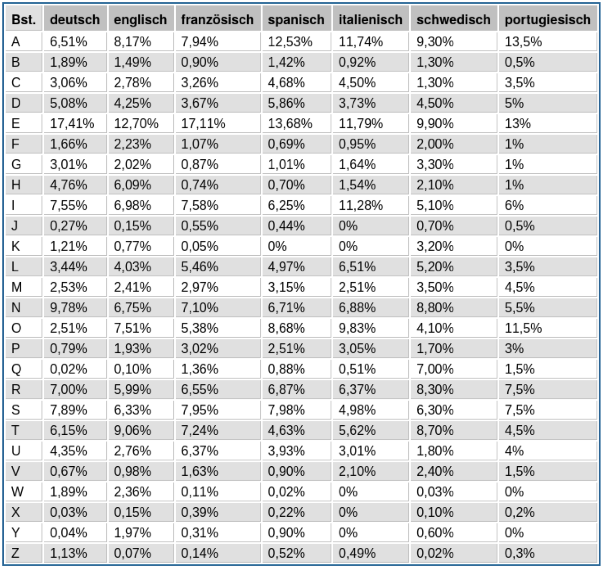
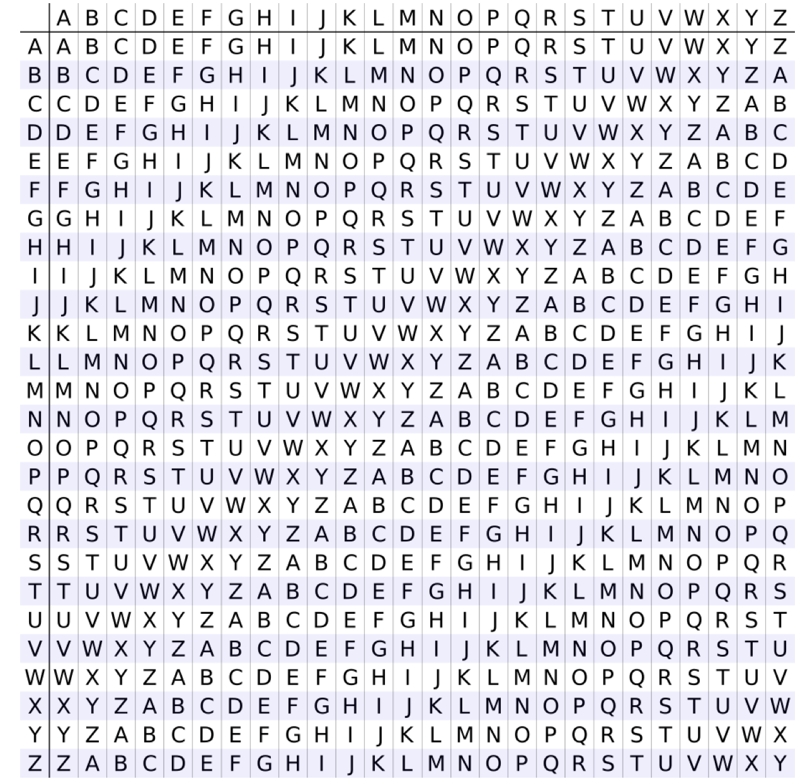
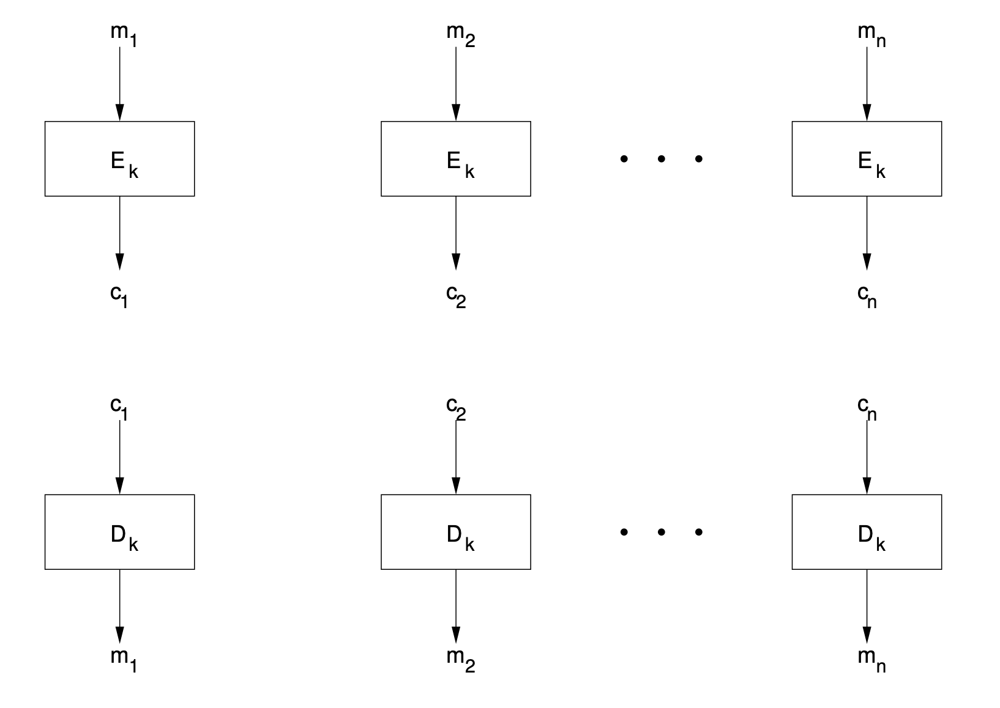
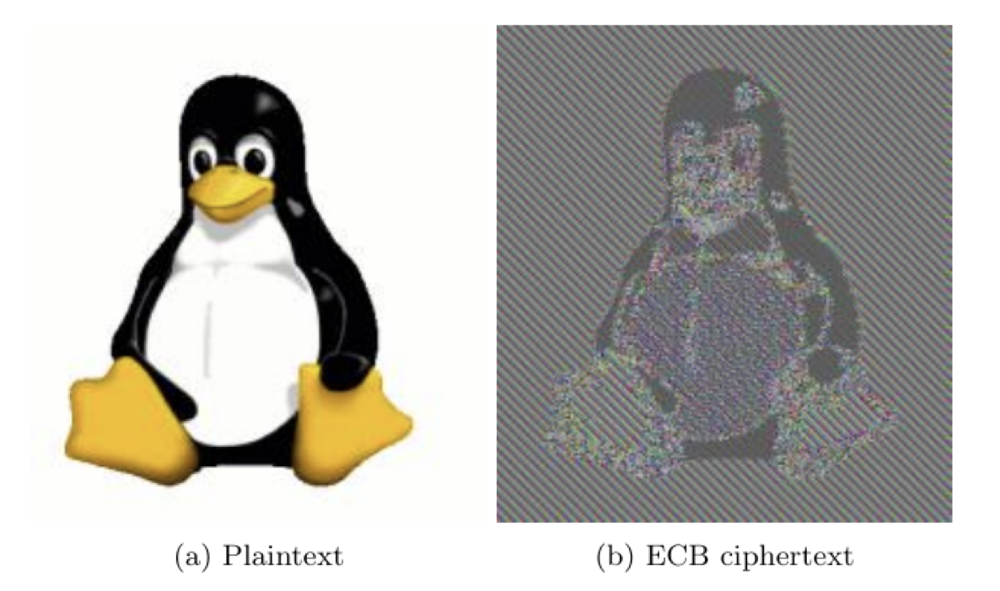
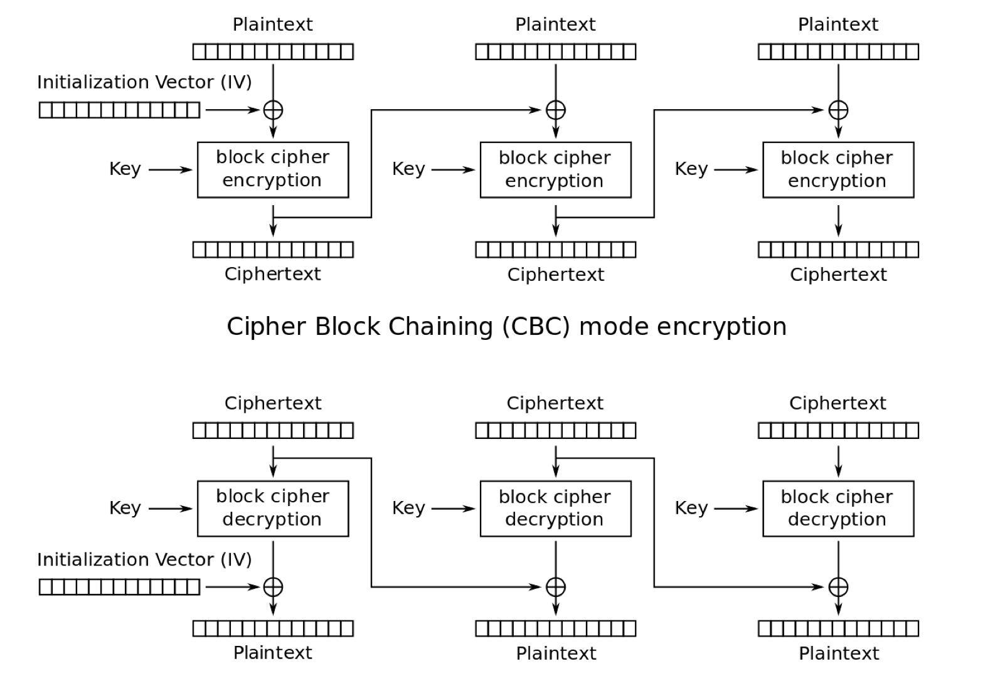
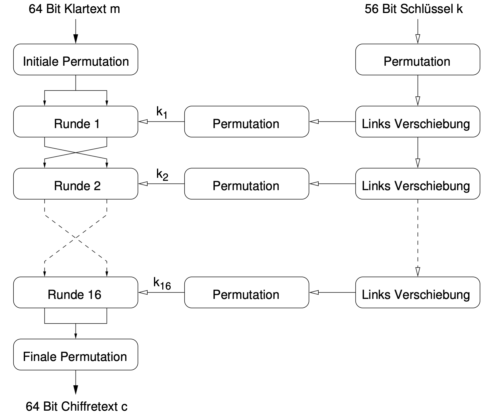
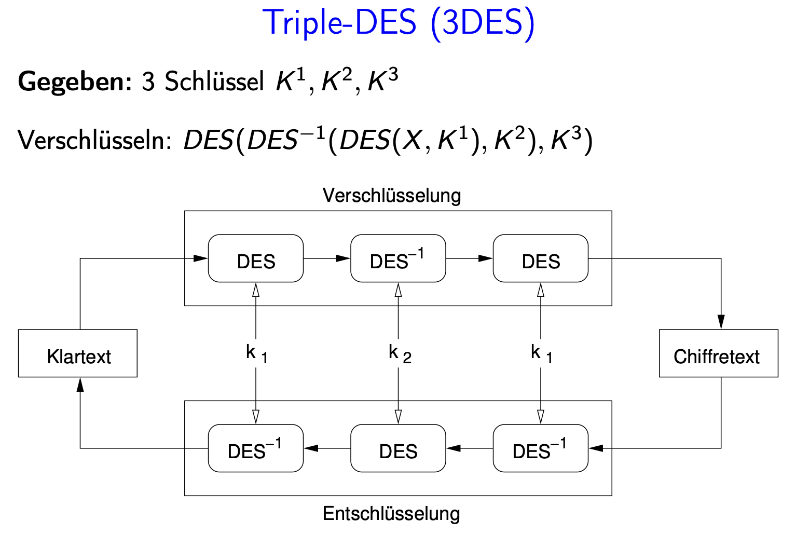
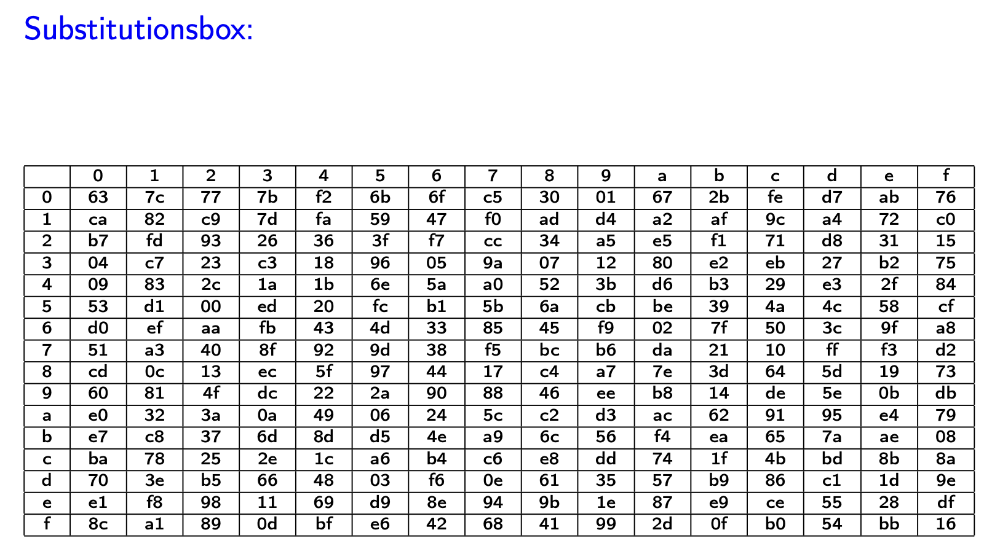
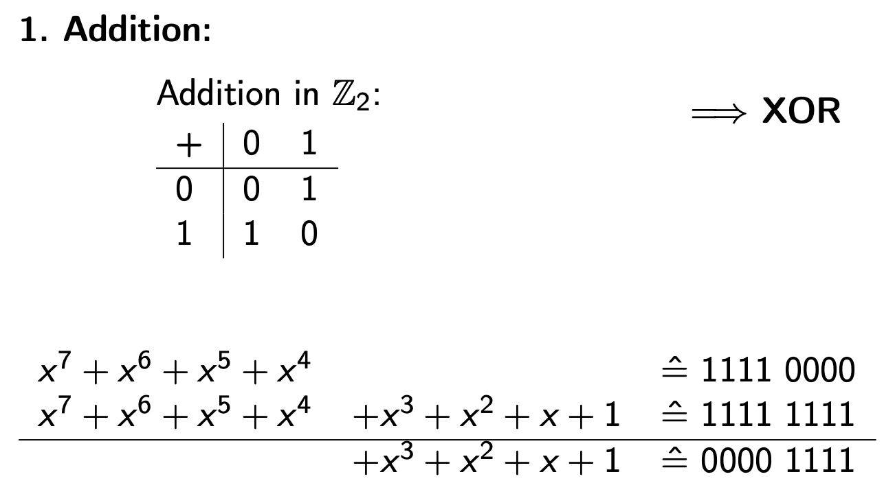

## 1. Grundlegende Begriffe – Core Cryptographic Concepts

### Terminology

| German              | English             | Explanation |
|---------------------|---------------------|-------------|
| **Klartext**        | Cleartext           | Original readable data or message |
| **Chiffretext**     | Ciphertext          | Encrypted, unreadable version of the message |
| **Chiffre**         | Cipher              | The algorithm or method for encrypting/decrypting (e.g., AES, RSA) |
| **Chiffrieren**     | Encryption          | The act of converting cleartext into ciphertext using a cipher + key |
| **Dechiffrieren**   | Decryption          | Reversing encryption to get back the original cleartext |
| **Schlüssel**       | Key                 | The secret used together with a cipher to perform encryption or decryption |
| **Kryptographie**   | Cryptography        | The science of secure communication |
| **Kryptoanalyse**   | Cryptanalysis       | The science of breaking cryptographic methods without knowing the key |
| **Kryptologie**     | Cryptology          | Umbrella term: Cryptography + Cryptanalysis |

---

### Symmetric vs Asymmetric Ciphers

#### Symmetric Cipher
- Same key used for encryption and decryption.
- Key must be shared secretly between sender and receiver.
- Example: AES

#### Asymmetric Cipher
- Two keys: **Public key** (for encryption) and **Private key** (for decryption).
- Public key is shared, private key is kept secret.
- Example: RSA

---

### Formal Definition of a Cryptosystem

A **Kryptosystem** is defined as a 5-tuple:

`(M, C, K, Eₖ, Dₖ)` where:

- `M` = set of all plaintexts (messages)
- `C` = set of all ciphertexts
- `K` = set of all keys
- `Eₖ(m)` = encryption function using key `k`
- `Dₖ(c)` = decryption function using key `k`

**Correctness condition:**  
`∀ m ∈ M, ∀ k ∈ K: Dₖ(Eₖ(m)) = m`

This ensures decryption correctly reverses encryption.

---

### Cryptosystem Requirements

1. Efficient encryption/decryption for all keys: we don’t want users to wait 10 minutes to open an email.
2. It must be easy to pick a key k, and use Eₖ (encryption) and Dₖ (decryption) functions without needing a PhD.
3. Security should depend **only on the key**, not on secrecy of the algorithm = A cryptosystem should remain secure even if everything about the system, except the key, is public knowledge.
   → **Kerckhoffs’s Principle (1883)**

---

### 2. Monoalphabetic Substitution Ciphers

- Let A and B be two alphabets, both {A, B, C, ..., Z} (so |A| = |B| = 26). Each letter in the alphabet is **replaced with a fixed, unique** other letter.
- This is general substitution: any letter can map to any other letter, and the mapping is arbitrary and a **bijective mapping** (one-to-one, no repeats).
- Alphabet: A–Z ⇒ 26 letters: 
- Number of possible keys = `26!` ≈ **4 × 10²⁶**  
  → Very large key space

### **BUT**
### Weakness: Frequency Analysis

- Attackers can guess likely mappings by analyzing **letter frequency** in ciphertext.
- Example: If `H` appears most often, it's probably `E` in English.
- Use language-specific frequency tables (like the one in the image) to break the cipher.



---

### Example: Caesar Cipher (Special Case)

- A monoalphabetic cipher where each letter is shifted by the same number: If you want to shift a letter, you add a number to its position:

Let's say A = 0. Shift by 3: 0 + 3 = 3 → D

But what happens if you go past Z?

Y = 24, shift by 4 → 24 + 4 = 28

There is no letter at position 28, so we wrap around 🔄 

28 mod 26 = 2 → C

#### Caesar Encryption Formula:
- Treat A–Z as 0–25
- `Encrypted = (x + s) mod 26`
- `Decrypted = (x - s) mod 26`

#### Key Space:
- Only 25 possible keys (shifts from 1 to 25).  
- Very small key space → easy to brute-force.
---
## Polyalphabetic Substitution & Vigenère Cipher

### What is Polyalphabetic Substitution?

Instead of using **one fixed substitution** (like Caesar cipher), we use **multiple Caesar ciphers**, rotating between them using a **key**.

- The key is a **sequence of letters** (e.g., `DOG`)
- Each key letter defines **how much to shift** that character.
- The same key is repeated over the whole message.
- This makes it much harder to break than monoalphabetic substitution.

---

### What is the Vigenère Cipher?

It’s the **most famous example** of polyalphabetic substitution.

#### The Vigenère Table:
- A 26×26 grid of Caesar cipher rows
- Each **row** represents a Caesar cipher with a different shift
- Row A = no shift, Row B = shift by 1, ..., Row Z = shift by 25

#### The key idea:
- For each letter in the plaintext, you use the **row corresponding to the key letter**
- You **find the column** matching the plaintext letter
- The **intersection** is your encrypted letter

---

### Concrete Example: Key `"DOG"`, Plaintext `"ATTACK"`

Step-by-step:

Plaintext:  A   T   T   A   C   K

Key:        D   O   G   D   O   G

Now convert letters to numbers:

| A=0 | B=1 | ... | D=3 | G=6 | O=14 | T=19 | K=10 |
Plain:       0   19   19   0    2   10

Key(DOG):    3   14    6   3   14    6

Add:         0+3 = 3   → D

19+14 = 33 → 33 mod 26 = 7 → H

19+6 = 25 → Z

0+3 = 3   → D

2+14 = 16 → Q

10+6 = 16 → Q

Result: `"DHZDQQ"` ✅ 

---

### Why is this better than Caesar?

| Feature                 | Caesar Cipher        | Vigenère Cipher            |
|-------------------------|----------------------|-----------------------------|
| Uses 1 alphabet         | ✅                   | ❌                         |
| Easy to brute-force     | ✅ (only 25 keys)     | ❌ (depends on key length) |
| Leaks letter frequency  | ✅                   | ❌ (disguises better)      |
| Vulnerable to frequency analysis | ✅       | Partially, only with long text and short keys |

---

###  Weakness ⚠️

Still breakable if:
- The key is short
- The text is long

Attackers can:
- Guess the key length (using Kasiski or coincidence methods)
- Slice the ciphertext into **columns** based on key length
- Apply frequency analysis **on each column**

This is how the Vigenère cipher can be cracked.


## How to Use the Vigenère Table (Vigenère Square)

The Vigenère table (or Vigenère square) is a 26×26 grid used to encrypt and decrypt messages using **polyalphabetic substitution**.

---

### Structure of the Table

- **Rows** = Caesar shifts starting from each letter A–Z
- **Columns** = The plaintext letters
- **Cells** = The resulting encrypted letters

| Key (Row ↓) \ Plain (Col →) | A | B | C | D | ... |
|-----------------------------|---|---|---|---|-----|
| A                           | A | B | C | D | ... |
| B                           | B | C | D | E | ... |
| C                           | C | D | E | F | ... |
| ...                         |   |   |   |   |     |
| Z                           | Z | A | B | C | ... |

---

### Encryption with the Table

**Steps:**

1. Take your **plaintext** and **repeat the key** until it’s the same length.
2. 
	- Use the key letter to select the row
	- Use the plaintext letter to select the column
	- Find the intersection
---

### Example: Encrypt `"HELLO"` with key `"KEY"`

Repeat the key:

Plaintext:  `H   E   L   L   O`

Key:        `K   E   Y   K   E`

#### Now encrypt each letter:

| Plain | Key | Row (Key) | Col (Plain) | Cipher |
|-------|-----|-----------|-------------|--------|
| H     | K   | Row K     | Col H       | **R**  |
| E     | E   | Row E     | Col E       | **I**  |
| L     | Y   | Row Y     | Col L       | **J**  |
| L     | K   | Row K     | Col L       | **V**  |
| O     | E   | Row E     | Col O       | **S**  |

Result: `"RIJVS"`

---

### Decryption with the Table

To decrypt:

1. For each key letter, go to its row
2. In that row, find the position of the ciphertext letter
3. The column label where you found it = the original plaintext letter

---

### Modulo Version (Optional)

Behind the scenes, Vigenère is just:

Encrypted = (PlainIndex + KeyIndex) mod 26

Decrypted = (CipherIndex - KeyIndex + 26) mod 26

## 🏰 Example: Enigma – A Mechanical Polyalphabetic Substitution Cipher

### Historical Context

- **Inventor:** Dr. Arthur Scherbius (Germany, 1918)
- **Used by:** Reichswehr, later the Nazi Wehrmacht (1930s–1945)
- **Name Meaning:** "Enigma" = "Rätsel" in Greek (means "riddle")
- **Why Important?** Its cracking by Alan Turing's team at Bletchley Park massively accelerated the Allied victory in WWII and gave birth to modern computing.

---

### How Enigma Works (At a Glance)

Enigma is a **mechanical cipher machine** that performs a **complex form of polyalphabetic substitution**, but with a twist:

> The substitution changes automatically **after every keypress** 🔁 

---

### Components

| Component        | Function |
|------------------|----------|
| **Keyboard**      | Letter input (e.g. you press `A`) |
| **Rotors (Walzen)** | Each rotor shifts letters and rotates after each press; like a Caesar cipher that changes |
| **Reflector**     | Sends the signal back through the rotors, ensuring encryption is reversible |
| **Plugboard (Steckerbrett)** | Swaps letters in pairs before and after rotor encryption for extra confusion |
| **Lampboard**     | Lights up the output letter |

---

### Step-by-Step Flow

1. **You press a key**, say `A`
2. Signal passes through **plugboard**
3. Goes through a stack of 3 (or more) **rotors**, each shifting the signal
4. Hits the **reflector**, bounces back
5. Goes back through rotors (in reverse path)
6. Back through **plugboard**
7. A different letter lights up (e.g., `G`)

Then the **rightmost rotor rotates** → this changes the mapping for the **next letter**.

---

### Polyalphabetic, but dynamic!

Unlike Vigenère:
- Which repeats a fixed pattern (`DOGDOG...`)
- Enigma generates **a new substitution alphabet every time**, by rotating internal gears

So the **same plaintext letter typed twice** gives **different ciphertext letters**; e.g., `A` → `G`, then `A` → `T`

---

### Why was it considered secure?

- Over **150 quintillion** possible configurations (with plugboard + rotors)
- Substitution rules changed dynamically
- Keys changed **daily**

But it had **weaknesses**:
- No letter ever encrypted to itself
- Same daily key used by entire military unit
- Human patterns made guessing easier

---

### Why was Enigma breakable?

1. **Allies captured machines & codebooks**
2. **Polish cryptanalysts** (Rejewski, Zygalski, Rozycki) began cracking early versions
3. **Turing and Bletchley Park** automated attacks using the **Bombe** machine
4. They used **cribs** (guessed plaintext fragments) and **math logic** to reverse rotor settings

---

### Why is Enigma important?

- It is the **real-world evolution** of Vigenère
- Shows the limits of substitution-based encryption
- Motivated the rise of **modern cryptography**, which now relies on math (e.g., RSA, AES), not moving parts

---

### Final Thought 🔑 

> Enigma wasn't broken because of bad encryption; it was broken because of **bad key management, human error, and predictable messages**.

## Transpositionschiffre (Transposition Cipher)

### 📌 What It Is

A **transposition cipher** rearranges the **positions** of letters in the plaintext, without changing the letters themselves.

> "It scrambles, but does not substitute."

This stands in contrast to:
- **Substitution ciphers**: replace letters (e.g. A → D)
- **Transposition ciphers**: keep letters, change **order**

---

### The Key: A Permutation π

The encryption rule is a **permutation** π ∈ γₙ, meaning:
- For a block of `n` letters, the character at position `i` is moved to position `π(i)`
- The permutation must not be the identity (π ≠ id)

#### Notation:
$$
\pi =
\begin{bmatrix}
1 & 2 & 3 & 4 \\
3 & 1 & 4 & 2
\end{bmatrix}
$$

This means:
- 1st letter goes to position 3  
- 2nd → 1  
- 3rd → 4  
- 4th → 2

---

### Example

**Plaintext:** `R E N A  I S S A  N C E _`  
(Split into 4-letter blocks)

#### Block 1: `R E N A`

| Original | R | E | N | A |
|----------|---|---|---|---|
| Index    | 1 | 2 | 3 | 4 |
| π(i)     | 3 | 1 | 4 | 2 |
| Output   | E | A | R | N |

**Ciphertext:** `E A R N`

---

### ❗ Weakness

> "Chiffre ist leicht zu brechen"

- For a block size `n`, there are `n!` possible permutations
- For example:  
  `4! = 24` → an attacker only needs to try **23 permutations** (excluding identity)

---

### Comparison to Previous Ciphers

| Feature                 | Vigenère              | Transposition           |
|-------------------------|------------------------|-------------------------|
| Substitutes letters     | Yes                | No (keeps same letters) |
| Rearranges letters      | No                 | Yes                  |
| Preserves frequency     | No                 | Yes (frequencies unchanged) |
| Brute-force attack risk | Medium (needs text length & crib) | ❗ High (try all permutations) |

---

### When to Use  💡 

Transposition ciphers are **not secure alone**, but they:
- **Obscure structure** of text
- Are useful when **combined** with substitution (double encryption)

---
## 8.4 Kryptoanalyse (Cryptanalysis) – Breaking Ciphers

**Kryptoanalyse** is the science of figuring out how to:
- Decrypt messages without having the key
- Break or weaken entire cryptographic algorithms
- Learn patterns that leak sensitive information

---

### 1. Analyse von Häufigkeitsverteilungen (Frequency Analysis)

**What is it?**
- A method for breaking **substitution-based ciphers** by analyzing **how often letters or patterns appear** in ciphertext.

**Why does it work?**
- In natural language, letters and digraphs (like "th", "er", "en") occur at predictable frequencies.
- Example in German: `E`, `N`, `I`, `S` are common; `Q`, `X`, `Y` are rare.
- If encryption doesn’t disguise these frequencies (e.g., in Caesar or Vigenère with short keys), attackers can **match the ciphertext frequency distribution** to known language statistics.

**Used to break:**
- Monoalphabetic Substitution
- Caesar Cipher
- Weak Vigenère Cipher

**How?**
1. Count how often each letter appears in ciphertext
2. Compare that to frequency tables for the target language
3. Swap suspected letters into the ciphertext and test if the result makes sense
4. Repeat and refine


---

### 2. Avalanche Effect (Lawineneffekt)

**What is it?**
- A cryptographic property where **changing just 1 bit** in the input (plaintext or key) causes **many bits** in the output (ciphertext) to flip.

**Why does it matter?**
- It guarantees that the cipher is **non-linear** and hides structure.
- A strong cipher should be **highly sensitive** to small input changes.

**In Cryptanalysis:**
Attackers try to flip 1 bit in:
- The key → check how output changes
- The plaintext → check how the ciphertext reacts

If the output changes only a little, the cipher may **leak key info** or have a **predictable structure** attackers can exploit.

**Used in:**
- Differential Cryptanalysis
- S-Box testing
- Evaluating block cipher quality (e.g. AES, DES)

---

## Avalanche vs Confusion — What’s the Difference?

| Scenario             | What changes            | What it tests                                          |
| -------------------- | ----------------------- | ------------------------------------------------------ |
| Flip 1 plaintext bit | Change 1 input bit      | Avalanche effect — does it spread to many output bits? |
| Flip 1 key bit       | Change 1 bit of the key | Confusion — does it drastically change the output?     |

Both are part of what makes AES strong.

* **Avalanche**: Input bits cause widespread change
* **Confusion**: Key has a chaotic effect on output

---

### 3. Zeitanalyse-Angriff (Timing Attack) ⏱

## What is a Side-Channel Attack❓ 

> A **side-channel attack** is an attack based not on the math of the algorithm but on how it is implemented and how it behaves physically.

Examples of side channels:

* **Timing**: Operations take longer/slower based on input
* **Power usage**: Power consumption patterns reveal data
* **EM radiation**: Detecting emissions from a chip

In AES, a **timing side-channel** might let an attacker recover the key by observing how long AES takes to run.

---

**Important:**
> This is **not** an attack on the math, but on the **implementation.**

**How does it work?**
- The attacker feeds the algorithm different inputs
- Measures how long the algorithm takes to respond
- Correlates timing differences with key guesses

**Example:**
- In AES, some lookup tables (`T-tables`) stored in memory can have **variable access time** depending on cache hits or misses → measurable delays
#### What is a Cache?

Modern CPUs have **small, fast memory** areas called **caches** to speed up access to frequently used data. 

- If a program asks for something that’s already in the cache, it's called a **cache hit** → fast access.

- If the data isn’t in the cache and must be fetched from main RAM → it’s a **cache miss** → slower access.

| Type       | Description                   | Speed   |
| ---------- | ----------------------------- | ------- |
| Cache Hit  | Data is already in fast cache | ⚡ Fast  |
| Cache Miss | CPU must fetch from slow RAM  | 🐢 Slow |

---

#### What is Profiling?

> **Profiling** means measuring how a program behaves — especially its timing — under different conditions.

In side-channel attacks, attackers **profile** which TBOX entries cause delays by measuring how long it takes the system to encrypt different plaintexts.

For example:

* `TBOX[0x6A]` → fast
* `TBOX[0x8B]` → slow (cache miss)
* They build a timing table:
  "Which inputs take longer, and why?"

---

**Attackers can extract:**
- Bits of a key
- Information about padding or buffer sizes
- Behavior under different branches (e.g., ifs, loops)

---

### 4. Brute-Force Angriff

**What is it?**
- The attacker tries **every possible key** in the keyspace until one decrypts the message successfully.

**When is it effective?**
- If the key size is **too small**
- If no better cryptanalytic shortcut is known

**Formula:**
Keyspace size = 2^key_length
#### ⚠️ Weak Key Length Example: 56-bit DES
2^56 = 72,057,594,037,927,936 keys
This was once considered secure. It’s not anymore.

#### What Does "Try 1 Billion Keys per Second" Look Like?

When we say an attacker can "try" keys, we mean:

* Take a ciphertext and a known plaintext
* Try to **decrypt the ciphertext using each key** in the keyspace
* Check if the result matches the plaintext

In code (conceptual):

```python
for key_guess in range(2**56):
    if AES_decrypt(ciphertext, key_guess) == known_plaintext:
        print("Key found:", key_guess)
```

This loop is what we mean by "trying" decrypting and verifying against known data.

### Real-World Example: COPACOBANA vs. DES

**COPACOBANA** = Cost-Optimized Parallel COde Breaker  

**Specs:**
- 120 FPGA chips (Spartan-3 1000)
- Total cost: ~$10,000
- Tested: 58 **billion** DES keys per second

| Platform        | DES Keys/sec        | Cost         |
|------------------|---------------------|--------------|
| Regular PC (2GHz)| ~2 million/sec      | ~$200        |
| 1 FPGA chip      | ~400 million/sec    | ~$50         |
| COPACOBANA (120) | ~58 billion/sec     | ~$10,000     |

➡️ **Full keyspace (2^56)** can be searched in ≈ **14 days worst case**, ~7.2 days on average.

**Conclusion:**  
Brute-force becomes feasible when key size is too small.

### Quantum Computers and AES Key Size

Quantum computers can speed up brute-force search with **Grover's Algorithm**:

* Classical search over N items: `O(N)` time
* Quantum search: `O(sqrt(N))`

So for AES:

* Classical brute-force time: `2^128`
* Quantum brute-force time: `2^64`

**Still infeasible.** Even `2^64` is too large for any practical attack. That’s why 128-bit AES is still safe even against quantum computers.

## Preview: Betriebsarten von Blockchiffren (Block Cipher Modes)
> AES is the **core algorithm** but it only encrypts one 128-bit block at a time.

To encrypt longer messages, you use a **block cipher mode of operation**, like:

* **ECB** (Electronic Codebook)
* **CBC** (Cipher Block Chaining)
* **CTR** (Counter Mode)

These define **how multiple blocks are chained or processed**.

## Deep Dive: AES, XOR, TBOX, Timing Attacks, and Cryptanalysis

## Encrypting in 128-Bit Blocks

> AES always encrypts in **chunks of 128 bits = 16 bytes**.

If your plaintext is:

```
"HELLOHELLOHELLOH"
```

You convert it to bytes (ASCII):

```
[0x48, 0x45, 0x4C, 0x4C, 0x4F, 0x48, 0x45, 0x4C, 0x4C, 0x4F, 0x48, 0x45, 0x4C, 0x4C, 0x4F, 0x48]
```

That is **one full 128-bit block**. It gets encrypted as one unit.

---

## What Does "Byte = 0 to 255" Mean?

A **byte** is 8 bits:

```
00000000 → 0
11111111 → 255
```

So yes, it's a 1-to-1 mapping between 8-bit binary values and decimal values `0–255`.

This is why the SBOX and TBOX only need 256 entries; there are only 256 possible input byte values.

---

## SBOX vs TBOX

| Concept   | SBOX                               | TBOX                                                     |
| --------- | ---------------------------------- | -------------------------------------------------------- |
| Size      | 256 entries                        | 256 entries                                              |
| Purpose   | SubBytes (non-linear substitution) | Optimization combining SubBytes + ShiftRows + MixColumns |
| Used in   | Hardware & software                | Only in performance-oriented software                    |
| Leak Risk | No                                 | Yes (due to cache timing)                                |

---

## "XOR the plaintext with key"

AES consists of **multiple rounds**:

### Step 1: The Plaintext

- AES begins with a **128-bit plaintext block** (16 bytes)

`[plaintext_byte_0, plaintext_byte_1, ..., plaintext_byte_15]`

**Each plaintext_byte_i is simply one byte of the message you’re trying to encrypt.**

- These bytes are called `plaintext_byte_0` through `plaintext_byte_15`
- Each `plaintext_byte` represents one character, byte, or chunk of the input message
- `key_byte` is the corresponding byte from the **secret AES key**
- The result, `input_byte`, is what gets passed into the **SubBytes** step (via SBOX or TBOX)
---

### Step 2: AddRoundKey — First Transformation

AES does **not** start with SubBytes. It starts with:

* `AddRoundKey(plaintext, key)` ← XOR step: `input_byte = plaintext_byte ⊕ key_byte`
### Other steps: SubBytes → ShiftRows → MixColumns → AddRoundKey
* Final round: No MixColumns

---
### Recap: How the AES TBOX is Accessed

In some AES implementations:

```c
cipher_byte = TBOX[plaintext_byte ⊕ key_byte];
```

➡️ The table index is `input_byte = plaintext_byte ⊕ key_byte`

➡️ This index determines **which memory location is accessed** in TBOX.

---

### Attacker's Goal: Recover a `key_byte`

Let’s walk through it.

---

### Step-by-Step Key Recovery Example 👣 

#### 1. Attacker chooses a plaintext:

```plaintext
plaintext[5] = 0xE3
```

They control the byte at position 5.

---

#### 2. System encrypts the data

Internally, AES computes:

```plaintext
input_byte = plaintext[5] ⊕ key[5]
```

Then:

```plaintext
cipher_byte = TBOX[input_byte]
```
---

#### 3. Attacker measures ⏱️

They notice that this encryption takes **longer** than others.
From their **profiling**, they know:

```plaintext
TBOX[0x8B] = slow → causes a cache miss
```
This means

So they **guess**:

```plaintext
input_byte = 0x8B
```

Which means position 0x8B (139) in the TBOX (The TBOX goes all the way up to index 255.)

---

#### 4. Attacker calculates key\_byte using XOR reversal

```plaintext
key_byte = input_byte ⊕ plaintext_byte
         = 0x8B ⊕ 0xE3
```

Let’s compute:

```
  0x8B = 10001011
⊕ 0xE3 = 11100011
------------------
         01101000 = 0x68
```
Attacker learns ✅ :

```plaintext
key[5] = 0x68
```

---

### Why This Works

Because:

* The attacker controls the `plaintext_byte`
* The TBOX index is `plaintext_byte ⊕ key_byte`
* A **cache miss leaks which index was accessed**
* XOR is reversible → attacker computes the missing `key_byte`

---

### Repeat This for All 16 Bytes... 🔁 

...and the attacker recovers the **entire 128-bit AES key**!

✅ Even without knowing anything about the algorithm’s internals

✅ Just by **measuring timing** and **doing clever math**

## Deep Dive: AES, XOR, TBOX, Timing Attacks, and Cryptanalysis

## What Is a Block Cipher?

A **block cipher** (like AES or DES) encrypts **fixed-size chunks** of data (called **blocks**), not individual characters.

| Cipher | Block Size          |
| ------ | ------------------- |
| AES    | 128 bits = 16 bytes |
| DES    | 64 bits = 8 bytes   |

> ✅ Each block = 16 bytes (128 bits) in AES

So if you have a message like:

```
"Hello, World!"
```

That’s only 13 bytes → AES will **pad** it to make it 16 bytes.

---

## Why Padding Is Needed

AES **requires full blocks** to operate. But what if your message isn't a perfect multiple of 16 bytes?

Example:

```
Plaintext = "ENCRYPT THIS NOW" → 15 bytes
```

AES can't encrypt just 15 bytes — it needs 16.
➡️ So we **pad** the last block, often using:

* Zeroes (`0x00`)
* Special bytes like `0x01`, `0x02`, ..., `0x10` (PKCS#7 padding)

Padding ensures **every block = 16 bytes**, which AES needs.

---

## What Is ECB (Electronic Code Book) Mode?

ECB is the **simplest mode** of using a block cipher like AES.

### How ECB Works:

* Split the plaintext into blocks: `m₁, m₂, ..., mₙ`
* Encrypt each block **independently**:

  ```plaintext
  cᵢ = Eₖ(mᵢ)
  ```
* Decrypt each ciphertext block the same way:

  ```plaintext
  mᵢ = Dₖ(cᵢ)
  ```

Each block is handled **on its own**, without influence from the others.



### Encryption:

```plaintext
m₁ → [Eₖ] → c₁
m₂ → [Eₖ] → c₂
...
mₙ → [Eₖ] → cₙ
```

### Decryption:

```plaintext
c₁ → [Dₖ] → m₁
c₂ → [Dₖ] → m₂
...
cₙ → [Dₖ] → mₙ
```

Can be done **in parallel** - No randomness, no chaining

## ECB Is Broken for Structured Data 🐧 


Even though the image is encrypted, you can still **see the penguin**.

Why? Because:

* Identical pixel blocks → identical ciphertext blocks
* **Patterns are preserved**!

This is why ECB **should never be used for encrypting images, documents, or structured files**.

## ✅ ECB Mode Summary

| Feature                         | ECB Mode                                  |
| ------------------------------- | ----------------------------------------- |
| Encrypts in blocks              | Yes                                       |
| Each block is independent       | Yes                                       |
| Easy to parallelize             | Yes                                     |
| Repeating blocks leak patterns  | Yes                                     |
| Blocks can be reordered/removed | Yes, no integrity                      |
| Use in practice                 | Don't use for images or structured data |

---
## Cipher Block Chaining (CBC) Mode

CBC is an improved block cipher mode over ECB. It introduces **dependency** between blocks and uses a random **Initialization Vector (IV)** to make patterns in the plaintext unrecognizable in the ciphertext.

---

### How CBC Encryption Works

Let’s say:

* Your plaintext is split into blocks: `m₁, m₂, ..., mₙ`
* `IV` is a random 128-bit value (same size as a block)
* `Eₖ()` is the encryption function using key `k`

Encryption steps:

```plaintext
c₁ = Eₖ(m₁ ⊕ IV)
c₂ = Eₖ(m₂ ⊕ c₁)
c₃ = Eₖ(m₃ ⊕ c₂)
...
cₙ = Eₖ(mₙ ⊕ cₙ₋₁)
```

Each plaintext block is XORed with the **previous ciphertext block**, then encrypted.

The **first block** is XORed with the **IV** instead of a previous ciphertext

---

### How CBC Decryption Works




Let’s say:

* `Dₖ()` is the decryption function
* Ciphertext blocks: `c₁, c₂, ..., cₙ`

```plaintext
Decryption steps:

To get m₁ back later, we have to reverse both operations:

	1.	Undo the encryption → apply Dₖ() to get back m₁ ⊕ IV

	2.	Undo the XOR with IV → apply ⊕ IV again

m₁ = Dₖ(c₁) ⊕ IV
m₂ = Dₖ(c₂) ⊕ c₁
m₃ = Dₖ(c₃) ⊕ c₂
...
```
(Doing XOR again with the same value undoes the effect.)


---

### CBC Properties

| Feature                                 | CBC Mode                                                      |
| --------------------------------------- | ------------------------------------------------------------- |
| Encrypts in blocks                      | ✅ Yes                                                         |
| Identical blocks → identical ciphertext | ❌ No — thanks to chaining with XOR                            |
| Initialization Vector (IV)              | ✅ Required for first block                                    |
| Parallel encryption                     | ❌ No (depends on previous ciphertext)                         |
| Parallel decryption                     | ✅ Yes (requires prior ciphertext only)                        |
| Error propagation                       | ⚠️ Affects 2 blocks: current and next                         |
| Integrity check                         | ❌ No built-in integrity (use with MAC or switch to GCM)       |
| Pattern hiding                          | ✅ Excellent — plaintext patterns do not show up in ciphertext |

---

### Why CBC Is Better Than ECB

* Adds **randomness** with IV
* Each ciphertext block depends on all previous blocks
* Prevents **repeating patterns** in ciphertext

---

### Limitations of CBC

* Requires IV management and synchronization
* Cannot detect if ciphertext was tampered with (no integrity)
* Vulnerable to padding oracle attacks if not implemented securely

✅ Modern alternative: **GCM (Galois Counter Mode)** — includes **authentication tag**

---
## Data Encryption Standard (DES)

DES is a classic symmetric cipher and the predecessor of modern AES. Here’s how it works in detail:

### Core Features:

| Feature           | Value                        |
| ----------------- | ---------------------------- |
| Input Block Size  | 64 bits                      |
| Key Size          | 56 bits (plus 8 parity bits) |
| Number of Rounds  | 16                           |
| Structure         | Feistel Network              |
| Block Cipher Type | Substitution & Permutation   |

---

### Step-by-Step DES Process



#### 1. **Initial Permutation (IP)**

The 64-bit plaintext is permuted using a fixed table. This is just rearranging the bits.

#### 2. **Split into Two Halves**

The result is split into:

* `L₀` = left 32 bits
* `R₀` = right 32 bits

#### 3. **16 Rounds of Feistel Processing**

Each round uses a 48-bit round key `kᵢ`, derived from the main key. Each round performs:

```plaintext
Lᵢ = Rᵢ₋₁
Rᵢ = Lᵢ₋₁ ⊕ f(Rᵢ₋₁, kᵢ)
```

#### 4. **The Round Function f(R, k)**

The heart of DES:

1. Expand `Rᵢ₋₁` from 32 to 48 bits using an E-box
2. XOR with the round key `kᵢ`
3. Pass through 8 S-boxes (Substitution)

	(each S-box compresses 6 bits → 4 bits, using a lookup table)
4. Rearrange using a P-box (Permutation)

Output: 32 bits

#### 5. **Final Permutation (IP⁻¹)**

After 16 rounds, swap `L` and `R` one last time and apply the inverse of the initial permutation:

IP `plaintext bit 58 → position 1`

IP⁻¹ `position 1 → bit 58`

➡️ You now have a 64-bit ciphertext.

---

### Key Schedule (How Round Keys Are Made)

1. Start with a 56-bit main key
2. Apply **Permutation Choice 1 (PC-1)**
3. Split into two 28-bit halves
4. In each round:

   * Left shift the halves
   * Combine and permute (PC-2) to get a 48-bit round key

This gives you `k₁` through `k₁₆`

Plaintext → Initial Permutation (IP) → 16 Rounds → Swap Halves → Final Permutation (IP⁻¹) → Ciphertext

---

### Decryption in DES

Thanks to the Feistel structure:

* **Same algorithm** is used
* Just reverse the round key order:

```plaintext
Encrypt: k₁ → k₂ → ... → k₁₆
Decrypt: k₁₆ → k₁₅ → ... → k₁
```

---

### Avalanche Effect

By round 5, every bit of the output depends on:

* Every input bit
* Every key bit

✅ Tiny change in plaintext or key → massive change in ciphertext

---

### DES Weakness: Too-Short Key

| Year | Event                      | Time     | Cost       |
| ---- | -------------------------- | -------- | ---------- |
| 1994 | Cracked by 12 workstations | 50 days  | —          |
| 1998 | DES Cracker built by EFF   | 56 hours | <\$250,000 |
| 2005 | COPACOBANA (FPGA-based)    | 2 weeks  | Low-cost   |

➡️ Keyspace = `2⁵⁶` = \~72 quadrillion
➡️ Breakable by brute-force in days

### DES Retirement

* DES was retired as a U.S. standard in 1998
* Replaced by **Triple DES** and later **AES**
* Still historically important for understanding symmetric encryption



#### In DES:

### Step-by-Step Breakdown of DES

#### 🔸 1. Plaintext Preparation

* DES works on **64-bit blocks** (8 bytes)
* A 64-bit plaintext block is input to the cipher

#### 🔸 2. Initial Permutation (IP)

* A fixed permutation of the **64 bits** based on a known table
* It rearranges the bit order (not hex digits! The hex characters just represent 4 bits each)
* Example:

```plaintext
Original (hex):      0123456789ABCDEF  
→ binary:            0000 0001 0010 0011 ... (64 bits total)

Initial Permutation (IP):
- Bit 58 → becomes Bit 1
- Bit 50 → becomes Bit 2
  ...
  ```
#### 🔸 3. Split into Halves

* The permuted block is split:

  ```plaintext
  L₀ = Left 32 bits
  R₀ = Right 32 bits
  ```

#### 🔸 4. Key Schedule (Generating Round Keys)

* DES uses a **64-bit key**
* But 8 of those bits are **parity bits** (one per byte)
* **Only 56 bits** are used for encryption

##### 💡 What are Parity Bits?

* Parity bits are a cheap error-detection trick and the rule is: Odd parity: Total number of 1s in the byte must be odd. The number of 0s doesn’t matter
* Every 8th bit is a parity bit
* Ensures **odd number of 1s** in each byte
* Example:

  ```plaintext
  Byte = 01101010 → has 4 ones → not odd
  Add a 1 to make it 5 ones: 01101011 ✅
  That's why only 56 bits are real key, the rest is there to control parity.
  ```

##### 🔐 Key Schedule Steps:

1. **Remove parity bits** → get 56-bit key
2. Apply **PC-1 (Permuted Choice 1)** → rearranges bits
3. Split the 56 bits into:

   ```plaintext
   C₀ = left 28 bits
   D₀ = right 28 bits
   ```
4. For each of 16 rounds:

   * **Left-shift** both halves

     * Round 1, 2, 9, 16 → shift by 1 bit
     * All other rounds → shift by 2 bits
   * Combine Cᵢ and Dᵢ → 56 bits
   * Apply **PC-2** to extract 48-bit round key kᵢ

This produces:

```plaintext
k₁, k₂, ..., k₁₆  (each is 48 bits)
```

---

#### 🔸 5. DES Round Function (16 Rounds)

For each round `i = 1 to 16`:

Let’s denote Lᵢ and Rᵢ as the updated halves in round `i`.

Each round does:

```plaintext
Lᵢ = Rᵢ₋₁
Rᵢ = Lᵢ₋₁ ⊕ f(Rᵢ₋₁, kᵢ)
```

Where:

* `f(Rᵢ₋₁, kᵢ)` involves:

  1. **Expansion (E)**:

     * Expand 32-bit Rᵢ₋₁ to 48 bits by duplicating some bits
  2. **Key Mixing**:

     * XOR with round key: `E(Rᵢ₋₁) ⊕ kᵢ`
  3. **Substitution**:

     * Divide into 8 chunks of 6 bits
     * Pass each chunk into an S-box → gives 4 bits
     * Total output: 32 bits
  4. **Permutation (P-box)**:

     * Shuffle 32 bits to spread influence of each bit

✅ Result of `f` is 32 bits → XORed with L to create new R

---

#### 🔸 6. Final Steps

After 16 rounds:

1. **Swap** the final L₁₆ and R₁₆

   ```plaintext
   R₁₆ || L₁₆  ← (note the swap!)
   ```

2. Apply **Final Permutation (IP⁻¹)**:

   * Reverse the Initial Permutation
   * Returns bits to final scrambled order

✅ Output is the **64-bit ciphertext block**

---

### Summary Table of DES

| Step                | Description                                        |
| ------------------- | -------------------------------------------------- |
| Initial Permutation | Bit-level shuffle of input                         |
| Split               | L₀ and R₀ ← 32 bits each                           |
| Key Schedule        | 16 round keys (48-bit each) from 56-bit key        |
| 16 Rounds           | Feistel rounds with expansion, S-boxes, XOR, P-box |
| Final Swap          | L₁₆ ↔ R₁₆                                          |
| Final Permutation   | IP⁻¹ applied to 64-bit block                       |

---
## AES: Selection, Structure, and Math Under the Hood

### Public Selection of AES

* In 1997, NIST launched a public competition to find a **secure, efficient, and flexible** replacement for DES
* Requirements:

  * Block cipher with 128-bit blocks
  * Support for 128, 192, and 256-bit keys
  * Stronger and faster than Triple-DES
  * Suitable for software, hardware, and constrained environments (e.g., smartcards)

### The Winner: Rijndael

* Out of 15 candidates, 5 finalists were selected:

  * MARS (IBM), RC6 (RSA Labs), Rijndael, Serpent, and Twofish
* After public analysis, Rijndael by Joan Daemen and Vincent Rijmen was chosen in 2000
* In 2001, it became the official AES standard: [FIPS-197](https://www.nist.gov/publications/advanced-encryption-standard-aes)

### Block Size and Key Sizes

**Block size**: Always **128** bits

**AES Key Schedule (Handling 128/192/256-bit Keys)** 

AES always operates on **128-bit blocks** (16 bytes), but the **key size** can vary:
- **AES-128** → 10 rounds
- **AES-192** → 12 rounds
- **AES-256** → 14 rounds

Each round requires a **round key** of 128 bits.
That means:
- AES-128 needs 11 × 128-bit keys (10 rounds + 1 initial)
- AES-192 needs 13 × 128-bit keys
- AES-256 needs 15 × 128-bit keys

### Key Expansion (Round Key Generation)

The original key is expanded into a **key schedule** using:
1. **Rotation**: Circular shift of a 4-byte word
2. **Substitution**: Each byte is replaced using the AES S-Box
3. **Round constant**: XOR with a constant derived from powers of 2
4. **Chained XORs**: Chaining previous words (Wi-1, Wi-4, etc.)

This lets AES produce unique per-round keys even from a short original key.

### AES Round Breakdown
### Step 1: Initial State Setup
### State Matrix: How AES Organizes Data

We start with a 128-bit plaintext block:

```plaintext
[0x32, 0x43, 0xF6, 0xA8, 0x88, 0x5A, 0x30, 0x8D, 0x31, 0x31, 0x98, 0xA2, 0xE0, 0x37, 0x07, 0x34]
```

* The 128-bit block is arranged into a 4×4 byte matrix called the **state**:

  ```
  [ s00 s01 s02 s03 ]
  [ s10 s11 s12 s13 ]
  [ s20 s21 s22 s23 ]
  [ s30 s31 s32 s33 ]
  ```

  * Each `sij` is **1 byte** (8 bits), represented in hex (e.g., `f0` = `11110000`)

Example:
```plaintext
[ [0x32, 0x88, 0x31, 0xE0],
  [0x43, 0x5A, 0x31, 0x37],
  [0xF6, 0x30, 0x98, 0x07],
  [0xA8, 0x8D, 0xA2, 0x34] ]
```
### Step 2: AddRoundKey (First XOR)

Each byte of the state is XORed with the corresponding **key byte**:
We’re taking one column from the state matrix (4 bytes = 32 bits), and we’re multiplying it by this fixed matrix, column-by-column (Example below)
> This XOR is done **column-wise**, since the state is organized as a 4×4 byte matrix. Each round key is also arranged in columns, so the XOR operation is applied byte-by-byte, column by column. 

```plaintext
state[i][j] = plaintext[i][j] ⊕ round_key[0][i][j]
```

This injects the secret key into the plaintext **immediately**.

⛔️ This isn’t normal integer multiplication. We’re working in:

**GF(2⁸): Galois Field with 256 elements**

## AES Round Internals (Per Round)

Let’s follow one **AES round**, excluding the first and last tweaks:

### 1. SubBytes: SBOX Lookup

After we XORed each byte of plaintext with the key, each byte is substituted using the AES S-Box, where each byte in the state (e.g., 0x57, 0x83, etc.) is replaced by another byte using the S-Box.

Example:

```plaintext
Input Byte = 0x53 → SBOX[0x53] = 0xED
```
This substitution is not random. It’s built from inverse in GF(2⁸) (except 0 becomes 0) and affine transformation.

This gives us **non-linearity** (confusion).

---

### 2. ShiftRows: Matrix Transformation

Row `i` is rotated left by `i` bytes:

```plaintext
[0xA, 0xB, 0xC, 0xD] → (if row 1) → [0xB, 0xC, 0xD, 0xA]
```

This **spreads** bytes across columns (diffusion).

---

### 3. MixColumns: Field Multiplication in GF(2⁸)
#### Let's first see how GF(2⁸) Multiplication in AES is done

AES uses arithmetic in a finite field called **GF(2⁸)**. GF(2⁸) is a **Zahlenkörper** — a **field** where every element (≠0) has an inverse.
This changes how we add and multiply bytes. You’ll see this especially in the **MixColumns** step of AES.


### Irreducible Polynomial

AES uses:

```text
m(x) = x⁸ + x⁴ + x³ + x + 1
      = 100011011₂
      = 0x11B
```

We use this polynomial when a product overflows 8 bits.


## AES Field Multiplication Rules

### ➕ XOR for Addition


```text
a + b = a ⊕ b
```

### ✖️ Multiply by 2 (≡ multiply by x)

```text
If x < 0x80 → (x << 1)

If x ≥ 0x80 → (x << 1) ⊕ 0x1B
```

Why? Because we discard the 9th bit and "wrap" using the AES polynomial.

### ✖️ Multiply by 3

```text
3 • x = (2 • x) ⊕ x
```

---

## Example 1: Multiply 2 • 0x57 in GF(2⁸)

```text
0x57 = 01010111

Top bit = 0 → no overflow
(0x57 << 1) = 0xAE

Final Result: 2 • 0x57 = 0xAE
```

---

## Example 2: Multiply 3 • 0x83 in GF(2⁸)

Step-by-step:

### Step 1: 2 • 0x83

```text
0x83 = 10000011 → top bit = 1 (overflow)

Left shift: 0x83 << 1 = 0x106 → drop overflow bit → 0x06

Now XOR with 0x1B:
0x06 ⊕ 0x1B = 0x1D
```

✅ 2 • 0x83 = 0x1D

### Step 2: Add x again

```text
3 • 0x83 = 2 • 0x83 ⊕ 0x83
         = 0x1D ⊕ 0x83
         = 0x9E
```

✅ Final Result: 3 • 0x83 = 0x9E

---

## Summary Table

| x    | 2 • x | 3 • x |
| ---- | ----- | ----- |
| 0x57 | 0xAE  | 0xF9  |
| 0x83 | 0x1D  | 0x9E  |
| 0xC6 | 0x97  | 0x51  |


### Why Does This Matter?

These multiplications are used in **MixColumns** to transform state columns:

```text
[2 3 1 1]
[1 2 3 1]
[1 1 2 3]
[3 1 1 2]
```

Multiplied by each column vector using **GF(2⁸)** arithmetic:

Let’s do:

```plaintext
col = [0x57, 0x83, 0x1A, 0xC6]
```

We compute:

```plaintext
new_col[0] = (2•0x57) ⊕ (3•0x83) ⊕ (1•0x1A) ⊕ (1•0xC6)
```

Each GF multiplication uses the irreducible polynomial:

```plaintext
x⁸ + x⁴ + x³ + x + 1 = 0x11B
```

We showed earlier:

```
2•0x57 = 0xAE
3•0x83 = 0x98
1•0x1A = 0x1A
1•0xC6 = 0xC6
new_col[0] = 0xAE ⊕ 0x98 ⊕ 0x1A ⊕ 0xC6 = 0x35
```

This brings powerful diffusion.

> During decryption, AES uses the **inverse matrix** of this transformation.  
> The inverse polynomial is:

```math

a^{-1}(x) = \{0b\}x^3 + \{0d\}x^2 + \{09\}x + \{0e\}

```
> These constants are carefully chosen so that the inverse MixColumns operation also stays inside GF(2⁸)[x] and correctly undoes the mixing.
---

### 4. AddRoundKey Again

Another XOR step:

```plaintext
state[i][j] = transformed_state[i][j] ⊕ round_key[r][i][j]
```

This locks in the round transformation using the next round key.

This repeats for 10 rounds (AES-128).

Final round skips the **MixColumns** step!

---

## How TBOX and Timing Attacks Fit In

* TBOX combines SubBytes + ShiftRows + MixColumns for speed
* Index into TBOX = `plaintext_byte ⊕ key_byte`
* If attacker measures timing → they may guess the input byte → reverse XOR → get the key

We’ve done this in full earlier with:

```plaintext
plaintext[5] = 0xE3
cipher_byte = TBOX[0x8B]
key[5] = 0x8B ⊕ 0xE3 = 0x68
```
---
