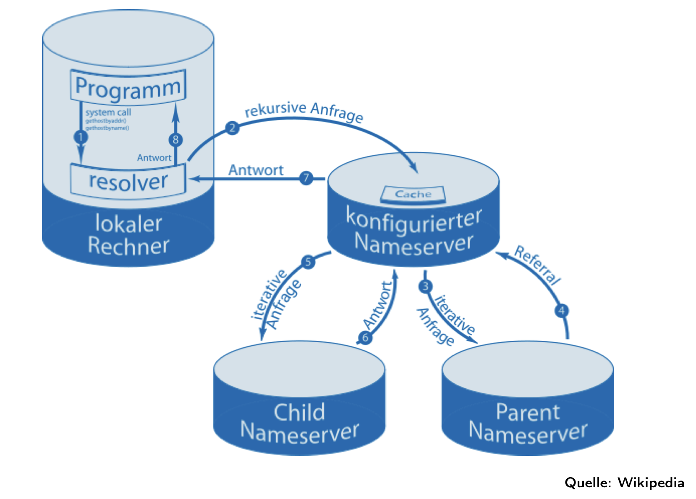
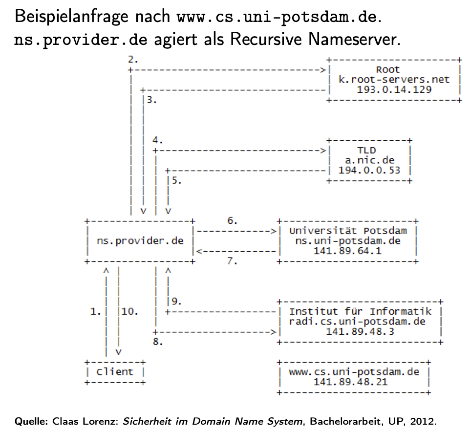
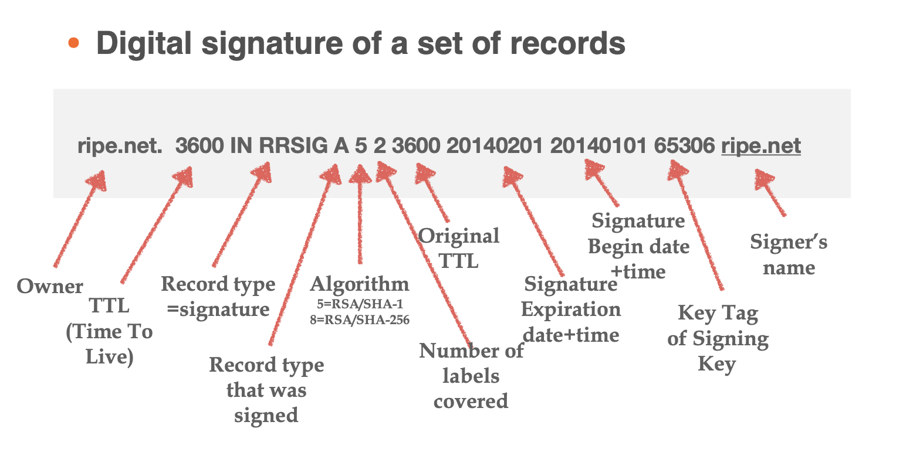
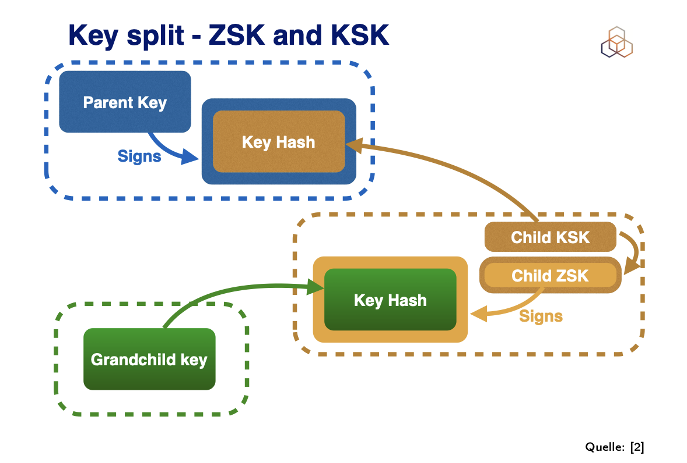
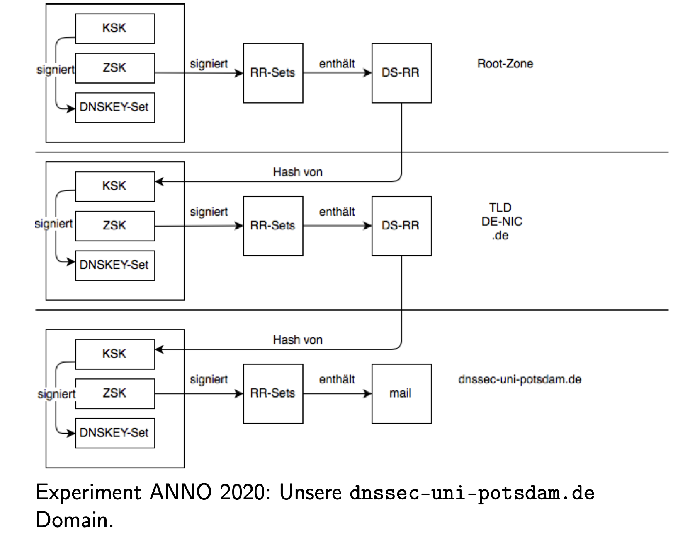

# DNS  
When we open a website, send an email, or run a command like `ping`, our systems rarely deal directly with raw IP addresses. Instead, they rely on the Domain Name System (DNS), often called the "central nervous system of the Internet." To understand how DNS operates, we need to look at its structure, the actors involved, and how the resolution process unfolds step by step.

## The Position of DNS in the Network Stack

DNS is an **Application Layer (Layer 7)** protocol. It translates human-friendly names like `www.uni-potsdam.de` into machine-usable IP addresses such as `141.89.239.5`. To move DNS queries and responses across the network, the protocol uses:

* **UDP port 53** by default, chosen for speed and simplicity since most queries fit into a single request/response.
* **TCP port 53** for cases where responses are too large (e.g., DNSSEC) or where reliability is required (zone transfers).

Above DNS lies the **application logic** (your browser, email client, etc.), while beneath it are IP for routing (Layer 3) and Ethernet/Wi-Fi at the link layer (Layer 2).

## Why a Dedicated Port?

Every Internet service needs a fixed identifier so clients know where to connect. For DNS, the Internet Assigned Numbers Authority (IANA) reserved **port 53**. This standardization ensures efficiency (no negotiation needed) and allows firewalls or intrusion detection systems to monitor DNS traffic separately from web, mail, or SSH traffic:

1. Your stub resolver (laptop library) → recursive resolver (router):
`src=192.168.10.x:49532 → dst=192.168.10.1:53`
    - DNS query for www.amazon.com on UDP/53.
    - Firewalls/IDS can log this: “user looked up amazon.com.”
2. Recursive resolver (router) → root → .com → Amazon’s **authoritative server** – the ones that host the **zone files** that are managed by the domain owner and distributed across their master and slave authoritative servers and are seperate infrastructures from the **web servers** (machines serving the actual website content):
`public IP of router src =84.xx.xx.xx:53011 → dst=205.251.193.182:53`
    - Doesn’t deliver webpages, products, or HTTPS. It only hands out DNS records: IP 52.95.xx.xx.
3. Your browser → TCP handshake with 52.95.xx.xx on port 443:
    - HTTPS connection established.
    - Now you’re browsing products.
    - **This traffic is completely separate from DNS.**

## The Actors in DNS

DNS is distributed and hierarchical. Different components cooperate to resolve a query:

* **Stub Resolver**: This is a small library (Code on your OS) in your operating system. When an application asks for `www.uni-potsdam.de`, the stub resolver prepares the query and sends it to a designated recursive server. It never resolves domains fully by itself.

* **Recursive Resolver**: Often operated by your ISP, your router, or a public provider like Google (8.8.8.8). It takes full responsibility for resolution. If the answer isn’t cached, it queries the global DNS hierarchy until the final IP address is found.

* **Iterative Nameserver**: Root servers and **top-level domain** (TLD) servers are iterative. They do not follow the whole chain. Instead, they reply with referrals, pointing the resolver to the next step. Example: a root server does not know the IP of `uni-potsdam.de`, but it can tell you where to find the `.de` servers.

* **Authoritative Servers**: These hold the actual records of a domain. Among them:

  * **Master (Primary)**: Stores the original, editable zone file. Domain administrators make changes here.
  * **Slave (Secondary)**: Maintains a read-only copy of the master’s zone via zone transfers, ensuring redundancy and load balancing.

* **Parent and Child**: Terms that describe relationships in the DNS hierarchy. The `.de` TLD acts as parent, delegating authority to the child zone `uni-potsdam.de`.
## Iterative vs. Recursive in Practice

The terms *iterative* and *recursive* mirror programming concepts:

* **Iterative resolution**: Each server gives only a partial answer, and the client must keep asking the next one. Root → TLD → authoritative, step by step.
* **Recursive resolution**: The recursive server does the entire chain on behalf of the client, diving deeper until the base case (the IP address) is found.

## Walking Through a Real Example

Let’s trace `www.uni-potsdam.de`:

1. A user types the name into a browser. The application calls the **stub resolver** in the OS.
2. The stub resolver sends the query to `192.168.10.1` (seen in a `dig` output). This is the router, acting as a **recursive resolver**.
3. If the router’s cache lacks the answer, it contacts the global hierarchy:

   * **Root server** (iterative): “I don’t know the host, ask the `.de` TLD servers.”
   * **`.de` TLD server** (parent): “I delegate `uni-potsdam.de` to these authoritative servers.”
   * **Authoritative servers of `uni-potsdam.de`** (child): “The record for `www.uni-potsdam.de` is 141.89.239.5.”
   * Behind the scenes, the authoritative role could be fulfilled by a **master** server (source of truth) and mirrored on **slaves** for redundancy.
4. The recursive resolver caches the response and sends the final IP back to the stub resolver, which gives it to the browser.

At this point, DNS has done its job. The browser now knows where to connect.

## Ping vs. DNS — Why They Behave Differently

When trying `ping www.uni-potsdam.de`, the DNS process succeeded, returning the IP `141.89.239.5`. However, the ping failed with timeouts. Why? Because `ping` uses ICMP at the network layer, and many servers block ICMP requests for security reasons. This does not mean DNS or the service is broken. A `curl -I https://www.uni-potsdam.de` test confirmed the site is alive: it returned an HTTP 301 redirect, proving that DNS resolution, TCP connection on port 443, TLS negotiation, and HTTP communication all succeeded.

## Practical Tools for Verification

* **Check configured recursive servers (stub → recursive relationship):**

  * macOS/Linux: `cat /etc/resolv.conf`
  * Windows: `ipconfig /all`

* **Query DNS directly:**

  ```bash
  dig www.uni-potsdam.de
  ```

* **Test actual application reachability:**

  ```bash
  curl -I https://www.uni-potsdam.de
  ```
## Key Takeaways

* DNS operates at the application layer, using port 53 (UDP/TCP).
* The stub resolver inside your OS never resolves domains fully; it forwards to a recursive server.
* Recursive servers handle the complete chain of resolution, consulting iterative servers (root, TLDs).
* Master vs. Slave distinguishes editable vs. read-only authoritative servers.
* Parent vs. Child expresses the hierarchical delegation of domains.
* Successful DNS resolution does not guarantee ICMP ping will work — they are different protocols at different layers.

# DNS Resolution and Resource Records

When we explored the actors in DNS, we saw how stub resolvers, recursive resolvers, and authoritative servers cooperate to answer queries. Now let’s look at **how a full resolution works in practice** and the **data structures (Resource Records)** that make it possible.

## 1. The Resolution Path

Suppose a client wants to resolve `www.cs.uni-potsdam.de`. The steps unfold like this:

1. **Client → Recursive Resolver**
   The client asks its configured recursive resolver (e.g., `ns.provider.de`): *“What is the IP of `www.cs.uni-potsdam.de`?”*

2. **Recursive Resolver → Root**
   The recursive asks a root server: *“Who knows about `.de`?”*

3. **Root → Recursive Resolver**
   The root responds: *“Ask the `.de` TLD server at `a.nic.de (194.0.0.53)`.”*

4. **Recursive Resolver → `.de` TLD server**
   *“Who knows about `uni-potsdam.de`?”*

5. **TLD server → Recursive Resolver**
   *“The authoritative server is `ns.uni-potsdam.de (141.89.64.1)`.”*

6. **Recursive Resolver → Authoritative for `uni-potsdam.de`**
   *“Where is `cs.uni-potsdam.de`?”*

7. **Authoritative → Recursive Resolver**
   *“That’s delegated further: ask `radi.cs.uni-potsdam.de (141.89.48.3)`.”*

8. **Recursive Resolver → Departmental Authoritative**
   *“Where is `www.cs.uni-potsdam.de`?”*

9. **Departmental Authoritative → Recursive Resolver**
   *“Here: `www.cs.uni-potsdam.de = 141.89.48.21`.”*

10. **Recursive Resolver → Client**
    Final answer: `141.89.48.21`.

📍 Notice: The **client only asked once**. The recursive resolver did all the chasing.

## 2. Resource Records (RRs)

Every DNS answer is built from **Resource Records**, stored in zone files on authoritative servers. Their general format:

```
<name> [<ttl>] [<class>] <type> <rdata>
```

* **name**: the domain (e.g., `www.cs.uni-potsdam.de.`)
* **ttl**: how long resolvers may cache the record
* **class**: usually `IN` (Internet)
* **type**: record type (A, AAAA, MX, NS, SOA, …)
* **rdata**: the actual data (IP, hostname, metadata, etc.)

### Common Record Types

#### A (Address Record)

```
www.uni-potsdam.de.   3600   IN   A   141.89.48.21
```

* Maps a hostname to an IPv4 address.
* Used for web access, SSH, or any IPv4-based service.

#### AAAA (IPv6 Address)

```
www.uni-potsdam.de.   3600   IN   AAAA   2001:638:904:ffff::21
```

* Maps hostname to an IPv6 address.
* Preferred if the client and network support IPv6.

#### NS (Nameserver)

```
uni-potsdam.de.   86400   IN   NS   ns1.uni-potsdam.de.
uni-potsdam.de.   86400   IN   NS   ns2.uni-potsdam.de.
```

* Declares which nameservers are authoritative for the domain.
* These may be a **master (primary)** and **slaves (secondaries)**, but the NS record itself does not show the difference — it only lists them.

#### SOA (Start of Authority)

```
uni-potsdam.de.   86400   IN   SOA   ns1.uni-potsdam.de. admin.uni-potsdam.de. (
    2025093001 ; serial
    7200       ; refresh (2 hours)
    3600       ; retry (1 hour)
    1209600    ; expire (2 weeks)
    86400      ; minimum TTL (1 day)
)
```

* Identifies the primary nameserver and provides administrative details.
* Contains the **serial number** used by slaves to detect updates, and timers for refresh/retry/expire.

#### MX (Mail Exchange)

```
uni-potsdam.de.   3600   IN   MX   10 mail.uni-potsdam.de.
uni-potsdam.de.   3600   IN   MX   20 backupmail.uni-potsdam.de.
```

* Directs where email for the domain should be delivered.
* Priority values (10, 20) define the order: lowest number first.
* Sending servers look up MX records first, then resolve each MX hostname with A/AAAA to get IP addresses, and finally connect to those on **SMTP port 25**.

**Tangible example:** Sending an email to `student@uni-potsdam.de`:

1. The sender’s mail server queries MX for `uni-potsdam.de`.
2. DNS returns `mail.uni-potsdam.de (priority 10)` and `backupmail.uni-potsdam.de (priority 20)`.
3. The sender resolves those hostnames to IPs.
4. It tries the priority 10 server first; if unreachable, it falls back to 20.

This adds one extra **indirection layer** compared to a web lookup:

```
Domain → MX record(s) → Hostname(s) → A/AAAA → IP(s)
```

## 3. Key Insights

* Resolution involves multiple hops (root → TLD → authoritative).
* The client’s stub resolver only asks once; the recursive resolver does the chasing.
* Resource Records are the atomic pieces of DNS data.
* **A/AAAA** = hosts. **NS** = delegation. **SOA** = zone authority. **MX** = email routing.
* MX records add an extra indirection step: first find the mail servers, then find their IPs, then deliver via SMTP.
* Master/Slave distinction applies only to authoritative servers managing the zone file, not to normal client queries.

# DNSSEC End-to-End Example: [www.uni-potsdam.de](http://www.uni-potsdam.de)

Why DNSSEC?

The problem: **DNS spoofing / cache poisoning**

An attacker pretends to be an authoritative server.

They send **forged responses**, tricking your resolver into caching wrong data.

Example: Instead of bank.com → 192.0.2.10, the attacker injects bank.com → 6.6.6.6.

Your browser then connects to the attacker’s server, thinking it’s the real bank.

This is a **masquerade attack** (“Maskerade-Angriff”) → attacker makes their machine look like some other server.

## 2. Starting Point: What we want

We want to know: **What is the IPv4 address (A record) of `www.uni-potsdam.de`?**

DNSSEC means we will not just accept an answer. We will verify it cryptographically.

```
Root (.)
 └── Top-Level Domain (TLD): .de
      └── Second-Level Domain: uni-potsdam.de
           └── Subdomain/Host: www.uni-potsdam.de
```

* The **Root zone** is at the very top. It knows about every TLD (.com, .de, .org …).
* The **.de zone** is below the root. It knows about every domain that ends in .de.
* The **uni-potsdam.de zone** is below .de. It knows about its own hosts, such as `www`, `mail`, `cs`.

Each of these zones has a **zone file** that contains Resource Records (RRs). Zone files are served by **authoritative servers**.

## 3. Root Zone Data

The resolver (the validating recursive resolver, not your stub) starts at the root. It has one piece of trust hardcoded: the **root’s public Key Signing Key (KSK)**.

Root zone contains:

```
de.   IN NS a.nic.de.
de.   IN NS f.nic.de.
de.   IN DS  36781 13 2 ABCDEF...
de.   IN RRSIG DS <signature-by-root>
```

Meaning:

* **NS records**: the names of the authoritative servers for .de.
* **DS record**: a hash of the .de zone’s KSK.
* **RRSIG**: a digital signature over the DS record, created with the root’s private key.

**Validation Step:**

* Resolver uses the root’s **public key** (built-in trust anchor).
* It checks the RRSIG signature over the DS record.
* If valid: the DS for .de is authentic.

## 4. .de Zone Data

Now the resolver goes to a .de authoritative server (for example `a.nic.de`). It asks for the DNSKEYs of the .de zone.

The .de zone returns:

```
de. IN DNSKEY 257 3 13 <KSK-public>
de. IN DNSKEY 256 3 13 <ZSK-public>
de. IN RRSIG DNSKEY <signature-by-KSK>
```

**Validation Step:**

* Resolver takes the DS from the root zone.
* It computes a hash of the .de KSK public key.
* If this matches the DS, the .de KSK is authentic.
* Then it uses that KSK to verify the RRSIG over the DNSKEY RRset.
* If valid: all of .de’s DNSKEYs are trusted.

## 5. Delegation to uni-potsdam.de

The resolver asks .de: “Who is responsible for uni-potsdam.de?”

.de zone responds with:

```
uni-potsdam.de. IN NS ns1.uni-potsdam.de.
uni-potsdam.de. IN NS ns2.uni-potsdam.de.
uni-potsdam.de. IN DS 12345 13 2 A1B2C3...
uni-potsdam.de. IN RRSIG DS <signature-by-.de>
```

**Validation Step:**

* Resolver uses the trusted .de DNSKEYs.
* It checks the RRSIG over the DS for uni-potsdam.de.
* If valid: the DS for uni-potsdam.de is authentic.

## 6. uni-potsdam.de Zone Data

The resolver now queries `ns1.uni-potsdam.de` for its DNSKEYs.

It returns:

```
uni-potsdam.de. IN DNSKEY 257 3 13 <KSK-public>
uni-potsdam.de. IN DNSKEY 256 3 13 <ZSK-public>
uni-potsdam.de. IN RRSIG DNSKEY <signature-by-KSK>
```

**Validation Step:**

* Resolver hashes the KSK.
* It compares that hash with the DS it got from .de.
* If they match: the uni-potsdam.de KSK is authentic.
* Resolver then uses the KSK to verify the RRSIG over the DNSKEY RRset.
* If valid: all DNSKEYs for uni-potsdam.de are trusted.

## 7. The Actual A Record

Finally, the resolver asks ns1/ns2: “What is the A record for [www.uni-potsdam.de?”](http://www.uni-potsdam.de?”)

The server responds:

```
www.uni-potsdam.de. IN A 141.89.48.21
www.uni-potsdam.de. IN RRSIG A <signature-by-ZSK>
```

**Validation Step:**

* Resolver identifies which DNSKEY (ZSK) signed this record (key tag in the RRSIG).
* It uses the ZSK to verify the RRSIG over the A record.
* If the signature is valid: the A record is authentic.

Result: The resolver returns **141.89.48.21** to the client with the **AD (Authenticated Data) flag** set.

* On your macOS laptop, the stub resolver configuration shows:

  * `nameserver 192.168.10.1` (your Fritz!Box router)
  * IPv6 alternatives for the same router.
* Your stub does not validate DNSSEC. It only forwards queries.
* The Fritz!Box (or your ISP’s resolver upstream) is the one that may perform DNSSEC validation.
* The root trust anchor (root KSK) lives inside that recursive resolver software (not inside your stub).
* Common recursive resolver software: **BIND, Unbound, Knot Resolver, PowerDNS Recursor**.

## 9. Root servers and anycast

* The root zone is served by 13 logical root server names (`a.root-servers.net` to `m.root-servers.net`).
* Each of these names corresponds to **hundreds of physical servers** deployed worldwide.
* They use **anycast routing**: the same IP address is advertised in multiple locations. Your packets are routed to the nearest instance.
* All of them serve the exact same root zone data, kept in sync.

## 10. Complete Validation Chain (Expanded)

```
Built-in root DNSKEY (trust anchor)
   ↓ verify signature
Root’s RRSIG over DS(.de)
   ↓ DS(.de) is authentic
.de DNSKEYs
   ↓ verify signature
.de’s RRSIG over DS(uni-potsdam.de)
   ↓ DS(uni-potsdam.de) is authentic
uni-potsdam.de DNSKEYs
   ↓ verify signature
RRSIG over A(www.uni-potsdam.de)
   ↓ A record is authentic
```

At every level, the resolver does not just take records. It checks signatures against trusted keys and compares DS digests with child DNSKEYs.

## RRSIG: Digital Signature of a Zone

An **RRSIG** is a *digital signature over an RRset*.  
An RRset is all records of the same type and name (e.g., all A records for `ripe.net`).



Field-by-field:

- **Owner name**: `ripe.net.` → the domain whose RRset is signed.  
- **TTL**: `3600` → how long the signature can be cached.  
- **Class**: `IN` → Internet class.  
- **Type**: `RRSIG`.  
- **Type covered**: `A` → says this covers the A-record RRset for `ripe.net.`  
- **Algorithm**: `5` (RSA/SHA-1). Other codes: `8` = RSA/SHA-256, `13` = ECDSA P-256 with SHA-256, etc.  
- **Labels**: `2` → number of labels in `ripe.net.` (ripe + net). Used for wildcard logic.  
- **Original TTL**: `3600` → the TTL of the RRset when it was signed.  
- **Signature expiration**: `20140201` → not valid after this UTC date/time.  
- **Signature inception**: `20140101` → not valid before this UTC date/time.  
- **Key tag**: `65306` → short ID that points to the right DNSKEY.  
- **Signer’s name**: `ripe.net.` → which zone’s DNSKEY signed it.  
- **Signature**: `<signature>` → base64 cryptographic signature bytes.

Key point: **If the RRset changes, a new RRSIG must be generated.**

## Early Design and Its Problem

- RFC 2535 (1999) design:  
  - Parent signs the child’s **public key**.  
  - That parent’s signature is stored *inside the child zone*.  

- Problem 1: If parent zone (e.g., `.de`) doesn’t use DNSSEC, children (e.g., `uni-potsdam.de`) can’t benefit.  
- Problem 2: If the parent re-keys, it must update signatures in *every* child zone. For `.com` with tens of millions of children, this is impossible.

Conclusion: **This design did not scale.**


## The Solution: Split into KSK and ZSK

Re-design (2005, RFC 4033–4035, operationalized in RFC 4641):

- Two keys per zone:
  - **KSK (Key Signing Key)**:  
    - Signs only the DNSKEY RRset.  
    - Hash of KSK is placed in the parent as a **DS (Delegation Signer)** record.  
    - Rarely changes (maybe yearly).  
  - **ZSK (Zone Signing Key)**:  
    - Signs all “normal” records (A, MX, NS, SOA, …).  
    - Rotated often (e.g., monthly).  

- Parent no longer signs child’s DNSKEY directly.  
- Parent publishes a **DS record** that contains a hash of the child’s KSK.  
- Validator compares DS (from parent) with the child’s DNSKEY.

Result:  
- Parent can re-key without touching children.  
- Child can roll ZSKs without parent involvement.  
- Child only coordinates with parent when KSK is changed.

## Example: `dnssec-uni-potsdam.de`

Three layers:

**Root zone**
- Publishes DNSKEY (KSK + ZSK).  
- Publishes DS for `.de`.  
- Signs DS with root’s private key.  

**.de (TLD zone)**
- Publishes DNSKEY (KSK + ZSK).  
- Publishes DS for `dnssec-uni-potsdam.de`.  
- Signs DS with `.de`’s private key.  

**Child zone: dnssec-uni-potsdam.de**
- Publishes DNSKEY (KSK + ZSK).  
- Signs DNSKEY with its private KSK → RRSIG(DNSKEY).  
- Signs A, MX, NS, SOA, … with its private ZSK → RRSIG(A), RRSIG(MX), etc.  

**Validation steps:**
1. Start with root’s public KSK (trust anchor).  
2. Verify RRSIG over DS(.de).  
3. Compare DS(.de) to DNSKEY(.de).  
4. Verify RRSIG over DS(dnssec-uni-potsdam.de).  
5. Compare DS(child) to DNSKEY(child).  
6. Use child DNSKEY (ZSK) to verify RRSIG over data (A, MX, …). 

## Why DNSSEC adds overhead

1. **Zone size increases**
   - Every Resource Record Set (RRset) must have an accompanying **RRSIG**.
   - Zone files therefore contain many more records compared to plain DNS.

2. **Answer packets are larger**
   - Responses now include both the requested data and its **digital signature**.
   - DNSSEC packets often exceed the 512-byte DNS-over-UDP legacy limit.
   - This requires **EDNS0 extensions** to allow bigger UDP payloads, or fallback to TCP (port 53).

3. **Validation requires computation**
   - Recursive resolvers must check every signature against the correct DNSKEY.
   - This introduces CPU overhead (cryptographic verification).
   - Sometimes extra queries are needed (fetch DNSKEY + DS records).

## Measured results (University of Potsdam, 2014)

Study: *Auswirkung des Einsatzes von DNSSEC auf die Performance von rekursiven Nameservern*  
Scenario: DNS operation **without caching** (worst case, every query validated fresh).

| Metric                          | DNS  | DNSSEC |
|--------------------------------|------|--------|
| Average packet size [bytes]    | 82   | 250    |
| **Median packet size [bytes]** | 70   | 81     |
| Minimum packet size [bytes]    | 28   | 28     |
| Maximum packet size [bytes]    | 1125 | 1472   |
| Median response time [ms]      | 20   | 61     |

**Interpretation:**
- Average packet size ~3× bigger (82 → 250 bytes).
- Median packet size grows modestly (70 → 81 bytes).
- Maximum packet size increases significantly (1125 → 1472).
- Median response time ~3× longer (20ms → 61ms), due to validation and larger transfers.

⚠️ Note: these numbers are for *no caching*.  
In reality, recursive resolvers cache DNSKEYs and signatures, so overhead is less visible to end-users.

## Cryptographic key lengths and effect

- Originally: DNSSEC used **RSA 1024-bit keys** (for both KSK and ZSK).
- Around 2016: many operators migrated to **RSA 2048-bit ZSKs** for stronger security.
- Example: Verisign root zone migration (2016):
  - Root Zone ZSK increased from 1024 → 2048 bits.
  - Zone file size increased from **1.6 MB → 2.1 MB**.
  - Reason: longer keys produce larger digital signatures.

## Takeaways

- **DNSSEC costs bandwidth and CPU**: bigger packets, more data to validate, more work for resolvers.
- **Caching mitigates the cost**: DNSKEYs and signatures are reused for many queries.
- **Algorithm choice matters**: newer elliptic curve algorithms (ECDSA, Ed25519) provide strong security with much smaller signatures, reducing overhead compared to RSA.

## Key Rollover

### Overview
**Key rollover** refers to the process of changing cryptographic keys (ZSK or KSK) used in DNSSEC.

### Risks and Challenges
- **Incorrect rollover consequences:**
  - Resolvers may reject signatures
  - Domains can become unreachable
  - Common mistake: Not publishing both old and new keys during transition

### Current State
- **Tool Support**: Mature solutions available
  - BIND
  - Unbound
  - Knot
  - OpenDNSSEC

- **Operational Practice:**
  - **ZSKs**: Rolled frequently (e.g., monthly)
  - **KSKs**: Rolled infrequently (e.g., yearly) - requires parent zone DS record updates
  - Controlled experiments (e.g., `dnssec-uni-potsdam.de`) demonstrate smooth rollover capability

- **Root KSK Rollovers:**
  - Successfully completed **59 times** globally
  - Demonstrates rollover manageability at scale

## Root Signing Ceremony

### The Root Zone Challenge
**Problem**: The root zone has no parent to vouch for it via DS records.  
**Solution**: The Root Signing Ceremony operated by ICANN.

### Purpose
Manage the root KSK (Key Signing Key) in a transparent, globally trusted manner.

### Process
1. **Location**: Highly secure facilities
   - El Segundo, CA
   - Culpeper, VA

2. **Participants**: Trusted Community Representatives
   - Multiple keyholders with smartcards or key shares
   
3. **Security Infrastructure**:
   - Hardware Security Modules (HSMs) store root KSK private key
   
4. **Key Operations**:
   - KSK signs root's DNSKEY RRset
   - Produces RRSIG(DNSKEY)
   - Signature published in root zone for resolver validation

### Transparency Measures
- Every ceremony is filmed and published
- All documents logged
- Actions witnessed by multiple parties
- Materials sealed post-ceremony

### Verification
```bash
dig . DNSKEY +dnssec
```
Shows root DNSKEYs and RRSIG(DNSKEY) from the ceremony.

## DANE: DNS-based Authentication of Named Entities

### Motivation (RFC 6698, 2012)
**Current TLS/PKI Weaknesses:**
- Browsers trust hundreds of Certificate Authorities (CAs)
- Any compromised CA can issue fake certificates for any domain
- Example: Attacker obtains fraudulent cert for `bank.com`

**DANE Solution:**
- Move key-name binding into DNS
- Secure with DNSSEC
- Domain owners control their own key associations

### Core Concept
- Use DNSSEC to publish TLS public keys or hashes
- Keys tied directly to domain names
- Cryptographic protection via DNSSEC signatures

### Usage Models

#### 1. Alternative to PKI
- DNSSEC distributes server keys directly
- No need for preinstalled root CAs
- No external certificate requirements
- Name resolution delivers the trusted key

#### 2. Complement to PKI
- DNSSEC distributes signed hash of TLS certificate's key
- Clients verify: Does server certificate match DNSSEC-signed hash?
- Prevents acceptance of fraudulent certificates

### TLSA Record Implementation

#### Record Format (RFC 6698, RFC 7218)
```
_443._tcp.example.com. IN TLSA [certificate_usage] [selector] [matching_type] [certificate_data]
```

#### Example
```
_443._tcp.example.com. IN TLSA 3 1 1 [hash_of_public_key]
```
Specifies the expected certificate or public key for TLS on port 443 (HTTPS) of example.com.

#### Features
- Stored in DNS
- Protected by DNSSEC signatures
- Domain admins specify valid TLS keys for their domain

### Adoption Status

#### ✅ Success Areas
- **Email (SMTP with STARTTLS)**: Widely adopted
  - Mail servers check TLSA records
  - Validates certificates before trust establishment
  
- **OpenPGP**: RFC 7929 defines PGP key publication via DANE

#### ❌ Limited Adoption
- **Web Browsers**: No major browser support
  - Chrome, Firefox, Safari continue CA-based PKI reliance
  - Browser vendors resistant to DANE implementation

## Summary

### Key Takeaways

1. **Key Rollover**
   - Manageable with proper tools and procedures
   - Root KSK successfully rolled 59+ times
   - ZSK: frequent rotation, KSK: infrequent rotation

2. **Root Signing Ceremony**
   - Solves the "no parent" problem for root zone
   - Highly controlled, transparent, audited process
   - Foundation of global DNSSEC trust

3. **DANE Implementation**
   - **Purpose**: Bind names to TLS keys via DNSSEC
   - **Approaches**: 
     - Replace PKI (direct key distribution)
     - Supplement PKI (signed certificate hashes)
   - **Mechanism**: TLSA records in DNS
   - **Adoption**: Strong in email, weak in browsers
