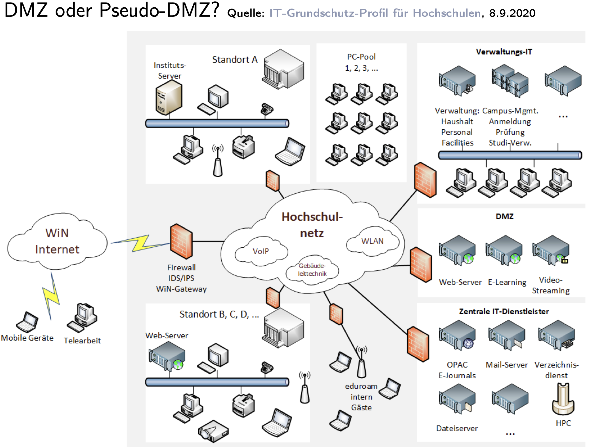

# Firewalls

## 1. Definition (vgl. Definition 75)
A **firewall** (Brandmauer) is a hardware/software system that connects two networks and ensures that **all traffic between them passes through it**.  
It enforces a **security strategy** by:

- Filtering packets (mainly **Layer 3 & 4**, sometimes L2 or DPI at L7).
- Enforcing **access restrictions** (who/what can communicate).
- Performing **authentication** (if required).
- Supporting **auditing & logging** (detection, forensics).

Only packets that satisfy the defined strategy are forwarded.

## 2. Firewall Concept – Building Blocks
A firewall deployment always involves four pillars:

1. **Security Strategy / Policies**  
   - What is protected? Against which threats?
   - Example: allow outbound HTTPS, deny inbound except VPN.

2. **Filter Rules & Mechanisms**  
   - **Stateless filters**: match IPs, ports, protocols.  
   - **Stateful filters**: track TCP sessions.  
   - **DPI / Application inspection**: scan payloads, detect malware.

3. **Protokollierung & Auditing**  
   - Record allowed, denied, and suspicious traffic.  
   - Enables attack detection and forensic analysis.

4. **Management**  
   - Define & control filter rules.  
   - Apply updates, patches, signatures.  
   - Create & restore backups of configuration.

## 3. Firewall Strategy – Key Questions
When designing a firewall strategy, the following aspects must be clarified:

1. **Schutzbedarf** – What protection needs are required?  
2. **Struktur des Netzes / Topologie** – What does the existing network topology look like?  
3. **Kommunikationsprofil** – Which services, users, and flows are required?  
4. **Informationen verdecken** – What should the firewall hide (e.g., NAT, private IPs)?  
5. **Zugänge** – Which access paths are required (ISP, redundancy, IPv4/IPv6)?  
6. **Datendurchsatz** – What throughput is expected?  
7. **Administration** – Who manages the firewall, rules, and rights?  
8. **Protokollauswertung** – Who analyzes logs and reacts to attacks?  
9. **Revision** – Who is responsible for compliance/audit checks?  
10. **Verschlüsselung** – Which data must be specially protected by encryption?  
11. **Schadsoftware-Schutz** – How are end-users protected from malware (central, decentralized, spam filter)?  
12. **Ausnahmesituationen** – How are exceptions or emergencies handled?  
13. **Backups** – Who performs backups, and how are they carried out?  
14. **Verbindungswünsche** – How are new connection/service requests treated?  
15. **Integrität** – How is data integrity ensured on systems?  
16. **Aktualität** – How are firewall software, OS, and admin knowledge kept up to date?

## Firewall Classification

### Mechanisms (Filter Philosophy)
- **Optimistischer Ansatz (optimistic approach):**  
  - Default = allow.  
  - Only *specified* traffic is blocked.  
  - Example: "Block SMTP spam, allow everything else."  
  - Risk: Easier misconfigurations, larger attack surface.  
  - Security principle: **Default-allow**.

- **Konservativer Ansatz (conservative approach):**  
  - Default = deny.  
  - Only *specified* traffic is allowed.  
  - Example: "Only allow HTTPS outbound, deny all other traffic."  
  - Stronger security posture, but more management overhead.  
  - Security principle: **Default-deny**.

### Protocol Layer Perspective
- **Vermittlungs- und Transportschicht (Network + Transport, L3/L4):**  
  - IP addresses, subnets, ports, TCP/UDP.  
  - Example rule: *Allow TCP 443 to 192.0.2.10, deny others*.  
  - Efficient, but no deep knowledge of the application.

- **Anwendungsschicht (Application Layer, L7):**  
  - Deep Packet Inspection (DPI), protocol awareness.  
  - Understands HTTP, SMTP, DNS, etc.  
  - Example: *Block HTTP requests with suspicious payloads (SQL injection patterns)*.  
  - More powerful, but CPU-intensive and affected by encryption (TLS/QUIC).

### Firewall Architectures
- **Zentrale Firewall (centralized firewall):**  
  - One main firewall at the network boundary (e.g., internet gateway – can be in the same box as the NAT).  
  - Easier to manage, but creates a bottleneck and single point of failure.  
  - Common in smaller organizations or simple topologies.

- **Verteilte Firewalls (distributed firewalls):**  
  - Multiple firewalls at different points (e.g., internal VLANs, data center segments).  
  - In modern environments: endpoint firewalls, cloud security groups, microsegmentation.  
  - Higher complexity but greater security granularity.

### Real-World Scale Example (University of Potsdam, 2014)
- **Active hosts (Endsysteme inkl. Telefone, Access Points, WLAN Clients):** ~18,000.  
- **Firewall ruleset (Internet-facing instance):** ~1,000 rules.  

📌 Insight:  
Even for ~18k endpoints, the number of **firewall rules** was only ~1k, showing:  
- Rules must be **abstract and scalable** (cover ranges, not individual hosts).  
- Rule management is a major administrative challenge (avoid redundancy, shadow rules).  

## Firewall Architectures
### One firewall system with multiple network interfaces
When we speak of a **firewall architecture**, we mean how the firewall is positioned in the network and how it connects to different zones.  

The simplest design is **one firewall system with multiple network interfaces**. Imagine a single firewall box (could be a hardware appliance like Cisco ASA, FortiGate, or even pfSense). It has several **network interfaces** — these are the “doors” that connect it to different networks(e.g outside, inside). Each interface has its own MAC address, IP configuration, and routing entry, and the firewall knows exactly which packet arrived on which interface.

Typical roles of the interfaces in this architecture:
- **LAN interface (Local Area Network):** connects to the internal, trusted network (e.g., your company’s PCs, your home laptops).  
- **WAN interface (Wide Area Network):** connects outward to the Internet or an ISP. This is often called the **WAN uplink**, because it is the physical link that carries your traffic “upstream” into the provider’s backbone.  
- **DMZ interface (Demilitarized Zone):** connects to semi-trusted systems like public web or mail servers that are exposed to the Internet.  

To make this concrete: when you want to connect to Google from your laptop, Chrome opens a TCP connection to port 443 (HTTPS). Your laptop checks its routing table: “I don’t know this 142.250.185.36 address — it’s outside my local network.” So → send it to my default gateway = 192.168.1.1 (your router), your packet leaves through your laptop’s Wi-Fi **network interface**, travels to your default gateway (the firewall/router). The firewall receives it on its **LAN interface**, checks its rules, applies **NAT** (translating your private IP 192.168.x.x into the firewall’s public IP), and then forwards it out through the **WAN interface** to the ISP. Google responds back to the firewall’s WAN IP, and the firewall rewrites it to your private address before sending it back via the LAN interface to your laptop.  

This is why interfaces are crucial: without multiple interfaces, the firewall couldn’t distinguish between “inside” and “outside,” or enforce different rules depending on traffic direction.  

#### Advantages (of one firewall system with multiple network interfaces)
- **Preiswert (cost-effective):** one device with several interfaces is cheaper and simpler to manage than multiple separate firewalls.  
- **Centralized management:** only one ruleset and one configuration to maintain.  

#### Disadvantages
- Suitable only for **niedrigen bis mittleren Schutzbedarf (low to medium protection needs)**.  
- It creates a **single point of failure** — if this one firewall is compromised or misconfigured, the attacker has direct paths to LAN, DMZ, and Internet.  
- Security principle violated: no **defense-in-depth**. With only one protective wall, there’s just one “Hürde” (hurdle) for attackers.  

To understand *defense-in-depth*, imagine layering:  
- Outer firewall blocks all inbound except HTTPS.  
- A second internal firewall separates LAN from DMZ.  
- Host firewalls on servers allow only specific application traffic.  
If one layer fails, the others still stand. A single multi-interface firewall lacks these redundant layers.  

#### Use Cases
- **Small and medium businesses.**  
- **University departments.**  
- **Home labs or SOHO setups.**  
Where budgets and complexity must stay low, a single firewall with multiple interfaces is often chosen, even if it sacrifices depth of protection.  
---
### Demilitarized Zone (DMZ)

#### What is a DMZ?
The term **DMZ (Demilitarized Zone)** comes from the military: a buffer zone between two hostile sides.  
In networking, it is a **separate subnet** for servers that must be reachable from the Internet, while protecting the internal LAN.  

- Goal: if a web or mail server is compromised, the attacker is **confined to the DMZ** and cannot directly access the LAN.  
- Quote by Bob Toxen:  
  > "Anyone inside it will likely get shot."  
  Servers in the DMZ are always at risk but that risk is isolated.  

#### Architecture Example: Screened Subnet with Application Gateway

This architecture shows a **three-zone setup** protected by two packet filters and an application gateway:

1. **Internet (untrusted zone):** all external requests enter here.  
   - First **packet filter** checks and limits incoming traffic.  

2. **DMZ (buffer zone):** contains public-facing systems.  
   - **Information server**: a service like web or mail that must be reachable.  
   - **Single-homed application gateway**: a proxy/firewall at Layer 7.  
     - "Single-homed" means it has only one interface, located in the DMZ.  
     - It mediates requests instead of allowing direct LAN connections (e.g., accepts a mail request and relays it inside).  
   - The DMZ is deliberately isolated: if a public server is hacked, the attacker is trapped here.  

3. **Internal network (trusted LAN):** workstations and database server.  
   - Protected by a second **packet filter**.  
   - Only carefully defined traffic from the DMZ or proxy can enter.  

**Key idea:** traffic from Internet → must go through outer filter → DMZ/proxy → inner filter → LAN.  
There is no direct Internet-to-LAN path. This creates **defense-in-depth** and limits the blast radius if a DMZ server is compromised.

#### Why a DMZ?
- Without DMZ: web servers would sit in the LAN → if hacked, attackers reach internal assets directly.  
- With DMZ: attackers breaking into a DMZ server still face another firewall barrier before touching LAN systems.  
- Implements **defense-in-depth**: multiple hurdles instead of one.

#### University Example – Reference Network Design

This shows a **real-world campus design** with multiple zones:

- **WiN Internet:** German national research & education backbone (DFN-WiN).  
- **Firewall / IDS/IPS Gateway:** first line of defense against external traffic.  

### Campus Core (Hochschulnetz)
- Central backbone for the university: routes between buildings, connects WLAN, VoIP, and building automation systems.  

### Locations (Standort A, B, C…)
- **PC-Pools:** student computer labs.  
- **Instituts-Server:** departmental servers (per faculty/institute).  
- **Remote sites:** smaller branch campuses, connected back into the core.  

### Verwaltungs-IT (Administrative IT)
- Most sensitive systems: HR, exams, finance, campus management.  
- Strictly separated by its own firewall rules.  
- Students or external users cannot reach it directly.  

### DMZ
- Buffer zone for public-facing services: web servers, e-learning platforms, video servers.  
- Accessible from both Internet and internal users.  
- If compromised, attackers are contained here and cannot freely pivot into Verwaltungs-IT or core infrastructure.  

### Zentrale IT-Dienstleister (Central IT Services)
- Critical backend services: mail servers, directory services, HPC cluster, file servers, e-journals.  
- Heavily protected, positioned deeper inside than the DMZ.  

### True vs Pseudo-DMZ
- **True DMZ:** a separate subnet with its own firewall interfaces and rules.  
- **Pseudo-DMZ:** no dedicated subnet, only separation by firewall rules within the same network. Less secure, since a rule mistake can expose internal systems.  

**Conceptual summary:**  
- Diagram 1 illustrates the *principle* of a DMZ with packet filters and a proxy firewall.  
- Diagram 2 shows a *practical university deployment* where the DMZ, admin IT, and central services are clearly separated and protected in layers.

#### Tangible Flow Example
- A student accesses an **e-learning platform** (in the DMZ).  
- Request goes: Internet → firewall → DMZ server.  
- If the e-learning server is hacked, the attacker cannot directly jump into the exam management system (Verwaltungs-IT), because that lies behind a different firewall barrier.  

#### Pros and Cons of DMZ
**Advantages**
- Limits impact of compromised public servers.  
- Enforces **defense-in-depth**: Internet → DMZ → LAN.  
- Supports more granular monitoring and logging.  

**Disadvantages**
- More complex setup and rulesets.  
- Higher cost (multiple firewalls, IDS/IPS).  
- Requires careful design to avoid “pseudo-DMZ” pitfalls.  

#### Key Takeaway
- DMZ = buffer zone for public services.  
- **Application gateways** add another layer by mediating traffic at the application layer.  
- **Universities and enterprises** always deploy DMZs for web, mail, e-learning, video, etc.  
- **SOHO setups** often skip DMZs because of cost/complexity, but this is risky if public services exist.

## Firewalls types

## 1. Host Firewall (Personal / Desktop Firewall)
- A **host firewall** runs directly on the end system (the host).  
- Controls **incoming and outgoing packets** for that one machine.  
- Special case of a network firewall, but limited to one host.  
- Protects against local malware or unauthorized outbound connections.  

**Examples**  
- Windows Firewall  
- Linux `iptables` / `nftables`  
- FreeBSD `ipfw`  
- OpenBSD `pf`  

**Tangible case**  
- On Windows, when an app first tries to connect, a popup asks:  
  *“Allow this app to communicate on private/public networks?”*  
- That is host firewall filtering in action.

## 2. Packet Filters (Definition 76)
Packet filters enforce rules based on **packet attributes**:

- Source / Destination IP address  
- Transport protocol (TCP, UDP, ICMP)  
- Port numbers (80, 443, 53, …)  
- TCP flags (SYN, ACK, FIN)

**Key properties**  
- Operate at **Layer 3 (Network)** and **Layer 4 (Transport)**.  
- Transparent to users and applications.  
- Known as **“first generation firewalls.”**

## 3. Filtering Philosophy
- **Conservative (default deny):**  
  - Allow only required services, block everything else.  
  - Example: Permit only DNS + HTTPS.  
- **Optimistic (default allow):**  
  - Block only known bad services, allow the rest.  
  - Example: Block Telnet, allow everything else.  
- Secure deployments generally use **default deny, allow by exception**.

## 4. Rule Processing
- Rules are applied **in order**.  
- First matching rule is enforced → remaining rules ignored.  
  - *Exception*: OpenBSD `pf` → **last match wins**.  
- Rule order critically affects security outcome.  

**Example**  
1. Allow TCP 53 outbound (DNS).  
2. Allow TCP 443 outbound (HTTPS).  
3. Deny all.  

- DNS packets match rule 1 → allowed.  
- Random traffic hits rule 3 → denied.

## 5. Two Rules per Service
For every service you want to pass, you typically need **two rules**:  
- Outbound request (client → server).  
- Inbound response (server → client).  

**Example: DNS**  
- Allow UDP 53 to DNS server.  
- Allow UDP 53 back from DNS server.

## 6. Logging
- Packet filters should log all **dropped packets** with details:  
  - Source/destination IP, port, protocol, timestamp.  
- Enables detection of scans, suspicious activity, and forensic analysis.

## 7. Properties of Packet Filters

**Advantages**  
- **High performance**: runs in kernel space, fast decisions.  
- **Cheap**: built into routers, operating systems.  
- **Extensible**: new services supported by simply adding new rules.

**Disadvantages**  
- **Coarse-grained control**: only IPs and ports, no user identity.  
- **No authentication awareness**: can’t tell who is behind an IP.  
- **Limited to TCP-oriented services**: weaker for UDP/ICMP.  
- **Configuration complexity**:  
  - Writing correct rule sets is hard.  
  - Requires deep knowledge of TCP/UDP port usage across OSs.  
  - Cheswick & Bellovin:  
    > “Configuring packet filters correctly requires detailed knowledge.  
    > That’s why we dislike them.”

## 8. Tangible Example
On a Linux laptop with `iptables`:

- Rule: Allow only outbound DNS (UDP 53) and HTTPS (TCP 443).  
- Rule: Deny + log everything else.  

**Result**  
- Browser works (HTTPS).  
- DNS resolution works.  
- Malware trying to exfiltrate via TCP 8080 → dropped + logged.  

## Packet Filter Rules (Zwicky et al.)

We inherit the following firewall rules:

| Regel | Aktion     | Quelle (Source) | Quell-Port | Ziel (Destination) | Ziel-Port |
|-------|------------|-----------------|------------|--------------------|-----------|
| A     | erlauben   | 10.*.*.*        | *          | 172.16.6.*         | *         |
| B     | blockieren | 10.1.99.*       | *          | 172.16.*.*         | *         |
| C     | blockieren | *.*.*.*         | *          | *.*.*.*            | *         |

## Rule Analysis
- **Rule A:**  
  Allow all hosts in `10.0.0.0/8` to reach subnet `172.16.6.0/24` (all ports).  

- **Rule B:**  
  Block hosts in `10.1.99.0/24` from reaching any `172.16.x.x` host.  
  → This is a *subset* of Rule A.  

- **Rule C:**  
  Block all remaining traffic.  
  → Implements “default deny.”

## Packets That Pass
- Packets from `10.x.x.x` → `172.16.6.x` **are allowed**.  
- Packets from `10.1.99.x` → `172.16.6.x` **still allowed** (Rule A matches first).  
- All other traffic → **blocked** by Rule C.

## Redundant Rules
- **Rule B is redundant** in this order:  
  - Rule A allows 10.x.x.x traffic before B is checked.  
  - So Rule B never applies to 10.1.99.x hosts reaching 172.16.6.x.  

- To make Rule B effective, it must appear **before Rule A**.  

**Lesson:** Specific block rules must come before general allow rules.

## Conceptual Takeaways
- **Default deny** (Rule C) is a secure base.  
- **Order matters:**  
  - Linux iptables = first match wins.  
  - OpenBSD pf = last match wins (different behavior!).  
- Always place **specific rules before general ones** to avoid unintended bypass.

## Real-World Example
Imagine:  
- Rule A = “Allow all employees (10.x.x.x) to access the finance subnet (172.16.6.x).”  
- Rule B = “Block the contractor subnet (10.1.99.x) from finance.”  

Because Rule A comes first, contractors are accidentally allowed.  
This is a **classic firewall misconfiguration**.
