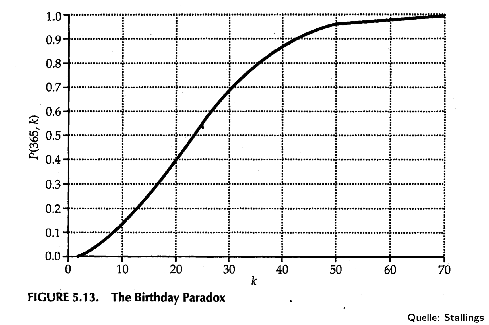
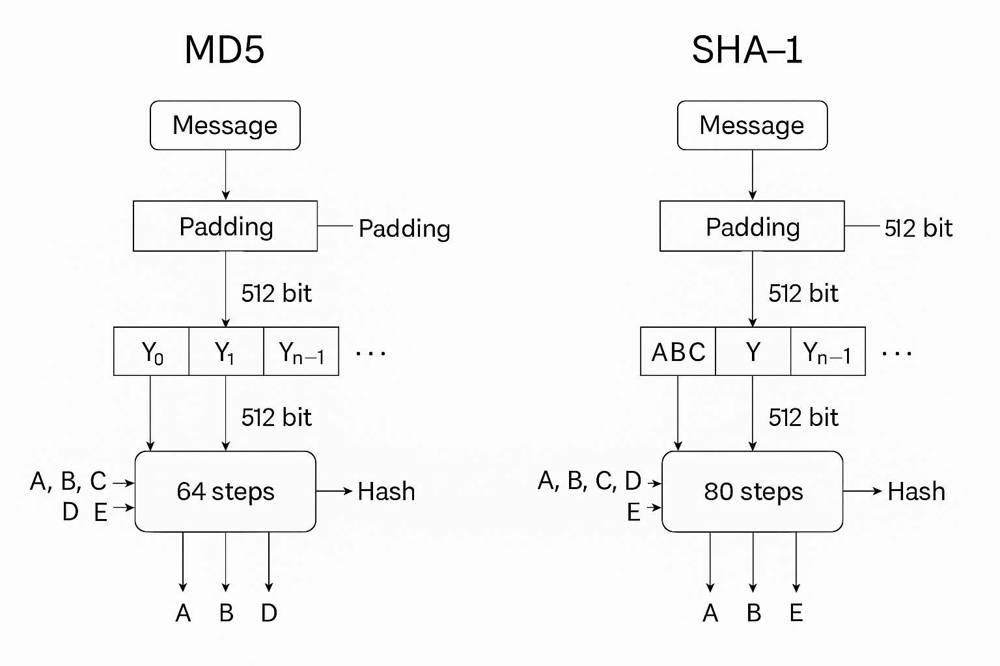
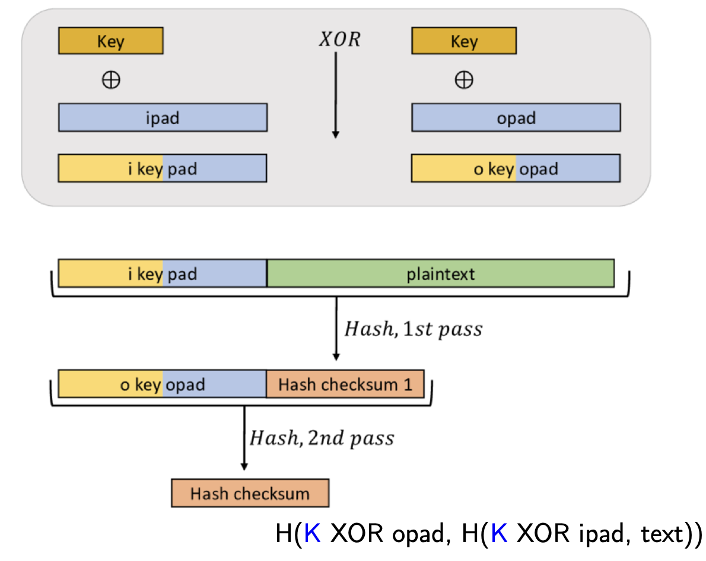
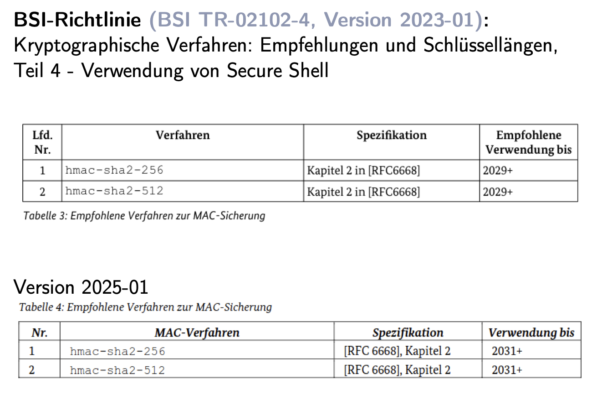

# Hash Functions and Digital Signatures

## 1. What Is a Hash Function?

A **hash function** is an algorithm that takes an input of arbitrary length and produces a fixed-size output, called the **digest** or **fingerprint**.

### Example:

```plaintext
Input (message): "I love crypto!"
Hash: 8fe3b8c2d4ea59a6... (256-bit value)
```

---

## 2. Why Do We Use Hashes in Cryptography?

Hash functions are used to provide:

* **Data integrity** – detect if a message has been modified
* **Authentication** – prove the message is from who you think it is
* **Digital signatures** – hash is signed instead of the full message

---

## 3. Properties of a Good Hash Function

Let $H: X \rightarrow Y$ be a hash function.

### ✅ Basic Required Properties:

1. **Fixed Output Length**:

   * No matter the input length, $H(m)$ is always a fixed size (e.g. 256 bits).

2. **Fast and Easy to Compute**:

   * Given $m$, it should be quick to compute $H(m)$.

3. **Pre-image resistance**:

   * Given hash output $h$, it should be computationally infeasible to find any input $m$ such that $H(m) = h$
   * (Like knowing a fingerprint and trying to find the person)

4. **Second pre-image resistance**:

   * Given a message $m$, it should be hard to find $m' \neq m$ such that $H(m') = H(m)$

   Suppose you already know:
   ```
   H("banana") = "b7f4..."
   ```
   You should not be able to find another `m₂ = "grapefruit123"` that also hashes to `"b7f4..."`.
   > This is a stronger property than pre-image resistance; now we’re assuming the attacker knows one valid message and tries to forge another with the same fingerprint.
5. **Collision resistance**:

   * It should be hard to find **any** pair $m \neq m'$ such that $H(m) = H(m')$
   * (This is what makes digital signatures secure!)

   An attacker shouldn’t be able to find any pair like:
   ```
   H("invoice_A.pdf") == H("invoice_B.pdf")
   ```
   > It’s like two completely different people having the same fingerprint: rare and dangerous in security.

> 💡 If a function satisfies only pre-image and second-preimage resistance, it's a **weak hash function**.
> If it also resists collisions → **strong hash function**.

---

## 4. Attacks on Hash Functions

### First Pre-image Attack: 🔑

> Given a hash $h$, find any message $m$ such that $H(m) = h$.

### Second Pre-image Attack: 🔄 

> Given a known message $m$, find another $m' \neq m$ such that $H(m') = H(m)$. The attacker starts with: A specific known input m₁ (maybe a signed message, public data, etc.) You are told: “Here’s Bob’s fingerprint. Now go find someone else with that exact same fingerprint.” You’re limited to this fingerprint.

### Collision Attack: 💥 

> Find any two messages $m \neq m'$ with $H(m) = H(m')$. The attacker starts with: Nothing. No message is given. You can freely try random combinations. Like trying to find any two people in the world with the same fingerprint; doesn’t matter who, as long as the fingerprints match.

> ⚠️ This is the most dangerous, because you don’t even need to control the message: just generate a pair with same hash. 

**So, a strong cryptographic hash function must resist the following three attacks:**
1. Pre-image Resistance (a.k.a. First Pre-image)
2. Second Pre-image Resistance
3. Collision Resistance

**Extra Desirable Traits:**

- Deterministic — same input = same output, always.
- Avalanche Effect — small change in input = big change in hash.
- Fast to compute — but not too fast in password hashing.
- Fixed output size — no matter how long the input.

>MD5 and SHA-1 considered broken in practice, even though they still seem to “work”?
Cryptographic security isn’t about whether it works.
It’s about whether an attacker can break it faster than brute force.
And both of these can be broken significantly faster than 2^n brute-force attempts which is a red line for cryptographic trust.


## 5. The Birthday Attack (with Paradox)

The **Birthday Paradox** says:

* With just **23 people** in a room, there's a >50% chance two share a birthday.

In hash functions:

* If the output is $n$ bits, you only need about $2^{n/2}$ tries to find a collision.
* For a 256-bit hash (like SHA-256), \~$2^{128}$ attempts are needed → still large, but NOT $2^{256}$.

> That’s why 128-bit hashes are no longer considered safe: birthday attacks are realistic!


## 💡 Is Hashing for Passwords and Hash Tables the Same?

Not quite, but related:

* **Hash Tables (Data Structures)** use fast, non-cryptographic hashes to distribute keys evenly.
* **Cryptographic Hashes** (e.g., SHA-256) are slow and secure, designed to be tamper-proof: You can’t tweak a message without invalidating the signature, unless you can create a valid one for the new message, which is supposed to be computationally infeasible.

Both use the same *idea*: deterministic mapping but have different goals.


## 6. How Are Hashes Built Internally?

Most cryptographic hash functions (like SHA-256) use a **block-wise structure**:

1. The input is padded so its length is a multiple of a fixed block size (e.g. 512 bits)
2. Each block is processed by a **compression function** that updates an internal state (We take a **block**, **mash** it with the current status of the hash, and **update** it again. Each step of cooking a food depends on the result from the last, so the final “taste” (digest) depends on all steps.): 
3. The final hash is the result of the last state

### Example Padding:

Input: "hello" → binary string of length 40 bits

* Padding: add `1` bit (Add 10000000 as one byte, because we can’t just add 1 bit, so we pack it into a byte), then `0`s, then original length as bits
* This ensures uniqueness and prevents collision padding tricks
* After padding → 512 bits total
- This block is now ready for SHA-1/SHA-2/etc. to crunch it with the compression function.


## Merkle–Damgård Construction

Most popular hash functions (like MD5, SHA-1, SHA-256) follow this structure:

### Steps:

1. **Pad** the message (next section)
2. **Split into blocks** of fixed size (e.g., 512 bits)
3. **Iterate over blocks** using a compression function
4. Final output is the last state


## Padding Process

To make the input message fit neatly into blocks, it goes through a **specific padding scheme**:

### Steps:

1. **Add a single 1 bit** (like `0x80`, ASCII is 1 byte, and that 0x80 is also 1 byte with just 1 leading 1-bit.)
2. **Add 0s** until the total length is 64 bits short of the next multiple of the block size
3. **Append original message length** in **64-bit big-endian** binary


### Example: Padding "hello"

* "hello" = 5 bytes = 40 bits
* Add 1-bit: `0x80`
* Pad with 0s until total length ≡ 448 mod 512
* Append: `0000...00101000` (which is 40 in 64-bit big-endian)

```plaintext
hello10000000..............00000000 00000000 00000000 00101000
```

✅ Now the message is ready to be split into 512-bit blocks and processed.


## Why Use Big-Endian?

**Big-endian** means most significant byte first. It's a convention for encoding multi-byte integers. Hash algorithms adopt this to:

* Maintain consistency across platforms
* Enable standardization of outputs

## 7. Use in Digital Signatures

We don’t sign the entire message directly (too slow!).

Imagine Alice wants to prove to Bob that she wrote a message and that it wasn’t tampered with.

Problem: Messages can be very long (e.g. a 10MB PDF).

🔴 Signing the entire message with RSA is computationally expensive.

✅ **Solution: Hash it first, then sign the digest (short fingerprint).
(Hashing transforms a long message into a short fixed-length output. Alice signs the hash of the message, not the message itself) :**
* Message: `m = "Hi Bob!"`
* Compute $H(m)$ → e.g., SHA-256 output (a 256-bit digest)
* Sign the digest using a private key: $s = h^d mod n$ = $\text{Sign}(H(m))$ = **(RSA signature)**

>It’s not just the hash, it’s the RSA encryption of the hash with her private key.

   - d is Alice’s private key
   - n is part of her RSA keypair
* She sends ✉️ 
m and s (message + signature)
* Bob verifies:

  * He doesn’t trust the hash Alice sent; she could fake both the message and a wrong hash. He computes the hash himself from the received message: $h' = H(m)$
  * Then checks if it matches what the signature says:
  * Use public key to verify the signature against the digest: $h'' = s^e mod n$
  	   - e is Alice’s public key exponent
	   - n is her public modulus
      
>The security of a digital signature doesn’t rely on keeping the public key private.
It relies on the fact that only the sender knows the private key, the mathematical inverse of the public key.
>So even though everyone can use the public key to check a signature, only the private key can create it:
>Proof of authorship: if your public key unlocks the message signature, then only your private key could’ve locked it. Proof of integrity: if the hash matches, the message wasn’t tampered with.

This gives:
* Integrity ✅
* Authentication ✅
* Non-repudiation ✅


 
 

That *magical reversal* happens only because the numbers were chosen to satisfy this golden rule:

```math
d · e ≡ 1 mod φ(n)
```

That’s the whole **mathematical engine** behind RSA. In your example:


* $d = 7$, $e = 3$
* `φ(n) = 20`
* So:

  ```math
  7 · 3 = 21 ≡ 1 mod 20
  ```

### What This Means:

```math
(h^d)^e mod n = h^{de} mod n = h^1 mod n = h
```
This is the **mathematical magic** of RSA:

- The exponent $de$ "collapses" to $1$ *inside the modulo world*,  
- So we get back the original $h$, even after two exponentiations!

Like a key made to match a lock 🔐🗝️ So **no matter what** the message hash \( h \) is, you always get it back when:

1. **Sign it** using the private exponent \( d \):  
   
   ```math
   s = h^d mod n
   ```

2. **Verify it** using the public exponent \( e \):  
   ```math
   h' = s^e mod n
   ```
**This gives us:**
- **Integrity** (you know what was signed)
- **Authentication** (you know who signed it)
- **Non-repudiation** (they can't deny signing it)

## Simplification: Cryptography Notes: Public/Private Key Pair & Signature Verification

## 1. The Twins Analogy: Public vs. Private Keys

Public and private keys are like **twins with complementary powers**:

- **Private Key** (secret twin): Used to sign messages (i.e., encrypt the hash).
- **Public Key** (visible twin): Used by anyone to verify that signature (i.e., decrypt the hash).

### How Digital Signatures Work:

1. Sender hashes the message:  
   `hashed_msg = hash(message)`

2. Sender signs the hash with their private key:  
   `signature = hashed_msg^d mod n`

3. Receiver verifies the signature with the sender’s public key:  
   `recovered_hash = signature^e mod n`

4. Receiver compares their own `hash(message)` to the `recovered_hash`.

> If the hashes match: Signature is valid → sender is authentic, and the message is intact.  
> If they don’t match: Something is wrong → see section 3.

## 2. What Happens With the **Wrong** Public Key?

Even if a hacker or receiver uses the **wrong public key**, RSA math still works:

```plaintext
wrong_result = signature^e_wrong mod n_wrong
```

- This still produces a number.
- But that number is meaningless: it won’t match the expected hash.

The equation doesn’t break. It just fails to validate the signature.

This is by design:  
Only the matching key pair (i.e., the true twins) produces a valid, verifiable signature.


## 3. When Hashes Don’t Match — What Could It Mean?

If `hash(received_message) ≠ signature^e mod n`, one of two things has gone wrong:

### A. Wrong Private Key Was Used
- The message wasn’t signed by the expected sender.
- The public key used to verify doesn’t match the one used to sign.
- **Result:** Signature fails. The message might be intact, but the sender is **not authentic**.

### B. Message Was Tampered With
- The signature might be legit.
- But the message was changed after being signed.
- So the hash of the received message doesn’t match the one that was signed.
- **Result:** Signature fails. The sender may be authentic, but the message lacks **integrity**.


## 4. The Power Trio: e, d, and φ(n) 👨‍👩‍👧 

We originally said RSA depends on two keys — but in truth, it relies on **three** players:

| Role        | Analogy                                       | Math Role               |
|-------------|-----------------------------------------------|-------------------------|
| `e`         | The showy twin — talks to the public          | Public exponent         |
| `d`         | The secret twin — operates in the shadows     | Private exponent        |
| `φ(n)`      | The wise elder/parent/blood pact              | Enforces their bond     |

### The Magical Equation:

```plaintext
(e * d) mod φ(n) = 1
```

- This ensures encryption and decryption are **mathematical inverses**.
- It's the core of RSA's correctness and reversibility.

If this bond isn’t satisfied, RSA simply won’t work.  
And if someone **finds φ(n)** (which is based on the prime factors of `n`), they can **compute `d`** and completely break the system.

## 💭 Aha Moment / 🤯 Realization Zone: Wait... if my public key is public, how is any of this safe?

> *“If I encrypt (or sign) a message using my **private** key, and everyone has access to my **public** key, then... can’t anyone just decrypt it? Isn’t that insecure?”*

Yes! And that’s the **whole point** 💥 it's not meant to be secret.

- Encrypting with your **private key** isn't about confidentiality.
- It’s about **proving you were the one who created the message** — anyone should be able to check that, just like anyone can verify your signature on a contract.

This isn’t encryption for secrecy — it’s a **digital signature**.

If you actually want **confidentiality**, you'd do the reverse:
- Encrypt the message using the **recipient’s public key**, so only they can decrypt it using their **private key**.

And if you want both (which you usually do):
1. **Sign the message** with your private key.
2. **Encrypt the signed message** with the recipient's public key.

That gives you:
- ✅ **Authenticity**: "This came from me."
- ✅ **Integrity**: "This wasn’t changed."
- ✅ **Confidentiality**: "Only the right person can read it."

This is the moment where crypto stops being just math and starts being **meaningful engineering**.
--- 
## MD5 vs SHA-1: Understanding One-Way Hash Functions Step-by-Step

### What is a One-Way Hash Function?

A **one-way hash function** turns any input (text, file, password) into a short, fixed-size fingerprint called a **hash**. You can't reverse the process (hence "one-way").

It’s used for:

* Verifying data integrity (did the file change?)
* Signing messages digitally
* Secure password storage

> 🔎 Hashing ≠ encryption.
> - Hashing is one-way, irreversible, and meant for integrity verification.
> - Encryption is two-way, reversible, and meant for confidentiality.

## MD5 (Message Digest 5)


### What MD5 Does

* Takes **any length message**, breaks it into **512-bit blocks**
* Processes each block using **64 fixed steps**
* Outputs a **128-bit hash**

###  How MD5 Works:

1. **Padding the message**:
You always append:
	1.	A single 1 bit (then 7 zero bits to byte-align → 0x80)
	2.	Then enough 0s to make the length ≡ 448 mod 512
	3.	Then a 64-bit little-endian representation of the original message length (in bits)

   This ensures:
```
Total length after padding = multiple of 512 bits
AND
Each block ends with the 64-bit message length
```
## MD5 Padding Edge Case: 1000-Bit Message Example

This example shows what happens when the input message is **more than 512 bits**, specifically **1000 bits**.

### Input:
- Original message length: **1000 bits**
- MD5 processes in 512-bit blocks

### Step 1: Process the First 512 Bits

- First 512 bits of the message are processed normally.
- **No padding** is added yet.
- Internal state (A, B, C, D) is updated using this block.

### Step 2: Remaining Bits

- Remaining message bits: `1000 - 512 = 488 bits`
- A full block is 512 bits → so **24 bits of space remain**

### Step 3: What Needs to Be Added?

To complete MD5 padding, we need:
- `1` bit for the padding `1` (`0x80`)
- `0` or more `0` bits
- `64` bits for the **original message length**, in little-endian

So we need **at least 65 bits** total.


### Problem:

- Only **24 bits** are available in the second block.
- **65 > 24** → Not enough space to finish padding and length.


### Solution ✅ :

- Second block holds:
  - Remaining 488 bits of the message
  - The `1` bit (`0x80`)
  - As many `0`s as possible to fill to 512 bits
- **Third block** is added:
  - First 448 bits: `0`s
  - Last 64 bits: **1000 (message length)** in little-endian format

### Summary

| Block | Contents |
|-------|----------|
| Block 1 | First 512 bits of message |
| Block 2 | 488 bits of message + `1` bit + `0`s (fills to 512 bits) |
| Block 3 | 448 `0`s + 64-bit original length |

This is a classic edge case:  
**When the padding and length can't both fit in the final partial block, an extra 512-bit block is added.**

--- 
2. **Initialize state**: The MD5 algorithm doesn’t take those 512 bits and spit out a hash in **one go**. Instead: It initializes four 32-bit values (A, B, C, D). These are your internal “state”. So, start with 4 fixed values: A, B, C, D (32 bits each)
---
3. **Process blocks**:

   * Then it processes the 512-bit block in 64 rounds; one tiny step at a time. Each 512-bit block goes through 64 **rounds/steps** of mixing using XOR, AND, NOT, shifts
   * The result of one block becomes the input for the next
--- 
4. **Final hash**: After all blocks are processed, you combine A, B, C, D → 128-bit hash

## More On How MD5 Updates Its Internal State (A, B, C, D)

After preprocessing and splitting the message into 512-bit blocks, MD5 processes each block to **update its internal state**, which consists of four 32-bit registers(= Working memory slots where we stir the ingredients of the message block, round after round.)

```plaintext
A = 0x67452301  
B = 0xefcdab89  
C = 0x98badcfe  
D = 0x10325476
```


### What Happens to the Message Block?

- Each 512-bit block is divided into **16 words**:
  ```plaintext
  M[0], M[1], ..., M[15]  → each 32 bits
  ```
- These words are **fed into 64 rounds** of operations.
- Each round uses one of the `M[i]` values, a constant `K[i]`, a rotation value `s[i]`, and a nonlinear function `F`, `G`, `H`, or `I`.


### Why 64 Rounds if We Only Have 16 Words?

- The 16 message words are **reused** across the 64 rounds in a specific sequence.
- Each group of 16 rounds (4 groups total) uses a different mixing function:
  - Rounds 0–15: Function F
  - Rounds 16–31: Function G
  - Rounds 32–47: Function H
  - Rounds 48–63: Function I

This design provides **diffusion**, even a tiny change in the message affects **all 64 rounds** and deeply disturbs A, B, C, D.

---

### What Happens in Each Round? ⚙️ 

In each of the 64 rounds, MD5 applies this kind of transformation:

```plaintext
A = B + LEFTROTATE((A + F(B,C,D) + M[i] + K[i]), s)
```

- The result **mutates A**
- The registers are then rotated:

  ```
  A → D  
  D → C  
  C → B  
  B → new value
  ```

---

### After All Rounds:

- A, B, C, D are added to their original values:

  ```plaintext
  A = A + original_A
  B = B + original_B
  ...
  ```
- This updated state is carried into the next message block (if any).

---

### Final Digest:

After all message blocks are processed, the final values of A, B, C, and D are concatenated:

```plaintext
MD5 hash = A || B || C || D   → 128-bit hash output
```

This final digest is the compressed fingerprint of the entire message.

---
### Why It Was Popular

* Very fast on Intel CPUs

   Let's say you have:
`0x12345678`
   - Big-endian (like how humans read):
   Stored as: 12 34 56 78
   - Little-endian (used by Intel CPUs):
Stored as: 78 56 34 12

MD5 was designed for Intel’s architecture, so it reads multi-byte data assuming little-endian order
* Easy to implement in software

### Why It’s Broken ❌

* In 2004, attackers could generate **collisions** (Find two different inputs produce the same hash output.)
* Finding a collision takes \~2^64 operations — much easier than expected


## SHA-1 (Secure Hash Algorithm 1)

### What SHA-1 Does

* Same general structure as MD5
* Uses **512-bit blocks**
* Outputs a **160-bit hash** (32 bits longer than MD5, which gives 16 extra bits, which sounds small… but actually means 2¹⁶ (~65,000×) more resistance.
)

### How SHA-1 Works:

1. **Padding**: Like MD5, pads the message to fit 512-bit blocks
2. **Initialize state**: 5 constants: A, B, C, D, E = State registers are a group of variables (like a, b, c, etc.) that hold the evolving result of the hash computation. 

>  Why are they called **“State”** Registers?
>
>Because they represent the current state of the hash function as it’s processing data. 
> 
>By the end of all rounds: The final values in the registers are your digest
>
>The message **never** becomes the hash. Instead, the message modifies the state registers, and their final state becomes the hash.

3. **Process blocks**:

   * Each block goes through **80 rounds** of bitwise mixing
   * Adds more complexity than MD5
4. **Final hash**: Combine A, B, C, D, E → 160-bit hash

## MD5 vs SHA-1: Internal Differences (Detailed Table)

This table compares the internal mechanisms of **MD5** and **SHA-1** side-by-side, focusing on how each algorithm processes data under the hood.

| Feature                      | **MD5**                                              | **SHA-1**                                               |
|-----------------------------|------------------------------------------------------|---------------------------------------------------------|
| **Block size**              | 512 bits                                             | 512 bits                                                |
| **Message words**           | 16 × 32-bit words (`M[0]`–`M[15]`)                   | 80 × 32-bit words (`W[0]`–`W[79]`)                      |
| **Message expansion**       | None, uses `M[0]` to `M[15]` directly               | Expands from `M[0-15]` using:                           |
|                             |                                                      | `W[i] = ROTL1(W[i-3] ⊕ W[i-8] ⊕ W[i-14] ⊕ W[i-16])`     |
| **State registers**         | 4 × 32-bit: `A, B, C, D`                             | 5 × 32-bit: `A, B, C, D, E`                             |
| **Initial values**          | A = 0x67452301<br>B = 0xefcdab89<br>C = 0x98badcfe<br>D = 0x10325476 | Same A–D plus:<br>E = 0xc3d2e1f0                        |
| **Rounds**                  | 64 rounds                                            | 80 rounds                                               |
| **Round groups**            | 4 groups of 16 rounds (F, G, H, I)                   | 4 groups of 20 rounds with different logic + constants  |
| **Logic functions**         | F: `(B AND C) OR ((NOT B) AND D)`<br>G, H, I variants| Group 1: `(B AND C) OR ((NOT B) AND D)`<br>Group 2 & 4: `B XOR C XOR D`<br>Group 3: Majority `(B AND C) OR (B AND D) OR (C AND D)` |
| **Constants per round**     | 64 constants (`K[0]–K[63]`)                          | 4 constants (one per 20-round group)                   |
| **Bit operations**          | Bitwise AND, OR, NOT, XOR + left rotations          | Same, but with additional heavy use of `ROTL5`, `ROTL30`|
| **Output digest size**      | 128 bits (A || B || C || D)                         | 160 bits (A || B || C || D || E)                       |
| **Output format**           | Concatenation of final A–D                          | Concatenation of final A–E                             |

---

### Why It Was Better Than MD5

* Longer hash = more possible outputs = better collision resistance (it's harder to find two different inputs that hash to the same value, in theory)
* Harder to crack, at first

### Why It’s Also Broken

* In 2005, Prof. Xiaoyun Wang showed a **differential attack**:

  * Collisions could be found in \~2^63 operations (not 2^80 as expected)
* Later, others broke even reduced-round SHA-1

---

## Security Breakdown

| Feature                | MD5             | SHA-1           |
| ---------------------- | --------------- | --------------- |
| Output size            | 128 bits        | 160 bits        |
| Designed in            | 1991 (Rivest)   | 1993 (NIST)     |
| Internal state         | A, B, C, D      | A, B, C, D, E   |
| Steps per block        | 64              | 80              |
| Collision resistance   | \~2^64 (broken) | \~2^63 (broken) |
| Architecture optimized | Little-endian   | Big-endian      |
| Secure today?          | ❌             | ❌             |

---

### So What’s the Difference?

* SHA-1 was designed to be **more secure** by adding more rounds and a longer output
* But both are **now insecure** for cryptographic uses

## Little-Endian Intuition

### What is Little-Endian?

Little-endian is a byte-ordering format where the **least significant byte** (LSB) is stored **first** in memory.

> It stores the byte containing the **smallest powers of 2** first.

### Example: The number 1000 in binary (64-bit)
`00000000 00000000 00000000 00000000 00000000 00000000 00000011 11101000`
- Byte 0 (rightmost) → `11101000` = 0xE8 → **least significant**
- Byte 7 (leftmost) → `00000000` = 0x00 → **most significant**

### Little-endian Representation (in memory)
`E8 03 00 00 00 00 00 00`
### Big-endian (for contrast)
`00 00 00 00 00 00 03 E8`
### Summary
- **Little-endian**: LSB first: smallest powers of 2 come first.
- **Big-endian**: MSB first: human-readable, but less common in modern low-level systems.

## SHA-256: Internals Explained (with Step-by-Step Breakdown)

### 1. What Are the 64 or 80 Constants?

**They're Called Round Constants: K[0], K[1], …, K[63] (for SHA-256)**

Or up to K[79] in SHA-512.

These constants are:
- **Fixed, published in the FIPS/NIST documentation**
- Each is a 32-bit (SHA-256) or 64-bit (SHA-512) word
- **Derived from the fractional part of cube roots of the first 64 primes**

**Example (SHA-256 first few constants):**

```plaintext
K[0] = 0x428a2f98
K[1] = 0x71374491
K[2] = 0xb5c0fbcf
K[3] = 0xe9b5dba5
...
K[63] = 0xc67178f2
```

👉 These are not random — they're mathematically derived, and every SHA-256 implementation uses the exact same set.


### 2. What's Going on in the Loop?

You saw this pseudocode:

```plaintext
// Start
a = H0
b = H1
c = H2
d = H3
e = H4
f = H5
g = H6
h = H7
```

These are called the **working variables**. They represent the internal state for one 512-bit chunk.

Then comes the real action:

```plaintext
for i in 0..63:
   temp1 = h + Σ1(e) + Ch(e, f, g) + K[i] + W[i]
   temp2 = Σ0(a) + Maj(a, b, c)

   h = g
   g = f
   f = e
   e = d + temp1
   d = c
   c = b
   b = a
   a = temp1 + temp2
```

Let's break this down line by line.


**💥 W[i]: Message Schedule**
- The message block is split into 16 × 32-bit chunks
- These are expanded into 64 entries using bitwise mixing and shifts
- **W[i] is one of these expanded values** — a prepared piece of your message


**Σ1(e) and Σ0(a): Big Rotating Functions**
- These are bitwise rotations and shifts:

For SHA-256:

```plaintext
Σ1(x) = ROTR^6(x) ⊕ ROTR^11(x) ⊕ ROTR^25(x)
Σ0(x) = ROTR^2(x) ⊕ ROTR^13(x) ⊕ ROTR^22(x)
```

- These functions **diffuse entropy**, spreading bits around to increase the avalanche effect


**Ch(e,f,g) and Maj(a,b,c)**

These are bit-selecting functions:
- **Choose (Ch)**: returns bits from f if e is 1, else from g

```plaintext
Ch(e, f, g) = (e AND f) XOR ((NOT e) AND g)
```

- **Majority (Maj)**: returns the majority bit of a, b, and c

```plaintext
Maj(a, b, c) = (a AND b) XOR (a AND c) XOR (b AND c)
```

These inject **nonlinearity**.


**temp1 and temp2:**

These are temporary values used to update the internal state:

```plaintext
temp1 = h + Σ1(e) + Ch(e,f,g) + K[i] + W[i]
temp2 = Σ0(a) + Maj(a,b,c)
```

Then we rotate the state variables down, inject the new values:

```plaintext
h = g
g = f
f = e
e = d + temp1
...
a = temp1 + temp2
```

Imagine these like **8 gears in a machine**. On every round, the gears rotate, and `a` is replaced with the new mixed value.


**Why So Much Rotation?**
- It's how **confusion and diffusion** (Claude Shannon's principles for crypto) are introduced
- A small change in the message completely changes the hash → **Avalanche Effect**
- The rounds mutate the internal state, and each round builds on the previous


**After All 64 Rounds**

The mutated state `a` to `h` is added back to the original `H0` to `H7`.

This is like saying:

```plaintext
H0 = H0 + a
H1 = H1 + b
...
H7 = H7 + h
```

So the new `H0...H7` become the starting values for the next block.

At the end of the last block, you concatenate them:

```plaintext
SHA-256 hash = H0 || H1 || ... || H7  →  256 bits
```


### 1. Initial Preparation

**Break the input message into 512-bit chunks**

SHA-256 operates on 512-bit blocks. If your message is longer, it's broken down into multiple chunks of 512 bits.


### 2. Create the Message Schedule Array

**What's the Message Schedule?**

You start with 64 words of 32 bits each: `W[0]...W[63]`.
- `W[0]` to `W[15]` come directly from the message block.
- `W[16]` to `W[63]` are generated using previous values and bitwise operations.

**Extension Formula**

```plaintext
for i from 16 to 63:
    s0 = (W[i-15] rightrotate 7) xor (W[i-15] rightrotate 18) xor (W[i-15] rightshift 3)
    s1 = (W[i-2]  rightrotate 17) xor (W[i-2]  rightrotate 19) xor (W[i-2]  rightshift 10)
    W[i] = W[i-16] + s0 + W[i-7] + s1
```

This spreads the entropy and makes it harder to find patterns in inputs (improves diffusion).


### 3. Compression Function: 64 Rounds

**📌 Set initial working variables:**

These are copied from the current hash values:

```plaintext
a = H0
b = H1
...
h = H7
```

**Loop over 64 rounds (i = 0 to 63):**

Each round:

```plaintext
S1  = (e rightrotate 6) xor (e rightrotate 11) xor (e rightrotate 25)
ch  = (e and f) xor ((not e) and g)
temp1 = h + S1 + ch + K[i] + W[i]

S0  = (a rightrotate 2) xor (a rightrotate 13) xor (a rightrotate 22)
maj = (a and b) xor (a and c) xor (b and c)
temp2 = S0 + maj

// Rotate state registers
h = g
g = f
f = e
e = d + temp1
d = c
c = b
b = a
a = temp1 + temp2
```


### 4. Update Hash State

After all 64 rounds, the final `a` to `h` values are added back into the hash state:

```plaintext
H0 = H0 + a
H1 = H1 + b
H2 = H2 + c
H3 = H3 + d
H4 = H4 + e
H5 = H5 + f
H6 = H6 + g
H7 = H7 + h
```


### 5. Final Digest (Output)

The final hash is:

```plaintext
digest := H0 || H1 || H2 || H3 || H4 || H5 || H6 || H7
```

Each H is 32 bits → 8 x 32 = **256-bit hash** 🎉

---

### ❓ Common Confusions Clarified

**🔄 Why 64 words when message gives only 16?**
- You extend from the 16 initial words using shifts, rotations, and XOR.
- This is essential for security, preventing simple attacks.

**🧮 What about the K[i] constants?**
- `K[0]` to `K[63]` are pre-defined constants derived from the fractional parts of the cube roots of the first 64 primes.
- These are public, universal, and used in every SHA-256 implementation.
---

### Key Differences: SHA-1 vs SHA-256

| Area             | SHA-1                | SHA-256 (SHA-2)              |
|------------------|----------------------|------------------------------|
| Schedule         | 80 words             | 64 words (more complex ops)  |
| Rotation Logic   | Only ROTL, simple XOR| ROTR + right shift, more entropy |
| Compression      | Simpler boolean funcs| More advanced: ch, maj, etc. |
| Bit Width        | 32-bit, 5 registers  | 32-bit, 8 registers          |
| Final Hash       | 160 bits             | 256 bits                     |

---

### Purpose of the Message Schedule

The message schedule expands the original 16 words from the message block into 64 (SHA-256) or 80 (SHA-1) words. This is not padding, but an internal process to create more complexity and diffusion in the hash function. The extra words are generated using bitwise operations (XOR, shifts, rotates) to ensure each round receives a unique, mixed value.

---

### Terminology

| Term                | Meaning                                                      |
|---------------------|-------------------------------------------------------------|
| 512-bit Block       | The chunk of data processed at each step                     |
| 32-bit Word         | Each block is divided into 16 words (512 / 32 = 16)          |
| W[0..15]            | Directly read from the message block                         |
| W[16..63] or W[16..79] | Generated from W[0..15] using mixing operations           |
| Message Schedule    | The full array W[0..63] or W[0..79] (real + derived words)   |

---

### Why Expand the Schedule?

- SHA-256 needs 64 rounds, so it requires 64 words (W[0] to W[63]).
- SHA-1 needs 80 rounds, so it requires 80 words (W[0] to W[79]).
- Only 16 are directly from the message; the rest are generated to increase security.

For SHA-1:
```plaintext
W[i] = ROTL1(W[i-3] ⊕ W[i-8] ⊕ W[i-14] ⊕ W[i-16])
```
For SHA-256:
```plaintext
s0 = (W[i-15] >>> 7) ⊕ (W[i-15] >>> 18) ⊕ (W[i-15] >> 3)
s1 = (W[i-2] >>> 17) ⊕ (W[i-2] >>> 19) ⊕ (W[i-2] >> 10)
W[i] = W[i-16] + s0 + W[i-7] + s1
```
This schedule expansion is crucial for the security of the hash function.

### Can You Recover the Message from the Hash?

No, you cannot "unhash" a message. Hash functions are designed to be one-way: given a hash, there is no practical way to recover the original message.

**How verification works:**
1. The sender hashes the message using a known algorithm (like SHA-256) to get a digest H(m).
2. The sender sends the message (and optionally the digest or a signature).
3. The receiver hashes the received message again to get H'(m).
4. The receiver compares H'(m) to the sender's hash:
   - If they match, the message is unchanged.
   - If they don't match, the message was tampered with or corrupted.

**You never "unhash"**—both sides simply recompute the hash and compare.


#### Why do both sides always get the same hash?

Both sender and receiver use the exact same algorithm and fixed constants, which are:
- **Initialization values** (e.g., H0 to H7 in SHA-256), chosen from mathematical sources and published in the standard.
- **Round constants** (K[i]), also fixed and public.

These constants are hardcoded in every correct implementation and are not secret. This makes the hash function **deterministic**: same input, same output, every time.

If any constant or rule were different, the hashes would not match. That's why certified libraries (like OpenSSL, hashlib, etc.) strictly follow the official standards.

---

# HMAC Explained (RFC 2104, 1997)

HMAC (**Hash-based Message Authentication Code**) is a construction used for verifying both the **integrity** and **authenticity** of a message. It works by combining:
- A cryptographic **hash function** (like SHA-1, SHA-256, or SHA-512), and
- A **secret key** shared between sender and receiver.

## Why Use HMAC?
Hash functions alone do **not** use a secret. If someone can modify the message, they can also compute a new hash. HMAC prevents this by involving a key.

## Definition (from RFC 2104)
Given:
- `H` = the hash function (e.g., SHA-256)
- `K` = secret key
- `text` = the message to authenticate
- `B` = block size in **bytes** of the hash function
- `L` = output size in **bytes** of the hash function, * **SHA-256 produces 256 bits** So, 256 bits / 8 = **32 bytes** output. This is often represented as a 64-character hexadecimal string (each hex digit = 4 bits)


We define two fixed constants:
- `ipad = 0x36` repeated `B` times
- `opad = 0x5C` repeated `B` times

They aren’t words — they are just names chosen in the spec (RFC 2104) to refer to these paddings.

These are **predefined 64-byte constants** used to scramble the key in different ways for the two rounds of hashing.

* `ipad` = inner padding = byte `0x36` repeated 64 times
* `opad` = outer padding = byte `0x5C` repeated 64 times


## HMAC Algorithm: Step-by-Step

The HMAC function is defined as:

```text
HMAC(K, message) = H((K ⊕ opad) || H((K ⊕ ipad) || message))
```

Where:

* `K` = secret key
* `H` = hash function (SHA-256)
* `⊕` = bitwise XOR
* `||` = concatenation

#### Step-by-Step:

1. **Pad Key**: Make key K exactly 64 bytes (SHA-256 block size)

   * If too short: pad with zeroes
   * If too long: hash it first, then pad to 64 bytes

2. **Inner XOR**:

   ```
   k_ipad = K ⊕ ipad
   ```

3. **Inner Hash**:

   ```
   inner_hash = H(k_ipad || message)
   ```

4. **Outer XOR**:

   ```
   k_opad = K ⊕ opad
   ```

5. **Final HMAC**:

   ```
   HMAC = H(k_opad || inner_hash)
   ```





## BSI Recommendations (2025 Update)


| Nr | HMAC Variant  | Spec                | Use Until |
| -- | ------------- | ------------------- | --------- |
| 1  | hmac-sha2-256 | RFC 6668, Chapter 2 | 2031+     |
| 2  | hmac-sha2-512 | RFC 6668, Chapter 2 | 2031+     |

BSI still recommends HMAC-SHA2 family (SHA-256 or SHA-512) for MACs.


## Summary

HMAC adds a layer of protection on top of hash functions. It ensures:

* **Message authenticity** (only the holder of the key can produce the correct HMAC)
* **Message integrity** (tampering is detectable)

It is widely used in:

* TLS/SSL
* IPsec
* JWTs
* API authentication

---
## Detailed Breakdown: Digital Signature and RSA (Based on German Lecture Notes)

---

### 1. **Challenge of Digital Signatures**

Electronic data can be easily copied and modified **without leaving any traces**. Therefore, digital signatures must fulfill the following requirements:

* **Proof of Origin (Herkunft)**: The recipient should be able to identify the sender.
* **Proof of Originality (Originalität)**: The signature cannot be changed afterward or transferred to another message.
* **Proof of Intent (Handlung)**: The signature must reflect a deliberate action that the sender cannot deny later.

---

### 2. **Digital Signature with RSA: Basic Setup**

Participants:

* A wants to send message **M** to B.
* **Public Keys**: A's is $(e_A, n_A)$, B's is $(e_B, n_B)$
* **Private Keys**: Only A knows $(d_A, n_A)$, only B knows $(d_B, n_B)$

#### Two Goals:

1. **Confidentiality**: Encrypt the message with B's public key $(e_B, n_B)$.
2. **Signature**: Sign the message (or just its hash) using A's private key $(d_A, n_A)$.

---

### 3. **Process: Creating a Digital Signature**

#### Sender A:

1. Compute the hash of the message: $H(M)$
2. Sign the hash: $\text{Sig}(M) = H(M)^{d_A} \mod n_A$
3. Send both message and signature: $M \| \text{Sig}(M)$

---

### 4. **Verification by Receiver B**

1. Receive the message and signature: $M \| \text{Sig}(M)$
2. Compute $H(M)$
3. Verify signature by computing: $\text{Sig}(M)^{e_A} \mod n_A$
4. If the result matches $H(M)$, the signature is valid and proves:

   * Message is authentic (from A)
   * Message is intact (not modified)

---

### 5. **Key Takeaways**

* **Digital Signatures require asymmetric encryption**.
* The signer uses their **private key** to sign.
* The verifier uses the **public key** to check.

---

### 6. **Why HMAC is Not a Digital Signature**

* HMAC uses a shared secret between sender and receiver.
* Both can generate the same HMAC.
* **No proof of origin** — it only authenticates that someone with the shared secret created it.

---

### 7. **Complexity and Fragility**

* Crypto systems are very **unforgiving** — a small mistake can break security.
* Quote from Eran Hammer (OAuth 2.0 Editor):

  > "Even beyond the complex math, cryptography is hard because it is generally unforgiving."

---

### 8. **Implementation Issues**

Example: A bug in IPsec (Strongswan) allowed **empty ECDSA signatures**.

* Bug existed from 2009 to 2013.
* Shows how easily cryptographic systems can be misused.

---

### 9. **Replay Attack (Without Authentication)**

1. A sends $M | \text{Sig}(M)$ to B
2. Attacker Eve records this message.
3. Eve replays it later pretending to be A.
4. B thinks A sent the message again.

**Problem**: Missing authentication — B cannot confirm it's really A sending it now.

---

### 10. **Challenge-Response with RSA**

Definition:

> A knowledge-based authentication scheme. A challenge (fresh random value) is sent, and only someone with the correct private key can compute the response.

#### RSA Version:

1. A sends: $M \| \text{Sig}(M)$
2. B sends A a challenge: $\text{challenge} = \text{Encrypt}_{\text{pub}}(N)$
3. A decrypts with private key and sends $N$ back.

* $N$ is a **Nonce** (Number used once)
* Prevents replay attacks
