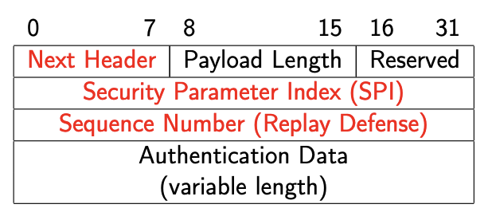
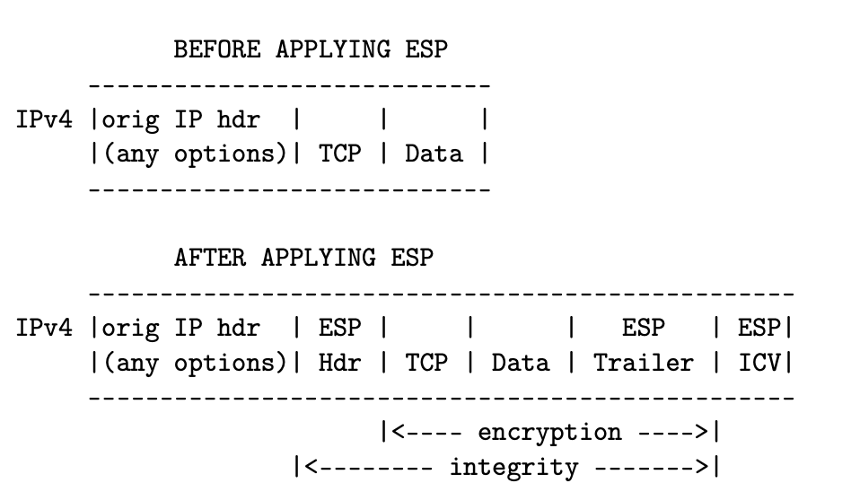
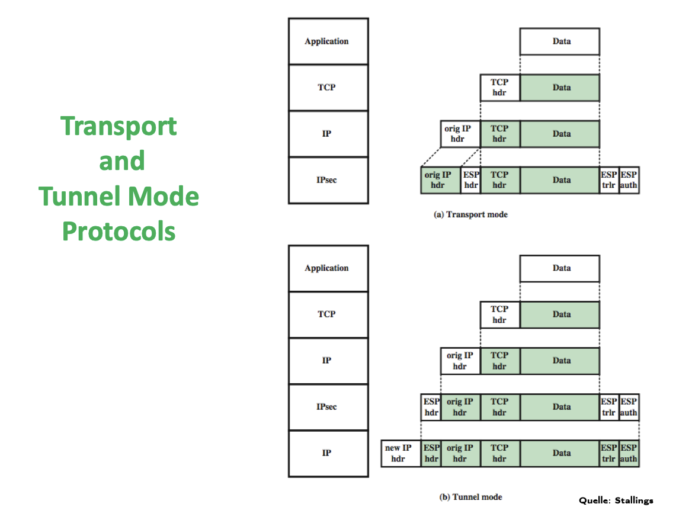
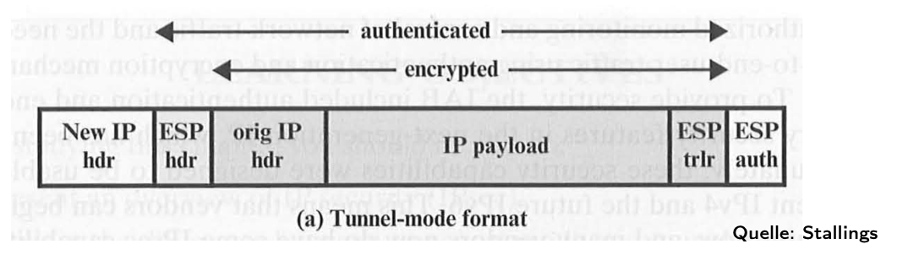
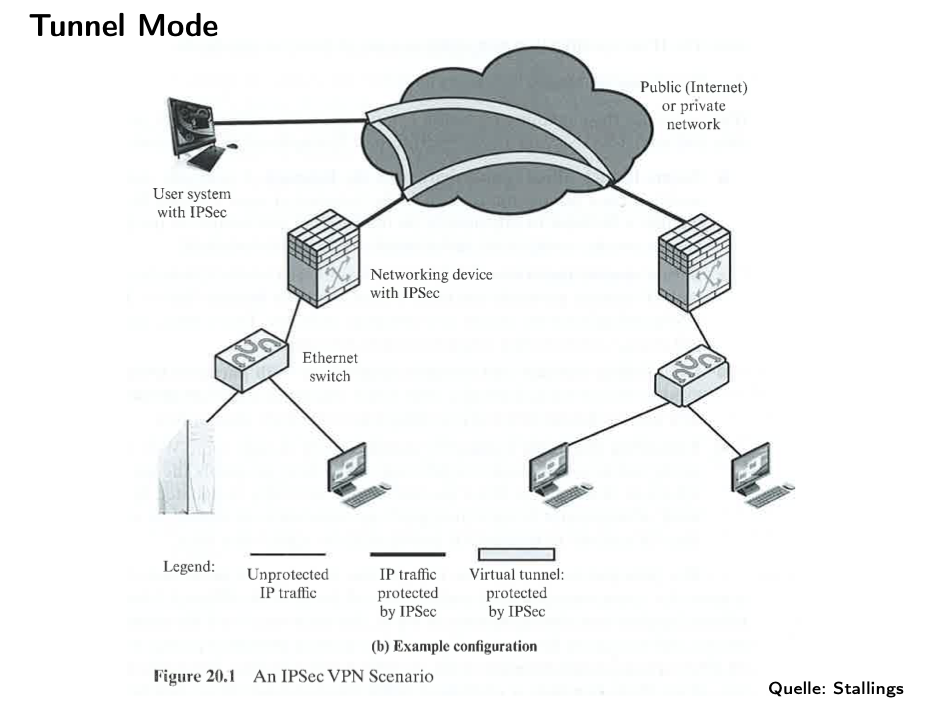
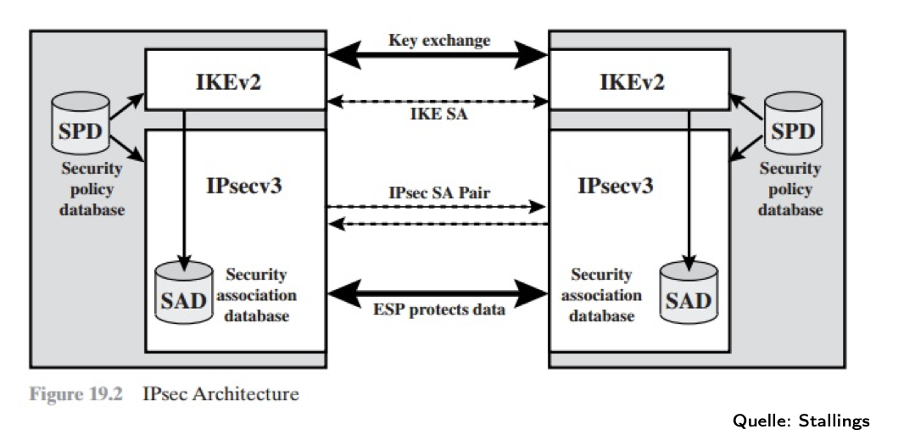

# Warm-Up: Packet Encapsulation & De-Encapsulation

This section is the **overview so far** — before we jump into IPSec itself.  
We start with a plain packet (no security, everything visible) and then show where different security protocols (MACsec, IPSec, TLS, QUIC) intervene.

## Baseline: No Security

A network packet without security looks like this. **Each header describes and controls the payload immediately to its right.**

````
+-----------------------------------------------------------+
| Ethernet Header | IP Header | TCP/UDP Header | App Data   |
+-----------------------------------------------------------+
````

- **Ethernet Header (L2):** Source/destination MAC, type, etc.  
- **IP Header (L3):** Source/destination IP, TTL, protocol, etc.  
- **TCP/UDP Header (L4):** Ports, sequence numbers, flags, etc.  
- **App Data (L7):** Application content (HTTP request, email, etc.).  

**Everything is visible on the wire.**

## Encapsulation (Sending Side)

1. **Application Layer (L7)**  
   - **Baseline:** Creates the data (e.g., `GET /index.html HTTP/1.1 …`).  
   - **With TLS/QUIC:**  
     - TLS encrypts just the application data before passing it to TCP.  
     - QUIC integrates TLS 1.3 and encrypts application data at this stage too.  

   Result:  
   - No security → `[App Data]`  
   - With TLS/QUIC → `[Encrypted App Data]`

2. **Transport Layer (L4 – TCP/UDP)**  
   - **Baseline:** Adds TCP/UDP header (ports, seq numbers, flags).  
     - Result: `[TCP/UDP Header | App Data]`  
   - **With TLS:** TCP header stays in cleartext, but payload is already TLS-encrypted.  
     - Result: `[TCP Header | Encrypted App Data]`  
   - **With QUIC:** UDP header visible, QUIC payload (including its transport metadata + app data) encrypted.  
     - Result: `[UDP Header | Encrypted QUIC Payload]`  

3. **Network Layer (L3 – IP)**  
   - **Baseline:** Adds IP header (src/dst IPs, TTL, protocol).  
     - Result: `[IP Header | TCP/UDP Header | App Data]`  
   - **With IPSec Transport Mode:**  
     - TCP/UDP header + App Data are encrypted (ESP payload).  
     - IP header remains visible.  
     - Result: `[IP Header | Encrypted (TCP/UDP Header + App Data)]`  
   - **With IPSec Tunnel Mode:**  
     - Entire original IP packet encrypted.  
     - New IP header added for routing.  
     - Result: `[New IP Header | Encrypted (Orig IP Header + TCP/UDP Header + App Data)]`

4. **Data Link Layer (L2 – Ethernet, Wi-Fi, …)**  
   - **Baseline:** Adds Ethernet (or Wi-Fi) header + trailer (MAC addresses, type, checksum).  
     - Result: `[Ethernet Header | IP Packet | Ethernet Trailer]`  
   - **With MACsec:**  
     - Encrypts the Ethernet payload (which is the entire IP packet).  
     - Ethernet header stays visible for switching.  
     - Result: `[Ethernet Header | Encrypted (IP Packet) | MACsec Trailer]`


5. **Physical Layer (L1)**  
   - **Baseline:** Converts frame to signals (electrical, optical, or radio).  
   - **Security:** At this level, no protocol encrypts the raw signal itself. Security always comes from higher layers (MACsec, IPSec, TLS, QUIC).  

## De-Encapsulation (Receiving Side)

The reverse happens:

1. **Physical Layer (L1)**  
   - Signals → bits.  
   - No security here.

2. **Data Link Layer (L2)**  
   - Removes Ethernet header/trailer.  
   - If MACsec is active → decrypts payload, verifies integrity.  
   - Exposes IP packet.

3. **Network Layer (L3 – IP)**  
   - Removes IP header.  
   - If IPSec is active → decrypts ESP payload (transport mode) or entire inner packet (tunnel mode).  
   - Exposes TCP/UDP segment.

4. **Transport Layer (L4 – TCP/UDP)**  
   - Removes transport header.  
   - If TLS is active → passes encrypted payload upward for TLS decryption.  
   - If QUIC is active → decrypts QUIC payload itself (since QUIC integrates crypto at L4).  
   - Exposes application data (or decrypted QUIC/TLS content).

5. **Application Layer (L7)**  
   - Processes the original request (e.g., HTTP).  
   - With TLS/QUIC → now sees cleartext after decryption.  

# IPSec 

- Before IPSec:
  - Security was added at the **application layer** (TLS, HTTPS, SMTPS, FTPS, …).
  - Problem: each application had to be modified to support encryption.

- With IPSec:
  - Security added at the **network layer (L3)** → transparent to applications.
  - Applications continue unchanged; OS handles security.

- IPSec provides:
  - **Encryption** – confidentiality of payload.
  - **Data integrity** – detect modification in transit.
  - **Authentication of sender** – data origin authentication.
  - **Replay protection** – prevents reuse of old packets.
  - **Negotiable algorithms** – peers agree dynamically.
  - **Key exchange** – done via **IKE (Internet Key Exchange)**.

## Characteristics

- Originally **mandatory for IPv6** (= any IPv6 stack had to come with IPSec code in the kernel); Over time, practice showed: **Not every use case needed IPSec**; because the web moved to TLS and VPNs had other technologies, today optional for both IPv4 and IPv6.
- Supports **compression before encryption** (since encrypted data doesn’t compress well).
- Requires **kernel/OS support** (unlike TLS, which runs in user space libraries).

## IPSec Protocols
**A protocol is a set of rules + a format for communication between peers.**

Every IP packet has a field in its header called *Protocol* (IPv4) or **Next Header** (IPv6).

This field says: “*What’s inside me?*”

Examples:

- 6 → payload is TCP.

- 17 → payload is UDP.

- 1 → payload is ICMP.

- 50 → payload is ESP.

- 51 → payload is AH.

So the IP header doesn’t care what the payload is. It just says: 
>“The next chunk is of type X.”

When IPSec is used, **instead of the IP payload being directly TCP/UDP**, it can be an **IPSec header**. So IPSec “**sits in between**” IP and TCP/UDP:
It doesn’t replace TCP or UDP.
It wraps them, so TCP/UDP are still there, just deeper inside.
### 1. AH – Authentication Header
````
IP Header (Protocol=51)
    └── AH Header
           └── TCP Header
                 └── Application Data
````

- **RFC 2402 (1998)** → replaced by **RFC 4302** (2005) and **RFC 4305**.  
- **Protocol number: 51.**  
- Services:  
  - Integrity protection.  
  - Authentication of sender.  
  - Replay protection.  
  - ⚠️ No encryption.  
- Works by calculating a **MAC** (Message Authentication Code) over:
  - Entire IP packet (IP header + payload + AH header).  
  - Excludes fields that change during transit (e.g., TTL). These are set to zero during MAC calculation.  
- **Fragmentation**: must reassemble fragments before verification, since MAC is over the whole packet.

#### AH Header Format

- **Next Header (8 bits):** Identifies protocol after AH (similar to Protocol field in IP header).  
- **Payload Length (8 bits):** Length of AH in 32-bit words.  
- **SPI – Security Parameter Index (32 bits):** Identifies the security association and cryptographic algorithms to use.  
- **Sequence Number (32 bits):** Prevents replay attacks.  
- **Authentication Data (variable):** Integrity check value (MAC).

### 2. ESP – Encapsulating Security Payload
Now, the IP header says: “*My payload is ESP.*”
````
[ IP Header (Protocol=50) | ESP Header | Encrypted Payload | ESP Trailer | ESP Auth ]
````
````
IP Header (Protocol=50)
    └── ESP Header
           └── [TCP Header + Application Data] (encrypted)

````

Inside ESP, you’ll eventually find the TCP/UDP header + app data (encrypted if ESP is in encryption mode).
- **RFC 2406 (1998)** → replaced by **RFC 4303** (2005).  
- **Protocol number: 50.**  
- Services:  
  - Encryption (confidentiality).  
  - Integrity protection.  
  - Authentication of sender.  
  - Replay protection.  
- **MAC calculation** only covers:  
  - ESP header.  
  - Payload (data).  
  - ESP trailer.  
  - The IP header is not ❌ covered (unlike AH), only in transport mode though. In **tunnel** mode **the original IP header** (the one from the host) is **encrypted** inside ESP. The new outer IP header (the one for gateways) is not encrypted.
#### ESP in Transport Mode



- **Before ESP**:  
````
IPv4 | Orig IP hdr | (any options) | TCP | Data |
````

- **After ESP**:  
````
IPv4 | Orig IP hdr | ESP hdr | TCP | Data | ESP trlr | ESP ICV |
````

- Encryption covers `[TCP | Data | ESP trailer]`.  
- Integrity protection covers `[ESP hdr | TCP | Data | ESP trailer | ICV]`.  

---

## IPSec Modes
**Modes are ways to apply a protocol (ESP or AH) to packets:**

### Transport Mode
- Protects only the **IP payload** (TCP/UDP header + application data). **Outer IP header** = the host’s **real** source/destination.
- Original IP header remains visible for routing.
- Used for **end-to-end host communication**.
- ESP → encrypts payload.  
- AH → authenticates payload + selected IP header fields.

### Tunnel Mode
- The **original IP packet** (which includes its own IP header + payload) is treated as data and encrypted by ESP.
- Adds a **new IP header** for routing between gateways.
- Used for **gateway-to-gateway VPNs** (site-to-site tunnels).
- Hides internal addressing from outside.

### Key point: Protocol and mode are independent axes.

→ You can run ESP in transport mode.

→ You can run ESP in tunnel mode.

→ You can run AH in transport mode.

→ You can run AH in tunnel mode.

→ You can even **stack** them: e.g., ESP transport + AH transport.

**In practice:**

ESP is overwhelmingly common (both modes).

AH is rare, because it doesn’t encrypt and breaks with NAT.

>AH protects immutable fields of the IP header by including them in its MAC (integrity check).
That includes source and destination IP addresses.
NAT changes those addresses.
Result: MAC check fails, receiver drops the packet.
There is no workaround: AH is fundamentally incompatible with NAT.
>
>👉 That’s why AH is basically dead in the real Internet.


## IPSec Use Cases

1. **Full traffic encryption between two hosts**
 - IPSec can secure all IP traffic between endpoints.  
 - Main use today: building **secure tunnels** → Virtual Private Networks (VPNs).  

When we think of IPSec, we often picture it protecting **user traffic**:
- Browser talking to a server,
- Host-to-host tunnel,
- VPN between gateways.

But the network itself also exchanges control traffic:

Routers talk to each other with routing updates (e.g., OSPF, BGP, ICMPv6). Hosts talk to routers with things like Neighbor Discovery in IPv6 (Router Advertisement, Neighbor Advertisement). This control traffic is also just IP packets. If an attacker can **tamper with routing or neighbor discovery**, they can e.g. redirect traffic through themselves (man-in-the-middle). So:

2. **Protection of routing information**
IPSec is not just for “your data.” It can also be applied to “*the network’s own housekeeping.*”
 - OSPF routing updates.  
 - ICMPv6 messages:  
   - **Router Advertisement** (new router announces itself).  
   - **Neighbor Advertisement** (router advertises itself to other routing domains).  
--- 
### More on Tunnel Mode Format


- **New IP header**: routes between gateways.  
- **ESP header/trailer/auth**: added by IPSec.  
- **Orig IP header + payload**: fully encrypted.  

### IPSec VPN Example


- End hosts send normal IP traffic into the LAN.  
- Networking device with IPSec (firewall/router) encapsulates traffic.  
- Over the public Internet: packets travel inside a **virtual tunnel**, protected by IPSec.  
- Remote gateway decrypts and forwards traffic to its local LAN.  


## Example 1 – Tunnel Mode (Gateway-to-Gateway VPN)

**Scenario:**  
- Berlin office LAN (`10.10.0.0/16`) and New York office LAN (`10.20.0.0/16`) need to communicate securely.  
- Each office has a **gateway** (a **firewall**/**router** that sits between the LAN – Local Area Network, a network limited to a relatively small geographic area using private IP addresses – and the public Internet).
- These gateways have **public IPs**: Berlin GW `203.0.113.1`, New York GW `198.51.100.2`.  

**Without IPSec tunnel mode:**  
- A host in Berlin (`10.10.5.1`) sends directly to a host in New York (`10.20.8.1`):  
````
[ IP Header: Src=10.10.5.1, Dst=10.20.8.1 | TCP | Data ]
````
- Problems:  
- Private IPs like `10.x.x.x` are not **routable** on the Internet.  
- Exposes internal addressing.  
- Routers on the Internet would simply drop the packet.  

**With IPSec tunnel mode:**  
1. The entire original packet is encrypted:  
````
Encrypted: [ Orig IP (10.10.5.1 → 10.20.8.1) | TCP | Data ]
````
2. A new outer IP header is added for routing:  
````
[ New IP Header: Src=203.0.113.1 (Berlin GW), Dst=198.51.100.2 (NY GW)
| ESP Header | (Encrypted Inner IP Packet) | ESP Trailer/Auth ]
````
- The Internet only sees traffic between the **gateways**.  
- The inner LAN addresses (hosts like `10.10.5.1`) are hidden.  
- New York GW decrypts, restores the original packet, and forwards it to its LAN (`10.20.8.1`).  

**Why tunnel mode feels “cleaner” with NAT:**  
- NAT changes IP headers to map private to public addresses.  
- With **AH**, this breaks immediately because AH’s MAC covers the IP header (so any NAT rewrite = authentication failure).  
- With **ESP transport**, NAT also causes trouble: the NAT box cannot see TCP/UDP ports inside ESP (they’re encrypted), so port mapping breaks. NAT Traversal (NAT-T, wrapping ESP in UDP/4500) is required to survive.  
- With **ESP tunnel mode**, NAT is harmless: NAT only rewrites the **outer IP header** (between gateways), which is not authenticated. The inner packet stays intact and encrypted.  
- That’s why **VPNs almost always use ESP in tunnel mode** — robust, NAT-friendly, hides internal addressing.  

✅ **Tunnel mode is used for site-to-site VPNs** between gateways.


## Example 2 – Transport Mode (Host-to-Host Secure Channel)

**Scenario:**  
- Two servers want to exchange sensitive data directly.  
- Server A: `192.0.2.10`  
- Server B: `192.0.2.20`  

**Without IPSec transport mode:**  
````
[ IP Header: 192.0.2.10 → 192.0.2.20 | TCP Header | Data ]
````
TCP header + data visible to anyone on the path.  

**With IPSec transport mode (ESP):**  
- The IP header stays visible (so routers can still forward).  
- TCP header + application data are encrypted inside ESP.  
````
[ IP Header: 192.0.2.10 → 192.0.2.20
| ESP Header | (Encrypted: TCP Header + Data + ESP Trailer) | ESP Auth ]
````

**Where NAT complicates this:**  
- In reality, most hosts don’t have globally routable public IPs.  
- Example: A laptop might be `10.0.0.5` behind a home NAT with public IP `203.0.113.5`.  
- Even here, there *is* a gateway (the NAT device), which rewrites the source IP to `203.0.113.5` and keeps a table so the reply can find its way back.  
- This is what I meant earlier when I said “no intermediate gateway” — in **textbook transport mode**, the two end hosts are the IPSec peers. But in practice, even hosts go through NAT gateways.  

**Why NAT is a problem for transport mode:**  
- AH breaks completely, since it authenticates IP headers that NAT changes.  
- ESP transport can also break because NAT can’t see the encrypted transport header and ports.  
- Workaround: **NAT-T** (NAT Traversal), which wraps ESP inside UDP/4500 so NAT treats it like ordinary UDP and can map it.  

✅ **Transport mode is used for direct host-to-host security** — but only works smoothly if both hosts have public IPs or if NAT-T is applied.


## Key Distinction Recap

- **AH + NAT:** incompatible (MAC covers IP headers, which NAT changes).  
- **ESP transport + NAT:** fragile, needs NAT-T.  
- **ESP tunnel + NAT:** clean, NAT only touches outer header, inner is protected.  

- **Transport mode:** end-to-end host security (direct peers).  
- **Tunnel mode:** gateway-to-gateway VPNs (protect entire LANs, NAT-friendly, hides addressing).

## Security Associations (SA), SPD, SAD, SPI, IKE
Imagine you are working from home on your corporate laptop and connect to your company’s network via an IPSec VPN.

* **Your laptop**: private IP `10.0.0.5` behind your home NAT.
* **Home NAT gateway**: public IP `203.0.113.50`.
* **Corporate VPN gateway**: public IP `198.51.100.1`.
* **Corporate server**: private IP `10.20.5.10` inside the LAN.

When you open a website or connect to a corporate file share, your laptop doesn’t just send packets directly. Every packet is checked against IPSec policy databases:

* **SPD**: decides what to do with the packet (protect, bypass, or discard).
* **SAD**: if protection is needed, find the right keys and algorithms.
* **IKEv2**: negotiates new SAs and installs them if not already present.
* **SPI**: a label inside each IPSec packet so the receiver knows which SA to use.

This control is why sometimes corporate laptops can’t access certain websites — the SPD rules force all traffic through the VPN, and the corporate gateway may block or misroute traffic.

## 1) Security Association (SA)

A **Security Association** is a one-way contract that defines how to protect IP traffic. Each SA includes:

* Peer IP address (or network prefix if covering multiple hosts).
* Protocol: **ESP (50)** or **AH (51)**.
* Algorithms + keys:

  * AH → integrity/authentication algorithm (MAC).
  * ESP → encryption algorithm + integrity/authentication.
* Initialization Vector (IV) info (ESP only).
* Lifetime (time-based or byte-based).
* Replay protection window.
* **SPI (Security Parameter Index):** unique 32-bit identifier carried in packets.

👉 Each SA is **unidirectional** and bound to one protocol. For bidirectional secure communication, you need a pair of SAs (one inbound, one outbound).

### Granularity of keys

* **Host-oriented:** one key per peer host.
* **User-oriented:** one key per user.
* **Connection-oriented:** one key per logical connection.

## 2) Security Policy Database (SPD)

The **SPD** is a rulebook inside the IPSec stack. The SPD (Security Policy Database) is like a firewall ruleset, but instead of just “allow/deny,” it can say “protect with IPSec,” “bypass,” or “discard.”It decides what happens to packets:

* **PROTECT:** use IPSec (ESP/AH) according to an SA.
* **BYPASS:** send/receive in clear.
* **DISCARD:** drop.

### Example SPD entries
To encrypt/authenticate with IPSec (ESP or AH), both sides need to agree on:
- Which algorithms to use (AES, SHA, etc.)
- Which keys to use.
But when you **first boot your laptop**, you **don’t have any IPSec keys yet.** So you need some way to set up those keys in the first place(first row):
```
UDP 1.2.3.101:500 ↔ *:500   BYPASS   (let IKE key exchange through)
ICMP                    BYPASS   (allow ICMP for PMTU, diagnostics)
* → 1.2.3.0/24          PROTECT: ESP transport (protect intranet)
TCP → 1.2.4.10:80       PROTECT: ESP transport (secure HTTP to server)
TCP → 1.2.4.10:443      BYPASS   (use TLS at higher layer)
* → 1.2.4.0/24          DISCARD  (block other flows)
* → *                   PROTECT: ESP tunnel (force all Internet traffic via VPN)
```

👉 If the last line says “all Internet traffic must go into the tunnel,” you might lose access to sites like `openai.com` if the corporate gateway doesn’t forward them.


## 3) Security Association Database (SAD)

The **SAD** holds all active SAs. Each entry is indexed by:

* Destination IP address.
* Security Protocol (ESP=50, AH=51).
* SPI value.

### Example SAD entry

```
SPI = 0x12345678
Peer = 198.51.100.1
Protocol = ESP
Encryption = AES-GCM
Key = abcdef...
Lifetime = 3600s
Replay Window = 64 packets
```

This tells the kernel: “Packets with Protocol=50 and SPI=0x12345678 use AES-GCM with this key.”

## 4) SPI (Security Parameter Index)

* 32-bit value carried in the **ESP or AH header** of each packet.
* Used by the receiver to select the correct SA from the SAD.
* Ensures multiple IPSec flows can exist at the same time between peers.

### Tangible ESP packet example

```
[ IP Header (Protocol=50) | ESP Header (SPI=0x12345678, Seq=42) | Encrypted Payload ... ]
```

* Protocol=50 → “This is ESP.”
* SPI=0x12345678 → Receiver looks up correct SA in SAD.
* SA entry tells which key/algorithm to use for decryption & replay protection.

## 5) IKE (Internet Key Exchange)

* Protocol that negotiates SAs dynamically (instead of manual configuration).
* Runs over UDP 500 (or UDP 4500 with NAT-T).
* Builds two types of SAs:

  * **IKE SA:** protects the IKE negotiation itself.
  * **IPSec SAs:** installed into SAD for ESP/AH traffic.

### Example flow (home laptop → company server)

1. SPD says: traffic from `10.0.0.5` to `10.20.5.10` must be protected with ESP tunnel.
2. Kernel checks SAD, finds no SA → triggers IKE.
3. IKE negotiates algorithms + keys with gateway `198.51.100.1`.
4. IKE installs new SA in SAD with SPI=0x12345678.
5. Kernel sends packet:

   ```
   Outer IP: 203.0.113.50 (NAT public) → 198.51.100.1 (VPN GW)
   ESP hdr: SPI=0x12345678, Seq=42
   Payload: (Encrypted inner packet 10.0.0.5 → 10.20.5.10)
   ```

## 6) Why NAT matters

* **AH**: breaks with NAT, because AH authenticates IP headers which NAT rewrites.
* **ESP transport**: fragile with NAT, since NAT can’t see ports; needs NAT-T (UDP encapsulation).
* **ESP tunnel**: clean with NAT, only outer IP is changed, inner packet stays encrypted and intact.

## 7) Real-World Impact (Why some websites fail on corporate laptops)

* If SPD forces **all traffic** through VPN (full tunnel) but gateway doesn’t forward external sites → websites fail.
* If SPD has **DISCARD** rules (e.g., block social media) → connections to those sites are silently dropped.
* If SA expires in the SAD and IKE fails to renew → some traffic stops working until renegotiated.

✅ **Core takeaway:**

* **SPD = rules (what traffic needs protection).**
* **SAD = active contracts (how to protect).**
* **SA = one of those contracts (with keys, algs, SPI).**
* **SPI = packet tag to look up SA.**
* **IKE = negotiator that creates SAs dynamically.**
* **Corporate side effect:** strict SPD policies are why some websites don’t work on a VPN-connected laptop.
