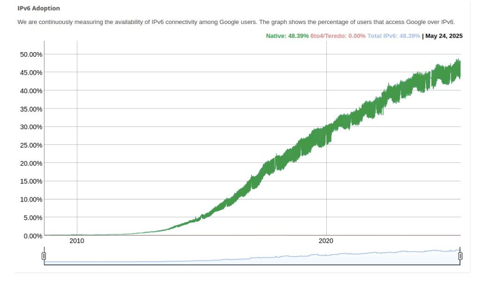
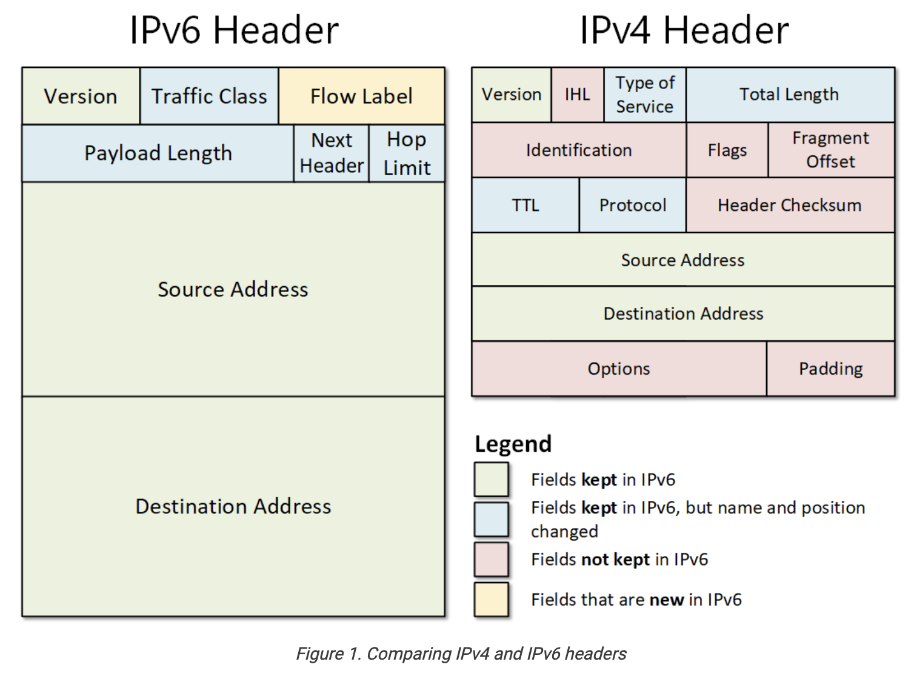

# IPv6 – Foundations

## 1. What is the Internet?
### 1.1 Internet = "network of networks"
- The Internet is not a single machine or cable. It’s a federation of thousands of independent networks, all connected together and agreeing to exchange traffic.
- These independent networks are called **Autonomous Systems** (ASes).
- It is a **giant network made up of smaller networks** (ISPs, universities, companies, data centers).
- These networks are linked at **Internet Exchange Points (IXPs)** where different providers physically connect their routers.
- ISPs are also ASes, and they connect to each other or to larger carriers at Internet Exchange Points (IXPs).
- Others like universities or companies should apply for their own **IP Space** and they get it from **Regional Internet Registry (RIR)** and then configure their router to announce this block via **BGP(Border Gateway Protocol)**. That's how they become a part of internet.

### 1.2 How Data Flows (from your device to Google)

When you type `google.com` into your browser, this is what really happens step by step:

1. **Your device (phone/laptop)**  
   - Builds an IP packet with:
     - **Source** = your IP address (assigned by ISP or VPN).
     - **Destination** = Google’s IP address.  
   - Passes this packet to your **home router** via Wi-Fi or Ethernet.  
---
2. **Your home router**  
   - Acts as the **reception desk** in your home network.  
   - Decides how to forward packets:
     - In **IPv4**: performs **NAT (Network Address Translation)** so multiple devices can share one public IP(= one public IP, many private devices inside)
     - In **IPv6**: uses **prefix delegation** (every device gets its own globally unique IPv6 address).  
   - Then forwards traffic to your ISP’s network.

   ### Public vs Private IPs and NAT (IPv4 vs IPv6)

#### Allocation inside your home (Private IPs)
- Your **home router** runs a **DHCP server (Dynamic Host Configuration Protocol)**.  
- DHCP automatically hands out **private IPs** to each device:  
  - Laptop → `192.168.0.15`  
  - Phone → `192.168.0.23`  
- These addresses are only valid inside your local network (LAN).  
- They are **not routable on the Internet**.

#### Allocation to the outside (Public IP)
- Your **ISP assigns a public IP** to your home router.  
- Example: `84.156.221.42`.  
- This is what websites see when you visit “What is my IP?”.  
- Public IP = globally unique and routable.

#### NAT (Network Address Translation)
- Since all devices in your LAN share one public IP, the router must **translate**:
  - Outgoing packet (before NAT):  
    ```
    Source = 192.168.0.15
    Destination = 172.217.169.14 (Google)
    ```
  - Outgoing packet (after NAT):  
    ```
    Source = 84.156.221.42  (router’s public IP)
    Destination = 172.217.169.14
    ```
- The router keeps a **NAT table** so when Google replies, it knows the packet belongs to your laptop, not your phone.

#### Why private vs public?
- IPv4 has only ~4.3 billion addresses.  
- NAT + private ranges (`192.168.x.x`, `10.x.x.x`, `172.16–31.x.x`) allow millions of devices to share fewer public IPs.  
- Without this system, IPv4 would have run out long ago.

#### How IPv6 changes this
- IPv6 has 128-bit addresses → 3.4 × 10³⁸ possibilities.  
- NAT is not needed: every device can get its **own public IPv6 address** directly.  
- Example:  
  - Laptop → `2001:db8:abcd:1::23`  
  - Phone → `2001:db8:abcd:1::45`  
- Websites see the same IPv6 your device has — no translation.  
- IPv6 does define **ULA (Unique Local Addresses, `fc00::/7`)** for private use, but they are rarely needed.

#### Analogy
- **IPv4 with NAT**  
  - Your apartment building has **one street address (public IP)**.  
  - Inside, each tenant has a **room number (private IP)**.  
  - The doorman (router with NAT) knows which room to deliver each letter to.  

- **IPv6 without NAT**  
  - Every tenant has their own **unique street address**.  
  - The mail (packets) goes straight to them — no doorman required.

---

3. **Your ISP (Telekom, Vodafone, O2 …)**  
   - Owns and runs a **large access network** made of:
     - **Access switches** (collect connections from neighborhoods).  
     - **Edge routers** (decide where to send traffic out of the access area).  
     - **Backbone routers** (high-capacity devices like Cisco ASRs or Juniper MX, moving traffic across cities).  
   - Assigns you an IP address (dynamic or static).

      - **Public IP allocation (from ISP to your router):**
        - ISP assigns your router a **public IP address** that represents your home on the Internet.
        - Types:
          - **Dynamic IP** (default for most home users):  
            - Changes periodically (e.g., after router reboot or every 24h).  
            - Easier for ISPs to manage and recycle scarce IPv4 addresses.
          - **Static IP** (optional, often for businesses or advanced users):  
            - Never changes.  
            - Useful for hosting servers, remote access, or VPNs that require a fixed endpoint.  
            - ISPs usually charge extra for static IPs because:
              - It consumes an address permanently (can’t be recycled).  
              - Scarcity of IPv4 addresses makes fixed allocations more valuable.  
              - Requires extra management/support.

      - **Private IP allocation (inside your home):**
        - Handled by your **router via DHCP**.  
        - Gives each device a local private IPv4 address (`192.168.x.x`, `10.x.x.x`).  
        - These are not assigned by the ISP, only by your router.

      - **IPv6 allocation (modern networks):**
        - Your ISP usually assigns your router a whole **prefix** (e.g., `2001:db8:abcd::/56`).  
        - That prefix defines the **network part** of the IPv6 address.  
        - Your router then gives every device a **globally unique IPv6 address** from that prefix.  
        - Because IPv6 space is so huge, there is **no need for NAT** (unlike IPv4).  

⚠️ Note: This "prefix allocation" is **different** from how the device itself chooses its **host ID** (the second half of the address). We will cover that below in the MAC address section.

---

4. **Backbone networks / Internet Exchange Points (IXPs)**  
   - High-speed **fiber cables** interconnect ISPs and global carriers.  
   - IXPs (like **DE-CIX Frankfurt** or **AMS-IX Amsterdam**) are “train stations” where ISPs hand packets to each other.  
   - At the IXP, your ISP forwards traffic to Google’s network (because Google peers(“Peering” = two networks meet and exchange traffic directly without going through a third ISP) directly at major IXPs).  

---

5. **Google’s network (edge routers & data centers)**  
   - **Google edge routers** receive your packet at the nearest data center.  
   - The router forwards it into the **data center switch fabric** (huge local network).  
   - Finally, a **Google server** with the requested IP address processes your request and sends a reply packet.  
   - The reply travels the reverse path: Google → IXP → ISP → your router → your device.  

---

### 1.3 Special Case: VPNs

### VPN Types and How They Work

- **Corporate VPN (e.g., Cisco ASA, Palo Alto, Fortinet)**  
  - Your device sets up an **encrypted tunnel** to the company’s VPN appliance.  
  - Even here, your packets **must first cross your ISP’s routers and backbone** — there is no bypassing that.  
  - What the ISP sees:  
    - Source = your home public IP.  
    - Destination = company VPN appliance’s IP.  
    - Payload = encrypted blob (cannot see inner destinations).  
  - At the VPN appliance (in the office or datacenter):  
    - Packets are **decrypted**.  
    - Injected into the **corporate LAN** as if you were physically there.  
  - Effect: you appear “inside the office network” remotely.

- **Commercial VPN**  
  - Your device sets up an **encrypted tunnel** to the VPN provider’s server.  
  - ISP again only sees “you ↔ VPN server” (encrypted traffic).  
  - At the VPN server:  
    - Packets are **decrypted**.  
    - Forwarded to the actual Internet destinations (Google, YouTube, etc.).  
  - Effect: websites see the VPN server’s IP/location, not your home IP.  

👉 In both cases:  
- Packets always **physically cross your ISP’s network first** (cables, routers, backbone).  
- The difference is the **tunnel termination point**:  
  - **Corporate VPN:** tunnel ends at the company’s gateway → traffic enters the corporate LAN.  
  - **Personal VPN:** tunnel ends at the VPN provider’s server → traffic enters the wider Internet.

---

### 1.4 Why this matters for IPv6

- Everything above describes the **plumbing of the Internet**: devices, routers, ISPs, IXPs, data centers.  
- The one thing that makes it all possible = **addresses** (IPs).  
- In IPv4, these are 32-bit addresses (≈ 4.3 billion).  
- In IPv6, these are 128-bit addresses (≈ 3.4 × 10³⁸).  


## What is IP?
- **IP (Internet Protocol) address** = unique identifier for a network interface.
- Works across all types of connections:
  - **Wi-Fi** (wireless link to a router at home, work, or public hotspot)
  - **Ethernet (cable)** (physical plug-in connection to a switch or router, common in offices/servers)
  - **Mobile data (4G/5G)** (connection to your mobile provider’s cellular towers, IP comes from telecom network)
  - **Even virtual interfaces** (software-defined “network cards” inside cloud servers or virtual machines; they behave like real hardware but exist only in software)
- A device can have multiple IPs (**one per interface**, e.g., your laptop might have one for Wi-Fi and another for Ethernet at the same time).

---

## IPv4 Addressing (32-bit)
- Written in **dotted decimal**: e.g., `192.168.0.10`
- Structure:
  - 4 numbers (0–255), each = **8 bits (1 octet)**.
  - Example:
    - `192` → `11000000`
    - `168` → `10101000`
    - `0`   → `00000000`
    - `10`  → `00001010`
- Total = 4 × 8 bits = **32 bits**.

---

## IPv6 Addressing (128-bit)
- Written in **hexadecimal groups** separated by `:`.
- Full address has **8 groups × 16 bits = 128 bits**.

### Example: `2001:0db8::1`

1. **Full form:**
`2001:0db8:0000:0000:0000:0000:0000:0001`
2. **Remove leading zeros in each group:**
`2001:db8:0000:0000:0000:0000:0000:1`
3. **Collapse consecutive all-zero groups (only once!):**
`2001:db8::1`

⚠️ Important: `::` may only be used **once** per address.  

- Allowed: `2001:DB8::8:0:0:417A` ✅ 
- Not allowed: `2001:DB8::8::417A` ❌ 

Always expands back to **8 groups** internally.

## Why IPv6?
- IPv4 = ~4.3 billion addresses → exhausted in 2019 (RIPE NCC ran out).
- IPv6 = 128-bit space → That’s 340 undecillion possible ~3.4 × 10³⁸ addresses = 7·1023 Adressen pro Quadratmeter
- Enough for every phone, car, fridge, sensor (IoT), etc.

## How it started Vs. How it's going

### 1995–2006: 6Bone Test Network
- **Goal:** Provide a testbed for IPv6 before real deployment.  
- **Method:** Used *IPv6-in-IPv4 tunneling* (encapsulating IPv6 packets inside IPv4).  
- **Impact:** Allowed researchers, universities, and early adopters to experiment with routing and addressing.  
- **Shutdown:** 2006, once native IPv6 began rolling out.

### 2011: World IPv6 Day (June 8, 2011)
- Major players (**Google, Yahoo, Facebook**) enabled IPv6 alongside IPv4 for 24 hours.  
- Purpose:
  - Test IPv6 readiness worldwide.  
  - Identify breakages in ISP and enterprise networks.  
- Result:  
  - Only ~0.229% of users were on IPv6.  
  - Quote (Igor Gashinsky, Yahoo):  
    > “That was a lot of work for 0.229% IPv6 users.”

### Challenges During Early Adoption
1. **New protocols = new risks**  
   - IPv6 + ICMPv6 introduced unfamiliar attack surfaces.  
   - Example: IPv6 Neighbor Discovery could be abused like ARP spoofing in IPv4.  

2. **Security tools not compatible**  
   - Firewalls, IDS/IPS initially built for IPv4.  
   - Could not parse IPv6 headers or extension headers properly.  

3. **Knowledge gap in admins**  
   - Network staff had decades of IPv4 training.  
   - Misconfigurations common when shifting to IPv6.  

4. **Lack of monitoring/analysis tools**  
   - IPv6 traffic harder to inspect and log in early years.

### 2011–2025: Adoption Growth
- After 2011, gradual rollout by ISPs, CDNs, and device vendors.  
- Google IPv6 adoption data (2009–2025):  
  - 2011: ~0.2%  
  - 2020: ~35%  
  - 2025: ~48% (almost half of Google traffic is IPv6).  
- Adoption continues to rise, driven by:  
  - IPv4 exhaustion.  
  - Mobile providers (4G/5G) going IPv6-first.  
  - Cloud/data centers supporting dual-stack or IPv6-only setups.  



### IPv4 header Vs. IPv6 header

## 2. IPv4 Header vs IPv6 Header

### 2.1 IPv4 Header
- **Version** → always `4` for IPv4.  
  - (**Version 5** was already used in the 1980s/1990s for an **experimental streaming protocol** called ST2, defined in RFC 1190/1819. It never became mainstream, but since the number was taken, the next Internet Protocol became **IPv6**.)
- More **complex** and contains many fields that made sense in the 1980s but became inefficient later.
- Key fields:
  - **IHL (Internet Header Length)** → tells how long the header is (because it can vary).
  - **Type of Service** → QoS marking (used rarely).
  - **Total Length** → size of the whole packet.
  - **Identification, Flags, Fragment Offset** → used for packet fragmentation (breaking big packets into smaller ones).
  - **TTL (Time To Live)** → limits how many hops a packet can make.
  - **Protocol** → tells if the payload is TCP, UDP, ICMP, etc.
  - **Header Checksum** → error detection for header integrity.
  - **Source Address** → sender’s IPv4 address (32 bits).
  - **Destination Address** → receiver’s IPv4 address (32 bits).
  - **Options, Padding** → optional, rarely used.

👉 Result: IPv4 header is **variable-length** and costly to process by routers.

---

### 2.2 IPv6 Header
- **Version** → always `6` for IPv6.  
  - (Skips “5” because of ST2 experiment.)
- Designed to be **simpler, fixed-size, and faster** for routers to handle.
- Key fields:
  - **Version** → always `6` for IPv6.
  - **Traffic Class** → replacement of IPv4’s Type of Service (used for QoS/priority).
  - **Flow Label** (new) → allows labeling of packet flows for special handling (e.g., streaming).
  - **Payload Length** → size of the data after the header.
  - **Next Header** → replacement of Protocol field; indicates TCP, UDP, ICMPv6, or an extension header.
  - **Hop Limit** → replacement of TTL; decreases with each router hop.
  - **Source Address** → sender’s IPv6 address (128 bits).
  - **Destination Address** → receiver’s IPv6 address (128 bits).

👉 Result: IPv6 header is **fixed-size (40 bytes)**, easier for routers to parse, and puts optional/rare features into **extension headers** instead of bloating the base header.

---

### 2.3 Key Differences
- IPv6 removes many IPv4 fields:
  - No Header Checksum (error detection is handled elsewhere).
  - No Fragmentation fields (handled differently).
  - No Options in the main header (moved to extension headers).
- IPv6 adds:
  - **Flow Label** (new concept for traffic flows).
- IPv6 keeps:
  - Source/Destination addresses, TTL (renamed Hop Limit), Protocol (renamed Next Header).

👉 IPv6 is **leaner, cleaner, and optimized** for modern hardware.

### 2.4 IPv6 Address Types by Prefix
| Address Type        | Binary Prefix        | IPv6 Notation | Example | Real-life meaning |
|---------------------|----------------------|---------------|---------|-------------------|
| **Unspecified** (literally all zeros)     | 00…0 (128 bits)      | `::/128`      | `::`    | Used as “no address” (e.g., before an interface configures one). |
| **Loopback** (“I’m talking to myself.”)       | 00…1 (128 bits)      | `::1/128`     | `::1`   | Like IPv4 `127.0.0.1`, used to test networking stack locally, it is sent out and immediately comes back in. |
| **Multicast**       | 11111111             | `FF00::/8`    | `FF02::1` | Replaces IPv4 broadcast. Devices subscribe to groups like `ff02::1` (all nodes) or `ff02::2` (all routers) from the moment the interface(= your network card or port) comes up(=the operating system activates it and marks it as ready to send/receive traffic)|
| **Link-Local Unicast** | 1111111010         | `FE80::/10`   | `fe80::1%eth0` | Always auto-assigned, used to talk to neighbors and discover routers. |
| **Unique-Local Unicast (ULA)** | 1111110    | `FC00::/7`    | `fd12:3456:789a::1` | Like IPv4 private ranges (`192.168.x.x`), only routable inside private networks. |
| **Global Unicast**  | everything else      | (commonly `2000::/3`) | `2001:4860:4860::8888` | Public Internet addresses (e.g., Google DNS). |

#### Examples

- `2001:DB8:0:0:8:0800:200C:417A` → **Global Unicast**  
- `FF01:0:0:0:0:0:0:101` → **Multicast**  
- `0:0:0:0:0:0:0:1` → **Loopback**  


## Key Points

- IPv6 addresses are categorized by their **prefix bits**.  
- `/64` is the default subnet size (huge host ID space).  
- Special cases:  
  - `::/128` = unspecified  
  - `::1/128` = loopback  
- IPv6 **does not have broadcast** → replaced with multicast groups (`ff02::1`, `ff02::2`).  
- Shortening rules keep addresses readable and consistent.  

## 3. Subnets 

### 3.1 What is a subnet?
- A **subnet** = a block (or slice) of IP addresses that belong together.
- Think of the IP universe as a giant street map, then:
    - Subnets = neighborhoods.  
- Each subnet is defined by:
  - **Network part** (fixed bits = the neighborhood ID)
  - **Host part** (remaining bits = house numbers inside the neighborhood)

---

### 3.2 IPv4 example
- `192.168.0.0/24`  
  - `/24` = 24 bits are fixed for the network.  
  - Remaining = 32 − 24 = 8 bits → 2⁸ = **256 host addresses**.  
- Hosts range from `192.168.0.0` to `192.168.0.255`.  
- Only 256 possible “house numbers” inside this subnet.

---

### 3.3 IPv6 example
- `2001:db8:abcd::/64` In binary it looks like:
```
2001      : 0db8      : abcd      : 0000   | 0000      : 0000      : 0000      : 0000
[ 16 bits ][ 16 bits ][ 16 bits ][ 16 bits]|[host part begins         →               ]
```
  - `/64` = 64 bits are fixed for the network (the prefix given by ISP).  
  - Remaining = 128 − 64 = 64 bits → 2⁶⁴ ≈ **18 quintillion possible addresses per subnet**.  
- Hosts range from `2001:0db8:abcd:0000:0000:0000:0000:0000` up to `2001:db8:abcd::ffff:ffff:ffff:ffff`.  
- In other words, the neighborhood is defined by the prefix, but there are an enormous number of possible “house numbers” (host IDs).

---
### 3.4 How Host IDs Are Assigned

Up to now we said:  
- An IP address = **[network prefix] + [host ID]**. This is CIDR notation (Classless Inter-Domain Routing).
- The prefix is fixed (defines the subnet).  
- The host ID varies (defines the individual device).  

But: **who assigns the host ID?**  
It depends on IPv4 vs IPv6.

---

#### IPv4 Host IDs
- In IPv4, the **router** usually assigns host IDs via **DHCP (Dynamic Host Configuration Protocol)**.  
- Example in `192.168.0.0/24`:  
  - Laptop gets `.15`  
  - Phone gets `.20`  
  - Printer gets `.50`  
- The router picks numbers from the available pool and hands them out to devices when they join the LAN.  
- If two devices accidentally got the same host ID → conflict (they couldn’t both work).  

---

#### IPv6 Host IDs
- Your ISP assigns your **router** a whole **prefix** (e.g., `2001:db8:abcd::/56`).  
- That prefix defines the **network part** of IPv6 addresses in your home/office.  
- The router splits this into `/64` subnets and **advertises those prefixes** to devices (via *Router Advertisements*).  
- Each device then **generates its own host ID** inside that prefix.  
- Result: each device creates its **own full Global Unicast address**.  
- Because IPv6 has such a huge address space, there is **no NAT needed** (unlike IPv4).  

✅ **Important points:**  
- The router only hands down the **prefix**.  
- The device itself always generates the **host ID**.  
- The router never assigns the full global IPv6 address directly.  

- IPv6 mandates that a subnet must be at least `/64`.  
- In other words:  
  - **First 64 bits** = prefix (from ISP, passed via router).  
  - **Last 64 bits** = host ID (device decides).  

### Two approaches for host ID generation:
1. **Early method:** Host ID derived from device’s MAC address (**EUI-64**).  
2. **Modern method:** Host ID chosen randomly (privacy extensions).
👉 This explains why MAC addresses enter the picture next: because IPv6 originally tied the host ID generation directly to the hardware MAC:

## 4. MAC Addresses and IPv6 Host IDs
### 4.1 What is a MAC address?
- **MAC = Media Access Control address.**  
- A unique hardware ID burned into every network interface (Wi-Fi card, Ethernet port, etc.).  
- Format: 6 bytes = 48 bits. Example: 
`00:1A:2B:3C:4D:5E`
- Think of it like your device’s **serial number for networking**.  
- Unlike IP addresses (which change depending on network), MAC addresses are fixed to the hardware.

### 4.2 How IPv6 uses MAC for host IDs (early method)
- Recall: an IPv6 address = **[network prefix] + [host ID]**.  
- The **prefix** comes from the ISP.  
- The **host ID** is chosen by the device inside that subnet.  
- Early IPv6 devices generated the host ID automatically from the MAC address (called **EUI-64 format**).  
- Example:  
- Prefix from ISP: `2001:db8:abcd:1234::/64`  
- MAC address: `00:1A:2B:3C:4D:5E`  
- Converted host ID: `021a:2bff:fe3c:4d5e`  
- Full IPv6 address:  
  ```
  2001:db8:abcd:1234:021a:2bff:fe3c:4d5e
  ```
### 4.3 Modern IPv6 host IDs
- To avoid predictability and privacy issues, modern IPv6 devices use **random host IDs** instead of embedding the MAC.  
- Example:
`2001:db8:abcd:1234:9f12:88c0:22ab:7c3d`
- Still follows the same logic:  
- First 64 bits = prefix from ISP (subnet definition).  
- Last 64 bits = host ID, but now random rather than tied to MAC.

---

## 5. Attacks and Scanning in IPv4 vs IPv6

### 5.1 Why attackers scan
- Attackers cannot exploit what they cannot find.
- To build a **botnet** (network of compromised computers (bots) controlled by an attacker, often used for DDoS, spam, or malware spreading), attackers first need to **discover active hosts** (computers, IoT devices, servers).  
- First step = **reconnaissance**: This is done through **host scanning** → sending probes to IP addresses in order to see who responds.  
- Next steps = probe (send crafted packets to) those devices for entry points (ports and services).  
- Final goal = exploit a weakness:
  - Steal data (credentials, personal info, business secrets).  
  - Take control of the system (remote shells, admin access).  
  - Enlist devices into botnets for DDoS or spam.  

---

### 5.2 LAN vs Public Internet

- **Inside a LAN**  
  - Devices share the same **network prefix**.  
  - Example (IPv4): `192.168.0.0/24` → Laptop `192.168.0.15`, Printer `192.168.0.50`.  
  - Because they share the prefix, packets flow directly between them without going through the Internet.  
  - That’s why you can still print or stream to a smart TV when your Internet is down.  

- **Outside (Internet)**  
  - The LAN is hidden behind a **router with NAT**.  
  - Router has:
    - Private side = `192.168.0.1` (LAN-facing).  
    - Public side = `84.156.221.42` (ISP-assigned).  
  - From the Internet, attackers only see the **public IP** (`84.156.221.42`), never your private LAN IPs.  

---

### 5.3 Solicited vs Unsolicited Packets

- **Solicited traffic:**  
  - Initiated by you.  
  - Example: Your browser requests `google.com`.  
  - NAT creates an entry: "192.168.0.15:51234 → 84.156.221.42:443 (HTTPS)".  
  - When Google replies, the router knows which device to send it to.  

- **Unsolicited traffic:**  
  - Arrives at your public IP without you asking.  
  - Example: Attacker sends a TCP SYN packet to `84.156.221.42:3000`.  
  - Router checks NAT table: no entry found → drops the packet.  
  - This is why NAT provides a default safety layer: strangers can’t just walk into your LAN.  

---

### 5.4 Port Forwarding

- Normally, unsolicited packets stop at the router.  
- If you configure **port forwarding**, the router knows to forward certain traffic inside.  
- Example:
  - You run a Node.js app on laptop `192.168.0.15`, listening on port 3000.  
  - Router rule: “Forward all traffic on public IP port 3000 → 192.168.0.15:3000.”  
  - Now outsiders can reach your server at `84.156.221.42:3000`.  

👉 This is why attackers focus on **ports**: each open port = a service potentially exposed to the world.  

---

### 5.5 What does "listening" mean?

- When a program “listens,” it tells the OS: “Bind me to this port and deliver any incoming traffic here.”  
- Examples:
  - **Node.js**  
    ```js
    app.listen(3000);
    console.log("Listening on port 3000");
    ```
  - **Java (Spring Boot)**  
    ```
    Tomcat started on port(s): 8080
    ```
  - **Python (Flask)**  
    ```python
    app.run(host="0.0.0.0", port=5000)
    ```

- Locally, you see `http://localhost:3000`.  
- Globally, if port 3000 is forwarded on your router, outsiders can also reach it via your **public IP** (`http://84.156.221.42:3000`).  

---

#### How local apps become reachable from outside

1. **Direct port forwarding (home/lab setup)**  
   - Router forwards public traffic on port X → to device + port Y inside the LAN.  
   - Example: forward `:3000` externally → `192.168.0.15:3000`.

2. **Reverse proxy (production setup)**  
   - Middleman software like Nginx or Apache sits on standard web ports (80/443).  
   - Forwards traffic internally to your app (e.g., port 3000).  
   - Adds HTTPS, security filtering, and scalability.

3. **Tunneling services (developer convenience)**  
   - Tools like **ngrok** or **localtunnel** create a secure tunnel from the Internet → to your local port.  
   - Useful for demos or testing without touching router settings.  
   - Example: `https://randomstring.ngrok.io` → forwarded to your local app on port 5000.

****Big picture:****  
- **Listening** = app is ready on a port.  
- To be reachable globally, that port must be exposed in one of three ways:  
  - Router forwarding,  
  - Reverse proxy on 80/443,  
  - Tunnel service (ngrok).  
- In production, reverse proxies are standard; for testing, tunneling tools are common.
---

### 5.6 IPv4 Scanning

1. **Host discovery (which devices exist in a subnet):**  
   - Send ICMP Echo (“ping”) or TCP SYN probes.  
   - Tools: `nmap -sn 192.168.0.0/24`.  
   - Easy in IPv4: only 256 possibilities in a `/24`.  

2. **Port scanning (which services are listening):**
> Up to now, we focused on **hosts**: which IP addresses inside a subnet are alive.  The next step is **ports**: which *services/programs* are listening on those hosts.
> #### Where ports fit in the stack
>- **IP layer (IPv4/IPv6):** delivers the packet to the right machine.  
>- **Transport layer (TCP/UDP):** delivers the packet to the right program on that machine, using **port numbers**.  
>- **Application layer:** interprets the data according to the service (HTTP, SSH, DNS, etc.).
Your laptop (IP: 84.156.221.42, port 52314)
→ Google server (IP: 142.250.185.14, port 443 HTTPS)
→ Application: HTTPS GET request

>- Without ports, the OS would not know whether a packet is for the **web server**, the **SSH daemon**, or some other program.
>#### Why scanning ports matters
>- Each open port = one program actively **listening** for connections.  
>- Attackers probe ports to discover:
>   - Which services are exposed (HTTP, SSH, databases).  
>   - Which versions they run.  
>   - Whether those versions have known vulnerabilities.

>👉 With this context in place, we can now look at the details:  

For each live host, attackers scan ports 0–65535:
    In TCP/UDP, the **port number field is 16 bits long** → 2¹⁶ = 65,536 possible values.  
    - Port numbers let one IP run many services at once.  
      - 22 = SSH  
      - 80 = HTTP  
      - 443 = HTTPS  
      - 3306 = MySQL  
    - **Well-known ports (0–1023):**  
      - Reserved for core Internet services.  
      - Binding to them requires **admin/root rights** for extra safety.  
    - **Registered ports (1024–49151):**  
      - Commonly assigned to applications (e.g., 3306 = MySQL, 5432 = PostgreSQL).  
    - **Dynamic/Ephemeral ports (49152–65535):**  
      - Picked by the OS for temporary outbound connections.  
      - Example: browser connects to Google → source port 52314 → destination port 443.  
    - Attackers scan all ports (0–65535) on each host.  
    - Any open, listening port could be a potential attack entry point.
    
3. **Service and version detection:**  
   - Fingerprint services by sending crafted packets.  
   - Example:  
     - SSH banner reveals “OpenSSH 7.2p2”.  
     - HTTP header reveals “Apache/2.4.41 (Ubuntu)”.  

4. **Vulnerability mapping:**  
   - Compare versions to public vulnerability databases (CVEs).  
   - Example: Apache Struts CVE-2017-5638.  

5. **Exploitation:**  
   - Launch exploit → gain unauthorized access.  
   - Example: SMB exploit (EternalBlue) → install ransomware.  

---

### 5.7 IPv6 Scanning
- Since IPv6 mandates that a subnet must be at least `/64`:
- And a `/64` subnet has 2⁶⁴ ≈ 18 quintillion possible host IDs.  
  - Brute-forcing every address = computationally impossible = **Blind Scanning is Impractical**

**But once an IPv6 address is known, port scanning works exactly the same.**  
- Host discovery is the hard part.  
- ***Port → Service → Version → Vulnerability → Exploit*** sequence doesn’t change.

### 6.4 Practical Shortcuts Attackers Use

Since blind scans don’t work, attackers use **smarter techniques**:

1. **Predictable Host IDs**
 - Early IPv6 devices used **MAC-based host IDs (EUI-64)**.  
 - If the attacker knows the vendor prefix of the MAC (e.g., Apple, Intel), they can guess likely addresses.  
 - Manually chosen host IDs are also easy to guess:
   - `::10`, `::20`, `::100`  
   - Embedded IPv4 addresses (e.g., `::192.168.0.10`).  

2. **DNS Resolution**
 - Many services publish their IPv6 addresses in DNS (AAAA records).  
 - For example run *dig* (Domain Information Groper) on your own computer:
   ```
   dig AAAA facebook.com
   ```
   👉 That’s Facebook’s IPv6 address.
 - That means attackers don’t need to brute-force 2⁶⁴ possibilities; the IPv6 address is public knowledge.

> **But**: discovery is only step 1. Knowing an IP doesn’t mean you can break into it. What really matters is **what’s listening on that IP**.

3. **Local Access Attacks**
 - If an attacker is already inside the LAN (infected laptop, rogue Wi-Fi user), discovery becomes trivial:
   - **Multicast groups (RFC 2375):**
     - `FF02::1` → All Nodes  
     - `FF02::2` → All Routers  
     - `FF05::3` → All DHCP Servers  
     → One packet reveals all participants.  
   - **Fake Router Advertisements (RAs):**
     - Attacker pretends to be a router, tricks devices into revealing themselves.  
   - **Sniffing Duplicate Address Detection (DAD):**
     - When a device joins, it announces “I want to use this address; anyone else?”  
     - Attacker can listen and harvest active host IDs.  
  

---

### 5.8 Dual Stack Reality

- Most networks run **both IPv4 and IPv6 (dual stack)**.  
- That means devices have two addresses:
  - One IPv4 (public via NAT).  
  - One IPv6 (global, from ISP prefix).  
- Analogy: Same building, but it has **two official street addresses**.  

**Attackers prefer IPv4 today** because:  
- IPv4 subnets are enumerable and tools are mature.  
- Many services still exposed only on IPv4.  

But:  
- If an IPv6 address leaks (via DNS or predictable host IDs), attackers scan its ports the same way.  
- So networks are only as secure as their weakest stack.  

---

### 5.9 Key Takeaways
- LAN = devices sharing the same prefix; they talk directly without Internet.  
- NAT hides LAN behind one public IP. Unsolicited packets are dropped unless port forwarding is configured.  
- Ports = entry points into services. “Listening” means a program is actively waiting on that port.  
- IPv4 scanning is trivial; IPv6 brute-force scanning is impossible, but shortcuts exist.  
- Dual stack = attackers will use whichever address family is easier. Today that’s often IPv4.

---
# IPv6 - Address Types

IPv6 addresses are categorized into **three fundamental types**. Each type defines **who receives a packet** when you send it.

## 1. Unicast (One-to-One)

A **unicast address** identifies a single interface. Packets sent to a unicast go to exactly **one device**.

### Subtypes of Unicast

1. **Global Unicast**  
   - **Prefix:** `2000::/3`  
   - **Scope:** The entire Internet  
   - **Routable:** Globally 🌐 
   - **Analogy:** International phone number (works everywhere)  
   - **Examples:**  
     - Google DNS → `2001:4860:4860::8888`  
     - Cloudflare DNS → `2606:4700:4700::1111`  
   - **Real-life:** When you browse `https://google.com`, your computer’s **global unicast** is the source address used to reach Google’s **global unicast servers**.

2. **Link-Local Unicast**  
   - **Prefix:** `fe80::/10`  
   - **Scope:** Valid only on the *local link* (one Ethernet segment or Wi-Fi network)  
   - **Routable:** Never forwarded by routers ❌ 
   - **Analogy:** Room number inside one apartment (only meaningful if you’re already inside that apartment)  
   - **Examples:**  
     - `fe80::1a2b:3c4d:5e6f:7g8h%eth0`  
   - **Real-life:**  
     - Every IPv6 interface automatically configures a link-local address.  
     - Used for router discovery and neighbor discovery.  
     - Example: When your laptop boots(starts up), it automatically assigns itself a link-local address. It uses this to ask: “Hey, who is the default router?” (This “asking” happens with a special kind of message called **ICMPv6 Neighbor Discovery**):
      1. Laptop boots → generates `fe80::…` (Host ID from MAC or random).  
      2. Laptop sends a **Router Solicitation** to the multicast `ff02::2` (all routers).  
      3. Router replies from its own **Link-Local** (e.g. `fe80::1`), saying: *“I am your default gateway, and here’s the global prefix you should use.”*  
      4. Only **after this exchange** does the laptop create its Global Unicast address.  

  ⚠️ **SO**:
  - the **Link-Local prefix is fixed (`fe80::/10`)** and the device always self-assigns it.  
  - The router only hands down the **global prefix** later.

3. **Unique-Local Unicast (ULA)**  
   - **Prefix:** `fc00::/7` (in practice `fdxx::/8`)  
   - **Scope:** Private networks  
   - **Routable:** Inside private network, Never on Internet  
   - **Analogy:** Company’s internal phone extension (works across office buildings, but not outside)  
   - **Examples:**  
     - `fd12:3456:789a::1` (internal database server)  
   - **Real-life:**  
     - A company uses ULA for file servers, printers, or intranet services.  
     - These addresses are reachable across internal routers but invisible to the outside world.

### ✅ Quick Recap Table

| Type           | Prefix       | Scope        | Routed?            | Example                  | Analogy                        |
|----------------|-------------|--------------|--------------------|--------------------------|--------------------------------|
| Global Unicast | `2000::/3`  | Internet     | Global           | `2001:4860:4860::8888`   | International phone number     |
| Link-Local     | `fe80::/10` | One link     | Never forwarded  | `fe80::1%eth0`           | Room # inside an apartment     |
| Unique-Local   | `fdxx::/8`  | Private net  | Inside private   | `fd12:3456:789a::1`      | Company phone extension        |

## 2. Multicast (One-to-Many)

A **multicast address** identifies a group of interfaces. Packets sent to a multicast are delivered to **all members of the group**. (⚠️ IPv6 has **no broadcast at all**)

- **Prefix:** `ff00::/8`  
- **Scope:** Defined by flags, common ones include:  
  - `ff02::1` → All nodes on the local link  
  - `ff02::2` → All routers on the local link  
- **Real-life:**  
  - Your laptop multicasts to `ff02::2` (all routers) to ask: *“Who is my default router?”*  
  - Streaming applications can use multicast to send one stream to many clients.


## 3. Anycast (One-to-Nearest)

An Anycast address can be used by **multiple machines** at the same time. But when you send a packet to that address, only **one machine** receives it, the one that is **closest** according to the routing system. This is different from multicast (many receivers) and unicast (exactly one fixed receiver).

- **Prefix:** None special (looks like unicast)  
- **Scope:** Usually global  
- **Analogy:** Toll-free number (you always reach the nearest call center)  
- **Real-life:**  
  - Root DNS servers → e.g. `2001:500:2f::f` is advertised from many locations worldwide. You always connect to the closest one.  
  - Google DNS (2001:4860:4860::8888) is anycasted, so you automatically hit the closest Google data center.


## Big Picture Summary

- **Unicast (one-to-one):**  
  - **Global (`2000::/3`)** → Internet-wide, routable everywhere (e.g. Google DNS `2001:4860:4860::8888`).  
  - **Link-Local (`fe80::/10`)** → mandatory, always created on boot, valid only on the local link, never forwarded. Used first to find the router.  
  - **Unique-Local (`fdxx::/8`)** → private networks, routable only internally (like IPv4 private ranges).  

- **Multicast (one-to-many):** replaces IPv4 broadcast. Devices auto-join groups like:  
  - `ff02::1` → all nodes on the link (“Hey, every IPv6 device, listen up.”)  
  - `ff02::2` → all routers on the link (“Hey, only the routers, I need you.”)  

- **Anycast (one-to-nearest):** same address advertised by multiple servers, but only the closest responds (used by DNS root servers, CDNs, global DNS resolvers).  

- **Every IPv6 interface always carries:**  
  - **1× Link-Local address** (`fe80::…`),  
  - **some Multicast memberships** (`ff02::1`, `ff02::2` if router),  
  - **0 or more Global/ULA addresses** depending on the network.  