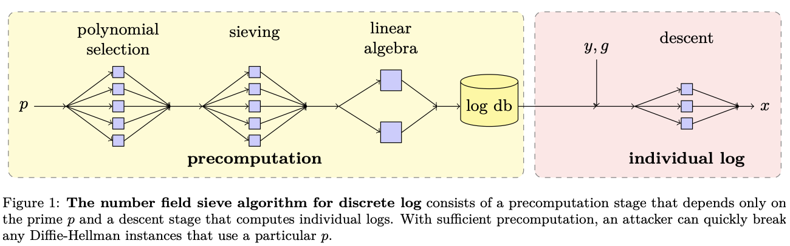
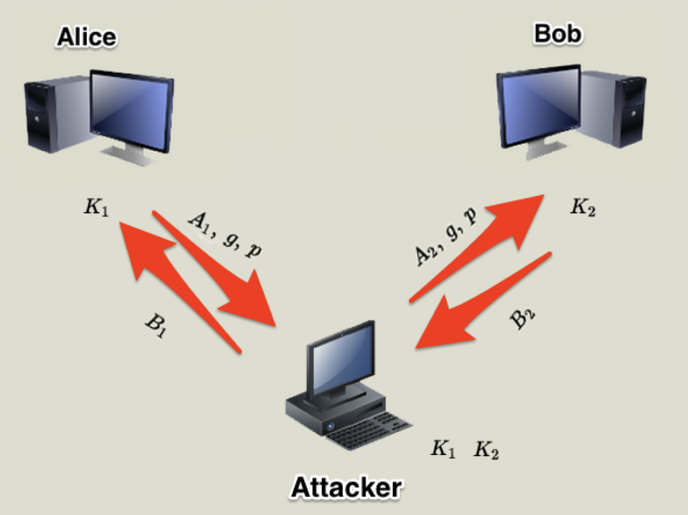
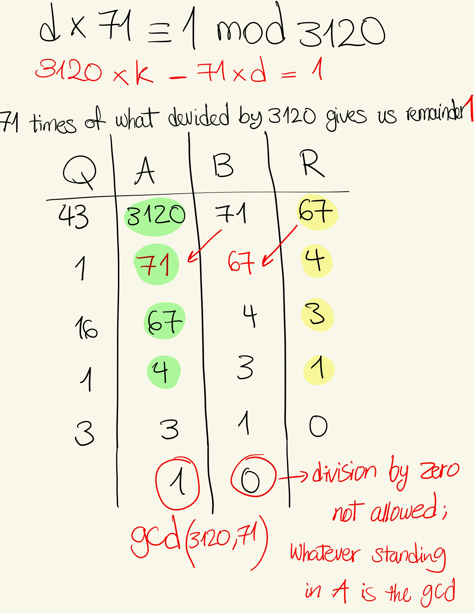
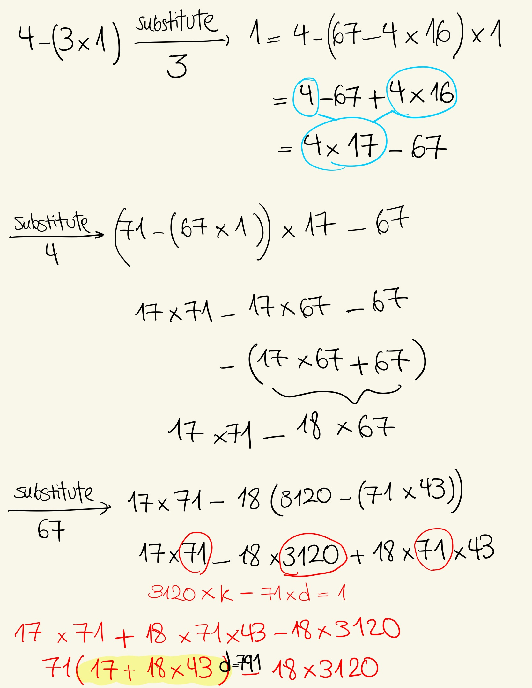
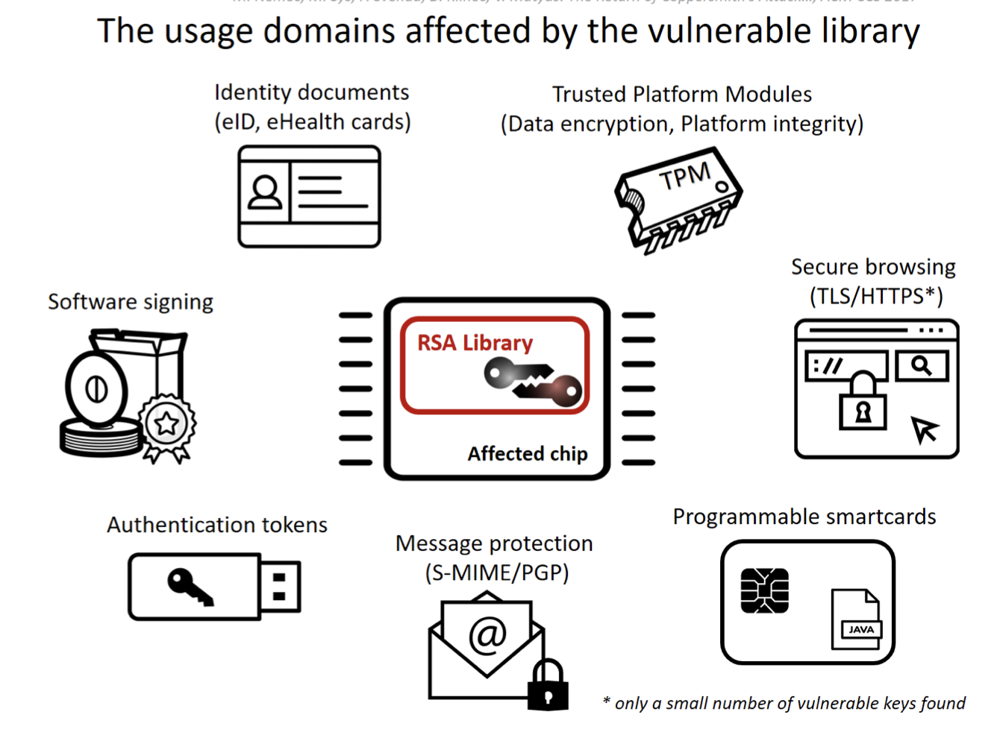
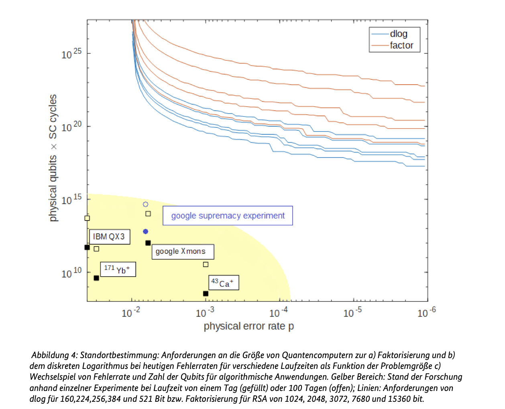

# Diffie–Hellman Key Exchange (DH)

## What Is It?

Diffie–Hellman (DH) is a method for two parties (e.g., Alice and Bob) to agree on a **shared secret** over an insecure channel: without transmitting the secret itself.

It relies on:

* Modular arithmetic
* The difficulty of the **discrete logarithm problem (DLP)**

## Core Setup

Choose:

* A large **prime number** `p`
* A **primitive root** `g` mod `p` (also called a generator)

Each party:

* Picks a secret exponent:

  * Alice: `a`
  * Bob: `b`
* Computes public value:

  * Alice: `A = g^a mod p`
  * Bob: `B = g^b mod p`
* Exchanges these over the network

Then:

* Alice computes: `K = B^a mod p`
* Bob computes:  `K = A^b mod p`

Both arrive at:

```
K = g^(ab) mod p
```

They now share `K` without anyone else being able to compute it (assuming DLP is hard).

---

## Why It’s Secure: Asymmetry of Effort

| Role      | Task                         | Effort                        |
| --------- | ---------------------------- | ----------------------------- |
| Alice/Bob | `g^a mod p`                  | Fast (**modular exponentiation**) |
| Attacker  | Recover `a` from `g^a mod p` | Hard (That’s the **Discrete Logarithm Problem** = Find the **exponent a** from a **modular exponentiation**.)           |

**That’s asymmetric:**
- Alice has it easy.
- Attacker has it hellish.

### Discrete Log Problem (DLP):

Given:
`A = g^a mod p`, find `a`.

* With large `p` (e.g., 2048 bits), this is **computationally infeasible**.
* This asymmetry forms the core of DH’s security.

## Understanding the Math With a Tiny Playground

### Setup 🌪️ 

Use:

* Prime `p = 11`
* Candidate generator `g = 2`

Compute:

| a  | 2^a  | 2^a mod 11 |
| -- | ---- | ---------- |
| 0  | 1    | 1          |
| 1  | 2    | 2          |
| 2  | 4    | 4          |
| 3  | 8    | 8          |
| 4  | 16   | 5          |
| 5  | 32   | 10         |
| 6  | 64   | 9          |
| 7  | 128  | 7          |
| 8  | 256  | 3          |
| 9  | 512  | 6          |
| 10 | 1024 | 1 ✅        |

✅ All non-zero numbers mod 11 `{1, ..., 10}` are hit once → `g = 2` is a **primitive root mod 11**

## Primitive Root, What It Means

A number `g` is a **primitive root modulo p** if:

> The powers `g^1, g^2, ..., g^(p-1) mod p` hit **every number from 1 to p−1** (no repeats, no misses).

In our example:

```
{2^1, 2^2, ..., 2^10} mod 11 = {2, 4, 8, 5, 10, 9, 7, 3, 6, 1}
```

✅ Covers entire multiplicative group modulo 11

This is crucial to make sure the shared secret can be **any** value in that space.


## Exponent Cycles 🔁 

Since:

```
2^10 mod 11 = 1
```

We know exponentiation **wraps around every 10** steps.

Therefore:

```
2^a ≡ 2^b mod 11  ⇔  a ≡ b mod 10
```

This means:

* If `a = 3` and `b = 13`, then `2^a ≡ 2^b` mod 11
* They point to the **same location in the cycle**

---

## Secret Exponents in {0, ..., p−2}

We always choose secret `a` from:

```
{0, 1, ..., p−2}
```

Why not up to `p−1`?

### Fermat’s Little Theorem:

If `p` is prime, and `g` is not divisible by `p`, then:

```
g^(p−1) ≡ 1 mod p
```

This means:

* The exponents cycle every `p−1`
* So there are only `p−1` **unique outputs**
* Larger exponents like `g^1000 mod p` just **loop back**

---

## Mini Diffie–Hellman Walkthrough

Let’s simulate a key exchange with:

```plaintext
p = 11
g = 2
```

* Alice picks `a = 3`:
  `A = 2^3 mod 11 = 8`
* Bob picks `b = 6`:
  `B = 2^6 mod 11 = 9`

Now:

* Alice computes `K = B^a = 9^3 = 729 mod 11 = 3`
* Bob computes `K = A^b = 8^6 = 262144 mod 11 = 3`

✅ Shared key `K = 3`

Attacker sees:

* `g = 2`, `p = 11`, and `A = 8`

But figuring out `a` such that `2^a ≡ 8 mod 11` = **hard**, unless they brute-force or use a lookup.

With huge primes (e.g., 2048-bit), this is **not feasible**.


## Summary

* Diffie–Hellman lets two parties agree on a secret `K = g^(ab) mod p`
* It depends on:

  * Modular exponentiation
  * The cycle length `p−1` (from Fermat’s Theorem)
  * Picking `g` as a primitive root
* With a large enough `p`, attackers can’t reverse-engineer the secret


# Breaking Diffie–Hellman: NFS & Logjam

This section explains how Diffie–Hellman can be broken when the same prime `p` is reused — using the **Number Field Sieve for Discrete Logarithm (NFS-DL)** — and how this was exploited in the real-world **Logjam attack**.

---

## Problem Setup: What Does an Attacker See?

During a Diffie–Hellman key exchange, the attacker sees:

* The prime modulus `p` (often reused)
* The generator `g`
* The public key `A = g^a mod p`

The attacker’s goal is to recover the private `a`, i.e.:

```
Find a such that A = g^a mod p
```

This is the **discrete logarithm problem**.

In small fields, it’s easy. In large fields (e.g., 2048-bit `p`), it’s hard — unless we cheat with precomputation.

---

## Discrete Log Problem: A Concrete Example

Let’s take:

* `p = 17`
* `g = 3`
* `A = 13`

We're trying to find:

```
a = log₃13 mod 17
```

Try all powers:

| a | 3^a mod 17 |
| - | ---------- |
| 0 | 1          |
| 1 | 3          |
| 2 | 9          |
| 3 | 10         |
| 4 | 13 ✅       |

So:

```
a = 4
```

But if `p` were a 2048-bit prime, this table would have \~2^2048 rows. Brute-force is impossible.


## The Number Field Sieve (NFS-DL)

NFS is the fastest known algorithm for solving discrete logarithms in large prime fields. It works in two stages:

### Phase 1: Precomputation (One-Time)

* Requires only the prime `p`
* Takes weeks or months
* Produces a "log database" for the entire multiplicative group $\mathbb{Z}_p^*$

### Phase 2: Per-Target Attack

* Input: `A = g^a mod p`
* Goal: Decompose `A` into known elements
* Use precomputed logs to recover `a`

> This only works if `p` is reused across many systems.

# 🗃️ Log Database Example: Z₁₁\* with g = 2

This document shows how to construct a **logarithm database** for the multiplicative group:

```
Z₁₁* = {1, 2, 3, 4, 5, 6, 7, 8, 9, 10}
```

## Definition: $\mathbb{Z}_p^*$

$\mathbb{Z}_p^*$ is the **multiplicative group modulo `p`**:

* It consists of all integers $x in {1, 2, ..., p−1}$
* Each element must be **coprime to `p`**
* If `p` is prime, then $\mathbb{Z}_p^*$ always contains `p−1` elements

So:

```math
\mathbb{Z}_{11}^* = {1, 2, 3, 4, 5, 6, 7, 8, 9, 10}
```

This group is the set of possible results from `g^a mod p` in DH.


## Computation

| a | $2^a mod 11$ | Log Entry: $log_2 x mod 11$ |
| - | ------------- | ----------------------------- |
| 0 | 1             | $\log_2 1 = 0$                |
| 1 | 2             | $\log_2 2 = 1$                |
| 2 | 4             | $\log_2 4 = 2$                |
| 3 | 8             | $\log_2 8 = 3$                |
| 4 | 5             | $\log_2 5 = 4$                |
| 5 | 10            | $\log_2 10 = 5$               |
| 6 | 9             | $\log_2 9 = 6$                |
| 7 | 7             | $\log_2 7 = 7$                |
| 8 | 3             | $\log_2 3 = 8$                |
| 9 | 6             | $\log_2 6 = 9$                |

---

## How to Use the Log DB

Suppose an attacker intercepts:

```math
A = 3
```

They want to recover the private exponent `a` such that:

```math
A = 2^a mod 11
```

Look it up:

```math
log₂ 3 = 8 ⇒ a = 8
```

✅ Check:  $2^8 = 256 mod 11 = 3$

---

## Recap

A log DB maps:

```math
x = g^a mod p ⇒ log_g x mod p = a
```

For large `p`, attackers precompute this using Number Field Sieve (NFS-DL). But here, we did it by hand for small `p = 11`.

This is exactly how NFS enables instant discrete log recovery after one-time precomputation.


## The Logjam Attack (2015)

### What Happened?

Many servers allowed **EXPORT-grade DH** — using 512-bit primes.

1. 🔌 Client says: “I support normal and export-grade DH”
2. 🎩 MITM attacker downgrades to 512-bit export-grade DH
3. 🖥️ Server sends DH parameters with weak, known `p`
4. 🕵️ Attacker uses precomputed logs for that `p`
5. 🔓 Attacker recovers `a`, computes shared key `K`, decrypts TLS



This diagram shows a **Man-in-the-Middle (MITM)** attack on the classic Diffie–Hellman key exchange protocol.

### What Happens

#### Step-by-step:

1. **Alice** generates her DH public key:
   $A_1 = g^a mod p$
   She sends this to Bob but the attacker intercepts it.

2. The **attacker** generates a fake key:
   $A_2 = g^{a'} mod p$
   and sends that to **Bob** instead.

3. **Bob** replies with:
   $B_2 = g^b mod p$
   but again, the attacker intercepts it.

4. The **attacker** generates another fake key:
   $B_1 = g^{b'} mod p$
   and sends that to **Alice**.

---

### 🔐 Resulting Keys:

* Alice computes:
  $K_1 = (B_1)^a mod p$  (shared with attacker)
* Bob computes:
  $K_2 = (A_2)^b mod p$  (shared with attacker)
* The **attacker** knows both $a'$ and $b'$, so it can compute:

  * $K_1 = g^{ab'} mod p$
  * $K_2 = g^{a'b} mod p$

➡️ The attacker can now decrypt, inspect, modify, and re-encrypt all traffic between Alice and Bob.

---

### ⚠️ Diffie–Hellman **does not authenticate** the sender of the public key.

If a protocol does not include additional authentication (e.g., certificates, digital signatures), a passive or active attacker can silently insert themselves in the middle.

This is the reason why:

* TLS uses DH **only with certificates (or PSK)**
* Signal uses **authenticated key exchanges**
* SSH checks **server host keys**


### Summary

| Entity   | Key Computed               | Communicating With             |
| -------- | -------------------------- | ------------------------------ |
| Alice    | $K_1 = B_1^a$              | Thinks it's Bob                |
| Bob      | $K_2 = A_2^b$              | Thinks it's Alice              |
| Attacker | Knows both $K_1$ and $K_2$ | Fully decrypts and re-encrypts |

To prevent this, **authentication is essential** in any real-world DH deployment.

---

### Real-World Stats

* 92% of affected servers used just 2 primes!
* One NFS precomputation broke **thousands** of HTTPS sessions


## Key Takeaways

* DH security **depends on the secrecy of `a`**, and the difficulty of computing $log_g A mod p$
* **Reuse of `p`** across servers enables mass surveillance
* NFS-DL turns long-term security into a one-time investment for attackers
* Logjam proved this attack is practical


## What Can Be Done?

* Use **large primes**: `p ≥ 2048 bits` (BSI recommends ≥ 3000)
* Use **ephemeral DH** (generate new `p` per session)
* Use **Elliptic Curve Diffie–Hellman (ECDH)**
* Always **authenticate** key exchanges (e.g., via TLS certificates)

---
# DH Security Guidelines & BSI Recommendations

## Why Should $(p - 1)/2$ Be Prime?
Let’s say:

```math
p = 23
```

We now know:

- The multiplicative group ${Z}_{23}^* = {1, 2, ..., 22}$ has size 22
- That group has a subgroup of prime order:

  $$
  q = \frac{p - 1}{2} = \frac{23 - 1}{2} = 11
  $$

This makes attacks like **small subgroup confinement** harder:

- An attacker can’t trick you into using a subgroup of order 2, 4, etc.
- Because the only subgroup orders are **11**, or **22** all of which are difficult to exploit in practice

This condition ensures that $\mathbb{Z}_p^*$, the multiplicative group modulo `p`, has a **large prime-order subgroup**.

### Why it matters:

* If $(p−1)/2$ is also prime, then:

  * $\mathbb{Z}_p^*$ has a subgroup of order $q = (p−1)/2$
  * Prevents certain **small-subgroup attacks** (where attacker forces weak exponents)

Such primes `p` are called **safe primes**.

## BSI Key Length Recommendations (TR-02102-1)

| Year       | Minimum Bit Length of `p` | Notes                      |
| ---------- | ------------------------- | -------------------------- |
| 2013       | 1024 bits recommended     | Already outdated           |
| 2021       | **≥ 2000 bits**           | Required for ongoing use   |
| 2025 (now) | **≥ 3000 bits**           | Required for long-term use |

> “If a DH key will be used past 2022, `p` must be at least 3000 bits long.” – BSI TR-02102-1

### ❌ Why 512- and 1024-bit primes are insecure ❌ 

* Easily broken with NFS
* Used in Logjam-style attacks
* Many were shared (standardized primes like Oakley Groups)

---

## ⚠️ Implementation Pitfalls

The BSI references academic work (\[112] J.-F. Raymond & A. Stiglic, 2000) that highlights common flaws:

### Typical Mistakes:

* Using **non-safe primes**
* Failing to validate public keys (e.g. rejecting invalid or low-order inputs)
* Accepting **EXPORT-grade DH** without user control
* Reusing long-term secrets across many sessions
* Not verifying the identity of the communication partner

> DH on its own provides **no authentication**. It must be combined with digital signatures or certificates (e.g., in TLS).


## Use of Standardized Primes = Dangerous

Examples of standardized primes used widely:

* Oakley Group 1 (768 bits)
* Oakley Group 2 (1024 bits)
* Oakley Group 5 (1536 bits)

These values were published as defaults in old standards (e.g. IKE, SSH, Tor) but have been targets for **precomputation attacks**.

---

## Secure DH Usage Checklist

* [ ] Use **safe primes** (where `(p − 1)/2` is also prime)
* [ ] Use `p ≥ 3000 bits` (as of 2025)
* [ ] Never reuse the same `p` across all systems
* [ ] Reject unvalidated peer public keys
* [ ] Avoid EXPORT-grade fallback entirely
* [ ] Combine DH with **authentication** (e.g., signatures or certs)

---
## Introduction to Elliptic Curve Diffie–Hellman (ECDH)

### Why Do We Need ECDH?

Diffie–Hellman over integers (mod p) works, but...

* **Public key sizes are big** (2048+ bits)
* **Computation is slower**
* **Bandwidth and storage are wasted**

Elliptic Curve Cryptography (ECC) gives us:

* Same security level with much **smaller keys**
* **Faster computations** (especially on constrained devices)
* **Modern cryptographic standards** (TLS 1.3, Signal, Bitcoin, etc.)

---

### 🔢 Core Idea of ECDH

Instead of working in $\mathbb{Z}_p^*$, we do math on **points** of an **elliptic curve**:

A typical curve:

```math
y^2 = x^3 + ax + b \mod p
```

Where:

* All operations are modulo a `prime p`
* Only the points that satisfy the equation (and a point at infinity) form the group

---

### Basic ECDH Steps (High-Level)

1. Public curve parameters:

   * Prime $p$
   * Curve equation: $y^2 = x^3 + ax + b$
   * Base point $G$ (generator)
   * Order $n$ of $G$ (i.e. $nG = \mathcal{O}$, the point at infinity)

2. Alice picks secret $a$ and computes $A = aG$

3. Bob picks secret $b$ and computes $B = bG$

4. They exchange public keys $A$ and $B$

5. Alice computes shared secret: $S = aB = abG$

6. Bob computes shared secret: $S = bA = abG$

Same shared point, no secret revealed!

---

### Size Comparison

| Security Level | DH Key Size | ECDH Key Size |
| -------------- | ----------- | ------------- |
| 80-bit         | 1024 bits   | 160 bits      |
| 128-bit        | 3072 bits   | 256 bits      |
| 256-bit        | 15360 bits  | 512 bits      |

That’s a **10x+ improvement** in size for the same strength.

---

### Why It's Secure

ECDH relies on the **Elliptic Curve Discrete Log Problem (ECDLP)**:

> Given $P$ and $aP$, it is hard to find $a$.

No sub-exponential time algorithm is known for solving ECDLP (unlike integer DLP with Number Field Sieve). That’s why **smaller keys** still give you **huge security margins**.

---
## Tiny ECDH Example with Full Math Breakdown

We’ll work over a **tiny finite field** to make the math visible.
Let’s define everything step-by-step.

---

### 📘 Step 1: Choose a Tiny Prime Field

We work over the field $\mathbb{Z}_{17}$ (i.e., all numbers 0 through 16).

We define a simple elliptic curve over this field:

```math
E: y^2 = x^3 + ax + b \mod 17
```

Let’s use:

* $a = 2$
* $b = 2$

So the curve is:

```math
E: y^2 = x^3 + 2x + 2 \mod 17
```
---

### 🔍 Step 2: Pick a Point G on the Curve

Try $x = 5$:

```math
RHS = 5^3 + 2 \cdot 5 + 2 = 125 + 10 + 2 = 137 \mod 17 = 1 \\
LHS = y^2 = 1 \Rightarrow y = 1 \text{ or } 16
```

✅ So $G = (5, 1)$ lies on the curve!

---

### Step 3: Alice and Bob Pick Secrets 👩‍💻 

* Alice picks a secret: $a = 2$
* Bob picks a secret: $b = 3$

Now compute public keys:

* Alice computes $A = 2 \cdot G$
* Bob computes $B = 3 \cdot G$

Let’s do these with **point addition and doubling**:

---

### ➕ Step 4: Point Doubling and Addition Rules

If $P = (x_1, y_1), Q = (x_2, y_2)$ on curve $E$,
then their sum $R = P + Q = (x_3, y_3)$ is:

If $P \neq Q$:

```math
\lambda = \frac{y_2 - y_1}{x_2 - x_1} \mod p \\
x_3 = \lambda^2 - x_1 - x_2 \mod p \\
y_3 = \lambda(x_1 - x_3) - y_1 \mod p
```

If $P = Q$ (doubling):

```math
\lambda = \frac{3x_1^2 + a}{2y_1} \mod p
```

Use modular inverse when dividing!

---

### Step 5: Compute A = 2G

Double G = (5, 1):

```math
\lambda = \frac{3 \cdot 5^2 + 2}{2 \cdot 1} = \frac{3 \cdot 25 + 2}{2} = \frac{77}{2} \mod 17
```

77 mod 17 = 9

2⁻¹ mod 17 = 9 (because 2 \cdot 9 = 18 ≡ 1 mod 17)

So:

```math
\lambda = 9 \cdot 9 = 81 \mod 17 = 13 \\
x_3 = 13^2 - 5 - 5 = 169 - 10 = 159 \mod 17 = 6 \\
y_3 = 13(5 - 6) - 1 = -13 - 1 = -14 \mod 17 = 3
```

✅ Alice’s public key A = (6, 3)

---

### Step 6: Compute B = 3G

Compute 2G again = (6, 3) → then add G again:

P = (6, 3), Q = (5, 1)

```math
\lambda = \frac{1 - 3}{5 - 6} = \frac{-2}{-1} = 2 \mod 17 \\
x_3 = 2^2 - 6 - 5 = 4 - 11 = -7 \mod 17 = 10 \\
y_3 = 2(6 - 10) - 3 = -8 - 3 = -11 \mod 17 = 6
```

✅ Bob’s public key B = (10, 6)

---

### Step 7: Shared Secret

* Alice computes: $2 \cdot B = 2 \cdot (10, 6)$
* Bob computes: $3 \cdot A = 3 \cdot (6, 3)$

Let’s do Alice’s computation:
Double B = (10, 6):

```math
\lambda = \frac{3 \cdot 10^2 + 2}{2 \cdot 6} = \frac{302}{12} \mod 17 \\
302 \mod 17 = 13 \\
12⁻¹ \mod 17 = 10 (since 12 \cdot 10 = 120 ≡ 1 mod 17) \\
\lambda = 13 \cdot 10 = 130 \mod 17 = 11 \\
x_3 = 11^2 - 10 - 10 = 121 - 20 = 101 \mod 17 = 16 \\
y_3 = 11(10 - 16) - 6 = -66 - 6 = -72 \mod 17 = 13
```

✅ Shared secret = (16, 13)

---

### Summary

Both compute the same point via scalar multiplication:

* Alice: $a \cdot (b \cdot G)$
* Bob: $b \cdot (a \cdot G)$

That point — **(16, 13)** — is the shared secret.

Instead of numbers like in DH, ECDH works with **points on a curve**, but the result is just as powerful, with **smaller key sizes and faster math**.
# RSA: Full Walkthrough

## Euler’s Totient Function ($\varphi(n)$)

The totient function $\varphi(n)$ tells us **how many numbers less than $n$**, are **coprime** with $n$.

> Two numbers are **coprime** if they have no common divisors except 1.

### Example 1: Prime

If $p = 7$, then:
$\varphi(7) = 6$
Because: {1, 2, 3, 4, 5, 6} are all coprime with 7.

### Example 2: Composite

If $n = 9$, then:
$\varphi(9) = 6$
Because: {1, 2, 4, 5, 7, 8} are coprime with 9.

### Properties of $\varphi$:

* $\varphi(p) = p - 1$ if $p$ is prime
* $\varphi(p^k) = p^k - p^{k-1}$
* $\text{If } \gcd(m, n) = 1, \text{ then } \varphi(mn) = \varphi(m) \cdot \varphi(n)$

(Two numbers having gcd(m, n) = 1 just means they’re *coprime* (or *relatively prime*); that is, they share no common positive integer factor other than 1.) They do not have to be prime themselves, like 9 and 10.


---

## Euler’s Theorem

If $a$ is coprime to $n$, then:
$a^{totient(n)} equiv 1 mod n$

This means:

**If we raise $a$ to the power of the totient function $\varphi(n)$ - which tells us **how many numbers less than $n$**, are **coprime** with $n$ -  and and devide it by $n$ , we always get 1.**

# Totient Tip — Euler’s φ(n) Function Explained

Euler’s **totient function** φ(n) counts how many integers between 1 and n−1 are *coprime* to n: 

meaning they share no common factor with n except 1.

---

### 1. When n is Prime:

If $n$ is a prime number:

$$
\varphi(n) = n - 1
$$

Because every number less than a prime is automatically coprime with it.

**Example:**  $n = 7$  → $\varphi(7) = 6$  → {1, 2, 3, 4, 5, 6}

---

### 2. When n is Composite:

If $n$ is **not** prime, we use its prime factorization.

If $n = p \cdot q$, where $p$ and $q$ are **distinct primes**:

$$
\varphi(n) = (p - 1)(q - 1)
$$

This comes from a general formula:

$$
\varphi(pq) = pq - (p + q - 1) = (p-1)(q-1)
$$

---

### Example: φ(15)

$n = 15 = 3 \cdot 5$

$$
\varphi(15) = (3 - 1)(5 - 1) = 2 \cdot 4 = 8
$$

Numbers coprime to 15: {1, 2, 4, 7, 8, 11, 13, 14}

---

### ✨ For RSA Specifically

If:

* $p$ and $q$ are large primes
* $n = p \cdot q$

Then:

$$
\varphi(n) = (p - 1)(q - 1)
$$

This totient is **crucial** in RSA because:

* It defines the modular space for key generation
* Used when computing $d$, the modular inverse of $e$ modulo $\varphi(n)$

## RSA Key Generation

Let’s say Alice wants to create an RSA key pair.

### Step 1: Choose 2 primes

$$
p = 53, \quad q = 61
$$

### Step 2: Compute $n$ and $\varphi(n)$

$$
n = p \cdot q = 53 \cdot 61 = 3233
$$

$$
\varphi(n) = (p - 1)(q - 1) = 52 \cdot 60 = 3120
$$

### Step 3: Pick encryption exponent $e$

Pick $e$ such that:

* $1 < e < \varphi(n)$
* $\gcd(e, \varphi(n)) = 1$

Let’s pick:

$$
e = 71
$$

(Small enough for hand calculations, but still valid)

### Step 4: Compute decryption exponent $d$

We want:

```math
e \cdot d \equiv 1 \mod \varphi(n) \Rightarrow 71 \cdot d \equiv 1 \mod 3120
```
The modular inverse of 71 mod 3120 is:

$$
d = 791
$$

(Found using Extended Euclidean Algorithm)

We already have:

* A public key exponent $e = 71$
* A totient value $\varphi(n) = 3120$

Now, we want to find a number $d$ such that when we multiply it by $e$, we get **1 more than a multiple of** $\varphi(n)$.

That’s what this means:

```math
e \cdot d \equiv 1 \mod \varphi(n)
```

In our case:

```math
71 \cdot d \equiv 1 \mod 3120
```

This means:

> Find a $d$ such that $71 \cdot d$ leaves a **remainder of 1** when divided by $3120$. In other words, $71$ times of what gives us a remainder of 1 when devided by $3120$.

This is **not** something we can do by trial and error, instead, we use something called the **Extended Euclidean Algorithm**.


### What is the Extended Euclidean Algorithm?

It’s a trick to find two numbers (in this case $d$ and some other value) such that:

```math
e \cdot d + \varphi(n) \cdot k = 1
```

This is called a **linear combination**.

When you solve it using the Extended Euclidean Algorithm, you get:

```math
71 \cdot 791 + 3120 \cdot (-18) = 1
```

See that?

> ✅ The number $791$ is the $d$ we're looking for!

So, we now have:

* **Public exponent** $e = 71$
* **Private exponent** $d = 791$

These two are mathematically linked:

```math
(71 \cdot 791) \mod 3120 = 1
```

✅ That means decryption will work!

---

Final keys:

* Public key: $(n = 3233, e = 71)$
* Private key: $(n = 3233, d = 791)$

That’s called the modular inverse of e and here’s the rule:
❗️The modular inverse only exists if e and φ(n) are coprime:

 
 
## Encrypting the Message: "RENAISSANCE"

### Step 1: Encode each letter

```
A = 00, B = 01, ..., Z = 25, space = 26
```

"RENAISSANCE" becomes:

```
17 04 13 00 08 18 18 00 13 02 04 26
```

Split into digraphs:

```
1704, 1300, 0818, 1800, 1302, 0426
```

### Step 2: Encrypt with public key $(n = 3233, e = 71)$

For each number $m$, compute:
$c = m^{71} mod 3233$

Example:

$$
1704^{71} mod 3233 = 3106
$$

You get the encrypted blocks:

```
3106, 0100, 0931, 2691, 1984, 2927
```

---

## 🔓 Decrypting with Private Key $(n = 3233, d = 791)$

For each ciphertext $c$, compute:
$m = c^{791} mod 3233$

Example:

$$
3106^{791} mod 3233 = 1704
$$

Repeat for all blocks, get the original numeric values:

```
1704, 1300, 0818, 1800, 1302, 0426
```

Split into pairs, decode with the letter table:

```
RENAISSANCE
```

---

## Summary

| Step              | Value/Action                  |
| ----------------- | ----------------------------- |
| Primes            | $p = 53, q = 61$              |
| Modulus           | $n = 3233$                    |
| Totient           | $\varphi(n) = 3120$           |
| Public Key        | $(n = 3233, e = 71)$          |
| Private Key       | $(n = 3233, d = 791)$         |
| Encrypted Text    | 3106 0100 0931 2691 1984 2927 |
| Decrypted Message | "RENAISSANCE"                 |

# From Public-Key Basics to Real-World Attacks

## Section 1: What Is Asymmetric Cryptography?

In symmetric systems (like AES), both sender and receiver share a **secret key** 🔒. But in **asymmetric cryptography** (aka public-key systems), each user has:

* A **public key** $p$: shared with everyone
* A **private key** $s$: kept secret

### How It Works:

If user $A$ wants to receive secure messages:

* They publish $p$
* Anyone can send encrypted messages using $E_p(m) = c$
* Only A can decrypt with $D_s(c) = m$

## Section 2: What Is a Public-Key Cryptosystem?

A **Public-Key Cryptosystem** $(M, C, K, E_k, D_k)$ must satisfy:

1. Computing the inverse $D_s = E_p^{-1}$ must be hard — even if $p$ is known.
2. If both $p$ and $s$ are known, encrypting/decrypting must be efficient.

## Section 3: Trapdoor One-Way Functions

A function $f(x)$ is a **trapdoor one-way function** if:

* $f(x)$ is easy to compute (forward direction)
* $f^{-1}(y)$ is hard **unless** you know a hidden trapdoor (like the secret key)

For RSA:

* $f(x) = x^e mod n$
* The trapdoor is the private key $d$, which lets you do:
  $f^{-1}(x) = x^d mod n$

## Section 4: Euler's Totient Function $\varphi(n)$

$\varphi(n)$ = number of integers in $[1, n)$ that are **coprime to $n$**.

Formulas:

* If $p$ is prime: $\varphi(p) = p - 1$
* If $p^k$: $\varphi(p^k) = p^k - p^{k-1}$
* If $m \perp n$: $\varphi(mn) = \varphi(m) \cdot \varphi(n)$

Example: $\varphi(15) = \varphi(3 \cdot 5) = 2 \cdot 4 = 8$

## 📐 Section 5: Euler’s Theorem

If $a \perp n$, then:

$$
a^{\varphi(n)} \equiv 1 mod n
$$

This means:

* Raising a number $a$ (coprime with $n$) to $\varphi(n)$ gives 1 under modulo $n$

Example:
$$a = 2, n = 15 \Rightarrow \varphi(15) = 8 \Rightarrow 2^8 \bmod 15 = 1$$

## Section 6: RSA Key Generation

1. Choose 2 large **distinct primes**: $p = 53, q = 61$
2. Compute $n = pq = 3233$
3. Compute $\varphi(n) = (p-1)(q-1) = 52 \cdot 60 = 3120$
4. Choose $e = 71$ such that $1 < e < \varphi(n)$ and $\gcd(e, \varphi(n)) = 1$
5. Find $d$ such that $e \cdot d \equiv 1 mod \varphi(n)$

   * This means: find the modular inverse of 71 mod 3120
   * Extended Euclidean Algorithm → $d = 791$

## Section 7: RSA Encryption + Decryption

### Encrypt

1. Convert plaintext into numeric chunks $m_i$
2. Compute: $c_i = m_i^e mod n$

### Decrypt

1. Compute: $m_i = c_i^d mod n$
2. Convert numbers back to text

Example:

* Plaintext: RENAISSANCE → 17 04 13 00 08 ...
* Encrypted: $1704^{71} mod 3233 = 3106$
* Decrypted: $3106^{791} mod 3233 = 1704$

## Section 8: Prime Reuse Attack (Key Collision)

If two RSA keys use the **same prime**, an attacker can:

* Find $\gcd(n_1, n_2) = p$
* Factor both keys:
  $q_1 = n_1 / p,\quad q_2 = n_2 / p$
* Then: Rebuild $\varphi(n_1), \varphi(n_2)$
* Compute $d_1, d_2$

This is why: **never reuse primes** in multiple key pairs!

## Section 9: Debian RNG Disaster (2008)

* A bug in Debian’s OpenSSL removed random seed logic
* Only 32,768 different RSA keys could be generated
* Anyone could generate the full key pool and precompute them
* Debian revoked all such keys in 2008

👉 Lesson: **Random number generators (RNGs) must be truly unpredictable.**

## Section 10: ROCA Attack (Infineon Key Flaw)

* Infineon’s RSALib used predictable prime construction:

$$
p = k \cdot M + (65537^a mod M)
$$

* $M$: product of first N primes
* Reduces search space drastically: $2^{256} \rightarrow 2^{99}$
* Attackers used **Coppersmith’s method** to recover $p, q$

### Fingerprinting Test:

If $n mod M = 65537^{a+b} mod M$, ROCA is likely present.

### Real-World Impact:

* Estonian ID cards vulnerable
* TPM chips, BitLocker, smartcards
* 750k+ keys affected

## Summary: What You Should Remember

* **Public-key crypto** relies on asymmetric math (easy to compute forward, hard to reverse)
* RSA is secure **only** if implemented correctly: good RNG, no key reuse, strong primes
* **Attacks** like prime reuse, Debian bug, and ROCA show how *math is only part of security* — engineering matters too




# Quantum Threat to Public-Key Cryptography (RSA, DH, ECC)

## Why Quantum Computers Break RSA

* Shor’s algorithm (1994) runs on quantum computers.
* It can factor integers and compute discrete logarithms in **polynomial time**.
* This directly breaks:

  * RSA (based on factoring)
  * Diffie–Hellman (based on discrete log)
  * Elliptic Curve Cryptography (based on elliptic curve discrete log)

> Public-key systems rely on problems that are hard *for classical computers*. But quantum computers can solve them efficiently.


## How Much Power Does a Quantum Computer Need?

The plot shows the relationship between:

* **x-axis**: physical error rate per gate (p)
* **y-axis**: resource cost = physical qubits × surface code cycles

Each blue/red line shows the threshold to break one crypto target:

* **Blue lines**: discrete logarithm (e.g., break Diffie–Hellman)
* **Red lines**: integer factorization (e.g., break RSA)

### 🟡 Yellow region

* Current capabilities of today’s quantum hardware (IBM, Google, IonQ, etc.)
* Still far below the threshold to break 2048-bit RSA, but progressing steadily

> As error rates drop and qubit count grows, RSA and DH become breakable.

---

## What Is Post-Quantum Cryptography (PQC)?

* PQC = cryptographic systems designed to resist attacks from quantum computers
* Runs on **normal hardware** (no need for quantum tech)

PQC is based on **problems not known to be solvable efficiently by quantum algorithms**:

### Examples of Hard Problems:

* **Lattice-based problems** (e.g. Learning With Errors, Module-LWE)
* **Code-based problems** (e.g. decoding random linear codes)
* **Hash-based signatures** (e.g. Merkle trees)

---

## Why This Is Urgent

> "Quantum computers don’t have to exist *today* to be a threat."

* Encrypted data stolen today can be stored and decrypted later
* Many infrastructures (e.g., identity, banking, software signing) depend on RSA
* Migration to PQC will take **10–20 years** to fully deploy

# Takeaways

* RSA and similar systems are **insecure against quantum attackers**
* Post-quantum cryptography is our **only classical solution**
* Modern cryptography must prepare **now** to defend against future quantum computers
Your understanding is very good! Let me create a clean summary based on what you said. I'll refine it slightly for clarity:

### Diffie-Hellman vs RSA

### Diffie-Hellman (Key Exchange)

Both sides create a **shared secret** using public components they exchange.

**How it works:**
- Each side has a **secret** (private) component that only they know
- Each side creates a **public key** by raising a public base to the power of their secret
- They exchange these public keys
- Each side takes the other's public key and raises it to the power of their own secret
- Due to the **rules of exponents**, both end up with the same shared secret: (g^a)^b = (g^b)^a = g^(ab)

### RSA (Encryption & Signatures)

RSA uses properties of prime numbers and the **Euler totient function φ(n)**.

**Key Generation:**

1. **Choose two prime numbers** p and q
2. **Multiply them** to get n = p × q (this n will be part of both public and private keys)
3. **Calculate φ(n)** = (p-1) × (q-1)
   - This tells us how many numbers smaller than n are coprime with n
   - Why? For a prime, φ(p) = p-1 (all smaller numbers are coprime)
   - For n = p×q: φ(n) = (p-1)(q-1)

4. **Find e** (public exponent):
   - Choose e where 1 < e < φ(n)
   - e must be coprime with φ(n) (gcd(e, φ(n)) = 1)

5. **Find d** (private exponent):
   - Find d such that: (e × d) mod φ(n) = 1
   - In other words: e × d ≡ 1 (mod φ(n))
   - This is the **mathematical magic** of RSA:
      - The exponent $de$ "collapses" to $1$ *inside the modulo world*,  
      - So we get back the original "Klartext", even after two exponentiations!
    - The exponents e and d are inverses of each other **in the modulo φ(n) world**

**Keys:**
- **Public key:** (n, e)
- **Private key:** (n, d)
