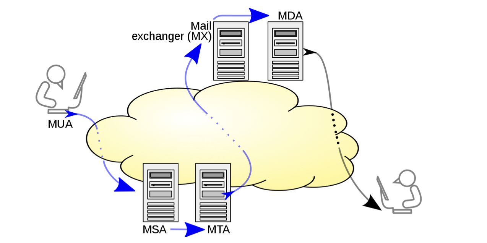
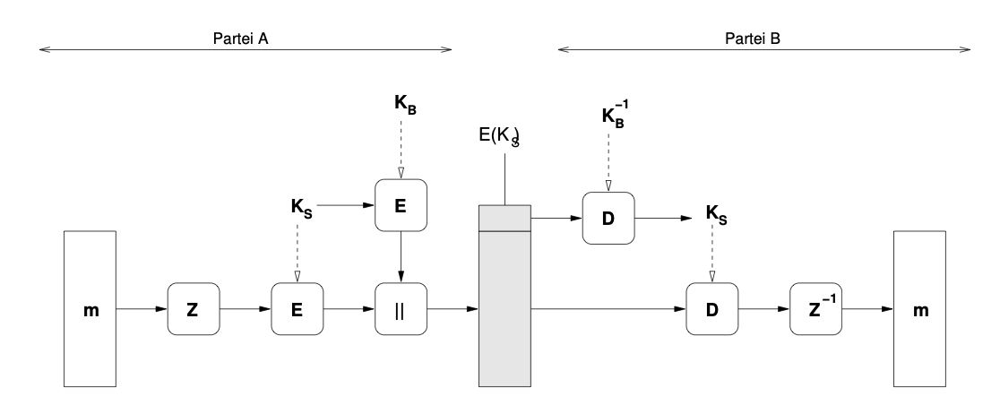
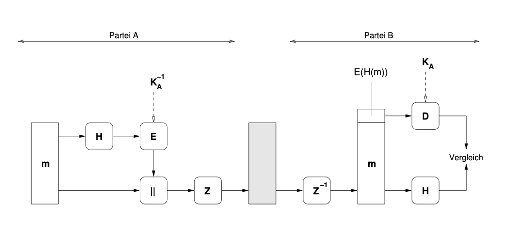

# Certificate Validation Errors

Digital certificates prove the identity of a website and enable secure encryption.  
If something is wrong with the certificate, browsers block the connection. For example in case of:

## 1. Domain Mismatch (SAN / CN Error)

- **Error Code (Firefox):** `SSL_ERROR_BAD_CERT_DOMAIN`  
- **Cause:** The website address you typed is not listed in the certificate’s **Subject Alternative Name (SAN)**
> SAN is an extension field in X.509 certificates. It contains a list of domain names (and sometimes IPs, emails, URIs) that the certificate is valid for. Your browser checks this list when matching the site you typed. SAN can also include wildcards to cover subdomains.
- **Example:**  
  - You visit `https://www.syssec.ruhr-uni-bochum.de`.  
  - The certificate is only valid for `*.goserver.host` and `goserver.host`.  
  - Result: **Mismatch → browser rejects it.**  
## 2. Untrusted Issuer (Unknown CA)

- **Error Code (Firefox):** `SEC_ERROR_UNKNOWN_ISSUER`  
- **Cause:** The certificate is not signed by a trusted **Certificate Authority (CA)**.  
- **Possible reasons:**  
  - Self-signed certificate (like printing your own passport).  
  - Missing intermediate certificates (broken trust chain).  
  - Issued by a CA not included in the browser’s trust store.  

## Big Picture

- **Domain check:** Does the name in the certificate match the domain visited?  
- **Issuer check:** Was the certificate issued by a trusted CA?  

These two checks are independent and either one failing will cause a browser warning.

# Secure Internet Protocols 

## 0) Big Picture
Security protocols provide **confidentiality, integrity, authentication** (and sometimes non-repudiation).  
They almost always follow a 3-phase model:

1. **Schlüsselaustausch** (e.g., Diffie-Hellman/ECDH, RSA)  
2. **Aushandeln der Kryptoverfahren** (cipher suites: AES/ChaCha20, SHA-256, signatures)  
3. **Betriebsmodus** (protecting actual data traffic with the agreed keys and algorithms)

**Main protocols:**
- **PGP**: End-to-end encryption and signatures for emails.  
- **TLS (SSL/TLS)**: Transport encryption for web (HTTPS), mail submission, IMAP/POP; identity via X.509 certificates.  
- **IPsec**: Network-layer protection of IP packets (basis of VPNs).  
- **IPv6**: Next-generation IP protocol; designed with IPsec integration.  
- **DNSSEC / DANE**: Integrity and authenticity for DNS; DANE ties TLS to DNSSEC records.  
- **SSH**: Secure remote login and tunneling; its own key and trust mechanisms.  

## 1) Encrypted Email Communication (Architecture & Ports)

### 1.1 Roles in Email Delivery
- **MUA (Mail User Agent):** The client **program** used to write and read emails (Outlook, Apple Mail, Thunderbird, Gmail web UI).  
- **MSA (Mail Submission Agent):** **First server** that accepts outgoing mail from the MUA (authenticates user, enforces policy).  
- **MTA (Mail Transfer Agent):** Relays mail between servers across the Internet (possibly multiple hops).  
- **MDA (Mail Delivery Agent):** Final component that places mail into the recipient’s mailbox; the recipient’s MUA retrieves it.  
- **MX Record (DNS):** Tells which mail server is responsible for a recipient’s domain.  

### 1.2 Standard Ports (server side)
- **Submission (MUA → MSA):**  
  - 587 (SMTP submission, STARTTLS capable)  
  - 465 (SMTP with Implicit TLS)  
- **Server-to-server (MTA ↔ MTA):**  
  - 25 (SMTP relay; often STARTTLS, but optional)  
- **Retrieval (MUA ↔ access server):**  
  - IMAP: 143 (plaintext) / 993 (IMAPS)  
  - POP3: 110 (plaintext) / 995 (POP3S)  

> Note: The **client** uses random ephemeral source ports (e.g., 52344).  
> When we say “SMTP runs on port 25/587,” we mean the **server’s listening port**.

#### Example Flow in Plain SMTP (Port 25)
- The mail client opens a TCP connection to the server’s port 25.  
- The server sends a greeting banner in plaintext.  
- The client sends all SMTP commands in plaintext:  
  - `MAIL FROM` with the sender’s address  
  - `RCPT TO` with the recipient’s address  
  - `DATA` followed by the full email body  
- The server acknowledges and queues the mail.  
- **Effect:** Every detail (addresses, message content) is visible to anyone monitoring the network (e.g., with Wireshark or at an ISP router).  
- **Security:** No confidentiality, no protection against tampering.


“**Server-to-server**” = specifically the **MTA↔MTA communication on port 25**.

## 2) Why Plain SMTP Is Insecure (RFC 788, 1981)
Problems:
1. **No encryption** → no confidentiality (email = postcard).  
2. **Store-and-forward principle:** every intermediate server can read/modify.  
3. **No sender authenticity check:** anyone can spoof the “From” address.  

## 3) Transport Encryption for Email: STARTTLS vs. Implicit TLS

### 3.1 STARTTLS (RFC 3207, 2002)
- SMTP Service Extension for Secure SMTP over Transport Layer Security
- Workflow: connection starts in plaintext; upgraded with `STARTTLS` command if both sides support it.  
- Pros: widely deployed, backwards compatible.  
- Cons:  
  - Opportunistic: if peer doesn’t support → falls back to plaintext.  
  - Vulnerable to downgrade attacks.  
  - Only protects transport, not end-to-end; servers still see plaintext.  
#### Example Flow in SMTP with STARTTLS (Port 587)
- The mail client connects to the submission server on port 587.  
- The session begins in plaintext: server greets, client identifies itself.  
- The client asks for encryption using the `STARTTLS` command.  
- If the server supports it, both sides perform a TLS handshake:  
  - Server provides its certificate  
  - Algorithms are negotiated  
  - A session key is established  
- Once TLS is established, the SMTP conversation restarts inside the encrypted tunnel.  
- **Effect:** All further communication (sender, recipient, message body) is encrypted.  
- **Limitation:** Because the first part is plaintext, an attacker could strip the `STARTTLS` option and force the client to remain in plaintext (downgrade attack). Unless strict policies are enforced, the client may silently fall back to insecure mode.


### 3.2 Implicit TLS (RFC 8314, 2018)
- Recommendation for **MUA ↔ submission/access servers**: encryption from the start, on a dedicated port.  
- Examples: SMTP submission 465, IMAPS 993, POP3S 995.  
- Stronger consistency, avoids plaintext handshakes.  
- Applies mainly to **client↔server** traffic, not general **server↔server (port 25)**.  

> Related: **DANE (with DNSSEC)** can enforce TLS for SMTP relay (using TLSA records), preventing downgrade attacks. 

#### Example Flow in SMTP with Implicit TLS (Port 465)
- The mail client connects directly to the server’s port 465.  
- The very first step is a TLS handshake, no SMTP commands are exchanged before encryption is active.  
- During the handshake, certificate exchange and key negotiation take place.  
- Only after encryption is established do SMTP commands (greeting, `MAIL FROM`, `RCPT TO`, `DATA`) flow, but now they are entirely inside TLS.  
- **Effect:** Even the initial greeting and authentication are encrypted; to an eavesdropper, the connection looks like random encrypted bytes from start to finish.  
- **Security:** Stronger than STARTTLS, since there is no plaintext phase and no possibility of downgrade to insecure transport.


## 4) Transport vs. End-to-End Security
- **STARTTLS / Implicit TLS:** Protect **transport channels** (links between servers/clients). Servers still process plaintext.  
- **PGP:** Protects the **message itself** (end-to-end). Only sender and recipient can decrypt; intermediate servers cannot read.  


## Why Spoofing Is a Problem
- SMTP by itself does **not verify sender authenticity**.  
- Example: An email claiming to be from `schnor@cs.uni-potsdam.de` could be sent via the mail server of `microsoft.com`.  
- Without additional mechanisms, the recipient cannot know if this is legitimate.  
- A Man-in-the-Middle (MiM) or malicious server can forge headers and impersonate domains.  
- Solution requires **signatures or DNS-based verification**.

## DNS-Based Authentication Mechanisms (Tangible View)

### 1. Sender Policy Framework (SPF)
- **What it does:** The domain owner publishes a rule in DNS saying *“only these servers are allowed to send emails for my domain.”*  
- **How it works in practice:**  
  1. You receive an email from `ceo@apple.com`.  
  2. Your mail server looks up a TXT record in DNS for `apple.com`
  > “According to the SPF record of apple.com, is the sending server’s IP authorized?”
  3. That TXT record may say:  
     ```
     v=spf1 ip4:17.0.0.0/8 -all
     ```  
     **which roughly says: “only servers from Apple’s IP range 17.x.x.x are allowed”**
  4. If the IP does not match Apple’s authorized list → SPF fails.  

➡ **outcome:**  
If someone tries to send email from a random Amazon EC2 server, the receiving server checks DNS and sees that this IP is not authorized → mail fails SPF check.
- Without SPF: Spammers can easily spoof @apple.com addresses, and many will land in inboxes.
- With SPF: Receiving servers can tell if the mail really came from a server authorized by Apple. If not, it can be flagged or rejected.

### 2. DomainKeys Identified Mail (DKIM)

**What it does:**  
DKIM allows a domain to take responsibility for an email by adding a **cryptographic signature** to it.  
The recipient can then use a **public key** (published in DNS by the sending domain) to verify that:  
1. the email content has not been modified, and  
2. the domain listed in the DKIM header really signed it.

---

**How it works in practice:**

1. **Message creation**  
   - Alice at `alice@uni-potsdam.de` composes an email to `bob@uni-berlin.de`.  
   - Example content:  
     ```
     From: alice@uni-potsdam.de
     To: bob@uni-berlin.de
     Subject: Meeting tomorrow
     Date: Mon, 16 Sep 2025 09:30:00 +0200

     Body:
     Let's meet at 2pm.
     ```

2. **Canonicalization**  
   - Before hashing, the mail server normalizes (canonicalizes) the chosen parts of the message.  
   - This prevents trivial changes (like extra spaces, line wrapping) from breaking the hash.  
   - Canonicalization rules are specified in the DKIM header itself (`c=` tag, e.g. `relaxed/relaxed`).

3. **Hashing**  
   - The server selects specific headers (listed later in the `h=` tag, e.g. `from:to:subject:date`) and the body.  
   - It computes a hash (usually SHA-256) of this canonicalized data.  
   - Two values are produced:  
     - `bh=` : the hash of the body (base64 encoded).  
     - A combined hash of the headers + body hash (to be signed).

4. **Signing**  
   - The combined hash is **encrypted with the domain’s private DKIM key** (RSA or Ed25519).  
   - This produces the digital signature.  
   - A new header is added to the email, for example:  
     ```
     DKIM-Signature: v=1; a=rsa-sha256; d=uni-potsdam.de; s=mail1;
      c=relaxed/relaxed; h=from:to:subject:date;
      bh=FseugphKqulomNplAlwupsBKTThlxol0cWAvyPCJEt4=;
      b=Base64SignatureValueHere...
     ```
     - `v=` DKIM version  
     - `a=` algorithm (RSA with SHA-256 here)  
     - `d=` signing domain (`uni-potsdam.de`)  
     - `s=` selector (`mail1`, used to locate the key in DNS)  
     - `c=` canonicalization modes  
     - `h=` headers included in the signature  
     - `bh=` body hash (base64)  
     - `b=` the actual digital signature

5. **Publishing the public key**  
   - The domain publishes the public key in DNS under the selector.  
   - For `s=mail1` and `d=uni-potsdam.de`, the DNS TXT record is:  
     ```
     mail1._domainkey.uni-potsdam.de  IN TXT
     "v=DKIM1; p=MIIBIjANBgkqhkiG9w0BAQEFA..."
     ```

6. **Verification by the recipient**

    - Extract `d=` (signing domain) and `s=` (selector) from the DKIM-Signature header.  
    - Query DNS at `<selector>._domainkey.<domain>` to fetch the public key.  
    - Recompute the **body hash** (SHA-256, per `a=` and `c=`) and compare with `bh=`.  
    - If mismatch → body was altered → DKIM fails.  
    - Canonicalize the listed headers (`h=`) + `bh=` and compute their hash.  
    - Use the public key to verify that the signature `b=` matches this hash.  
    - If mismatch → headers altered or signature forged → DKIM fails.  
    - If both checks succeed → message is intact and legitimately signed by the claimed domain.  

**Outcome:**  
- If an attacker changes the message body (e.g., alters “Please pay 100€ to DE12345” → “Please pay 100€ to DE99999”), the new body hash will not match the original `bh=`.  
- Without the sender’s private DKIM key, the attacker cannot generate a new valid signature.  
- The recipient’s server detects this mismatch and the email fails DKIM verification.

### 3. Domain-based Message Authentication, Reporting, and Conformance (DMARC)
- **What it does:** Lets domain owners publish a *policy* in DNS that tells recipients how to handle SPF/DKIM failures, and provides reporting.  
- **How it works in practice:**  
  1. `uni-potsdam.de` publishes a TXT record like this:  
     ```
     _dmarc.uni-potsdam.de  IN TXT
     "v=DMARC1; p=reject; rua=mailto:dmarc-reports@uni-potsdam.de"
     ```  
     - `p=reject`: reject mail that fails SPF/DKIM.  
     - `rua`: send daily reports about spoofing attempts.  
  2. You receive a spoofed email claiming to be from `alice@uni-potsdam.de`, but it fails SPF and DKIM.  
  3. Because the policy says `reject`, your server **does not deliver** the mail at all.  
  4. A report is sent back to Uni Potsdam so they know spoofing attempts are happening.  

➡ **outcome:**  
Without DMARC, a spoofed email might still get through after failing SPF/DKIM. With DMARC policy set to `reject`, it’s blocked completely, and the domain owner gets visibility.

## 3) Limitations in Practice
- Adoption is incomplete: as of 2025, only ~59% of top 1M domains publish valid SPF records.  
- SPF and DKIM do not prescribe mandatory failure handling — servers may still deliver spoofed mails.  
- No guaranteed feedback to senders if authentication fails.  
- Complex infrastructures (forwarding, mailing lists, cloud providers) often break SPF/DKIM, leading to legitimate mail without signatures.  
- Any mail server in the chain can add a DKIM signature → does not necessarily guarantee end-to-end trust.  
## 4) The Real Goal
- **Confidential and authenticated email between communication partners** requires:  
  1. **Confidentiality:** End-to-end encryption of the message body.  
  2. **Integrity & authenticity:** Digital signatures that the recipient can verify independently of transport.  
## 5) Two Main End-to-End Approaches

### S/MIME (Secure / Multipurpose Internet Mail Extensions)

### 1. Background: MIME
- **SMTP limitation:** SMTP was originally limited to **7-bit ASCII text** only.  
- **MIME (Multipurpose Internet Mail Extensions):** Extended email to support:  
  - Multimedia attachments (audio, video, images).  
  - International character sets.  
  - Program files and arbitrary binary data.  
- Defined in RFC 1520/1521.  
- Origin: based on the Andrew Messaging System at Carnegie Mellon University in the 1980s.

### 2. What S/MIME Adds
- **S/MIME = Secure MIME.**  
- Defined in RFC 3850 / RFC 3851.  
- Adds cryptographic protection (encryption + digital signatures) to MIME emails.  
- Provides **end-to-end security** using X.509 certificates for key exchange.  
- The specific encryption algorithm is **not fixed by the standard** — it depends on what both sender and recipient support.

### 3. Algorithm Selection (RFC 3851, Sec. 2.7)
- The **sending mail client (MUA)** decides which cryptographic method to use.  
- Process:  
  1. Sender must determine the strongest algorithm supported by both sides.  
  2. Sender transmits info about supported algorithms (so the recipient can also use them later).  
  3. If no info is available yet, the recommended default is **Triple DES (3DES)**.  
  4. If the chosen algorithm is considered insecure, the client must produce an error instead of sending.  

### 4. Certificates in S/MIME
- S/MIME uses **X.509 certificates** (the same system as TLS/HTTPS).  
- Each user has:  
  - A private key (kept secret).  
  - A public certificate signed by a Certificate Authority (CA).  
- Senders attach their certificates to outgoing emails, so recipients can:  
  - Verify signatures.  
  - Obtain the sender’s public key for encrypting replies.


### 5. Relevant RFCs
- **RFC 7817 (2016):** Updated TLS server identity check procedure for email protocols.  
  - Applies to SMTP Submission, IMAP, POP, ManageSieve.  
  - Updates earlier RFCs (2595, 3207, 3501, 5804).  
  - Defines how to correctly validate server certificates when using STARTTLS.  


### 6. Summary
- **MIME:** lets email carry any content type.  
- **S/MIME:** secures MIME messages with encryption and signatures using X.509 certificates.  
- **Algorithm choice:** sender-driven, strongest mutually supported method.  
- **Defaults:** Triple DES if no info available (historical).  
- **Trust model:** PKI with Certificate Authorities (same as HTTPS).  

---
### 5.2 Pretty Good Privacy (PGP)
- Uses public/private key pairs as well.  
- Instead of central authorities, PGP uses the **Web of Trust**:  
  - Users exchange keys directly and sign each other’s keys.  
  - Trust is decentralized and built on social/organizational relationships.  
- Provides encryption for confidentiality and signatures for integrity/authenticity.  

### Core Idea
- Provides **end-to-end encryption** of emails/files.  
- Ensures **confidentiality, authenticity, integrity** (via digital signatures).  
- Developed by Philip Zimmermann, 1991.  
- Uses a **hybrid approach**: fast symmetric crypto for message + asymmetric crypto for key exchange.  
- Built-in compression for efficiency and added security.

#### Encryption (Sender Side)
1. Compress message `m` → `Z(m)`.  
2. Generate random one-time symmetric session key `K_S`.  
3. Encrypt compressed message with `K_S`: 
`E_KS(Z(m))`
4. Encrypt `K_S` with recipient’s public key `K_B` (e.g., RSA):
`E_KB(KS)`
5. Send both together:
`E_KB(KS) || E_KS(Z(m))`
#### Decryption (Recipient Side)
1. Split the received message into two parts:  
- Encrypted session key `E_KB(KS)`  
- Encrypted message `E_KS(Z(m))`  
2. Decrypt session key with private key `K_B⁻¹`: 
`D_KB⁻¹(E_KB(KS)) = KS`
3. Decrypt message with recovered `KS`: 
`D_KS(E_KS(Z(m))) = Z(m)`
4. Decompress `Z(m)` to obtain the plaintext `m`.

#### Signature Generation
1. Compute hash of message `m`: `H(m)`  
2. Encrypt hash with sender’s private key: `E_KA⁻¹(H(m))`  
3. Concatenate signature and message: `E_KA⁻¹(H(m)) || m`  
4. Compress result: `Z(E_KA⁻¹(H(m)) || m)`

#### Signature Verification
1. Decompress received message.  
2. Split into signature + plaintext.  
3. Decrypt signature with sender’s public key: `D_KA(E_KA⁻¹(H(m))) = H(m)`  
4. Recompute hash of plaintext.  
5. Compare both hashes:  
   - Match → authentic & unmodified  
   - Mismatch → tampered or invalid

#### Properties
- **Confidentiality**: Only intended recipient can decrypt.  
- **Authenticity & Integrity**: Provided by digital signatures.  
- **Efficiency**: Symmetric encryption is fast; public-key used only for the session key.  
- **Security dependence**: Relies on strength of RSA (or chosen asymmetric scheme).  
- **Legal history**: Triggered US export control and patent disputes in early 1990s.
- Signatures can be **detached** (multiple signers possible)

#### Practical PGP: GnuPG (GPG)

## 1. GnuPG Overview
- **GnuPG (GPG)** is the free software implementation of the OpenPGP standard.  
- Version shown: `gpg (GnuPG) 2.4.4`, with support for multiple algorithms:
  - **Public key algorithms:** RSA, ELG, DSA, ECDH, ECDSA, EDDSA  
  - **Symmetric ciphers:** IDEA, 3DES, CAST5, BLOWFISH, AES (128/192/256), TWOFISH, CAMELLIA  
  - **Hash functions:** SHA-1, SHA-2 family, RIPEMD160  
  - **Compression:** ZIP, ZLIB, BZIP2  

## 2. Common GPG Commands
- `-s, --sign` → make a signature  
- `--clear-sign` → signature + plaintext (human-readable)  
- `-b, --detach-sign` → signature only, stored separately  
- `-e, --encrypt` → encrypt data  
- `-c, --symmetric` → symmetric-only encryption (no public key)  
- `-d, --decrypt` → decrypt data (default)  
- `--verify` → verify a signature  

**Examples:**
- `gpg -se -r Bob file.txt` → sign and encrypt for recipient Bob  
- `gpg -d file.gpg` → decrypt file  
- `gpg --verify file.sig file.txt` → verify a detached signature  

## 3. Key Generation
- GPG uses a **pseudo-random number generator** to create keys.  
- Randomness is strengthened by processing with IDEA and timing variations from user input (e.g., keyboard delays, mouse movement).  
- Command: `gpg –generate-key``
- Creates a key pair (public + private key).


## 4. Key Storage: Key Rings
- Keys are stored in **key rings**:
- **Public key ring:** all known public keys.  
- **Private key ring:** user’s own private keys.  
- Private keys are **encrypted with IDEA** before storage.  
- The decryption key is derived from a **hash of the user’s passphrase**.  
- Accessing the private key requires entering the **PGP passphrase** — it should never be written down or stored in files.

## 5. Key Distribution and Trust
- **Problem:** how to distribute your public key securely?  
- PGP solution: **Web of Trust**.
- A key is considered trustworthy if it has been signed by enough people you already trust.  
- This builds a decentralized trust network.  
- **Key servers** (e.g., [https://keys.openpgp.org/](https://keys.openpgp.org/)) allow publishing and retrieving public keys.  
- Unlike X.509 PKI, there are no central certification authorities; trust is user-driven.  
- Early practice: **key signing parties** where people verified each other’s identities and signed each other’s keys.

## 6. PGP-Capable Email Clients
- **Thunderbird (with built-in OpenPGP since version 78)**  
- **Evolution/Seahorse** on Linux  
- Many modern clients integrate GnuPG directly or via plugins.  

## 7. Key Takeaways
- GPG = practical tool for PGP (OpenPGP standard).  
- Supports encryption, signatures, key management.  
- Relies on **Web of Trust** instead of central authorities.  
- Private keys are always encrypted and protected by a passphrase.  

# Practical Issues in Email Security

## 1. The Efail Attacks (2018)
- **Researchers:** Poddebniak, Dresen, Müller, Ising, Schinzel, Friedberger, Somorovsky, Schwenk.  
- **Conference:** USENIX Security Symposium 2018, plus CCC talk by Sebastian Schinzel.  
- **Target:** Both OpenPGP and S/MIME.  
- **Technique:** *Malleability gadgets* (CBC/CFB injection).
  - Attackers inject malicious snippets into encrypted emails.
  - Standard-conforming email clients process these snippets.
  - The result: decrypted plaintext leaks via backchannels (HTML, CSS, X.509 features).
- **Impact:**
  - Works even on archived emails.
  - Triggered when recipient decrypts a single crafted attacker mail.
  - Found in **23/35 S/MIME clients** and **10/28 OpenPGP clients** tested.
- **Lesson:** End-to-end encryption standards are fragile in practice when clients are poorly implemented.

## 2. Real-World Adoption Problems
- **TLS vs. End-to-End:**
  - Most providers today use **TLS for transport encryption** (e.g., Posteo).  
  - True **end-to-end encryption (PGP, S/MIME)** is still rare in practice (as of 2023).  
- **Implementation flaws** (like Efail) further reduce trust.  

## 3. The German De-Mail Project
- **Legal basis:** De-Mail law of April 28, 2011.  
- Goal: secure, confidential, and legally verifiable electronic communication.  

### 3.1 Functionality
- Supposed to guarantee:  
  - Confidential communication.  
  - Mutual authentication.  
  - Legal proof of delivery.  

### 3.2 Issues
1. **Delivery obligation:**
   - Once a message is delivered to the De-Mail inbox, it counts as “received” by law (after 3 days), even if the user never read it.  
   - Problematic if user is offline, on holiday, or without access.
2. **No true end-to-end encryption:**
   - Transport is TLS-encrypted, but messages are **decrypted at the provider** for spam/virus checks.  
   - During this step, mails are in plaintext and vulnerable.  
   - Bundesrat criticized this in 2010: demanded true end-to-end.  
3. **Low adoption:**
   - Users did not see the benefit.  
   - Too complicated (X.509-based).  
   - 2015: optional PGP-based plugin announced.  
   - 2021: Telekom discontinued De-Mail, calling it a failure.

## 4. Other Secure Communication Systems
- **ELSTER:**  
  - For communication with the German tax office.  
  - Works via a web portal with HTTPS.  
  - User is notified by an *unencrypted* email that a new message is available in the portal.  
  - Good for eGovernment workflows.  

- **beA (besonderes elektronisches Anwaltspostfach):**  
  - Mandatory secure mailbox for German lawyers (since 2018 passive, since 2022 active).  
  - Used for communication with courts.  
  - Criticized for many security flaws.  
  - **No true end-to-end encryption.**

## 5. Certificate Practice and Problems
- **DFN Certificates:**  
  - Used at Universität Potsdam.  
  - Valid for 3 years.  
  - RSA 4096-bit keys.  

- **Practical issues:**
  1. Certificates expire → must renew in time.  
  2. Key management: users need to keep *all old keys* to read past emails (since those were encrypted with older keys).  
  3. Each certificate is tied to one email address → multiple addresses mean multiple certificates.

## 6. Lessons Learned
- PGP enables **true end-to-end encryption**.  
- Uses a **symmetric cipher for data**, asymmetric only for key exchange (same principle as TLS).  
- **Private key:** used to sign and to decrypt session keys.  
- **Correct signature:** proves authenticity + integrity.  
- **Encrypted but unsigned mail:** provides confidentiality, but no guarantee of authenticity.  
- **Passphrase:** protects private key on disk.  
- **Trust models:**  
  - PKI (e.g., S/MIME, X.509) = centralized CAs.  
  - Web of Trust (PGP) = decentralized, user-driven trust.  

**Conclusion:**  
Theory is elegant, but practice is full of pitfalls:  
- low adoption,  
- flawed implementations,  
- failed government initiatives (De-Mail),  
- certificate expiration and management headaches.