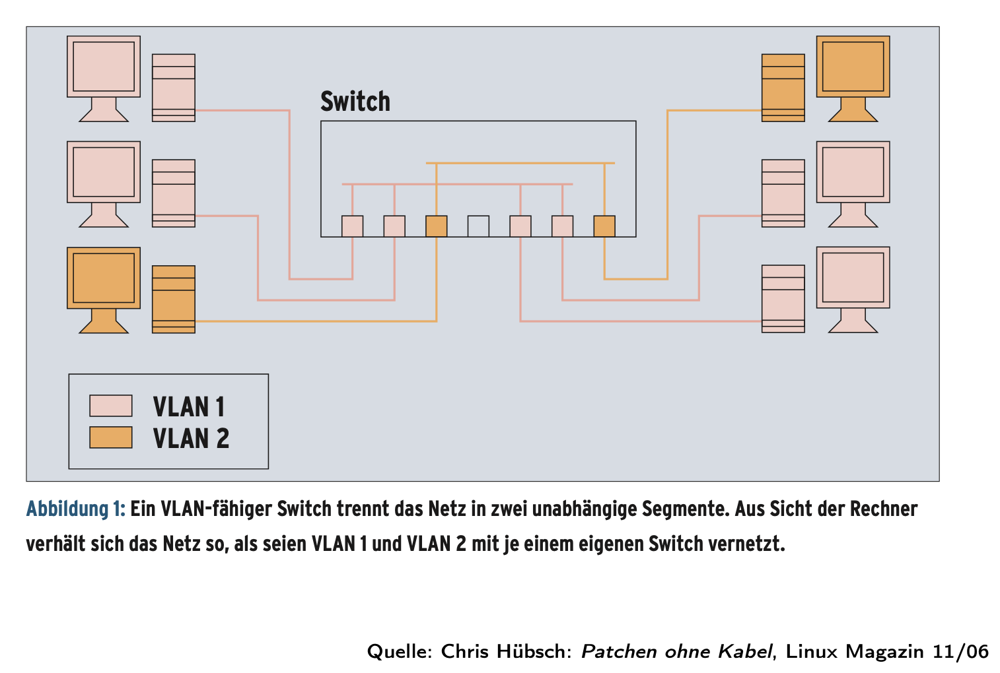
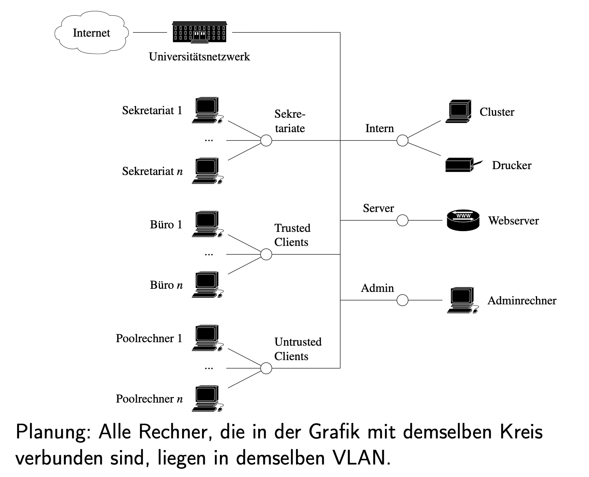
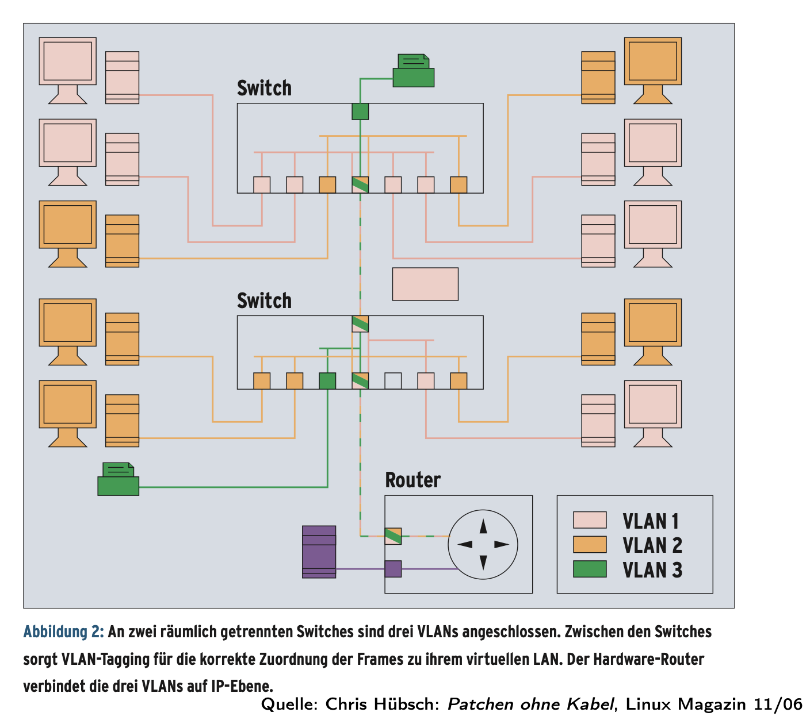
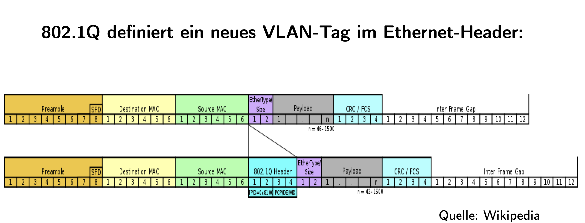

# Proxy Firewalls: From Packet Filters to Application Intent

## The fundamental shift: from lanes to conversations

Early firewalls were packet filters operating at the network and transport layers (Layer 3 IP addresses, Layer 4 TCP/UDP ports). Stateless filters examined each packet in isolation. Stateful firewalls evolved to track connections using the 5-tuple (source IP, source port, destination IP, destination port, protocol) and TCP flags like SYN, ACK, and FIN. This approach was fast and scalable, but fundamentally blind to *intent*.

Think of packet filters as traffic police monitoring lanes: they see which roads cars use but don't know what's inside the vehicles or where passengers intend to go. A stateful firewall can permit TCP port 443, but it cannot distinguish between a legitimate Jira session and a covert data exfiltration channel disguised as HTTPS traffic.

**Proxy firewalls shift enforcement from coarse network rules to fine-grained, business-aware rules.** They understand conversations, not just lanes.

## What a proxy firewall actually is

A proxy firewall is an **application-layer security gateway** (Layer 7) that terminates the client's connection and originates a separate, independent connection to the server. It deliberately becomes a controlled man-in-the-middle with two distinct TCP sessions:

```
Client            TCP #1                Proxy FW              TCP #2               Server
192.0.2.10:51515  ─────────►  203.0.113.9:3128   ◄──────────  198.51.100.20:443
```

The proxy is *two endpoints in one box*:
- **Client-facing connection**: where the proxy receives and authenticates the client
- **Server-facing connection**: where the proxy makes fresh requests on behalf of validated clients

This architecture enables capabilities impossible for packet filters:

- **Authentication**: User-centric (Kerberos, OAuth, Basic Auth), device-centric (mTLS with client certificates), or context-centric (time windows, geolocation)
- **Semantic auditing**: Protocol-aware logging (URLs, HTTP verbs, FTP commands, SMTP recipients) rather than just "IP:port matched rule"
- **Protocol validation**: Header sanity checks, HTTP method whitelists, MIME type verification, maximum object size limits, and command filtering for legacy protocols

## Why proxies see domains while firewalls see only IPs

This is where the architectural difference becomes tangible. Understanding where "domains" live in the network stack reveals why proxies can enforce rules that firewalls cannot.

### The domain's journey through the network stack

**Layer 3 (IP)**: Routers and traditional firewalls see only source IP ↔ destination IP. They have no knowledge of `youtube.com`, only `142.250.74.206` (one of Google's IPs).

**Layer 4 (TCP/UDP)**: Adding ports, a firewall sees "TCP 443 to 142.250.74.206" but still has no clue it's YouTube—just "HTTPS to some Google IP."

**Layer 7 (Application/HTTP/HTTPS)**: This is where domain information becomes visible again:

For HTTP, the protocol includes an explicit `Host:` header:
```http
GET /watch?v=abc123 HTTP/1.1
Host: youtube.com
```

For HTTPS, although the request content is encrypted, the TLS handshake includes **SNI (Server Name Indication)** in plaintext before encryption begins:
```
ClientHello includes SNI = "youtube.com"
```

A proxy operating at Layer 7 can inspect the `Host:` header (for HTTP) or SNI (for HTTPS) and make policy decisions based on the actual service being requested, not fragile IP addresses.

### Why DNS lookups aren't enough

DNS resolution happens before the request goes out (`youtube.com → 142.250.74.206`), but relying on DNS for filtering creates brittleness:

- DNS responses can be cached locally
- IPs change frequently due to load balancing and CDN behavior
- Multiple domains may share the same IP address
- Clients can bypass local DNS entirely

Proxies avoid this brittleness by examining what the client actually requested at Layer 7, regardless of which IP it resolved to.

### Concrete example: blocking YouTube

When your browser fetches a YouTube video, the flow looks like this:

1. Browser performs DNS lookup: `youtube.com → 142.250.74.206`
2. Browser opens TCP connection to `142.250.74.206:443`
3. TLS handshake begins with ClientHello containing `SNI = "youtube.com"`
4. **Proxy sees SNI = "youtube.com" and blocks before the connection completes**

**Firewall without Layer 7 awareness**: Only sees `142.250.74.206:443` and must maintain IP blocklists that break when Google changes infrastructure.

**Proxy with Layer 7 awareness**: Sees `youtube.com` in SNI or Host header and blocks consistently, regardless of which IPs Google uses today.

This is how modern corporate web proxies enforce category-based filtering ("streaming media") without maintaining massive, constantly outdated IP databases.

## Forward and reverse proxies in practice

The terms "forward" and "reverse" describe deployment context, not fundamental differences in technology.

**Forward proxy** (client-side intermediary): Sits between internal users and the Internet. This is what corporate environments use to enforce browsing policy, log usage, cache content, and control egress. The proxy represents clients to the outside world.

**Reverse proxy** (server-side gateway): Sits in front of backend services to terminate TLS, authenticate sessions, rate-limit, load-balance, and hide internal topology. The proxy represents servers to clients.

```
Forward path (egress control)
  Client → Forward Proxy (policy, cache, auth) → Internet

Reverse path (ingress control)
  Internet → Reverse Proxy (TLS, WAF, routing) → Backend Services
```

Both can operate as proxy firewalls when policy, identity, and protocol validation become first-class concerns.

### Real-world example: Atlassian Edge as a reverse proxy firewall

When you access Jira Cloud, your traffic first hits **Atlassian Edge**, a globally distributed reverse proxy layer built on Envoy (a modern Layer 7 proxy and load balancer). This is a living example of proxy firewall principles in production.

Look at the response headers from any Jira Cloud request:
```http
atl-edge-region: eu-west-1
atl-edge-service: ge-basic-envoy
x-request-id: 0f0d8a2b-4c5e-6f7a-8b9c-0d1e2f3a4b5c
x-b3-traceid: 3af1e72c4d5e6f7a8b9c0d1e2f3a4b5c
x-b3-spanid: 8b9c0d1e2f3a4b5c
```

These headers reveal the proxy firewall architecture in action:

- **Edge termination**: Atlassian Edge (running in AWS `eu-west-1` region) terminates your TLS connection, validates your session, and applies authentication policy
- **Distributed tracing**: The `x-request-id` and `b3` identifiers create an end-to-end audit trail that follows your request through multiple microservices
- **Policy enforcement point**: Edge acts as the SaaS perimeter checkpoint before forwarding validated requests into Atlassian's internal service mesh

This architecture mirrors the principles we've discussed: the edge proxy becomes the intentional, observable control point where identity, protocol semantics, and business policy meet the wire.

### How AWS Edge Locations fit into the picture

Atlassian Edge doesn't exist in isolation—it runs on top of AWS infrastructure. AWS operates **Edge Locations** (Points of Presence) for CloudFront, Route 53, and Global Accelerator. These provide:

- Geographic distribution for low-latency access
- DDoS mitigation at the infrastructure level
- TLS offload and backbone routing optimization

The complete path looks like this:
```
Your Browser
    ↓
AWS Edge Location (PoP) — infrastructure-level entry point
    ↓
Atlassian Edge (Envoy in eu-west-1) — application-level policy enforcement
    ↓
Jira Backend Services — business logic
```

Atlassian Edge is the *application-aware* layer that enforces SaaS-specific policy while benefiting from AWS's global edge fabric for infrastructure-level optimization.

## NAT, stateful firewalls, and the "hole" concept

Your laptop sits behind NAT (network address translation) and a stateful firewall. When you initiate an outbound connection, these systems create temporary state:

- **NAT mapping**: Translates your private IP to a public IP and assigns a temporary port
- **Firewall state entry**: Records the connection's 5-tuple and permits return packets for this specific flow

This temporary state is the "hole" you've mastered. It stays open as long as the connection remains active, allowing replies to flow back through the NAT and firewall to your machine.

**Critical insight**: Proxies and tunnels don't magically enable inbound connections. They allow servers to reach you only over channels you already initiated. When you open a WebSocket tunnel from your development machine to Atlassian Edge, you're creating an outbound connection that keeps the "hole" open. Edge can then push events back to you over this already-established, full-duplex channel without requiring unsolicited inbound access through your firewall.

## Three practical ways to route traffic through a proxy

All three patterns achieve the same outcome—your traffic exits from a controlled intermediary rather than directly from your machine—but differ in scope and ergonomics.

### 1. Local port forwarding: *one service, one tunnel*

**What you do**: Open a secure session to a remote gateway and map a local port to a single remote service. Think of it as "opening a local door that reaches one specific room in a locked building."

```bash
ssh -L 8080:db.internal:3306 user@bastion
```
which means *open a local port 8080 on my laptop. Whenever I connect to it, send that traffic through SSH to the middle host (bastion). From there, connect out to the real target (db.internal:3306). Relay bytes back and forth.*

**Generally:**
```bash
ssh -L <local_port>:<final_destination_host>:<final_destination_port> user@<middle_jump_host>
```

**Start Point**: 8080 → that’s the local port you open. Anything you connect to localhost:8080 goes into the tunnel and when accessed, forwards that one TCP stream through the tunnel to the internal dashboard. Your browser thinks it's talking to a local service.

**Middle**: user@bastion → that’s just the machine you have SSH access to. It could be called *bastion*, *gateway*, *jumpbox*, whatever. It’s the middleman.

**Final destination**: db.internal:3306 → that’s the real target you want to reach. In my earlier example it was a database, but it could just as well be: `intranet.company.com:80` (an internal website), `git.internal:22` (a private Git server), or literally any TCP service.

**What the network sees**: One outbound SSH connection from your laptop to the gateway. Your NAT/firewall tracks only this single connection state. The final destination service sees requests originating from the gateway's IP, not your laptop's IP.

**When to use it**: Quick access to a **single** service without changing application configuration. Only works for that **one target** (db.internal:3306). If you now want to reach intranet.internal:80, you must create another -L tunnel.
>Think of -L as **hard-wiring one local port to one remote service**.

### 2. Dynamic SSH forwarding: *one entry point, many destinations*

**What you do**: Start an SSH session that provides a local SOCKS listener (SSH starts a local SOCKS proxy). Apps can request **any destination** dynamically.

```bash
ssh -D 1080 user@bastion
# Configure your apps (browser, DB client, etc.) to use a SOCKS proxy at localhost:1080
```

**What you get**: When your app wants to reach **any host:port** (e.g. db.internal:3306 or intranet.internal:80), it asks the SOCKS proxy. The proxy sends the request through SSH → bastion → target.

**What the network sees**: Still just one outbound SSH connection from your laptop to the gateway. All downstream targets see the gateway as the apparent origin. The local NAT/firewall only tracks the SSH connection state.

**When to use it**: Flexible access to many internal services without per-service configuration. Supports any application that can use a SOCKS proxy.

**Technical detail**: SOCKS is a socket-level proxy protocol (RFC 1928) that negotiates target host:port at the protocol level. SOCKS5 supports both TCP and UDP relay.
````
Your app → localhost:port → [SSH encrypted tunnel] → gateway → destination
                            ^^^^^^^^^^^^^^^^^^^^
                            This is SSH doing the work
````

### 3. Native SOCKS proxy: application-level routing, *any target host/port, just like ssh -D*

*But the big difference: the SOCKS proxy is not tied to SSH: it’s either a standalone service (company server) or a daemon (Tor).*
````
Your app → socks-server:port → destination
           ^^^^^^^^^^^^^^^^
           Direct SOCKS connection (no SSH tunnel)
````

**What you do (corporate SOCKS)**: Configure your applications or system to use a company-provided SOCKS server, typically requiring authentication.

**What you do (Tor)**: Run a local Tor client that provides a SOCKS endpoint. The Tor client builds encrypted circuits through the Tor network.

**What you get**: With corporate SOCKS—centralized policy enforcement, auditing, and content filtering. With Tor—anonymity and censorship circumvention through multi-hop relays.

**What the network sees**: For corporate SOCKS, your NAT sees an outbound connection to the company proxy. For Tor, your NAT sees connections to Tor nodes. In both cases, final destination sites see the exit point (company proxy or Tor exit node) as the origin.

### All three cases have the same topology
```
My laptop → Middleman server → Final destination
```
***The only difference is the mechanism/protocol we use to communicate with that middleman, the middleman is the same physical server but different software/configuration***
````
Physical Remote Server A:
├─ Running: OpenSSH server
├─ Listens on Port 22: SSH connections (can do -L and -D tunneling)
└─ Use case: OpenSSH client on my laptop and OpenSSH server on the gateway work together to create the SOCKS proxy. 

Physical Remote Server B:
├─ Running: Dante SOCKS daemon
├─ Listens on a port (commonly 1080) for SOCKS protocol connections
└─ Use case: Dedicated proxy service

Could they be the same physical server? Yes:
├─ Running: Both OpenSSH AND Dante
├─ Port 22: SSH connections
├─ Port 1080: SOCKS connections
└─ Use case: Both tunneling and dedicated proxy
````

### The SOCKS legacy: from classic daemon to modern "service **mesh**" – *Not a single proxy, but a network of interconnected **proxies***

SOCKS established the canonical two-leg proxy pattern in the 1990s: accept client connection (leg 1) → originate server connection (leg 2). 
> **one sidecar proxy for each service**: They form a "mesh" topology where every service has its own proxy, and these proxies communicate with each other to route traffic. (A **sidecar** is a separate container that runs alongside your main service container, in the **same** pod/unit and can talk via localhost)

````
[Service A + Envoy] ←→ [Service B + Envoy] ←→ [Service C + Envoy]
        ↓                      ↓                      ↓
[Service D + Envoy]     [Service E + Envoy]   [Service F + Envoy]
````
*All the Envoy proxies together form the "mesh"—a distributed system of proxies that handle all inter-service communication.*

This exact pattern now appears throughout modern infrastructure:

- Corporate forward proxies enforcing egress policy
  - Employee browser → proxy (leg 1)
  - Proxy → external website (leg 2)
  - Proxy checks policy before making leg 2
- Atlassian Edge terminating and re-originating connections
  - When you access Jira Cloud:
  - Your browser → Atlassian Edge (leg 1)
  - Atlassian Edge → Jira backend service (leg 2)
  - Edge validates your session, adds tracing headers, enforces policy
- In a Kubernetes cluster running a service mesh:
  - Service A → Envoy sidecar (leg 1)
  - Envoy sidecar → Service B (leg 2)
  - Envoy handles encryption, auth, retries, metrics
- SSH dynamic forwarding (`-D` flag) we already discussed:
  - Your app → SSH gateway (leg 1, through SSH tunnel)
  - SSH gateway → destination (leg 2)

The lineage is direct and unbroken. SOCKS invented this approach in the 1990s. Today's fancy cloud infrastructure (service meshes, edge proxies, SSH tunnels) all use the exact same architectural pattern—they just have more features and fancier names.

## What proxy firewalls can enforce that packet filters cannot

Because they terminate sessions and speak application protocols, proxy firewalls enable a different class of security controls:

**Identity-aware decisions**: User groups, device posture, mTLS (mutual TLS) client certificates, OAuth scopes. Example: "Allow `/api/tickets` only for users with `tickets:read` scope."

**Protocol-aware validation**: HTTP method allowlists, header size caps, MIME type constraints, SMTP recipient policies. Example: "Deny HTTP CONNECT method except for approved administrators."

**Data handling controls**: DLP (data loss prevention), tokenization, response redaction, safe browsing category blocks. Example: "Deny downloads from category 'file-sharing' during business hours."

**Domain-based egress policy**: Rules based on Host/SNI rather than brittle IP ranges. Example: "Block `Host: *.streaming-site.com` regardless of IP."

**Request shaping and resiliency**: Per-identity rate limits, circuit breakers, retries with exponential backoff. Example: "Limit user X to 100 requests/minute across all endpoints."

**Semantic auditing**: Request-level logging with business context. Example: "Log all API calls showing: user principal, endpoint path, HTTP verb, response status, request ID for distributed tracing."

### Example policy that only a Layer 7 proxy can express

```
rule: deny HTTP method CONNECT to *.example.com except for approved users
rule: deny Host matches category "streaming" during 09:00-17:00 local time
rule: allow /api/* only with JWT scope "tickets:read"
rule: rate-limit per user: 1000 requests/hour
```

A Layer 4 firewall cannot express any of these rules because it lacks visibility into HTTP methods, Host headers, JWT claims, or user identity.

## Observing proxy behavior with network tools

You can see proxy mechanics in action using standard network tools.

**Capture SNI in TLS handshake**:
```bash
sudo tcpdump -n -i en0 "tcp port 443 and (tcp[tcpflags] & (tcp-syn) != 0)"
```
You'll see the ClientHello packet carrying SNI in plaintext before application data is encrypted.

**Examine proxy-inserted headers**:
```bash
curl -v https://jira.atlassian.com
```
Look for headers like:
```http
x-request-id: 0f0d8a2b...  # Request correlation across edge and microservices
x-b3-traceid: ...          # Zipkin/Jaeger distributed trace ID
x-b3-spanid: ...           # Current hop span ID
atl-edge-region: eu-west-1 # Which edge region handled the request
```

These headers prove the proxy is actively participating in the conversation, not just forwarding packets.

## The limits: what proxy firewalls cannot fix

Proxy firewalls are powerful gatekeepers, but they cannot replace secure application design. Understanding their limits is as important as understanding their capabilities.

### SQL injection: the canonical example

SQL injection is an *application-level* vulnerability where untrusted input is incorrectly incorporated into SQL statements (concatenated strings instead of parameterized queries). 

A proxy can attempt to detect obvious SQLi payloads in request parameters:
```
?id=1' OR '1'='1
?user=admin'--
```

But this approach is fundamentally fragile:
- Attackers can obfuscate payloads (encoding, Unicode tricks, whitespace manipulation)
- Complex applications have too many code paths for signature-based detection
- Proxies cannot understand semantic context (what's malicious vs. legitimate for each endpoint)

**The reliable defense is inside the application**: parameterized queries, strict input validation, least-privilege database accounts, and proper error handling.

### The broader principle

Proxies can *mitigate* and *detect* many exploit attempts (acting as a Web Application Firewall), but they cannot substitute for correct server-side validation and secure coding. Critical business logic flaws and deep injection classes require code fixes and runtime protections:

- **Input validation**: At the application layer, with context-aware rules
- **Parameterized queries**: Prepared statements that separate code from data
- **Least privilege**: Database accounts with minimal necessary permissions
- **Runtime Application Self-Protection (RASP)**: Instrumentation that detects attacks from inside the application

Proxies amplify security but do not supplant secure software engineering.

## Encryption and the visibility tradeoff

Modern HTTPS changes where inspection can happen. With plain HTTPS, a proxy can read SNI in the TLS handshake (before encryption completes) but cannot see URL paths, headers, or request bodies without terminating TLS.

**TLS bridging** (also called SSL interception): The proxy terminates the client's TLS session and establishes a fresh TLS session to the origin server. This regains Layer 7 visibility and enables full content inspection, but introduces operational and privacy tradeoffs:

- **Trust requirement**: Clients must trust the proxy's certificate authority
- **Certificate management**: The proxy must generate and manage per-site certificates
- **Privacy implications**: The proxy can see everything, including passwords and personal data
- **Performance impact**: Double encryption/decryption adds latency and CPU load

**When to use TLS bridging**: Enterprise environments with clear policies, installed trust anchors, and need for DLP or advanced threat detection.

**When to avoid it**: Privacy-sensitive scenarios, compliance requirements for end-to-end encryption, or high-throughput services where the performance cost is prohibitive.

**Modern protocols**: HTTP/2 and HTTP/3 (over QUIC) follow the same principle—a proxy that terminates the session regains Layer 7 visibility and can enforce application policy, but requires proper trust infrastructure.

## Designing layered defenses: where proxy firewalls fit

Defense-in-depth means multiple, overlapping controls. A pragmatic architecture stacks different security mechanisms at appropriate boundaries:

**Public perimeter (reverse proxy cluster)**:
- Global edge locations (e.g., Atlassian Edge, AWS CloudFront)
- TLS termination and certificate management
- DDoS mitigation and rate limiting
- Initial authentication and session validation
- Request routing and load balancing
- Distributed tracing initialization

**DMZ/reverse proxy tier**:
- Application-aware policy enforcement
- API gateways handling OAuth, JWT validation, and quotas
- Web Application Firewall rules for OWASP Top 10
- Response inspection and data redaction

**Egress control (forward proxy)**:
- Corporate SOCKS servers or explicit web proxies
- Outbound policy enforcement (domain categories, allowed protocols)
- Logging and auditing of external access
- Caching for bandwidth optimization

**Internal segmentation**:
- Stateful firewalls at zone boundaries
- Micro-segmentation between service tiers
- Bastion hosts for administrative access
- Jump servers for controlled SSH/RDP tunneling

**Application layer**:
- Secure coding practices (parameterized queries, input validation)
- Role-based access control (RBAC) at the business logic level
- Runtime protections (RASP, secrets management)
- Comprehensive logging and monitoring

**Critical principle**: Each layer provides different controls. Proxies excel at identity, protocol semantics, and business policy. Firewalls excel at containment and network hygiene. Applications must still be secure from injection and logic errors.

## Operational takeaways for design reviews

When evaluating or proposing proxy firewall architectures, consider these practical principles:

**For domain-based policy**: Place a proxy that reads SNI or Host headers rather than maintaining fragile IP blocklists. Update: many CDN and cloud providers change IPs daily.

**For broad egress visibility**: A centrally managed SOCKS forwarder with authentication scales better than ad-hoc SSH tunnels. You gain consistent logging, policy enforcement, and don't depend on individual developer discipline.

**For internal-only services**: Use bastion hosts for administrative access and local port forwarding for short-lived development access. Never expose internal services directly to the Internet, even "temporarily."

**For high-throughput services**: Avoid full TLS bridging and deep inspection for everything. Use selective termination, targeted WAF rules, and rate limits to balance security and performance.

**For privacy-sensitive flows**: When end-to-end encryption is required (compliance, user trust), prefer endpoint TLS without interception. Document the visibility/control tradeoff clearly in your threat model.

**For modern applications**: Implement distributed tracing (request IDs, span IDs) from the edge through all tiers. This enables security investigations without full content inspection.

## The conceptual ladder: from packets to policy

This is the progression that brings us from 1990s stateful firewalls to modern proxy architectures:

1. **Packet filter (Layer 3/4)**: Fast, IP and port-based control. Blind to content and identity. Good for basic network hygiene and DDoS mitigation.

2. **Stateful firewall**: Adds connection tracking with SYN/ACK awareness. Understands session state but not application semantics. Good for zone boundaries and containment.

3. **Proxy firewall (Layer 7)**: Conversation-level control with identity, protocol validation, and business policy. Implementations include Envoy, NGINX, Squid, and dedicated SOCKS servers. Good for application-aware security.

4. **Tunneling/forwarding patterns**: Three practical techniques to route client traffic through a proxy (local port forwarding for single services; dynamic SOCKS for flexible multi-service access; native SOCKS for application-level routing).

5. **Limits and layering**: Proxies mitigate and detect threats but cannot replace secure application design. SQL injection, business logic flaws, and authentication bypasses require code fixes and defense-in-depth.

## Application-layer gateways: third-generation firewalls

The evolution we've traced—from packet filters to stateful firewalls to proxy firewalls—represents three generations of firewall technology. Application-layer gateways are the formal name for what we've been calling proxy firewalls: they work at Layer 7, inspect the payload (the actual data inside packets), and use proxy processes to handle different applications.

### What makes application-layer gateways different

The key capability is **payload inspection**—the ability to look inside the data being transmitted, not just the addressing information. This enables rules that packet filters and stateful firewalls simply cannot express.

**Concrete example: selective FTP filtering**

Imagine your company wants to allow employees to download files from external FTP servers (for legitimate work purposes) but prevent them from uploading company files to external servers. 

A traditional firewall sees only:
- Source: employee workstation IP
- Destination: FTP server IP  
- Port: TCP 21 (FTP control) and TCP 20 (FTP data)
- State: established connection

It can either allow all FTP or block all FTP. There's no middle ground.

An application-layer gateway sees the actual FTP commands:
```
USER anonymous
PASS guest@example.com
CWD /pub/documents
RETR report.pdf        ← Download (GET) - ALLOWED
STOR confidential.xlsx ← Upload (PUT) - BLOCKED
```

The proxy can enforce: "Allow FTP inbound, but block the PUT and STOR commands." This is payload-level filtering that's impossible without understanding the application protocol.

### Key capabilities of application-layer gateways

**User-specific authentication and access control**: The gateway can require users to authenticate before accessing services, then apply different rules based on who they are.

Example: User Alice (in the "developers" group) can access the production database via port 5432, but User Bob (in "contractors") cannot—even though both are on the internal network with valid IP addresses.

**Comprehensive logging with application context**: Instead of logs showing "192.168.1.50 connected to 203.0.113.20:80", the gateway logs "User: alice@company.com, Action: GET /api/customer/12345, Time: 14:23:45, Status: 200 OK, Response size: 4.2KB"

**User-specific accounting**: Track not just that "someone used 5GB of bandwidth" but that "Alice downloaded 3GB of training videos, Bob uploaded 2GB of design files."

### Real commercial implementations

**Squid proxy for HTTP content filtering**: Squid is a widely-used open-source proxy that can filter URLs and redirect requests. 

Real-world use case: A university wants to block access to social media during exam periods but still allow access to educational sites. Squid can:
```
# Block social media domains
acl social_media dstdomain .facebook.com .twitter.com .instagram.com
http_access deny social_media exam_hours

# Redirect blocked requests to an explanation page
deny_info http://internal.university.edu/exam-policy.html social_media
```

When a student tries to access Facebook during exam hours, they're redirected to a page explaining the policy instead of seeing a cryptic connection timeout.

**Cisco PIX Firewall and Adaptive Security Algorithm**: The PIX firewall performs "stateful application inspection" for protocols like FTP, HTTP, SMTP, and PPTP. Its Adaptive Security Algorithm (ASA) uses three information sources:

1. **Access Control Lists (ACLs)**: Traditional filtering based on network addresses and ports (the stateful firewall foundation)

2. **Inspection functions**: Protocol-specific logic that understands how each application works (the application-layer intelligence)

3. **Connection state**: Tracking which connections are active and their current phase (the stateful component)

Real example: When you authenticate to access a web application, the PIX can perform that authentication *at the firewall* before traffic ever reaches the web server. If authentication fails, the connection is dropped immediately—the web server never sees the request, reducing its exposure and load.

### The HTTPS filtering dilemma

This is where application-layer gateways face their biggest challenge: modern encryption.

**The problem**: You want to filter HTTPS traffic to protect your web applications from SQL injection and cross-site scripting attacks. But HTTPS is encrypted end-to-end. If the firewall can't read the content, how can it filter malicious payloads?

**The tension**: Two legitimate but conflicting goals:

1. **End-to-end encryption**: Users want privacy and security. If the firewall can decrypt their HTTPS traffic, it can see everything—passwords, personal messages, financial data.

2. **Protection**: Web applications have vulnerabilities. If HTTPS traffic passes through unfiltered, attackers can exploit those vulnerabilities and the firewall is powerless to stop them.

**The practical solution** (covered earlier as TLS bridging): The firewall becomes a controlled man-in-the-middle:
- Client connects to firewall with HTTPS (first encrypted session)
- Firewall decrypts, inspects, and filters the content
- Firewall connects to server with HTTPS (second encrypted session)

This requires:
- Installing the firewall's certificate authority on all client devices (so they trust the proxy)
- Clear organizational policy about what monitoring occurs
- Proper operational security (the proxy now sees everything)

**Real-world example**: A hospital uses TLS bridging on its proxy firewall to scan for malware in downloaded files and block SQL injection attempts against its patient records system. The hospital's IT policy clearly states that all traffic is monitored, and employee workstations have the hospital's certificate authority pre-installed. The proxy logs are subject to strict access controls and privacy regulations.

## Monitoring, analysis, and incident response

An application-layer gateway doesn't just filter traffic—it continuously monitors for potential attacks and must respond appropriately when threats are detected.

### Defining a potential attack

When a packet or request matches an explicit deny rule, it's classified as a **potential attack**. The firewall should log every single one of these events.

Example deny rules that would trigger logging:
```
DENY: Source IP from blacklisted country attempting SSH connection
DENY: HTTP POST to /admin/* from non-administrator user
DENY: FTP PUT command from external network
DENY: SQL keywords detected in URL parameters
```

### Active vs. passive monitoring

**Passive monitoring**: Potential attacks are written to log files on disk. A system administrator must manually review these logs (daily, weekly, or when investigating an incident).

Problem: This creates an information flood. A busy network might generate gigabytes of logs daily. Critical alerts get buried in noise.

Real example: Your firewall logs 50,000 "blocked port scan" events overnight. How do you distinguish routine internet background noise from a targeted reconnaissance operation against your systems?

**Active monitoring**: The firewall automatically notifies the system administrator when a potential attack occurs—via email, SMS, SNMP trap, or integration with a Security Information and Event Management (SIEM) system.

Example: The firewall detects 100 failed authentication attempts against your VPN in 60 seconds (likely a brute-force attack). It immediately emails the security team: "ALERT: Brute force attack detected from IP 203.0.113.45 against VPN endpoint. 100 attempts in 60 seconds. Source IP automatically blocked."

### Intrusion Detection Systems (IDS)

The log flood problem led to the development of IDS: systems that recognize attack patterns automatically.

**Signature-based detection**: The IDS maintains a database of known attack patterns and scans traffic for matches.

Real example: The IDS recognizes the pattern `' OR '1'='1` in a URL parameter as a classic SQL injection attempt and flags it immediately, even if it's buried among thousands of legitimate requests.

**Anomaly-based detection**: The IDS learns normal traffic patterns, then alerts on deviations.

Real example: Your database server normally receives 200 queries per minute from the web server. Suddenly it's receiving 5,000 queries per minute. Even if each individual query looks legitimate, the anomaly suggests a potential denial-of-service attack or compromised web application.

### Incident response procedure

When an attack is detected, follow this structured response:

**1. Don't panic**

Hasty decisions (like immediately disconnecting systems from the network) can destroy evidence or cause more damage than the attack itself.

**2. Initial assessment and immediate response**

Quick decisions based on severity:
- Must the affected system be disconnected from the network immediately?
- Who needs to be notified (security team, management, legal)?
- What immediate containment is necessary?

Real example: The firewall detects an active ransomware infection on a workstation. Immediate action: Disconnect that workstation's network port at the switch (preserving the workstation's state for forensics while preventing spread).

**3. Detailed analysis and broader impact assessment**

- Have other systems been compromised?
- What data may have been accessed or exfiltrated?
- When did the attack begin?
- Notify administrators of related systems that might be affected

**4. Preserve evidence**

Before rebuilding or cleaning compromised systems, create complete backups. These may be needed for:
- Forensic analysis to understand the attack
- Legal proceedings or law enforcement cooperation
- Insurance claims

**5. Restore to a secure state**

- Remove malware and close vulnerabilities
- Change passwords and revoke compromised credentials
- Apply security patches
- Verify integrity of restored systems

**6. Documentation and final assessment**

- Complete incident report with timeline
- Notify appropriate authorities (DFN-CERT in Germany, for example)
- Consider legal action if appropriate
- Update security policies and procedures based on lessons learned

**Critical requirement**: Have a documented incident response plan *before* an attack occurs. This should include contact information, decision-making authority, escalation procedures, and communication protocols.

## The reality of firewall management: operational challenges

Security experts and firewall administrators face real, messy problems that textbooks often ignore.

### The chaos of firewall rule sets

A 2016 survey of 300 IT security experts at Infosecurity Europe revealed troubling statistics:

**65% admitted they would face sanctions if the chaotic state of their firewall rule sets became known**. Only 35% felt confident their firewall configurations were in good order.

**32% of security managers had inherited more than half of their firewall rules from their predecessor**—and often didn't fully understand them.

**25% admitted they're afraid to disable rules created by previous administrators**, even when those rules appear unnecessary or obsolete.

**Why does this happen?**

Real-world scenario: You're the new network administrator. Your firewall has 847 rules. Rule #234 says "Allow TCP port 8443 from 10.50.0.0/24 to 192.168.200.15." 

Questions you can't answer:
- What application uses port 8443?
- Is that application still running?
- Who requested this rule and when?
- What happens if I disable it?

You're afraid to touch it because disabling a seemingly obsolete rule might break a critical but undocumented business process. A database backup that runs at 2 AM on Sundays. A vendor integration that happens quarterly. An executive's personal workflow.

**72% of organizations use firewalls from multiple vendors** (Cisco, Palo Alto, Fortinet, pfSense). Each has different syntax, different management interfaces, and different capabilities. Maintaining consistent security policy across this heterogeneous environment is genuinely difficult.

### Testing firewall configurations

Complex firewall configurations contain errors—this is statistically inevitable when rule sets contain hundreds or thousands of rules.

**Critical question**: Do you use tools to test whether your firewall configuration actually enforces your security policy?

Example tools and approaches:
- **Configuration analysis tools**: Parse firewall rules and identify conflicts, shadowed rules, or overly broad permissions
- **Penetration testing**: Attempt to violate security policy from both internal and external positions
- **Continuous compliance scanning**: Regularly verify that firewall configuration matches documented security policy

Real example of a shadowed rule:
```
Rule #10: DENY all traffic from 203.0.113.0/24
Rule #250: ALLOW HTTP from 203.0.113.50 to webserver
```
Rule #250 is shadowed—it will never match because Rule #10 already blocked that source IP range. The administrator thought they were allowing a specific host, but the rule is actually ineffective.

### Beyond network perimeter security

**USB drives and physical media**: Firewalls protect network perimeters, but what about USB sticks? The Stuxnet worm (2010) crossed air-gapped networks via infected USB drives, compromising Iranian nuclear facilities despite having no internet connection.

**Mobile devices blur inside/outside boundaries**: As one security expert noted: "The separation between 'inside' and 'outside' is obsolete. Thanks to mobile devices, every device in the network is potentially compromised."

Your employee's smartphone connects to your corporate WiFi. It also connects to public WiFi at coffee shops, airports, and conferences. It's simultaneously "inside" and "outside" your security perimeter.

**Insider threats**: A significant danger comes from inside the organization:
- Careless users (clicking phishing links, using weak passwords)
- Disgruntled employees (deliberately sabotaging systems or stealing data)
- Compromised credentials (attackers who've stolen legitimate user accounts)

Firewalls are designed to keep external attackers out. They're far less effective against authenticated insiders who have legitimate access.

### Trust in software: commercial vs. open source

**Can you trust purchased commercial products?** Vendors may have undisclosed vulnerabilities, intentional backdoors (pressure from intelligence agencies), or simply poor security practices.

**Can you trust open source software?** While many eyes can review the code, serious vulnerabilities still slip through (Heartbleed in OpenSSL, Log4Shell in Java logging). And how many administrators actually review the code they deploy?

This is a genuine, unresolved tension in security architecture.

### Real-world vulnerability examples: when firewall products fail

Even enterprise-grade firewall products from leading vendors contain critical vulnerabilities. These examples illustrate why defense-in-depth is essential—no single security layer can be trusted absolutely.

#### Case 1: Cisco IOS XE static credential vulnerability (CVE-2018-0150)

**The product**: Cisco IOS XE is a Linux-based operating system running on high-end network equipment like the Catalyst 9600 Series switches. These switches are marketed as having "the industry's most comprehensive security" with built-in support for VPN, NAT, and advanced firewalling.

**The vulnerability**: Cisco IOS XE Software contained an undocumented user account with privilege level 15 (the highest administrative privilege) that used a default username and password set at initial boot.

**What this means in practice**: An unauthenticated, remote attacker could log into affected Cisco devices using this secret account and gain complete administrative control—without needing to exploit any complex bug or bypass any security feature. The account was just *there*, with a known default password.

**CVSS Score**: 10.0 (Critical)—the maximum possible severity rating.

**The attack**: An attacker who discovered this vulnerability could:
1. Scan the internet for exposed Cisco IOS XE devices
2. Attempt to log in using the undocumented default credentials
3. Immediately gain privilege level 15 access (full administrative control)
4. Reconfigure firewall rules, create backdoors, intercept traffic, or pivot to other systems

**Type of security failure**: This is a **configuration/implementation error**, not a conceptual flaw in how firewalls work. Someone at Cisco created a privileged account for testing or maintenance and forgot to remove it before shipping the product.

**The lesson**: Even "most comprehensive security" products from industry leaders can contain critical, easily exploitable vulnerabilities. You cannot assume that commercial firewall products are inherently secure just because they're expensive or from a reputable vendor.

**Defense-in-depth implication**: If this Cisco device were your only security control, this vulnerability would compromise your entire network perimeter. Layered defenses (network segmentation, host-based firewalls, intrusion detection, least-privilege access controls) limit the blast radius when any single layer fails.

#### Case 2: GeNUGate firewall - BSI critical warning (March 2021)

**The product**: GeNUGate is a commercial firewall product from the German manufacturer GeNUA, specifically designed for high-security environments. It's often deployed in government agencies and critical infrastructure because of its security classification rating.

**The vulnerability** (CB-K21/0217 Update 1, Risk Level 5 - Critical): The GeNUGate firewall allowed a remote, anonymous attacker to gain administrative access to the device without authentication.

**What this means**: An attacker on the network could access the administrative interface of the GeNUGate firewall and take complete control—without knowing any passwords or exploiting complex bugs. They just had to access the admin interface.

**The specific failure modes**:

1. **Configuration error in high-security deployments**: The GeNUGate firewall was designed for environments with particularly high confidentiality requirements—classified as "VS" (Verschlusssache, German for "classified matter") and "VS-NfD" (VS - for official use only). In such environments, the firewall should *only* allow administrative access via the dedicated "Admin Interface"—a physically separate network interface isolated from the main network and user traffic. The web interface on the main firewall interface should be completely disabled.

2. **Factory default misconfiguration**: Despite the manufacturer's security recommendations, the internet-accessible interface was often left in an insecure default state. The firewall's external interface could be reached over the internet, and patches couldn't be applied quickly.

3. **SEC Consult (security research firm) finding**: When SEC Consult examined the issue, they found the manufacturer had not provided any guidance regarding physical isolation of the admin interface or disabling the web interface on external-facing ports. In every case they examined, it was advisable to apply patches immediately.

**Why this is worse than it sounds**: This wasn't just a vulnerability in the firewall code—it was a fundamental failure in how the product was designed to be deployed. Organizations bought GeNUGate specifically for high-security environments, believing they were getting enhanced protection. Instead, they got a product that shipped with administrative access exposed by default.

**Type of security failure**: This is both a **configuration error** (default settings were insecure) and a **design flaw** (the product should have enforced secure defaults and made insecure configurations difficult or impossible).

**The lesson**: 
- Even firewalls designed specifically for high-security environments can have critical vulnerabilities
- Default configurations are often insecure—even from security-focused vendors
- Manufacturer recommendations may be incomplete or contradictory to secure deployment practices
- "Classified for government use" doesn't mean "secure by default"

**Real-world impact**: Organizations that deployed GeNUGate believing they had enhanced security were actually exposed to complete administrative compromise. An attacker could:
- Disable firewall rules entirely
- Redirect traffic to attacker-controlled systems
- Exfiltrate all traffic passing through the firewall
- Use the compromised firewall as a pivot point to attack internal systems

**Defense-in-depth implication**: If your security architecture assumes "the firewall is secure because it's from a specialized security vendor," you're vulnerable. Critical systems behind the firewall should have their own authentication, encryption, and access controls—assuming the firewall might be compromised.

#### Deeper dive: GeNUGate authentication bypass (CVE-2021-27215)

The GeNUGate vulnerability deserves closer examination because it reveals how badly security can fail even in products designed for classified government use.

**The specific vulnerability**: The web interfaces (Admin, User Web, Side Channel) supported multiple authentication methods. One specific authentication method had a critical flaw: it didn't properly check the provided credentials when a certain manipulation occurred. Instead, it simply returned "OK" for any authentication request.

What this means in plain language: An attacker could manipulate the login request in a specific way, and the firewall would respond "This login is valid" regardless of what username or password was provided. The attacker could:
- Log in as root (highest privileges)
- Log in as any existing user
- Log in as a **non-existing user** (the system would just create a session for a fictional user)

**Type of security failure**: This is primarily an **implementation error**—the code that checks credentials was fundamentally broken. But it also reflects a **design/architecture problem**: why does an authentication system have a code path that returns "OK" without actually verifying credentials?

**Questions this raises**:

*Does a firewall for classified environments (VS-NfD) need a web interface at all?* The "law of large programs" states that complex software inevitably contains bugs. Every feature is an attack surface. A web interface adds:
- HTTP/HTTPS parsing (complexity)
- Session management (complexity)
- Multiple authentication methods (complexity)
- JavaScript, CSS, templates (complexity)

For a device protecting classified information, administrative access via a serial console or dedicated out-of-band management network would be more secure—even if less convenient.

*What did BSI (German Federal Office for Information Security) certify?* GeNUGate had security certifications for use in classified environments. How did this authentication bypass exist in a certified product? Possible explanations:
- The certification process didn't include penetration testing of authentication
- The vulnerability was introduced after certification (in an update)
- The certification was based on documentation and design review, not actual security testing
- The testing methodology wasn't thorough enough

*What happened to GeNUA's internal quality assurance?* This wasn't a subtle timing attack or complex race condition. This was an authentication check that simply returns "OK" when manipulated. How did this pass:
- Code review?
- Unit testing?
- Integration testing?
- Pre-release security testing?

*Who actually found this?* The vulnerability was discovered by **SEC Consult**, an external security research firm—not by GeNUA's internal testing, not by BSI's certification process, and not by customers. This suggests that independent security research is essential, even for "certified secure" products.

**The uncomfortable truth**: Organizations chose GeNUGate specifically because it was certified for high-security use. They paid premium prices for enhanced security. They got a product where an attacker could log in as root without knowing any passwords. The security certification provided false confidence.

#### Case 3: Fortinet - systematic failure at enterprise scale

If Cisco and GeNUA examples show that even industry leaders and specialized security vendors have critical vulnerabilities, Fortinet shows that these problems can be **systematic and recurring** rather than isolated incidents.

**The company**: Fortinet is a major American cybersecurity company founded in 2000, with over 14,000 employees and $1.75 billion profit in 2024. They sell security solutions including firewalls, endpoint security, and intrusion detection systems. They are one of the "big names" in enterprise security—the kind of vendor that large organizations trust to protect critical infrastructure.

**Incident 1: September 2021 - 500,000 VPN credentials leaked**

Almost half a million login names and passwords for Fortinet VPN devices were published on a hacking forum. These credentials were scraped from devices vulnerable to **CVE-2018-13379**—an exploit that was three years old at the time of the leak.

What this tells us:
- **The vulnerability existed since at least 2018**
- **Fortinet devices remained unpatched for three years** (or were patched but later re-exposed)
- **500,000 devices were vulnerable** to a known, publicly disclosed exploit
- **Organizations using Fortinet for VPN security** (to protect remote access) had their credentials harvested

Real-world impact: Attackers with these credentials could:
- Impersonate legitimate users on VPNs
- Access internal corporate networks
- Bypass the entire perimeter security (the VPN was supposed to be the secure entry point)
- Conduct these attacks without triggering alerts (they're using valid credentials)

**Incident 2: January 2025 - 15,000 FortiGate device configs leaked**

Credentials and complete configuration files for over 15,000 FortiGate firewall devices were leaked on a hacking forum. The data was obtained from devices vulnerable to **CVE-2022-40684**—an exploit from 2022.

What configuration files reveal:
- Internal network topology (which systems exist, how they're connected)
- Firewall rules (what traffic is allowed, what's blocked)
- VPN configurations (how remote access works)
- Administrative credentials (if stored in configs)
- Routing tables (how to reach internal systems)

Real-world impact: With this information, attackers can:
- Map the entire internal network without scanning (which would trigger alerts)
- Identify the weakest points in firewall rules
- Plan attacks that will evade detection (by understanding monitoring blind spots)
- Impersonate the firewall itself (using extracted credentials)

**April 2025: Fortinet advisory on post-exploitation techniques**

Fortinet released an advisory about new post-exploitation techniques for **known vulnerabilities**—meaning attackers are developing more sophisticated ways to exploit vulnerabilities that Fortinet already patched.

**What makes Fortinet's situation systematic**:

1. **Multiple critical vulnerabilities over years** (2018, 2022, 2025 and continuing)
2. **Large-scale exploitation** (500K devices in 2021, 15K devices in 2025)
3. **Long windows between vulnerability disclosure and patching** (the 2021 leak exploited a 3-year-old vulnerability)
4. **Recurring patterns** (credential leaks, device compromises, post-exploitation refinement)

This isn't just "software has bugs"—this is a pattern suggesting:
- Insufficient security in the product development lifecycle
- Customers not applying patches (or patches being too disruptive to apply)
- Lack of automatic security updates or telemetry to identify vulnerable deployments
- Possibly inadequate communication about vulnerability severity

**The CVE database reality**: You can see the full list of Fortinet vulnerabilities at the CVE database. As of this writing, there are hundreds of CVE entries for Fortinet products. Some highlights:
- Authentication bypasses
- Remote code execution
- Information disclosure
- Buffer overflows
- Path traversal vulnerabilities

This is typical for large software vendors, but remember: these are **security products**. The firewall is supposed to protect you from these exact types of vulnerabilities in your other systems.

### Research and verification: addressing firewall complexity

The problems we've discussed—configuration chaos, undiscovered vulnerabilities, inability to verify policy compliance—have led to active research in formal verification and automated testing of firewall configurations.

**The fundamental challenge**: Firewall rule sets with hundreds or thousands of rules are too complex for humans to verify manually. You need automated tools to answer questions like:
- Does this rule set actually enforce our security policy?
- Are there conflicts or contradictions between rules?
- Could an attacker find a path that violates our intended policy?

**Research from University of Potsdam** (Prof. Bettina Schnor's group) has developed tools and methods for:

**ft6 (Firewall Tester for IPv6)**: An open-source tool for testing IPv6 firewall configurations. Why does IPv6 need special attention? IPv6 has different addressing schemes, header formats, and extension headers compared to IPv4. Firewall rules written for IPv4 don't automatically translate to IPv6, creating security gaps.

**Rapid anomaly detection**: Methods to quickly identify contradictions, shadowed rules, or overly permissive rules in large firewall rule sets (published at IEEE HPCC-2022).

**Formal verification**: Techniques using mathematical proofs to verify that a firewall configuration enforces a specified security policy—without needing to test every possible packet (published at NetSys 2017, IEEE Transactions 2022).

**Policy specification languages**: Research into how to write security policies in a way that can be automatically translated to firewall rules and verified for correctness (Clemens 2018, Sohre 2019).

**Continuous compliance verification**: Systems that continuously monitor whether deployed firewalls match the intended security policy, detecting configuration drift or unauthorized changes (Lorenz et al. 2022).

**Why this research matters**: Remember the survey where 65% of security professionals feared sanctions if their chaotic firewall configurations were exposed? These tools address that problem by:
- Making it possible to understand what a complex rule set actually does
- Automatically detecting dangerous misconfigurations
- Verifying that the firewall enforces the intended policy, not just "some policy"
- Providing evidence for compliance audits

**The practical implication**: If you're managing firewalls in production, you should be using formal verification tools to check your configurations. Manual review is insufficient once rule sets exceed a few dozen rules.

## VLANs: Network segmentation at Layer 2

While firewalls control traffic between networks (Layer 3/4) and proxy firewalls inspect application content (Layer 7), **VLANs (Virtual Local Area Networks)** provide segmentation at Layer 2—the data link layer where switches operate. VLANs are a complementary technology that works alongside firewalls to implement defense-in-depth.

### What VLANs actually do

**Goal**: Divide a physical local network into virtual subnets (network segments). Even though computers are physically connected to the same switch, VLAN configuration makes them behave as if they're on completely separate networks.

**How it works**: Network switches implement the separation at Layer 2. This is sometimes called **slicing** and **slice isolation**—the physical network is "sliced" into logical segments that cannot directly communicate.

### A concrete scenario: University network segmentation

Imagine a university network where different types of users and systems need different levels of access and isolation:

**Without VLANs - single flat network**:
- All computers connect to the same switch
- Everyone is on the same network segment
- A compromised student laptop can directly attack the payroll server
- Network traffic from all users floods all switch ports
- No way to apply different security policies to different user groups


*A VLAN-capable switch recognizes the network as two independent segments. From the computer's perspective, the network behaves as if it's connected to its own dedicated switch. The hardware router connects the three VLANs at the IP level.*

**What you're looking at:**

This diagram shows a single physical network switch (the gray box in the center labeled "Switch") with multiple computers connected to it. The computers are color-coded: some are pink/light colored and others are orange/darker colored.

**Key visual elements:**

- **The switch**: One physical device with multiple ports (the small squares along the bottom edge represent physical Ethernet ports)
- **Pink computers (VLAN 1)**: These represent one group of users—perhaps administrative staff or trusted employees. Notice they're connected to different physical ports on the same switch.
- **Orange computers (VLAN 2)**: These represent a different group—perhaps guests, contractors, or public computer lab machines. They're also connected to various ports on the same physical switch.
- **Physical cables**: The lines connecting computers to the switch represent physical Ethernet cables.

**What this demonstrates:**

Even though all computers are physically plugged into the same switch hardware, the switch internally separates them into two virtual networks. A pink computer trying to communicate with an orange computer will fail—the switch simply won't forward the traffic between VLANs. It's as if there are two invisible, separate switches inside the one physical box.

**The critical insight:**

From each computer's perspective, it appears to be on its own dedicated network. A pink computer doing a network scan will only see other pink computers. An orange computer capturing network traffic with Wireshark will only see traffic from other orange computers. The VLAN configuration creates logical isolation using the same physical infrastructure.

**Practical implication:**

You can deploy one physical switch in an office, but create complete network separation between departments, guest networks, IoT devices, and administrative systems—without buying separate physical switches for each group.


**With VLANs - logical segmentation**:


*Planning principle: All computers connected by the same circle in the diagram are in the same VLAN.*

**What you're looking at:**

This is a logical network topology diagram showing how a university network is segmented using VLANs. Instead of showing physical connections, this diagram shows the logical organization—which systems belong to which security zones.

**Key visual elements:**

- **Internet connection** (top): The external network entry point
- **Circles or groupings**: Each circle represents a VLAN—a group of computers that can communicate directly with each other
- **Different user types**:
  - **Sekretariat (Secretaries) 1, n**: Administrative staff workstations
  - **Büro (Office) 1, n**: General office staff
  - **Poolrechner (Pool computers) 1, n**: Public computer lab machines that anyone can use
- **Infrastructure systems**:
  - **Cluster**: High-performance computing resources for research
  - **Webserver**: Public-facing web applications
  - **Adminrechner**: IT administration workstations
  - **Printer/Drucker**: Shared printing resources

**The planning principle visible here:**

"All computers connected by the same circle (or grouping) are in the same VLAN." This means:

- Secretaries and office staff might be in the "Trusted Clients" VLAN
- Public computer lab machines are isolated in the "Untrusted Clients" VLAN
- Critical infrastructure (admin workstations, clusters) are in separate dedicated VLANs

**What this demonstrates:**

Network segmentation based on trust level and job function, not physical location. A secretary's computer and a public lab computer might be in the same building, on the same floor, even plugged into the same physical switch—but they're in different VLANs and cannot directly communicate.

**Security significance:**

If a student's laptop in the computer lab (Untrusted VLAN) gets infected with malware, it cannot directly scan or attack the administrative systems or the webserver. Any communication between VLANs must pass through a router or firewall where security policy is enforced.

**Practical implication:**

This shows how real organizations design network topology: by creating security zones that reflect trust boundaries and access requirements, not by physical proximity.

```
Internet → University Network

VLAN: Trusted Clients
  ├── Secretary 1 (administrative work)
  ├── Secretary n
  ├── Büro 1 (office staff)
  └── Büro n

VLAN: Untrusted Clients  
  ├── Poolrechner 1 (public computer lab)
  └── Poolrechner n

Internal Systems
  ├── Intern: Cluster (compute cluster)
  ├── Server: Webserver (public-facing)
  └── Admin: Adminrechner (IT management)
```

This means:
- Secretaries and office staff (trusted employees) share one VLAN
- Public computer lab machines (untrusted, anyone can use them) are isolated in a separate VLAN
- Critical infrastructure (admin workstations, clusters) is in dedicated VLANs
- The webserver (exposed to the internet) is isolated from internal systems

### Why this matters for security

**Scenario: Student laptop compromised in computer lab**

Without VLANs: The malware can directly scan and attack the university payroll server, faculty research data, and administrative systems—they're all on the same network segment.

With VLANs: The compromised laptop is in the "Untrusted Clients" VLAN. It cannot even see the IP addresses of systems in other VLANs, much less attack them. Any communication between VLANs must pass through a router or firewall where security policy is enforced.

**Traffic isolation**: Even broadcast traffic (messages sent to all devices on the network) stays within the VLAN. A student running Wireshark in the computer lab cannot sniff network traffic from the administrative systems.

### Scaling to multiple switches and locations

**The problem**: What if your network spans multiple physical switches in different buildings? You want the "Trusted Clients" VLAN to include users in multiple locations, but maintain the isolation.

**The solution**: VLAN tagging using IEEE 802.1Q standard. Switches can be interconnected, and each Ethernet frame carries a VLAN tag identifying which virtual network it belongs to.

*With spatially separated switches and three VLANs connected: VLAN tagging between switches serves for correct assignment of frames to their respective LANs. The hardware router connects the three VLANs at IP level.*

**What you're looking at:**

This diagram shows two physical network switches (labeled "Switch" in gray boxes) connected together, with a router at the bottom. Three different VLANs (represented by three colors: pink/VLAN 1, orange/VLAN 2, and green/VLAN 3) are distributed across both switches.

**Key visual elements:**

- **Two physical switches**: Imagine these are in different buildings or on different floors
- **VLAN 1 (pink computers)**: Notice that pink computers are connected to *both* switches—some on the left switch, some on the right switch, but they're all in the same virtual network
- **VLAN 2 (orange computers)**: Similarly distributed across both switches
- **VLAN 3 (green computers)**: Infrastructure devices (servers) also distributed
- **The connection between switches** (thick line or highlighted cable): This is called a "trunk port" and carries traffic from all VLANs using VLAN tagging
- **Router at the bottom**: Connects the VLANs at Layer 3 (IP level) to enforce inter-VLAN security policy

**What this demonstrates:**

VLANs are not limited to a single physical switch. You can have a VLAN that spans multiple switches in different locations. The key technology is **VLAN tagging**: when a frame travels between switches, it carries a tag (the 802.1Q tag) that identifies which VLAN it belongs to.

**How the trunk works:**

When a pink computer on the left switch sends traffic to another pink computer on the right switch:
1. The frame arrives at the left switch
2. The left switch adds an 802.1Q tag: "This frame belongs to VLAN 1"
3. The tagged frame travels across the trunk cable to the right switch
4. The right switch reads the tag, sees "VLAN 1," and forwards it only to ports that belong to VLAN 1
5. The right switch removes the tag before delivering to the destination computer

**Security significance:**

Even though the trunk cable physically carries traffic from all three VLANs, the switches ensure that each VLAN's traffic only reaches the appropriate destinations. Orange computers on the right switch cannot receive pink VLAN traffic, even though it's traveling on the same physical cable.

**Practical implication:**

You can design a campus or multi-building network where the "trusted employees" VLAN spans all locations, the "guest network" VLAN spans all locations, and the "server infrastructure" VLAN is centralized—all while maintaining complete isolation between them. This is the foundation of modern enterprise network design.

Key points visible in the diagram:
- Two physical switches in different locations
- VLAN 1 (pink): distributed across both switches
- VLAN 2 (orange): distributed across both switches  
- VLAN 3 (green): servers and infrastructure
- Router connecting VLANs at Layer 3

**VLAN tagging**: The connection between switches (called a trunk port) carries traffic from multiple VLANs. Each frame is tagged with its VLAN ID so switches know which virtual network it belongs to, even though frames from different VLANs share the same physical cable.

### How 802.1Q VLAN tagging works

**Classic Ethernet frame header**:
```
[Preamble][Start][Dest MAC][Source MAC][Length/Type][Data][Pad][Checksum]
   7B       1B       6B          6B         2B      0-1500B  0-46B   4B
```

**802.1Q tagged frame**:

*802.1Q defines a new VLAN tag in the Ethernet header. Bytes 1 and 2: Type = 0x810 (Tag Protocol Identifier TPID). Bytes 3 and 4: PCP, DEI and 12-bit VLAN ID.*

**What you're looking at:**

This is a detailed diagram of the Ethernet frame header, showing exactly where the 4-byte VLAN tag is inserted and how those 4 bytes are structured.

**Key visual elements:**

**Top diagram (standard Ethernet frame)**:
Shows the original Ethernet frame structure with fields like:
- Preamble (synchronization)
- Destination MAC address
- Source MAC address
- **EtherType/Length field** (originally at byte position after source MAC)
- Payload (the actual data)
- Frame Check Sequence (error detection)

**Bottom diagram (802.1Q tagged frame)**:
Shows the same frame but with a 4-byte VLAN tag inserted between the source MAC address and the original EtherType/Length field.

**The VLAN tag breakdown (the 4 colored bytes in the middle)**:

1. **Bytes 1-2: TPID (Tag Protocol Identifier)** - colored in one shade
   - Value: `0x8100` (in hexadecimal)
   - This signals "this frame has an 802.1Q VLAN tag"
   - Switches that see `0x8100` know to look for VLAN information

2. **Bytes 3-4: TCI (Tag Control Information)** - colored differently, subdivided into three parts:
   
   - **PCP (Priority Code Point) - 3 bits**: Traffic priority (0-7)
     - Example: Voice traffic gets priority 6, email gets priority 1
   
   - **DEI (Drop Eligible Indicator) - 1 bit**: Can this frame be dropped if network is congested?
     - 0 = Don't drop unless absolutely necessary
     - 1 = Okay to drop if needed (less important traffic)
   
   - **VID (VLAN Identifier) - 12 bits**: The actual VLAN number (0-4095)
     - This is the field that determines which virtual network the frame belongs to
     - Example: VID = 10 means "this frame belongs to VLAN 10"

**What this demonstrates:**

The exact mechanism of how VLAN tagging works at the bit level. When a frame leaves a switch on a trunk port, these 4 bytes are inserted. When a frame arrives at a switch from a trunk port, the switch reads these 4 bytes to determine which VLAN it belongs to.

**The critical detail:**

The VLAN ID (VID) is only 12 bits, which means you can have a maximum of 4,096 different VLANs (2^12). In practice, VID 0 and 4095 are reserved, so you have 4,094 usable VLANs—more than enough for most organizations.

**Practical implication:**

When you configure a switch port as "VLAN 50," you're telling the switch to:
- Tag all outgoing frames with VID = 50 (if it's a trunk port)
- Only accept incoming frames tagged with VID = 50 (if it's a trunk port)
- Associate untagged frames with VLAN 50 (if it's an access port connected to an end device)

This is the actual mechanism that makes the logical separation work—a simple 4-byte addition to each Ethernet frame that switches can read and filter on at wire speed.

```
[Preamble][Start][Dest MAC][Source MAC][TPID][TCI: PCP|DEI|VID][Type/Len][Data][Pad][CRC]
   7B       1B       6B          6B       2B         2B              2B    0-1500B 0-42B 4B
```

**What changed**: A 4-byte VLAN tag is inserted after the source MAC address, before the original EtherType/Length field.

**Tag Protocol Identifier (TPID)** - 2 bytes: Set to `0x8100`, which signals "this is an 802.1Q tagged frame." Switches that don't support VLANs will drop these frames or misinterpret them.

**Tag Control Information (TCI)** - 2 bytes, divided into three fields:

1. **Priority Code Point (PCP)** - 3 bits: Frame priority level (0-7) per IEEE 802.1p. Used for Quality of Service (QoS)—voice traffic gets higher priority than file transfers.

2. **Drop Eligible Indicator (DEI)** - 1 bit: Marks frames that can be dropped during congestion. Example: A video stream might mark some frames as "less important" (DEI=1) so that if the network is overloaded, those frames get dropped first while critical frames survive.

3. **VLAN Identifier (VID)** - 12 bits: The actual VLAN number (0-4095). This is what determines which virtual network the frame belongs to.

**Practical example**: An Ethernet frame from a secretary's workstation:
```
Source MAC: 00:1A:2B:3C:4D:5E (secretary's computer)
Dest MAC: 00:5F:67:89:AB:CD (file server)
TPID: 0x8100 (this is a VLAN-tagged frame)
PCP: 010 (priority 2 - normal office traffic)
DEI: 0 (don't drop unless absolutely necessary)
VID: 000000000010 (VLAN 10 - "Trusted Clients")
```

When this frame arrives at a switch port connected to the public computer lab VLAN (VLAN 20), the switch checks the VID field, sees it's VLAN 10, and **does not forward it** to VLAN 20 ports. The frame stays within VLAN 10.

### Key characteristics of VLANs

**Operates at Layer 2**: VLANs work within a LAN, handled by switches before IP routing occurs. This is faster than router-based segmentation because switches make forwarding decisions based on a single header field (the VLAN tag).

**Fast filtering/forwarding**: Only one header field in the Ethernet frame determines whether traffic crosses VLAN boundaries. Compare this to a firewall inspecting hundreds of rules—VLAN switching is extremely fast.

**Payload reduction**: Because the 4-byte VLAN tag is inserted, the maximum payload is reduced from 1500 bytes to 1496 bytes (for standard Ethernet frames). The overall frame size increases by 4 bytes.

### Application scenario: Quarantine network

**Problem**: Your IDS detects suspicious behavior from a workstation—possible malware infection. You want to isolate it for investigation without disconnecting it entirely (which would alert the attacker and stop the forensic opportunity).

**VLAN solution**: Dynamically move the suspicious workstation's switch port to a "quarantine VLAN." 

What this achieves:
- The workstation remains connected (attacker doesn't know they're being watched)
- All traffic from the quarantine VLAN goes through a honeypot or analysis system
- The workstation cannot reach production systems
- Security team can observe the malware's behavior safely
- Easy to reverse if it was a false positive (move port back to normal VLAN)

**Real-world implementation**: When your switch port is reassigned from VLAN 10 (production) to VLAN 99 (quarantine):
1. Switch immediately stops forwarding your traffic to VLAN 10
2. Your traffic now only reaches systems in VLAN 99 (analysis tools, honeypots)
3. Firewall rules on the router enforce: "VLAN 99 can access internet (to observe malware C2 traffic) but cannot access any internal VLANs"
4. Your workstation's IP address and configuration doesn't change—only the VLAN tag on your Ethernet frames

### How VLANs integrate with firewall architecture

VLANs and firewalls work together as complementary layers:

**VLANs provide micro-segmentation**: Break a large flat network into smaller trust zones at Layer 2. This contains lateral movement—an attacker who compromises one workstation cannot directly attack systems in other VLANs.

**Firewalls enforce inter-VLAN policy**: When traffic needs to cross VLAN boundaries, it must pass through a router or Layer 3 switch where firewall rules apply. You can implement rules like:
```
VLAN 10 (Trusted Clients) → VLAN 50 (Servers): 
  Allow HTTPS to web servers
  Allow SQL to database servers (authenticated users only)
  Deny all other traffic

VLAN 20 (Untrusted Clients) → VLAN 50 (Servers):
  Allow HTTPS to web servers only (through reverse proxy)
  Deny direct database access
  Deny all administrative protocols (SSH, RDP)
```

**Example architecture combining both**:
```
Internet
   ↓
Border Firewall (blocks external threats)
   ↓
DMZ VLAN (web servers exposed to internet)
   ↓
Internal Firewall (controls DMZ → Internal)
   ↓
   ├─→ VLAN 10: Trusted Clients (employees)
   ├─→ VLAN 20: Untrusted Clients (guests, contractors)  
   ├─→ VLAN 30: Servers (application tier)
   ├─→ VLAN 40: Databases (data tier)
   └─→ VLAN 99: Quarantine (isolated investigation)
```

Each layer provides different controls:
- **Border firewall**: Blocks external attacks (port scans, exploit attempts)
- **DMZ VLAN**: Isolates internet-facing servers so compromise doesn't immediately reach internal systems
- **Internal firewall**: Enforces business policy between VLANs
- **VLAN segmentation**: Limits blast radius within each zone
- **Application-layer proxy**: Inspects content of allowed traffic for threats

This is defense-in-depth in action: an attacker must breach multiple independent security layers to reach critical assets.

### What these vulnerabilities teach us about trust

Both examples illustrate fundamental problems with trusting any single security layer:

**Commercial products are not immune to critical flaws**: Cisco is the market leader in networking equipment. GeNUA specializes in high-security firewalls for government use. Both had vulnerabilities that allowed complete administrative compromise with minimal attacker sophistication.

**Default configurations are dangerous**: In both cases, the vulnerabilities were partly about how the products were configured by default or commonly deployed, not just code bugs.

**Complexity breeds vulnerability**: Modern firewall products are complex software systems running on complex operating systems (Linux, in both these cases). Every layer of complexity is an opportunity for security failures.

**Disclosure and patching lag**: Organizations running these products had windows of vulnerability between when the flaw was discovered and when patches could be tested and deployed. During this window, attackers who knew about the vulnerability had free rein.

**The security industry's dirty secret**: The 2016 survey showing 65% of security professionals would face sanctions if their firewall chaos became known wasn't an anomaly—it reflects the reality that even security infrastructure is often poorly maintained, misconfigured, and vulnerable.

This is why the earlier sections emphasized that proxy firewalls are powerful tools but cannot be the only defense. Assume every firewall product has undiscovered vulnerabilities. Design your architecture so that compromise of any single component doesn't mean total compromise of the system.

## Conclusion: the proxy as intentional control point

Packet filters guard lanes. Stateful firewalls track sessions. Proxy firewalls understand conversations.

In modern cloud architectures, traffic enters through provider edge locations that behave as reverse proxy firewalls—enforcing security policy, validating identity, and enabling distributed tracing. Development tunnels open outward through NAT, keeping full-duplex paths alive for bidirectional communication. Throughout these flows, the proxy layer remains the intentional, observable, and controllable point where identity, protocol semantics, and business policy meet the wire.

The architectural pattern established by SOCKS in the 1990s—terminate, validate, re-originate—now powers everything from corporate egress controls to global SaaS platforms. Understanding how proxies fit into layered defenses, what they can and cannot protect against, and how to observe their behavior with standard tools gives you the foundation to evaluate, design, and troubleshoot modern security architectures.