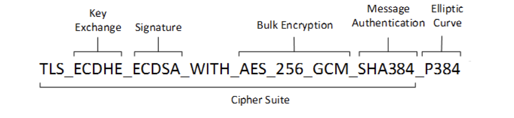
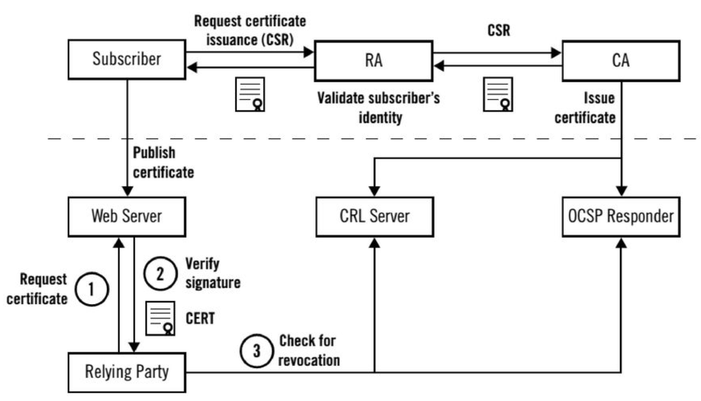
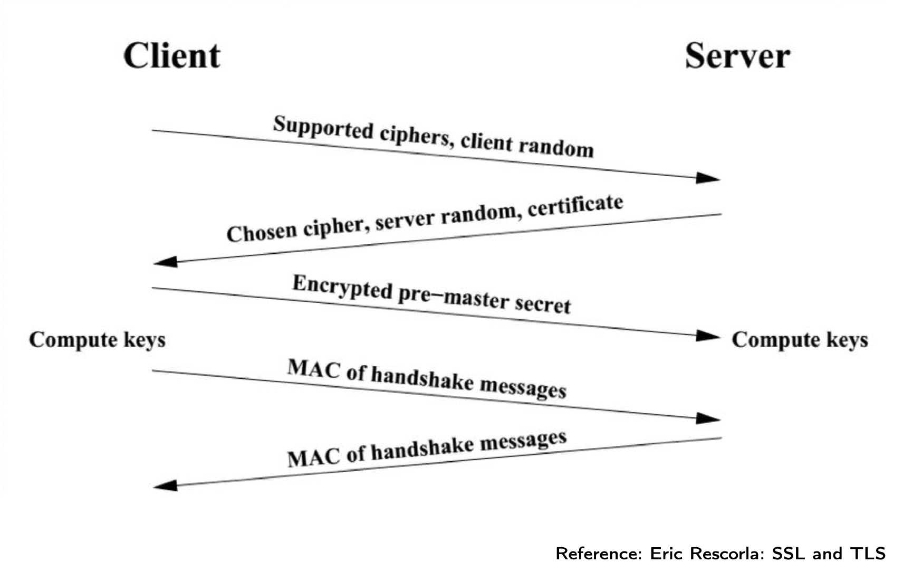
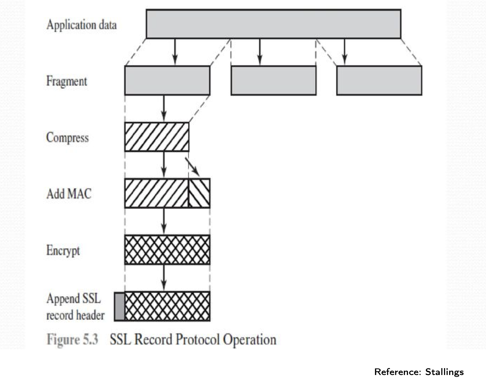
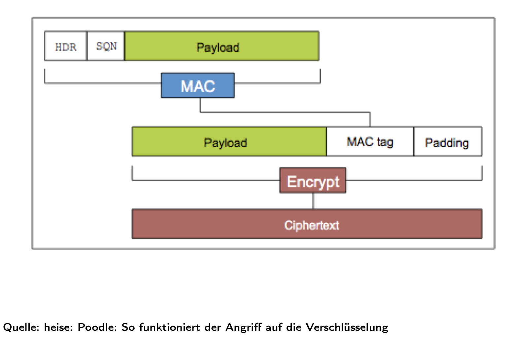
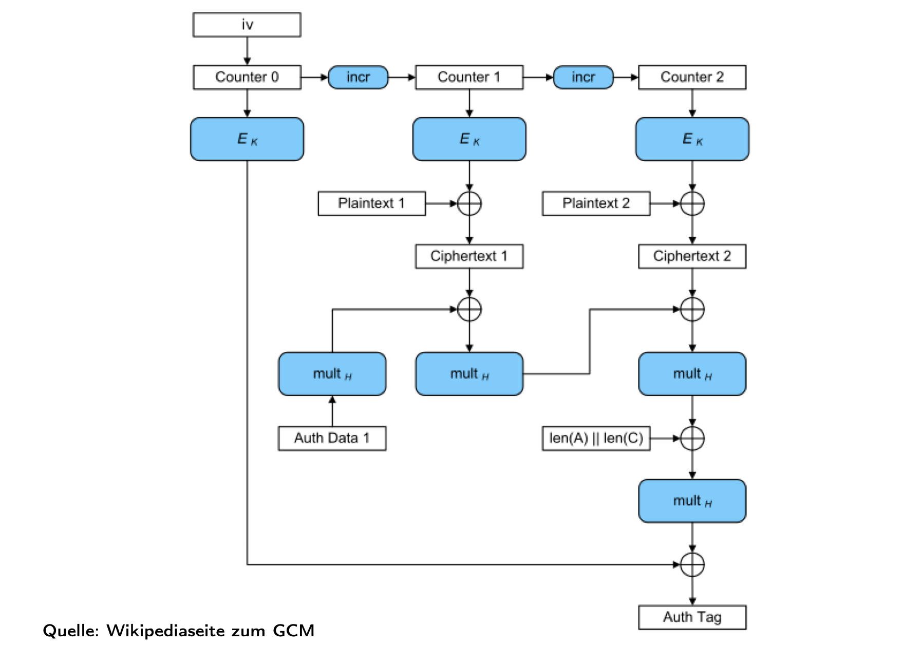
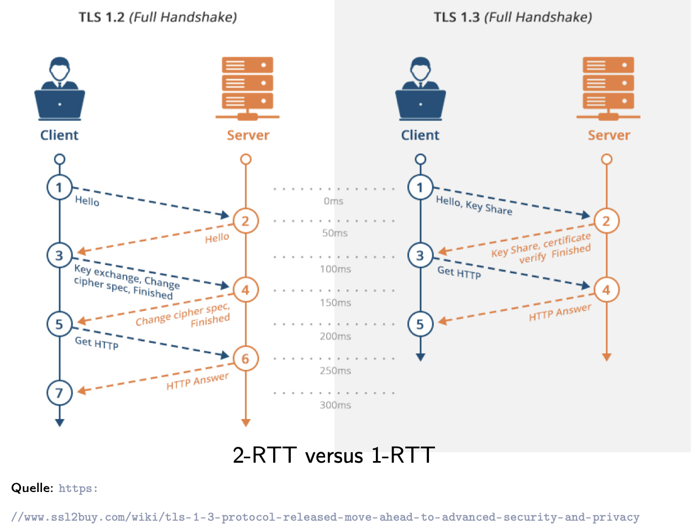
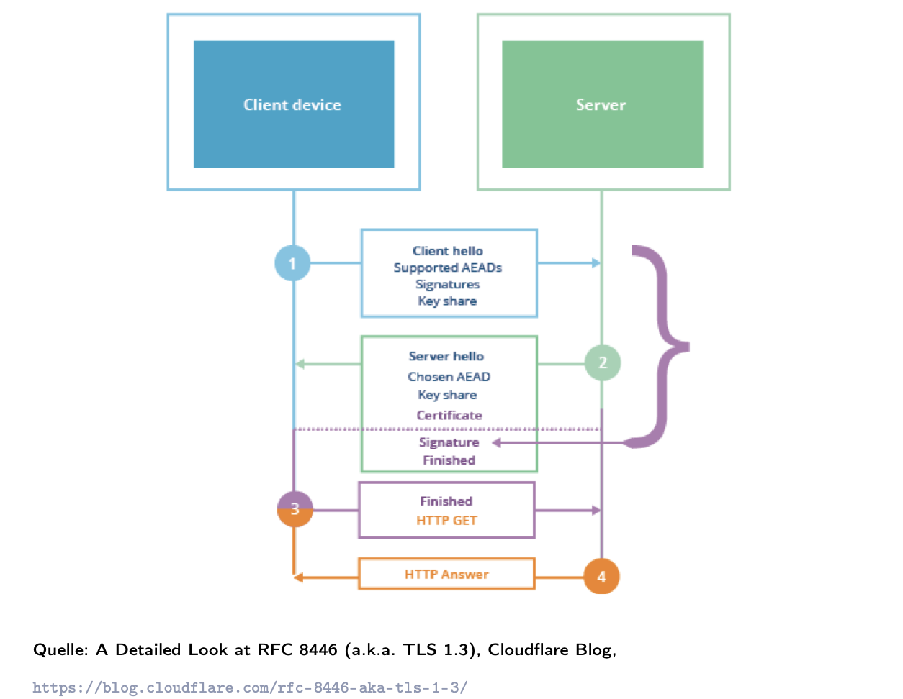

# Why all these types of security?!

## 1. Layered View (OSI perspective)

- **Layer 1: Physical (Bits as signals)**
- The Physical Layer (OSI L1) doesn’t care what the bits mean.
- Its only job: *take 0s and 1s → turn them into physical signals → send them across a medium → recover them as 0s and 1s at the other end.*
>Different media use different kinds of physics:
  >- Copper (Ethernet cables, old phone lines), medium is copper wire and signal = voltage changes (electrical pulses; **Bit 0 = low voltage, Bit 1 = high voltage**).
  >
  > - Fiber Optics (glass fiber), medium is glass fiber and signal = light pulses (laser/LED): **Bit 0 = no light pulse, Bit 1 = light pulse**
  > - Wireless (Wi-Fi, cellular, Bluetooth), medium is air and signal = radio waves (electromagnetic radiation), **bits are mapped onto changes in wave frequency/phase/amplitude.**
  >
  > They are all implementations of the Physical Layer, the very bottom of the stack.

- Laptop’s antenna, inside your Wi-Fi card:
  - modulates bits (0/1) into changes of the electromagnetic waves at 2.4 GHz or 5 GHz. Those modulated waves carry 802.11(document/version codes inside IEEE) frames (MAC header + payload + CRC).
	- Example:
	- Bit 0 → wave at 2.400000000 GHz with phase A.
	- Bit 1 → wave at 2.400000000 GHz with phase B.
- Router’s antenna, the receiver: 
  - does the reverse: electromagnetic waves → Antenna converts waves into → weak analog electrical signal → Wi-Fi radio chip samples signal (demodulates modulation) → recovers the digital bits → 802.11 frame reconstructed → CRC/MIC verified → IP packet → TCP segment → Application data
- Security risk: anyone nearby can **sniff signals** (radio interception, wire tapping), because radio is a shared medium. Any **NIC**(Wi-Fi card = Hardware that connects a computer to a network, has a MAC address and can be on **Managed mode** (normal, connects to an AP) or **Monitor mode**) set to monitor mode can capture frames on the channel, even if not connected to the **AP**(Access Point).

- **Layer 2: Data Link (Frames, MAC)**
  - Organizes raw bits from Physical into frames with meaning. Adds MAC addresses, local delivery, error detection.
  - It’s called Data Link Layer because it links two directly connected nodes (e.g., laptop ↔ router, router ↔ ISP).
That means:
  - Groups bits into **frames** with:
    - Destination MAC (hardware address)
    - Source MAC
    - Payload (higher-layer data)
    - Integrity check (CRC/MIC)
  - Ensures **single** hop delivery: Local delivery to your immediate neighbor (your router/AP)
  - Security tool: **WPA2/WPA3** (encrypts frames, adds MIC to detect tampering).

- **Layer 3: Network (Packets, IP)**
  - Payload of frame from Data Link is an **IP packet**:
    - Source IP (who sends)
    - Destination IP (who receives)
    - Payload (transport data)
  - Global addressing & routing (across the Internet).
  - Security tool: **IPsec** (encrypts/authenticates IP packets).

- **Layer 4: Transport (TCP/UDP, Ports)**
  - Payload of IP packet is a **TCP segment** (or UDP datagram):
    - Ports identify which application (e.g., 80 = HTTP, 443 = HTTPS).
    - TCP ensures order & retransmits lost packets.
  - Security tool: **TLS/DTLS** (encrypts the transport connection, authenticates servers with certificates).

- **Layer 7: Application (Protocols, Content)**
  - Payload of TCP segment is **application data**:
    - HTTP request, email (SMTP), DNS query, etc.
  - Security tools:
    - **TLS** → secures application traffic in transit (HTTPS, SMTPS, IMAPS).
    - **PGP/S/MIME** → encrypts/signs the *content itself* (end-to-end, independent of transport).
    - **DNSSEC** → protects DNS queries/answers.

- TLS sits **on top of TCP** (or UDP for DTLS). Sometimes people call it “Layer 4.5.”
- From TCP’s view, TLS is “just another application protocol.”
- Applications (HTTP, SMTP, IMAP, etc.) send data **inside TLS records**.
#### Without TLS (plaintext):
````
TCP Payload:
GET /login HTTP/1.1
Host: bank.com
Cookie: sessionid=abc123
````
#### With TLS (encrypted):
````
TCP Payload:
[TLS ciphertext blob]
````
👉 The HTTP request is now hidden inside the TLS record.

#### What TLS Does *Not* Protect
- **TCP/IP headers**: source/dest IP, ports, sequence numbers.  
- **Metadata**: packet size, timing, traffic patterns.  

A sniffer still sees:
````
Src IP: 192.168.1.5
Dst IP: 141.89.220.50
Dst Port: 443
Packet length: 1514 bytes
Time: 12:30:01
````
…but cannot see the actual HTTP request or cookie.

## Example: Logging into a Website Without Security

1. **Physical:** Raw Wi-Fi signals can be sniffed by anyone nearby.
2. **Link:** Frame shows MAC addresses, integrity check.
3. **Network:** Packet shows your IP → bank’s IP.
4. **Transport:** TCP segment shows port 80 (HTTP).
5. **Application:** HTTP request in plaintext:
````
GET /login HTTP/1.1
Host: bank.com
Cookie: sessionid=abc123
````
👉 Attacker sees your **login cookie**(= A small piece of data stored in your browser by a website (key-value pair), used to maintain state across multiple HTTP requests (since HTTP is stateless)). That sessionid is essentially your ticket proving you’re logged in. If an attacker steals it (via sniffing, XSS, etc.), they can impersonate you without knowing your password → session hijacking.

---

## Example: Same Login With WPA3 + TLS

1. **Physical/Link:** Wi-Fi frames encrypted with WPA3 → payload is gibberish.
2. **Network:** IP addresses still visible (you must know where to deliver), but payload is protected.
3. **Transport:** TCP session inside TLS → attacker cannot read/alter data.
4. **Application:** HTTP becomes HTTPS → cookies, passwords, and messages are encrypted end-to-end.

👉 Attacker sees only **encrypted blobs**, not your login data.
 
## Security by Layer 
| Layer        | Unit        | Addressing    | Risk                 | Security Tool |
|--------------|-------------|---------------|----------------------|---------------|
| Physical     | Bits/waves  | None          | Radio interception   | — |
| Data Link    | Frame       | MAC address   | Local sniffing/tamper| WPA2/WPA3 |
| Network      | Packet      | IP address    | Traffic analysis, spoofing | IPsec |
| Transport    | Segment     | Ports         | MITM, injection      | TLS/DTLS |
| Application  | Message     | Protocol data | Content leakage      | PGP, S/MIME, DNSSEC |

✅ **One sentence takeaway:**  
Networking is built in layers: each layer wraps the one above, each layer has its own risks, and each has its own security mechanisms (WPA3 → IPsec → TLS → PGP) and **NOW it is time for TLS:**
# Transport Layer Security (TLS) 🔒

## History
- **SSL (Secure Sockets Layer)**: developed by Netscape (1994).  
- **SSL 3.0** became the foundation of TLS.  
- **TLS versions:**
  - TLS 1.0 – RFC 2246 (1999) → obsolete  
  - TLS 1.1 – RFC 4346 (2006) → obsolete  
  - TLS 1.2 – RFC 5246 (2008) → still widely used  
  - TLS 1.3 – RFC 8446 (2018) → modern standard, simpler, more secure  

## Supported TCP-Based Services (with reserved ports)
TLS is not limited to HTTP — it can secure many TCP-based applications.

| Protocol | Port | Secure Version | Purpose |
|----------|------|----------------|---------|
| **HTTP** | 443  | **HTTPS**      | Browsing the web securely |
| **Telnet** | 992 | **Telnets**   | Remote terminal login (legacy, insecure without TLS) |
| **FTP (control)** | 990 | **FTPS** | Secure file transfer control channel |
| **FTP (data)** | 989 | **FTPS-data** | Secure file transfer data channel |
| **SMTP** | 465 | **SMTPS** | Secure mail submission (sending email from client to server) |
| **POP3** | 995 | **POP3S** | Secure mail retrieval (client fetching mail from server) |

## TLS Functionality
- **Authentication**: server identity (and optionally client) proven via certificates.  
- **Confidentiality**: all communication is encrypted.  
- **Integrity**: Message Authentication Code (MAC) detects tampering.  
- **OSI view**: takes over responsibilities of Session + Presentation layers.  

✅ **In short:** TLS secures TCP-based applications with authentication, encryption, and integrity, and uses well-known ports for secure protocol variants.

>Let's take a look at the previous session: TLS vs PGP:
>
>**TLS** sits between the **transport and application layers**. It encrypts the connection/session, so that any data passing over TCP (HTTP, SMTP, IMAP, etc.) is protected while in transit. Once the session ends, the protection is gone.
>
> **PGP** lives **fully at the application layer**. It encrypts and signs the message content itself (email text, attachments, files). Even if the message is copied, stored, or forwarded through many servers, it stays protected until the intended recipient decrypts it.
>
>👉 **In short: TLS = channel security, PGP = content security.**

## TLS 
##	TLS has sub-protocols:
*Terminology stuck from history. What the slides call “SSL-Handshake Protocol” is today’s TLS Handshake Protocol.*
- SSL-Handshake Protocol is the “setup phase.”: Austausch der notwendigen Informationen für die dezentrale Berechnung der Schlüssel (MAC- und Sitzungsschlüssel) und Aushandeln der kryptographischen Verfahren.
- When your browser starts talking to a server, it says:
> *“I know how to do encryption with AES, or ChaCha20, or others. Which one do you prefer?”*

  That list is called **cipher suites**. The server picks one.
- Both sides (browser + server) each send a 32-byte random number at the start. They **mix** these into the key calculation. This makes sure **every session is unique**, even if you connect to the same server again.

- **Master secret** is the **big shared secret** that both sides calculate during the handshake. They never send it across the Internet. They both create it independently, using the exchanged random numbers and some math (Diffie-Hellman or RSA). 

- **From master secret**, smaller keys are made → the ones used to encrypt your data → **SSL-ChangeCipherSpec Protocol** = After handshake math is done, each side sends a tiny signal (“from now on, encrypt with the session keys”).

**So**,
**Key derivation (general):**

`(Key-agreement → pre_master_secret)` → `PRF(pre_master_secret, client_random ∥ server_random)` → `master_secret` → `PRF(master_secret, "key expansion", server_random ∥ client_random)` → `key_block` → **split** → `client_write_key | server_write_key | client_write_MAC_key | server_write_MAC_key | IVs`

- *Notes:* “Key-agreement” can be RSA-encrypted premaster, Diffie-Hellman, ECDHE, etc. The PRF (pseudo-random function) mixes secrets + randoms to produce the `master_secret` and expands it into the `key_block`.  
- *Result:* the Record layer uses the `*_write_key` for confidentiality and the `*_MAC_key` for integrity (and IVs/nonces for cipher operation).

### Example
In Wireshark, when you open Booking.com, you’ll see lines like:
````
TLSv1.3 Handshake Protocol: Client Hello
   Cipher Suites: TLS_AES_128_GCM_SHA256, TLS_CHACHA20_POLY1305_SHA256, ...
   Random: (32 bytes)
---
TLSv1.3 Handshake Protocol: Server Hello
   Cipher Suite: TLS_AES_128_GCM_SHA256
   Random: (32 bytes)
   Certificate: *.booking.com
````
- ClientHello = browser’s proposal (ciphers, random).
- ServerHello = server’s answer (chosen cipher, its random, certificate).

In Wireshark when the handshake math is done → You’ll see a one-liner: `Change Cipher Spec`
Even though attackers can see the handshake, they **cannot** calculate the master secret, because the math (Diffie-Hellman) makes it impossible without the private key.

- At the end, both sides send a **Finished message**. This includes a **checksum (MAC) of all handshake steps**. If an attacker had changed anything, the checksums wouldn’t match → connection is aborted.
>The whole point of the handshake is to **compute keys**:
>- The outcome isn’t just the master secret. This “master secret” is the seed. From that, TLS derives:
>- **MAC key** (for integrity: HMAC-SHA256 checks on each record).
>- **Encryption key** (for confidentiality: AES, ChaCha).
>- **Session keys** for both directions (client→server, server→client).
> - So: Handshake = not just agreeing on algorithms, but actually **producing the working keys for Record Protocol**.
>
>👉 Bridge: the handshake’s job is to **prepare Record Protocol**. Without MAC + session keys, Record Protocol can’t encrypt or check integrity.

- **SSL-Record Protocol**: “Do encryption/decryption (and maybe compression).” = Takes the HTTP request, slices it into records, encrypts with AES/ChaCha, adds MAC (integrity check).
- **SSL-ApplicationData Protocol**: “Forward encrypted data to application.” = Your browser sees the decrypted result and renders Booking.com, but on the wire, it’s all gibberish. This is where the **“real business”** (HTML, JS, API calls) happens.

- **Alert Protocol** will fire, if something goes wrong, TLS sends a special Alert message before closing:
- Example: certificate invalid → browser shows “Your connection is not private.”
- Example: keys don’t match → TLS alert “handshake_failure.”

In Wireshark, you’d literally see a line:
```
Alert (Level: Fatal, Description: Handshake Failure)
```

### Let's now zoom into Session State and Connection State parameters.

Think about what TLS has to **“remember”** internally after the handshake:
- Some values belong to the whole session (they can be reused if you reconnect) = **SESSION**
- Other values belong to a single TCP connection (they are fresh each time) = **CONNECTION**


## Session State (TLS 1.2 style)
Values stored after handshake (can be reused in resumptions):
- **session identifier** → chosen by server, marks a resumable session.  
- **peer certificate** → e.g., `*.booking.com` X.509 certificate.  
- **compression method** → typically `null` (compression mostly disabled).  
- **cipher spec** → chosen algorithm bundle, e.g., `TLS_AES_128_GCM_SHA256`, it’s the outcome of the negotiation process that started with the cipher suite proposals.
- **master secret** → 48-byte shared root secret derived from the handshake.  
- **is resumable** → whether session can be resumed for future connections.

💡 *Think of session state as the “contract” between client and server — it records what they agreed on and can be reused to save time later.*


## Connection State (Security Parameters)
Each TCP connection under that session uses its own state:
- **connection end** → am I client or server?  
- **master secret** → imported from session.  
- **client_random / server_random** → 32-byte values exchanged in Hello messages.  
- **PRF algorithm** → pseudo-random function for key expansion (often SHA-256).  
- **bulk encryption algorithm** → e.g., AES-GCM, ChaCha20.  
- **MAC algorithm** → e.g., HMAC-SHA256, for integrity checks.  
- **compression algorithm** → typically none.  

💡 *The connection state is the **working toolbox**. From the master secret + randoms, the PRF expands into actual working keys*:
- `client_write_key`, `server_write_key` (for encryption).  
- `client_write_MAC_key`, `server_write_MAC_key` (for integrity).  
- Initialization vectors (IV is a block of random or unique bits that is added to encryption at the start of a message. It makes sure that if you encrypt the same plaintext twice with the same key, the ciphertext looks different.)

The old-style notation (TLS 1.2) with all pieces written out:

#### TLS 1.2 Cipher Suites' moving parts:

A cipher suite in TLS ≤1.2 is a combination of multiple crypto building blocks:

**General form:**  
`TLS_<KeyExchange>_<Authentication>_WITH_<Encryption>_<MAC>`

##### 1. Key Exchange
- RSA (no forward secrecy)  
- DH / ECDHE (Diffie–Hellman, elliptic curve variant → forward secrecy)  

##### 2. Authentication / Signature
- RSA  
- ECDSA  
- DSA  

##### 3. Bulk Encryption (Cipher)
- AES_128_CBC  
- AES_256_GCM  
- 3DES (weak, legacy)  
- RC4 (broken, legacy)  

##### 4. MAC (Hash for Integrity)
- SHA1 (weak)  
- SHA256  
- SHA384  
- MD5 (broken)  

##### 5. Elliptic Curve (if ECDHE/ECDSA)
- P-256  
- P-384  
- P-521  

💡 *Why it mattered:*  
Too many options meant servers often supported insecure combinations (RC4, 3DES, MD5, SHA1). Attackers could downgrade connections to these weak suites.  
TLS 1.3 removed this flexibility → only strong AEAD ciphers + modern hashes:
## TLS 1.3 simplifies notation.
- Only **AEAD algorithms** allowed (Authenticated Encryption with Associated Data, RFC 8446).  
- Format: `TLS_AEAD_HASH`  
- Example: `TLS_AES_128_GCM_SHA256`  
  - AEAD = AES-128-GCM (encryption + integrity combined).  
  - HASH = SHA256 (for handshake key derivation).  

💡 *Real-world:* If you visit `https://booking.com` today and capture traffic in Wireshark, you’ll see:
````
Cipher Suite: TLS_AES_128_GCM_SHA256
````
This exact choice dictates the keys in your connection state.

#### Jede Handshake-Nachricht ist wie folgt aufgebaut:
`Type (1 Byte) | Length (3 Bytes) | Content (≥0 Bytes)`
- Type: identifies the message (e.g., ClientHello = 1, ServerHello = 2, etc.).
-	Length: how long the message is.
-	Content: the actual fields (e.g., randoms, cipher list, cert, etc.).

## TLS Handshake detailed phases

### Phase 1: Client → Server (ClientHello)
The **ClientHello** message contains:
- **Maximum version number** the client supports (e.g., TLS 1.2, TLS 1.3).  
- **NonceC**: 32-bit timestamp + 28-byte random value `Rc`.  
  - Used later in key derivation (prevents replay attacks, ensures freshness).  
- **Session Identifier**:  
  - `0` → new session (fresh handshake).  
  - nonzero → request to resume a previous session.  
- **Cipher suite proposals** (list of supported algorithms):  
  - Hashes (MD5, SHA-1, SHA-256, …).  
  - Signature algorithms (RSA, DSA, ECDSA).  
  - Symmetric ciphers (AES, 3DES, RC4).  
  - Key exchange methods (RSA, DH, ECDH).  
- **Compression methods**: usually just “null.”  

💡 At this point, the client is saying:  
> “Here’s what I can do, here’s a random number for entropy, and here’s whether I want a new session or to resume an old one.”

---

### Phase 2: Server → Client (ServerHello and related)
The **ServerHello** message contains:
- **Chosen TLS version**: highest version both sides support.  
- **NonceS**: 32-bit timestamp + 28-byte random value `Rs`.  
- **Cipher suite selection**: chosen from client’s proposal.  
  - Example: `TLS_RSA_WITH_AES_256_CBC_SHA256`  
    - Key Exchange = RSA  
    - Bulk Cipher = AES-256-CBC  
    - MAC Algorithm = SHA256  
- **Compression method**: usually none.  

#### Optional messages in Phase 2:
1. **Variant 1: Certificate** → Server has a certificate with long-term keys. Example: RSA certificate. The public key inside the certificate is already enough for the client to send the pre-master secret (encrypted with RSA). Result: no need for a separate ServerKeyExchange. Only Certificate is sent ✅ 
2. **Variant 2: ServerKeyExchange** → Server uses ephemeral keys (forward secrecy). Example: ECDHE_RSA (Ephemeral Diffie-Hellman with RSA signature). The certificate proves the server’s identity (RSA signature). But the actual key exchange is done with ephemeral DH parameters (new, random keys per session) → The server must send those DH parameters in ServerKeyExchange. Client uses them + its own DH parameters to derive the pre-master secret.  
3. **CertificateRequest** → if server requires client authentication. Includes accepted CA list.  
4. **ServerHelloDone** → signals end of Phase 2.  

#### Client’s checks after Phase 2:
- Validate the server’s certificate (issuer trusted? valid date? hostname match?).  
- Verify that the chosen cipher suite is in the client’s proposal list.  

💡 Now the server has responded:  
> “We’ll use TLS 1.2, here’s my random number, here’s my certificate, and here’s the cipher suite I chose. Now it’s your turn to prove you can continue.”



When the server sends its certificate in the `Certificate` message,  
the client (browser) must check not only:
- Is the certificate signed by a trusted CA?  
- Is it within its validity period?  
- Does the hostname match?  

…but also: **Has this certificate been revoked?**

#### Certificate Issuance & Publishing
- **Subscriber (server owner)** → requests a certificate (CSR = Certificate Signing Request).  
- **RA (Registration Authority)** → validate the identity of the subscriber (the one requesting the cert). Acts as a **front desk** for the CA.
- **CA (Certification Authority)** → The entity that actually issues and cryptographically signs the certificate. It’s the CA’s private key that creates the signature you later verify in your browser. The CA’s private key must be extremely well-protected (often in an HSM — hardware security module).
	•	It’s safer if the CA only signs certificates and never directly deals with customers.
- Certificate is published and installed on the **web server**.

#### Client-side validation steps
1. **Request certificate** from the web server (part of TLS handshake).  
2. **Verify signature**: check if the server’s certificate is signed by a CA in the **client’s trust store**.  
3. **Check for revocation**: ensure the certificate has NOT been revoked.  

#### How revocation is checked
- **CRL (Certificate Revocation List)**:  
  - CA periodically publishes a signed list of revoked certificates.  
  - Client downloads and checks whether the server’s cert is listed.  
- **OCSP (Online Certificate Status Protocol)**:  
  - Client queries an OCSP responder server in real-time.  
  - Gets back a signed “good” or “revoked” response.  
- As of 2024 → CRLs are still commonly used, OCSP more modern but adds latency.

💡 *Bridge to TLS handshake:*    
- If validation fails → client sends an **Alert protocol** message and closes the connection.  
- Only if validation succeeds does the client continue to Phase 3 (ClientKeyExchange etc.)

---

### Phase 3: Client → Server
#### 1. Certificate (optional)
- If the server requested client authentication (via `CertificateRequest` in Phase 2),  
  the client sends its own X.509 certificate.  
- If no suitable certificate exists → client sends a `no_certificate` alert.  
- If fixed Diffie-Hellman is used → client’s message may instead contain its DH parameters.  

💡 This step is only needed when mutual authentication is required (common in VPNs, not in normal web browsing).

#### 2. ClientKeyExchange
Purpose: establish the **Pre-Master Secret (48 bytes)**.  
How it works depends on the key exchange method:

- **RSA key exchange**:  
  - Client generates the pre-master secret.  
  - Encrypts it with the server’s RSA public key (from the server’s cert).  
  - Sends `{PreMasterSecret}Kpub(S)` to the server.  

- **Ephemeral or Anonymous Diffie-Hellman**:  
  - Client sends its DH/ECDH public value.  
  - Server and client both compute the pre-master secret by combining each other’s DH parameters.  

💡 This implicitly authenticates the server: if it can decrypt or compute the same pre-master secret, it must own the correct private key.

#### 3. Master Secret derivation
Both sides now compute the **Master Secret (48 bytes)** from:
- Pre-master secret,  
- Client random `Rc`,  
- Server random `Rs`.  

Example (TLS ≤ 1.1):
````
master_secret = MD5(Pre | SHA(‘A’ | Pre | Rc | Rs))
| MD5(Pre | SHA(‘BB’ | Pre | Rc | Rs))
| MD5(Pre | SHA(‘CCC’ | Pre | Rc | Rs))
````
Since TLS 1.2 → HMAC-SHA256 is used instead of MD5/SHA1.  
In TLS 1.3 → even simpler derivation with HKDF.  

#### 4. CertificateVerify (optional)
- Only sent if the client provided a certificate earlier.  
- Client signs all prior handshake messages with its private key.  
- Server verifies with client’s public key.  
- Ensures the client really owns the certificate (challenge–response).

#### 5. ChangeCipherSpec
- “Change to the cipher **spec**ification (the negotiated suite).”
- This is actually its own little protocol inside TLS (separate from the Handshake protocol).
- Until this point, handshake messages are sent in plaintext (anyone sniffing can see ClientHello, ServerHello, etc.).
- It’s a 1-byte **state flip** message that tells the peer: *“From the next record onward, I will start encrypting and authenticating everything with the keys and cipher suite we just negotiated.”*  
- Updates local crypto context (encryption + MAC keys).

#### 6. Finished
- First message that is **encrypted and integrity-protected**.  
- Contains:  
```
verify_data = PRF(master_secret, “client finished”,
Hash(all handshake messages))
```
- Purpose: proves that the handshake was not modified (prevents MITM).  

💡 Think of it as the client’s signed receipt of the entire handshake.

---

## Phase 4: Server → Client

- Server also switches its crypto context with **ChangeCipherSpec**.  
- Sends its own **Finished** message: 
```
verify_data = PRF(master_secret, “server finished”,
Hash(all handshake messages))
```
- Confirms both sides agree on the same keys and transcript.  

💡 After this, both sides are synchronized. Encrypted **Application Data** can now flow.

### A Condensed Summary of the TLS Handshake (1.2) in One Visual Timeline:


### Step 1: Client → Server
- Sends **ClientHello**:
  - Supported cipher suites (algorithms the client can do).
  - Client random (nonce `Rc`).
- Purpose: Propose options + add entropy for key derivation.

### Step 2: Server → Client
- Sends **ServerHello**:
  - Chosen cipher suite (from client’s list).
  - Server random (nonce `Rs`).
  - Server certificate (X.509).
- Purpose: Lock down crypto parameters + prove identity.

### Step 3: Client → Server
- Sends **ClientKeyExchange**:
  - If RSA → pre-master secret encrypted with server’s RSA public key.  
  - If (EC)DHE → client’s DH public value.
- Both sides now compute the same **pre-master secret**.  
- Then: both compute the **master secret** = PRF(pre-master, Rc, Rs).  
- From master secret → session keys for encryption and MAC are derived.

### Step 4: ChangeCipherSpec + Finished
- **Both sides switch** to the negotiated cipher suite.  
- Each side sends a **Finished** message:  
  - Contains MAC (hash) of all handshake messages, keyed with the master secret.  
  - Proves the handshake was not tampered with (prevents MITM).  

### Step 5: Application Data
- Encrypted communication begins using the keys derived from the master secret.  
- Examples: HTTPS requests/responses, emails (SMTP over TLS), etc.

💡 This slide compresses everything we just studied (Phases 1–4) into a **timeline**. The critical point: **handshake ends when Finished messages are exchanged.**  Only after that does the **Record Protocol** take over to protect bulk application data.


## TLS Record Protocol

After the handshake, the **Record Protocol** takes over to securely transmit data.  
It works in **blocks (records)** with a maximum size of `2^14 = 16` **KB** each.

### Steps in the Record Protocol

#### (Sender Side):
1. **Application Data**
   - Example: HTTP request:
     ```
     GET /login HTTP/1.1
     Host: bank.com
     Cookie: sessionid=abc123
     ```
   - This is the plaintext generated by the application.

2. **Fragment**
   - Data is split into records (max 16 KB).
   - Ensures large data (like a video stream) can be handled piece by piece.

3. **Compress (optional)**
   - Original TLS allowed compression before encryption.
   - Disabled today ⚠️ (CRIME attack showed compression leaks secrets)

4. **Add MAC**
    - We want to ensure that data sent over the network has **not been altered** by an attacker.
    - TLS uses a **Message Authentication Code (MAC)** based on HMAC.  

    How it works:
    - After the handshake, both sides derive a **key_block**:
    ```
    key_block = PRF(master_secret, “key expansion”, Rc + Rs)
    ```

    - Inputs: master secret, client random (Rc), server random (Rs).  
    - Outputs (sliced):  
      - `client_write_MAC_key` / `server_write_MAC_key`  
      - `client_write_encryption_key` / `server_write_encryption_key`  
      - IVs  
  - These keys are **never sent** — both sides compute them locally and get identical values.

  Record protection:
  ```
  Encrypted( Data || MAC )
  ```
  - **Data** = the actual application message.  
  - **MAC** = `HMAC(write_MAC_key, sequence_number || record_header || Data)`.  
  - Then `(Data || MAC)` is encrypted with the write_encryption_key.  

  Clarifications:
  - ❌ `Encrypted(Data || MAC)` ≠ HMAC.  
    - HMAC is only used to *generate* the MAC.  
    - The record is (Data + MAC), then encrypted.  
  - ✅ Data is the message.  
  - ✅ MAC is derived from the handshake keys (`client_write_MAC_key` / `server_write_MAC_key`).

  **Let's do a toy example:**
      
    - Shared secret key: `K = 42`
    - Message: `"Hi"`
    We define a fake MAC function:

    `MAC = (K + sum of ASCII codes of message) mod 100`
    - `"Hi"` → ASCII(72 + 105) = 177  
    - MAC = (42 + 177) mod 100 = **19**
    ```
    Message: “Hi”
    MAC: 19
    ```
    Receiver checks: 
    ````
    (42 + 177) mod 100 = 19
    ````
    → Matches → message is valid. ✅

    If an attacker changes `"Hi"` → `"Ho"` (72 + 111 = 183):  
    - Receiver computes: (42 + 183) mod 100 = 25  
    - Doesn’t match MAC=19 → message rejected. ❌


    In real TLS, the key isn’t a number you pick by hand:

    - It comes from the **master secret** that was negotiated during the handshake.  
    - TLS derives **separate keys**:
      - `client_write_MAC_key` (for the client’s MACs)  
      - `server_write_MAC_key` (for the server’s MACs)

    - These keys are **never sent in plaintext**.  

    > The key expansion in TLS 1.2 looks like this: `key_block = PRF(master_secret, "key expansion", Rc + Rs)`
    
    From this key_block, TLS slices off chunks:
      - Pre-master secret  
      - Client random (`Rc`)  
      - Server random (`Rs`)  
    
    Because both sides perform the same math, they derive the same MAC keys without ever transmitting them.
    - Every TLS record (e.g., an HTTP request or response) carries: `Encrypted( Data || MAC )`

---

Sender sends:  
5. **Encrypt**
   - Record data + MAC are encrypted with the negotiated symmetric cipher (e.g., AES).  
   - Original TLS design: **MAC-then-Encrypt**.  
     - Weakness: padding oracle attacks (e.g., BEAST, POODLE).  
   - TLS 1.2+ recommends AEAD ciphers (e.g., AES-GCM) → encryption + authentication in one step.

6. **Append Record Header**
   - Metadata: content type (e.g., application data, handshake, alert), version, length.
   - Prepended so receiver knows how to parse the record.

#### (Receiver side):
- Reverse order: read header → decrypt → verify MAC → decompress → reassemble → deliver application data.

#### Key Material
- Not just one key!  
- TLS generates a **key_block** from the master secret (using SHA-256 in TLS 1.2) and the nonces (Rc, Rs).  
- From the key_block, it derives:
  - Client_write_MAC_key  
  - Server_write_MAC_key  
  - Client_write_encryption_key  
  - Server_write_encryption_key  
  - Initialization Vectors (IVs)  

💡 This guarantees **separate keys for each direction** and each function, avoiding key reuse.

---
## Why not SSL?

### Legacy algorithms in SSL
- SSL (Secure Sockets Layer, 1990s) supported ciphers that are now considered insecure and were phased out:
  - 56-bit DES
  - 168-bit Triple-DES
  - 128-bit IDEA
  - 80-bit Fortezza  
- Even weaker “export-grade” ciphers were added because of **US export laws**:
  - 40-bit DES
  - 512-bit RSA  

### US Export Controls and “Export-Grade” Ciphers
- In the 1990s, the US government classified **strong cryptography** as a weapon ("munition").  
- Export of software with strong crypto (≥128-bit) required a license; in practice, only **weakened versions** were allowed abroad.  
- **Export-grade ciphers** = deliberately crippled versions (40-bit DES, 512-bit RSA) that were legal to ship overseas.  

💡 Consequence:
- US users could use strong crypto (128-bit DES, big RSA).  
- Non-US users only had export-grade crypto.  
- If a **US client talked to a non-US server**, the handshake negotiated the **weakest common cipher** → always downgraded to weak.  

### End of Export Restrictions
- January 2000: US relaxed export controls.  
- Strong crypto could now be shipped worldwide, except to embargoed destinations (Iran, Cuba, North Korea, etc.).  
- After this:
  - Browsers (Internet Explorer, Netscape, later Firefox) began shipping with 128-bit crypto everywhere.  
  - Servers (like Apache with OpenSSL) also enabled strong ciphers globally.  
- But: the **export-grade suites still existed in SSL/TLS for backward compatibility**, even though they were no longer legally needed.

### Cleaning Up in TLS
- **TLS 1.1 (RFC 4346, 2006)**:  
  - Explicitly banned negotiation of export-grade ciphers.  
  - Clients could still *offer* them in ClientHello for old servers, but must reject if chosen.  
- **TLS 1.3 (RFC 8446, 2018)**:  
  - Removed all legacy baggage: no export-grade, no RC4, no weak CBC ciphers.  

### The RC4 Problem
- RC4 was a stream cipher widely used in SSL/TLS and Wi-Fi (WPA).  
- Over time, statistical flaws were found → allowed plaintext recovery attacks.  
- 2013: researchers (AlFardan, Bernstein, Paterson, Poettering, Schuldt) demonstrated **ciphertext-only attacks** on RC4 in TLS.  
- **RFC 7465 (2015)**: prohibited RC4 in all TLS versions.

💡 Today, if you try to connect with SSLv3, TLS 1.0, or RC4-only servers, modern browsers (Chrome, Firefox, Safari, Edge) will refuse the connection. Modern deployments require **TLS 1.2 or TLS 1.3** with strong AEAD ciphers (AES-GCM, ChaCha20-Poly1305).  

---
## SSL/TLS Libraries and Attacks

- **OpenSSL**  
  - Most widely used open-source TLS library (used by Apache, Nginx, Postfix, etc.).  
  - Infamous for the **Heartbleed bug** (2014): buffer over-read in the Heartbeat extension → allowed attackers to read private keys and secrets directly from server memory.  

- **LibreSSL**  
  - Fork of OpenSSL by the OpenBSD project.  
  - Goal: cleaner, safer codebase, remove legacy/unsafe features.  

- **Vendor libraries**  
  - **Schannel** — Microsoft’s TLS implementation (Windows).  
  - **Secure Transport** — Apple’s TLS stack (macOS, iOS).  

- **Lightweight / IoT libraries**  
  - **WolfSSL** — optimized for embedded/sensor boards (used in RIOT OS, Arduino).  

## The POODLE Attack (2014)
**POODLE = Padding Oracle On Downgraded Legacy Encryption**  
Researchers: Bodo Möller, Thai Duong, Krzysztof Kotowicz (Google), Oct 2014.  

### Root cause
- SSLv3 and TLS ≤ 1.2 with CBC ciphers used **MAC-then-Encrypt**.
  
- Padding bytes (added to align blocks) were **not covered by the MAC**.  
- Server only checked the last padding byte’s value, not full correctness.  

### Attack (Man-in-the-Middle required)
- **Who:** Attacker on the same network (rogue Wi-Fi, MiTM).  
- **How they get in:** Make the victim’s browser load a plain HTTP page that runs JavaScript; that script triggers many background HTTPS requests (the browser automatically sends the cookie).  
- **Downgrade:** Attacker forces the TLS handshake to fall back to old SSLv3 (legacy mode with the padding weakness).  
- **Tamper:** For each outgoing encrypted HTTPS request, attacker flips/changes a few ciphertext bytes that affect the decrypted padding.  
- **Probe:** The server reacts differently when padding is invalid versus when padding looks valid but the MAC fails — attacker observes that difference (error type, timing, or connection behavior).  
- **Exploit:** Each observed difference is a tiny “yes/no” leak about one plaintext byte; repeating this many times lets the attacker recover the secret cookie or token, one byte at a time.

(**Takeaway**: attacker uses forced downgrade + small ciphertext tweaks + server response differences to slowly read an encrypted secret.)

**Conceptual flaw:** Padding unauthenticated by MAC.  

## Alternatives to MAC-then-Encrypt

1. **MAC-then-Encrypt**  
   - Used in TLS ≤ 1.2 with CBC.  
   - Vulnerable to padding oracles.  

2. **Encrypt-then-MAC (EtM)**  
   - Encrypt plaintext, then compute MAC over ciphertext.  
   - Safer: any tampering fails MAC check before padding is even processed.  
   - Standardized as TLS extension (RFC 7366).  

3. **Encrypt + MAC independently**  
   - Encrypt plaintext, also compute MAC separately → send `Encrypt(M) || MAC(M)`.  
   - Used in SSH.  

4. **AEAD (Authenticated Encryption with Associated Data)**  
   - Examples: AES-GCM, ChaCha20-Poly1305.  
   - Encryption + authentication in one step.  
   - Mandatory in TLS 1.3, optional in TLS 1.2.  
   - Fixes padding oracle issue completely.  

## Lessons and Takeaways
- Multiple TLS connections can share one session (via session resumption).  
- Cipher suite negotiation (algorithms, compression, key exchange) is **built into TLS handshake**.  
  - Contrast: IPsec uses separate protocol (IKE) for negotiation.  
- For each direction (client→server, server→client), TLS derives **different session keys**.  
- Attacks like POODLE show: **protocol design choices matter**. TLS moved from MAC-then-Encrypt → AEAD-only (TLS 1.3). 

---
## Galois/Counter Mode (GCM)


### What is GCM?
- **GCM** = an AEAD mode (*Authenticated Encryption with Associated Data*) built on a block cipher (commonly AES).  
- Provides **confidentiality** (encryption) + **integrity/authenticity** (authentication tag) in one design.  
- Built from two building blocks:  
  - **CTR mode** → generates keystream for encryption.  
  - **GHASH** → polynomial MAC over GF(2¹²⁸) for authentication.  
- Security semantics: **Encrypt-then-MAC** (the tag covers both ciphertext and AAD).

### Inputs and outputs
**Inputs**
- Plaintext `P` (split into blocks).  
- Initialization Vector / Nonce `IV` (must be unique per key; 96-bit recommended).  
  - In TLS, the IV/nonce is **derived from the Master Secret** during the handshake, not chosen arbitrarily.  
- Secret key `K` (AES-128/192/256).  
- Additional Authenticated Data `A` (headers or metadata to be authenticated but not encrypted).  

**Outputs**
- Ciphertext blocks `C1, C2, ...` (same length as plaintext).  
- Authentication tag `T` (128 bits typical).

### High-level protocol
1. **Hash key H**  
   - Compute once: `H = E_K(0^128)` (AES of all-zero block).  
   - Both sides know `K`, so both can compute `H`.  
   - Used only inside GHASH.

2. **Counter start (J₀)**  
   - If IV length = 96 bits → `J0 = IV || 0x00000001`.  
   - Else → compute via GHASH(IV).  

3. **Encrypt plaintext (CTR mode)**  
   - For each block:  
     ```
     CTR_i = incr32(J0, i)
     S_i   = E_K(CTR_i)
     C_i   = P_i ⊕ S_i
     ```

4. **Authentication with GHASH**  
   - GHASH(H, A, C) over AAD + ciphertext + their lengths.  
   - Produces a 128-bit value `X`.

5. **Compute tag**  
   - `S0 = E_K(J0)`  
   - `T = S0 ⊕ X`  

6. **Send**  
   - Transmit: `IV || ciphertext || tag` (AAD stays in clear).

7. **Verify (receiver)**  
   - Recompute `H, J0, GHASH` → check `T' == T`.  
   - If match → accept; else → reject.

### Key properties
- **Nonce uniqueness**: Reusing IV with the same key **breaks security** (both confidentiality + integrity).  
- **AEAD**: AAD can be TLS record headers, IP addresses, ports, sequence numbers — left in clear but protected.  
- **Performance & hardware support**:  
  - GCM requires only XOR + GF(2¹²⁸) multiplications per block.  
  - Modern CPUs accelerate this: **AES-NI** for AES + **PCLMULQDQ** (carry-less multiply) for GHASH.  
  - Available since Intel Westmere (~2010).  
- **TLS usage**:  
  - TLS 1.2 → optional (e.g., `TLS_RSA_WITH_AES_256_GCM_SHA384`).  
  - TLS 1.3 → mandatory AEAD (`TLS_AES_128_GCM_SHA256`, `TLS_AES_256_GCM_SHA384`).  
- **GMAC**: Special case = authentication only (no encryption).

### Intuition for GHASH
- Treats data blocks as coefficients of a polynomial over GF(2¹²⁸).  
- Successive multiplications by `H` bind ciphertext + AAD + lengths.  
- Any change in ciphertext or AAD changes the final tag.  

💡 Highlight:  
- `Tag = E_K(J0) ⊕ GHASH(H,A,C)`  
- **IV/nonce is derived from the Master Secret in TLS**  
- **Nonce uniqueness is critical**  
- **TLS 1.3 mandates AEAD**  
- **Hardware acceleration with AES-NI + PCLMULQDQ**

---
## Real-world TLS Problems — Heartbleed, Libraries, Certificate Validation, MITM

### Heartbleed (OpenSSL Heartbeat bug, 2014)
- **What:** A bug in OpenSSL’s TLS Heartbeat extension allowed a remote requester to ask for `n` bytes to be echoed back but not actually provide `n` bytes. OpenSSL failed to check the claimed length and returned extra memory content.
- **Why it mattered:** Servers keep *private keys* and session secrets in RAM for TLS handshakes. An attacker could read arbitrary server memory chunks and exfiltrate:
  - Private TLS keys,
  - Session keys,
  - Cookies, passwords, other secrets.
- **Impact & response:**
  - Widespread emergency patches, certificate re-issuance, and key rotation.
  - Showed how a small implementation bug in a widely used library becomes catastrophic.

### Problems with non-browser TLS libraries and apps
- **Context:** Many non-browser apps (mobile apps, IoT, payment SDKs, CLI tools) rely on shared TLS libraries (OpenSSL, GnuTLS, cURL, Apache HttpClient, urllib, etc.).
- **Common issues:**
  1. **Wrong/weak defaults or optional checks** in APIs (programmers accidentally weaken validation).
  2. **Underspecified APIs** that easily get misused.
  3. **Developers disabling verification** (for testing or because of confusing options) and accidentally shipping insecure code.
- **Concrete example — cURL options:**
  - `CURLOPT_SSL_VERIFYPEER = true` → check certificate chain (default).
  - `CURLOPT_SSL_VERIFYHOST = 2` → verify certificate name matches hostname (correct).
  - Historically, `VERIFYHOST = 1` only checked that a name *exists* in the cert (not that it matches) → this is effectively **no hostname verification** and is unsafe.
  - Consequence: SDKs (e.g., older PayPal SDKs) set options incorrectly → MITMable clients.
  - Fix/mitigation: modern cURL treats `1` as `2` (safety), and libraries increasingly ship with safe defaults.

### MITM (Man-in-the-Middle) attack pattern against TLS when validation is weak
1. **Attacker position:** on-path (rogue Wi-Fi, compromised router, DNS hijack).  
2. **Attack setup:** attacker intercepts client TLS handshake and establishes *two* TLS connections:
   - Client ↔ Attacker (attacker presents a forged certificate).
   - Attacker ↔ Server (real server certificate).
3. **If client fails to validate server certificate properly** (bad CA, skipped hostname check, or accepts unknown CA), the client trusts the attacker's forged certificate.
4. **Result:** attacker can decrypt client requests, inspect/modify, then forward to server; likewise decrypt server responses and forward to client.
5. **Why it succeeds:** because TLS provides confidentiality *only if* the client verifies the server’s certificate chain and hostname correctly.

### Certificate validation & revocation (what the client should do)
- **Basic checks the client must perform at end of ServerHello (Phase 2):**
  1. Verify certificate **signature chain** up to a trusted root CA.  
  2. Verify the certificate **hostname** (CN / SAN) matches the server you requested.  
  3. Check **validity period** (notBefore / notAfter).  
  4. Optionally check **revocation**:
     - **CRL (Certificate Revocation List):** periodic list download from CA.  
     - **OCSP (Online Certificate Status Protocol):** on-demand query to CA/OCSP responder.
- **Practical caveats:**
  - Revocation checks are sometimes skipped/soft-failed for performance/availability reasons → leaves a gap.
  - Implementations may provide different default behaviors; application developers must ensure proper settings.

### Best-practice checklist (operational)
- **Keep TLS libraries up to date** (fix implementation bugs like Heartbleed).  
- **Enforce certificate validation** in applications:
  - Verify CA chain (`VERIFYPEER=true`).
  - Verify hostname (`VERIFYHOST=2` or equivalent).
  - Prefer libraries with safe defaults or explicitly set secure options.
- **Disable legacy/weak protocol versions and ciphers** (no SSLv3, no RC4, prefer TLS 1.2+ / TLS 1.3).  
- **Use AEAD cipher suites** (e.g., AES-GCM, ChaCha20-Poly1305) to avoid MAC-then-encrypt pitfalls.  
- **Plan for key rotation** and have an incident response for key compromise (revoke/reissue certs, rotate keys).  
- **Harden clients**: HSTS, secure cookie flags, pinning (where appropriate), avoid mixed content.

### One-liner
- TLS as a protocol is secure **if and only if** implementations and applications:
  1. Use up-to-date libraries (no Heartbleed-class bugs), and  
  2. Perform full certificate validation (chain + hostname + reasonable revocation policy).  
- Failures in either (bugs or bad defaults/api misuse) enable practical MITM and data-exfiltration attacks.

## TLS 1.3 

### 1) Design philosophy & big picture
- **Keep it simple** (after **28 drafts** → RFC 8446, 2018; editor: **Eric Rescorla/Mozilla**).
- **No backward compatibility** with SSLv3/TLS 1.0/1.1 (no version fallback; **prevents downgrades**).
- **No renegotiation**; no “re-handshake”.
- **Remove insecure/legacy pieces** (see below).
- **Shorter, faster handshake**: **1-RTT** by default (TLS 1.2 typically needed 2-RTT).
- **Perfect Forward Secrecy (PFS)** is mandatory.

### 2) Forward secrecy (PFS): why & how
- **Problem in TLS ≤ 1.2 (RSA key exchange):**
  - Client sent **Pre-Master Secret** encrypted with server’s **static RSA** public key:
    ```
    ClientKeyExchange: {PreMasterSecret}_(RSA public key of server)
    ```
  - If an attacker records traffic now and later steals the server’s RSA **private** key, they can derive all past **session keys** → decrypt old captures.
  - RFC 5246 (TLS 1.2) explicitly warns: *“Compromise of the server’s static RSA key results in a loss of confidentiality for all sessions protected under that static key.”*
- **TLS 1.3 solution:** only **ephemeral Diffie–Hellman** (DHE/ECDHE). New, temporary key per connection → even if the server’s long-term private key leaks later, past session keys **cannot** be reconstructed.

#### DH variants in the RFCs (historical → what TLS 1.3 chose)
- **Anonymous DH (ADH)**: no authentication → **MITM-unsafe** → **not recommended**.
- **Static DH (SDH)**: reuse DH private key across sessions → **no PFS** if that key is compromised.
- **Ephemeral DH (DHE/ECDHE)**: fresh DH private key per connection → **PFS** → **TLS 1.3 requires this**.

#### Named groups (simplifies negotiation)
- **MUST support:** `secp256r1` (NIST P-256).
- **SHOULD support:** `X25519` (RFC 7748).
- TLS 1.3 defines a fixed set of safe DH parameters (“named groups”) → fewer choices, fewer mistakes.


### 3) Authentication & digital signatures (what’s allowed)
- **Server** is **always authenticated** (certificate). **Client** authentication is **optional** (VPNs, enterprise).
- **Removed:** `MD5`, `SHA-224`, `DSA`.
- **Required (TLS 1.3):**
  - `rsa_pkcs1_sha256` (for certificates),
  - `rsa_pss_rsae_sha256` (**RSA-PSS**, RFC 8017; for CertificateVerify and certificates),
  - `ecdsa_secp256r1_sha256`.
- **Optional/modern:** EdDSA families (e.g., Ed25519/Ed448) via companion RFCs.

### 4) Symmetric encryption: cipher suites cleaned up
- **CBC** modes are **not allowed** (BEAST/Lucky13/POODLE issues).
- **RC4** removed (RFC 7465).
- Only **AEAD** ciphers (Authenticated Encryption with Associated Data):
  - **MUST implement:** `TLS_AES_128_GCM_SHA256`
  - **SHOULD implement:** `TLS_AES_256_GCM_SHA384`, `TLS_CHACHA20_POLY1305_SHA256`
- AEAD (e.g., **AES-GCM**, **ChaCha20-Poly1305**) = encryption + integrity in one step → no MAC-then-Encrypt pitfalls.

### 5) Handshake restructuring (why it’s 1-RTT)


**TLS ≤ 1.2** (typical 2-RTT):
1. ClientHello → ServerHello (+ cert, params)  
2. Key exchange msgs, `ChangeCipherSpec`, `Finished`  
3. Only then encrypted app data (HTTP, etc.)

**TLS 1.3** (1-RTT):
- **ClientHello** already carries **key share** (ECDHE).
- **ServerHello** replies with its key share + certificate + `Finished`.
- Client verifies and can **immediately** send encrypted application data.
- **Removed messages:** `ChangeCipherSpec`; **no renegotiation**; fewer choices (**baked-in parameters** in RFC).


### 6) 0-RTT (early data) — resumption/PSK mode
- If the client previously connected, it can reuse a **pre-shared key (PSK)** and send **0-RTT data** immediately.
- **Trade-offs:**
  - **Not forward-secret** (keys derived solely from PSK).
  - **Replay-able** (no global anti-replay guarantee across connections).
  - RFC 8446 §2.3 warns: treat 0-RTT carefully (avoid state-changing operations; consider only idempotent `GET`s).
- Ordinary 1-RTT TLS 1.3 data **is** forward-secret and protected against replay by the fresh handshake (ServerHello randomness, etc.).

### 7) Practical notes
- **PKI quality matters:** TLS relies on **CAs** and correct certificate issuance/validation. A compromised/mis-issued CA undermines TLS.
- **Server testing:** check your site at **SSL Labs**: `https://www.ssllabs.com/ssltest/` (cipher support, config, known vulns).
- **Crypto agility:** keep configs current (e.g., RC4 prohibited; CBC removed; AEAD required). Expect updates as RFCs evolve.
- **UDP?** Plain TLS is TCP-only. Use **DTLS 1.2** (RFC 6347, 2012; Rescorla & Modadugu) for UDP-based apps (VoIP, streaming, some VPNs).
- **Wireshark & “reading TLS”:**
  - You **cannot** read TLS traffic unless you have the session secrets.
  - Pre-TLS 1.3 with **static RSA**: loading the server’s private key could decrypt captures.
  - **TLS 1.3 + PFS**: captured ciphertext is useless without the *live* session keys (you’d need client key-logging, etc.).

### 8) Removed vs required (one-glance checklist)
**Removed in TLS 1.3**
- Version fallback / renegotiation
- Static RSA & static DH key exchange
- CBC modes
- RC4
- Hash/signature algs: MD5, SHA-224, DSA
- `ChangeCipherSpec` message

**Required / Recommended in TLS 1.3**
- **Ephemeral** (EC)DHE for key exchange (PFS)
- Named groups: **MUST** `secp256r1`; **SHOULD** `X25519`
- AEAD suites: **MUST** `TLS_AES_128_GCM_SHA256`; **SHOULD** `TLS_AES_256_GCM_SHA384`, `TLS_CHACHA20_POLY1305_SHA256`
- Signature support: `rsa_pkcs1_sha256`, `rsa_pss_rsae_sha256`, `ecdsa_secp256r1_sha256`

### 9) Why TLS 1.3 is considered safer & faster
- **Safer**: no legacy ciphers; AEAD-only; mandatory PFS; no downgrade/renegotiation paths.
- **Faster**: 1-RTT handshake (and optional 0-RTT resumption).
- **Simpler**: fewer algorithm combinations (“baked-in” strong defaults), smaller attack surface.